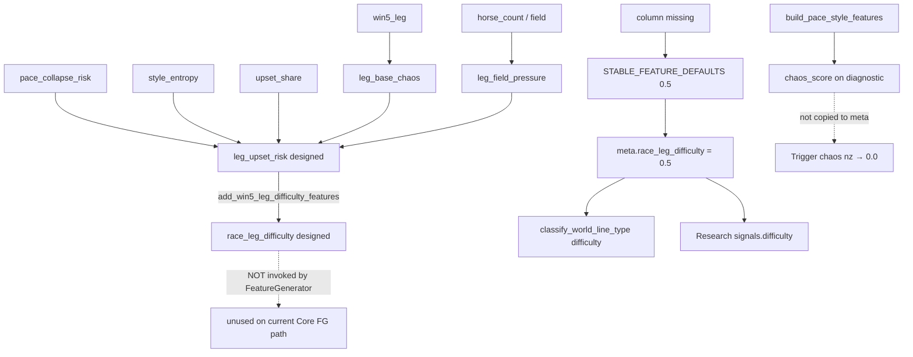

# Version29 — Difficulty Trace (Audit)

**Date:** 2026-07-27T13:34:28+00:00  

## Checklist

| # | Question | Answer |
|---|----------|--------|
| ① | Production Trigger difficulty value | `0.5` on probe |
| ② | FeatureLoader generation design | Loader does **not** synthesize difficulty; designed synth is `add_win5_leg_difficulty_features` (not called by FG) |
| ③ | DEFAULT=0.5 scope | **Production Core entire CE/Trigger path** (+ Research copy). Not Research-only. |
| ④ | Substitution / rename | Missing col → 0.5 fill; Research aliases `difficulty`↔`race_leg_difficulty`; Trigger uses `nz(...,0.0)` if key absent |

## chaos_score / leg_base_chaos / difficulty relationship

## Stage table

| Stage | difficulty | chaos_score | leg_base_chaos |
|-------|------------|-------------|----------------|
| FeatureLoader | absent (`False`) | usually absent | usually absent |
| After FG enrich | `[0.5]` | not from enrich | not from enrich |
| Scorer diagnostic | — | present (V26) | — |
| meta / Trigger | `0.5` | `None` → nz 0.0 | not on meta |
| Prediction Bundle numeric | not stored | not stored | not stored |
| Research Snapshot | `0.5` | NULL (V25) | not persisted |
