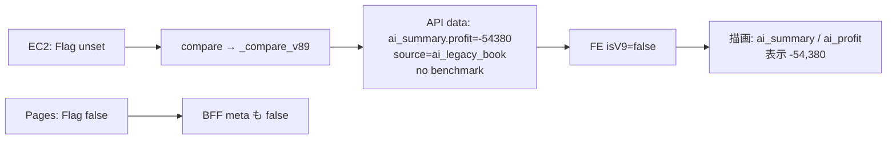

# Version9.0 Audit — Benchmark Layer Runtime

**Status:** Investigation only（コード変更なし）  
**Date:** 2026-07-27  
**Question:** なぜ本番 Challenge が旧 AI 収支 **-54,380** を表示するか  
**Verdict:** **Feature Flag 起因（一次原因）→ API が legacy を返す → UI は Flag OFF パスを正しく描画**

Artifacts:

- `docs/audit/v90-challenge-monthly-runtime-sample.json`（AI `compare` 実測・レース配列省略）
- `docs/audit/v90-challenge-monthly-http-slim.json`（EC2 `GET /v1/challenge/monthly` slim）

---

## 0. 結論（先に）

| 仮説 | 判定 |
|------|:----:|
| UI が V9 `benchmark` を無視して旧キーを誤表示 | **否** |
| API が V9 形状なのに UI だけ旧表示 | **否** |
| **Feature Flag OFF により API が V8.9 legacy を返している** | **是（一次原因）** |

表示値 **-54,380** は:

1. EC2 AI で `V9_BENCHMARK_LAYER` **未設定** → `v9_benchmark_layer_enabled() == False`  
2. `compare()` が `_compare_v89()` → 4券種 book → `ai_summary.profit = -54380`  
3. `feature_flags.v9_benchmark_layer = false` / `comparison.source = ai_legacy_book`  
4. CDN 上の `challenge-dashboard.js` は `isV9(data)===false` のため **`ai_summary`（legacy）** を描画  

Flag を AI で ON にすると同一コードで **benchmark profit = -2,560**（単勝）になることを EC2 上で確認済み。

---

## 1. Feature Flag 一覧

| 層 | `V9_BENCHMARK_LAYER` | 根拠 |
|----|----------------------|------|
| **AI（EC2 process）** | **未設定（実質 OFF）** | `expect-ai` MainPID environ にキー無し。`v9_benchmark_layer_enabled()` → `False` |
| **AI systemd** | 未設定 | `systemctl show expect-ai Environment` = `PYTHONPATH=...` のみ。drop-in 無し |
| **Pages `wrangler.toml` [vars]** | **`"false"`** | リポジトリ `wrangler.toml` L42 |
| **Cloudflare Pages Secrets** | **未登録** | `wrangler pages secret list` → `AI_BASE_URL`, `PI_BASE_URL` のみ |
| **Cloudflare Pages 実行時 vars** | **false（toml 由来と推定）** | Secrets に上書き無し。デプロイは toml vars を載せる構成 |

**本番で true になっている箇所は無い。**

設計ドキュメントも既定 OFF を明記: `docs/design/v9-benchmark-layer.md` / `docs/audit/v9-benchmark-layer-validation.md`。

---

## 2. 本番相当 API レスポンス

### 2.1 取得経路

| 経路 | 結果 |
|------|------|
| `GET https://expect-keiba.com/api/v1/challenge/monthly` | **未取得** — Research Week `OPS_CLOSED`（503）で stub login 不可 |
| EC2 `GET http://127.0.0.1:8000/v1/challenge/monthly?month=2026-07` | **成功**（本番 AI 同一プロセス） |
| `ChallengeCompareService.compare()` 直接 | **成功**（同上） |

BFF は AI をプロキシし `data` をそのまま返す（`functions/api/v1/challenge/monthly.js`）。AI が legacy なら Pages も legacy。

### 2.2 実測ペイロード（2026-07）

| フィールド | 値 |
|------------|-----|
| `schema_version` | `expect-challenge-compare/1.1` |
| `design_policy` | `v891_ai_shared_user_personal_since_join` |
| `feature_flags.v9_benchmark_layer` | **false** |
| `comparison.source` | **`ai_legacy_book`** |
| `comparison.ai_profit` | **-54380** |
| `ai_summary.profit` | **-54380** |
| `ai_book.bet_types` | `["馬連","ワイド","三連複","三連単"]` |
| `benchmark` | **キー無し** |
| `purchase_lab` | **キー無し** |

Flag ON 強制時（同一 DB・同一コード・調査用のみ）:

| フィールド | 値 |
|------------|-----|
| `feature_flags.v9_benchmark_layer` | true |
| `comparison.source` | `benchmark` |
| `benchmark.summary.profit` | **-2560** |
| `benchmark.book.bet_types` | `["単勝"]` |
| `purchase_lab` | あり |

---

## 3. `challenge-dashboard.js` 描画キー

CDN: `https://expect-keiba.com/assets/api/challenge-dashboard.js?v=2`  
確認: `v9_benchmark_layer` / `data.benchmark` / `AI Benchmark` 文字列あり（V9 UI はデプロイ済み）。

### 分岐

```javascript
function isV9(data) {
  return !!(data && data.feature_flags && data.feature_flags.v9_benchmark_layer);
}
```

| `isV9` | メインカード | バナー利益 | Purchase Lab |
|--------|--------------|------------|--------------|
| **false（現行本番）** | `ai_summary` or `ai` | `comparison.ai_profit` | 非表示 |
| true | `benchmark`（fallback `ai_summary`/`ai`） | 同上（V9 では ai_profit≡benchmark） | `purchase_lab` |

**現行本番は false のため legacy `ai` / `ai_summary` のみ使用。**  
`benchmark` キーは API に存在せず、UI バグではない。

補足: BFF は `meta.v9_benchmark_layer = AI flag OR Pages flag` を付与するが、**FE は `data.feature_flags` のみ参照**。Pages だけ true でも AI が false なら UI は旧表示のまま。

---

## 4. AI `service.py` 分岐動作

EC2 上の `/home/ubuntu/KEIBA-Single-AI/services/win5-ai/app/challenge/service.py` に V9 実装あり。

```text
compare()
  if v9_benchmark_layer_enabled():  # env V9_BENCHMARK_LAYER in 1|true|yes|on
      return _compare_v9(...)       # 単勝 benchmark + purchase_lab
  return _compare_v89(...)          # 4券種 legacy
```

| 条件 | 実測 |
|------|------|
| env 未設定 | enabled=False → v89 → **-54380** |
| env=`true`（一時） | enabled=True → v9 → **-2560** |

分岐は正常。問題は **本番 env が ON になっていないこと**。

---

## 5. EC2 Environment

```text
expect-ai Environment= PYTHONPATH=/opt/expect-ai/platform
drop-ins: (none)
process environ: V9_BENCHMARK_LAYER NOT SET
```

→ **`V9_BENCHMARK_LAYER=true` にはなっていない。**

---

## 6. Pages Environment

```text
wrangler.toml: V9_BENCHMARK_LAYER = "false"
Cloudflare secrets: AI_BASE_URL, PI_BASE_URL のみ（V9 なし）
```

→ **`V9_BENCHMARK_LAYER=true` にはなっていない。**

---

## 7. -54,380 の因果分解



| 層 | 寄与 |
|----|------|
| **Feature Flag** | **一次原因**（AI unset + Pages false） |
| **API** | Flag OFF の正しい legacy 出力（-54,380） |
| **UI** | Flag OFF の正しい legacy 描画（誤キー参照ではない） |

---

## 8. 本番を単勝 Benchmark 表示にする条件（監査メモ・実装しない）

コード変更なしの運用条件（参考）:

1. EC2 `expect-ai` に `V9_BENCHMARK_LAYER=true` を入れ **再起動**  
2. Pages 側も `V9_BENCHMARK_LAYER=true`（toml vars または Dashboard）し再デプロイ  
3. 両方 ON で `feature_flags.v9_benchmark_layer=true` かつ FE が `benchmark` を描画  

片方だけ ON では不整合（特に Pages のみ ON は FE が data.flag を見るため効かない）。

---

## 9. 変更境界

| 項目 | 本監査 |
|------|--------|
| コード変更 | **なし** |
| Flag 変更 / 再起動 | **なし**（読取のみ） |
| 成果物 | 本 MD + JSON サンプル |

---

## 10. 参照

- `services/win5-ai/app/challenge/service.py` — `v9_benchmark_layer_enabled` / `compare`  
- `functions/api/v1/challenge/monthly.js` — BFF meta OR  
- `public/assets/api/challenge-dashboard.js` — `isV9` / paint  
- `wrangler.toml` — Pages default false  
- `docs/design/v9-benchmark-layer.md`
