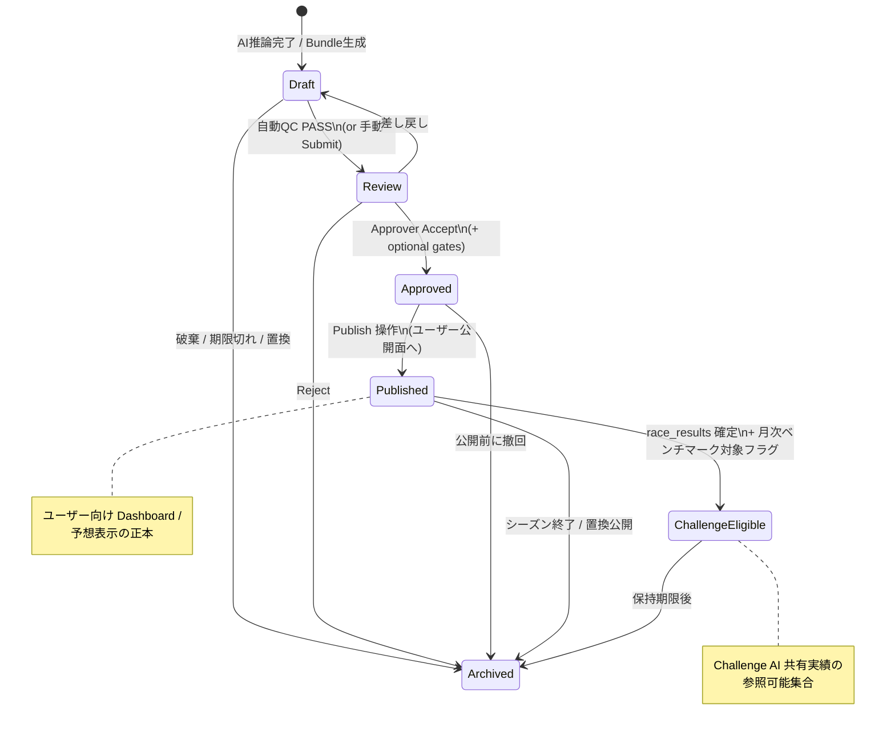

# Version9.0 Design — Prediction Lifecycle

**Status:** Design only（実装なし）  
**Date:** 2026-07-27  
**Parent:** Version8.9 Operations Console / Version8.8 Approval Workflow  
**Non-goals:** PE / CE / AI推論 / Research Logic / ResultAutomation 本体の変更

---

## 1. 背景

現状の Challenge AI 共有実績は:

```
Prediction 行（最新）
  → latest_prediction_bundle(race_id)
  → Challenge settle
```

承認・公開ゲートが無く、「最新 Bundle = Challenge 対象」になっている  
（`docs/audit/challenge-ai-benchmark-audit.md` / `challenge-data-integrity-audit.md`）。

Version9 では **Prediction 成果物のライフサイクル**を明示し、Challenge / Dashboard / Approval が参照する状態を分離する。

---

## 2. 目標ライフサイクル

```
Draft → Review → Approved → Published → ChallengeEligible → Archived
```

（実装時の正式ステータス名は下記。Challenge 対象は **Published** かつ結果確定後の派生ビューでもよい。）

---

## 3. 状態遷移図



### 遷移マトリクス（要約）

| From | To | トリガ | アクター |
|------|-----|--------|----------|
| — | Draft | 推論完了・Bundle INSERT | System (AI/PI) |
| Draft | Review | QC 自動 / Submit | System / OPS |
| Review | Approved | Approve | ADMIN/OPS（Approval） |
| Review | Draft | Request changes | ADMIN/OPS |
| Review / Draft | Archived | Reject / Timeout / Supersede | ADMIN/System |
| Approved | Published | Publish | ADMIN/OPS |
| Published | ChallengeEligible | Official result synced + eligible | System (RA 完了後フック想定) |
| * | Archived | 保持ポリシー | System |

**Hard rule:** Challenge は `Draft` / `Review` / `Approved(未Published)` を読まない。

---

## 4. 各状態の責務

| 状態 | 責務 | ユーザー可視 | Challenge | 備考 |
|------|------|:------------:|:---------:|------|
| **Draft** | 生 Bundle。推論直後・再生成可能 | 否 | 否 | 現行 `predictions` 行の多くがここに相当 |
| **Review** | QC・人レビュー待ち。差し戻し可 | 否（OPS のみ） | 否 | Ops Console レビューキュー |
| **Approved** | 公開承認済みだが未公開。Deploy/Publish 待ち | 否 | 否 | Version8.8 Approval の「Accept」に近いが **Prediction 単位** |
| **Published** | ユーザー向け予想の正本 | **是** | 条件付き* | Dashboard / レース詳細 |
| **ChallengeEligible** | Published かつ公式結果確定。共有ベンチマーク母集団 | 間接（成績） | **是** | Published のサブセットでも可 |
| **Archived** | 監査・再現用。現行正本から外す | 否（履歴） | 否（再集計ポリシー次第） | 削除せず保持 |

\* Challenge は「Published かつ結果確定」を要求する設計とする（上表の ChallengeEligible）。

### メタデータ（設計案・未実装）

各 Bundle バージョンに最低限:

- `lifecycle_status`
- `race_id` / `prediction_version` / `created_at`
- `reviewed_by` / `approved_by` / `published_at`
- `supersedes` / `superseded_by`
- `challenge_eligible_at`（結果確定時刻）

---

## 5. Challenge が参照する状態

| 参照 | 状態 |
|------|------|
| AI 共有実績 `ai_monthly` | **`ChallengeEligible` のみ**（= Published ∩ result finalized） |
| フォールバック | **無し**（Draft/Latest へ落とさない） |
| 月次フィルタ | 現行どおり `race_date` 月プレフィックス |

現行との差分:

| 現行 | V9 設計 |
|------|---------|
| `ORDER BY created_at DESC LIMIT 1` | `lifecycle_status IN (ChallengeEligible)` のうち正本 1 本 |
| 承認不要 | Published 経由必須 |

---

## 6. Dashboard が参照する状態

| 画面 / API | 参照状態 |
|------------|----------|
| ユーザー レース予想・印・解説 | **Published** |
| ホーム / マイページの「公開予想」 | **Published** |
| Challenge UI（AI 目標） | **ChallengeEligible** 由来の集計（API） |
| `/ops` Prediction レビュー | Draft / Review / Approved |
| `/ops` Approval（Research 週次） | 既存 Version8.8 キュー（下記接続） |
| 履歴・監査 | Archived + 全履歴 |

**原則:** 一般ユーザー Dashboard ≠ Challenge 母集団と必ずしも同一ではないが、Challenge は必ず Published 系からのみ取る。

---

## 7. Approval Workflow（Version8.8/8.9）との接続

Version8.8 は **Research → Production プロモート**の週次 Approval（decision / canary / 285R）。

Prediction Lifecycle は **レース単位 Bundle** の公開ライフサイクル。接続案:

```
[Research 週次 Approval — V8.8]
  Accept → Deploy Note → Human Deploy
        │
        │  （モデル/ポリシーが Production に載る）
        ▼
[推論 Pipeline]
  新 Bundle → Draft
        │
        ▼
[Prediction Approval — V9 新]
  Review → Approved → Published
        │
        ▼
[ResultAutomation 結果確定]
  Published → ChallengeEligible
        │
        ▼
[Challenge ai_monthly]
```

| レイヤ | 対象 | 既存 |
|--------|------|------|
| Research Approval | 週次プロモート可否 | V8.8 Queue |
| Prediction Approval | 個別 Bundle 公開 | **V9 新設（本設計）** |
| Result sync | 公式結果 | RA（変更せずフックのみ想定） |

**Boundary 維持:** Research 成果の自動 Production 適用はしない。Prediction Publish も Human/OPS 承認を要する設計。

---

## 8. Version8.9 との互換性

| 領域 | 互換方針 |
|------|----------|
| Ops Console `/ops` | Approval / History / Evidence は維持。Prediction 用タブまたは Queue 種別を **additive** 追加 |
| `approval-queue.json` | Research 用のまま。Prediction は別キュー `prediction-approval-queue` 推奨（混線防止） |
| Challenge API 契約 | `ai` / `user` セクション形状は維持。参照ソースのみ厳格化 |
| 既存 `predictions` テーブル | 移行期は `lifecycle_status` 列（または side table）を **additive**。未設定行は Draft 扱い |
| 移行期 Challenge | Feature flag `v9_challenge_published_only`（default false）で V8.9 挙動を維持可能 |
| Publish Layer V8.8.1 | Ops 静的 JSON はそのまま。Prediction 状態は AI DB / 専用 publish を追加検討 |

### 移行シーケンス（設計）

1. 列・状態機械の追加（読み取りは Draft 相当で現状維持）  
2. OPS で Review/Approve/Publish UI  
3. Flag ON で Challenge を ChallengeEligible のみに切替  
4. 過去月のバックフィル規則を決定（一括 Published 相当 or 再計算対象外）

---

## 9. 非対象（明示）

- PE / CE / 推論アルゴリズムの変更  
- RA の結果取得ロジック変更（状態遷移のトリガ購読のみ）  
- Research 週次 Approval の置換（接続のみ）

---

## 10. 成功条件（実装時の受け入れ）

1. Challenge が Draft/Latest を読めないこと  
2. Dashboard 公開予想が Published のみであること  
3. Research Approval と Prediction Approval がキュー分離されていること  
4. V8.9 Flag OFF で現行 Challenge と数値互換（移行期）
