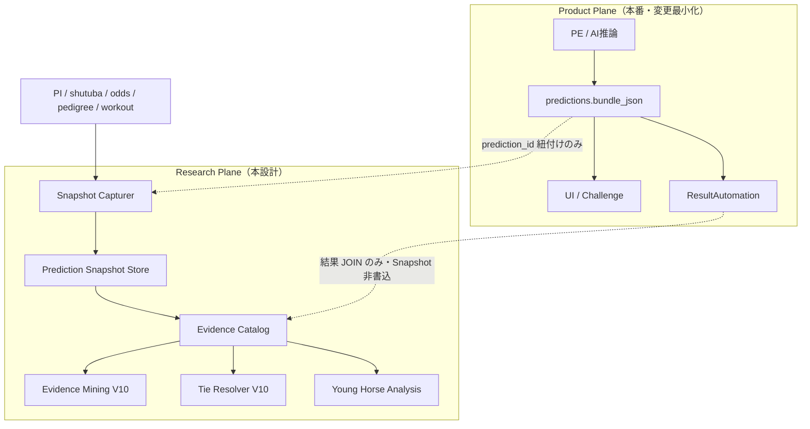

# Version9.2 Design — Research Evidence Platform

**Status:** Design only（実装なし / コード変更禁止）  
**Date:** 2026-07-27  
**Core artifact:** Prediction Snapshot（`docs/design/v92-prediction-snapshot.md`）  
**Consumers (V10+):** Evidence Mining / Tie Resolver / Young Horse Analysis  
**Hard Lock:** PE / CE / AI推論 / Research Runtime / ResultAutomation 変更禁止（本票は設計のみ）

---

## 1. 目的

Research が必要とする「予測時点の事実」を、本番 Prediction・Challenge・RA から切り離した **Research Data Platform** として定義する。

Version9.1 までの問題:

- Tie Break 候補の多くが DATA GAP  
- 結果後データと予測時点データの区別が無い  
- Miss Evidence は結果後中心で、新馬 Degeneracy の外部特徴を説明できない  

Version9.2 は **保存基盤の設計**まで。Mining / Resolver 実装は Version10。

---

## 2. プラットフォーム概観



**境界原則**

1. Product Plane の Score・Bundle 契約を Research が書き換えない  
2. Research Plane の欠測が Prediction 成功を落とさない  
3. すべての時変 Evidence は `captured_at <= prediction.created_at`  

---

## 3. コンポーネント

### 3.1 Snapshot Capturer

| 項目 | 設計 |
|------|------|
| 起動 | Prediction 永続化成功の **サイドカー通知**（フックは PE 内ロジック変更を避ける） |
| 責務 | 外部ソースから §Snapshot カタログを収集し Research Store へ書く |
| 失敗 | `capture_status=partial|failed` を残し、Product には影響しない |
| 再実行 | 同一 `prediction_id` は原則再書込禁止。修復は `repair` フラグ付き別ジョブ（監査必須） |

### 3.2 Prediction Snapshot Store

詳細は `v92-prediction-snapshot.md`。

- JSON: `evidence/research/prediction-snapshots/...`  
- DB: `research_prediction_snapshots`  
- Prediction とスキーマ分離・イミュータブル  

### 3.3 Evidence Catalog

Snapshot を分析用に索引付けするカタログ層。

| 索引 | 用途 |
|------|------|
| by `race_date` / `venue` / `class_label` | Young Horse セグメント |
| by `capture_status` / `field_coverage` | データ品質 |
| by `missing.reason` | 収集ギャップ優先度 |
| by `prediction_id` | Bundle JOIN |

日次 manifest:

```text
evidence/research/catalog/daily/{YYYY-MM-DD}.json
```

### 3.4 Downstream（Version10・本票では設計言及のみ）

| Consumer | Snapshot の使い方 |
|----------|-------------------|
| **Tie Resolver** | タイ集合 G 上で人気・厩舎・血統等を評価。Score 非改変 |
| **Evidence Mining** | Soft∧¬Strict / Degeneracy レースでどのフィールドが分離力を持つか探索 |
| **Young Horse Analysis** | 新馬・未勝利のクラス特異シグナル再計測（V9/V9.1 の再現拡張） |

既存の本番 Miss Evidence（`evidence/miss`, `miss_top1|3|5`）とは **併存**。混ぜない。

---

## 4. データ領域の分離

| 領域 | パス / テーブル | 書き手 | 読み手 |
|------|-----------------|--------|--------|
| Prediction | `predictions` | AI/PI | Product, RA, Challenge |
| Miss Evidence（本番） | `evidence/miss`, `evidence/improvement` | RA | OPS / Analyzer |
| **Prediction Snapshot** | `evidence/research/prediction-snapshots` | Capturer | Research only |
| Research Catalog | `evidence/research/catalog` | Catalog job | Research / OPS |
| Features（既存） | `features` / runners CSV | PI pipeline | PE 入力（本番） |

**禁止:** Snapshot を PE の入力特徴に静かに戻すこと（やるなら別 Approval・別 Version）。  
本 Platform の第一目的は **Resolver / 分析用の凍結観測**であり、学習データ化はスコープ外（将来 RFC）。

---

## 5. Evidence 優先度（収集ロードマップ）

V9.1 スコアカードと整合。

### P0 — Tie Resolver 阻塞解除

| Evidence | Snapshot フィールド |
|----------|---------------------|
| 人気 | `popularity` |
| 単勝オッズ | `win_odds` |
| 複勝オッズ | `place_odds` |
| 想定人気 | `expected_popularity` |
| 騎手 | `jockey` |
| 継続騎乗 | `jockey_continued`（新馬は null） |
| 厩舎 | `trainer` |
| 枠 | `frame` |
| 開催コンテキスト | `venue`, `distance`, `field_size`, `surface`, `going`, `weather` |

### P1 — 初出走の事前情報

| Evidence | Snapshot フィールド |
|----------|---------------------|
| 馬体重 | `horse_weight` |
| 馬体重増減 | `horse_weight_delta` |
| 父 | `sire` |
| 母父 | `damsire` |

### P2 — 調教系・環境拡張

| Evidence | Snapshot フィールド |
|----------|---------------------|
| 追切評価 | `workout_rating` |
| 調教時計 | `training_time` |
| 含水率 | `moisture_rate` |

---

## 6. Evidence Mining（V10 設計プレビュー）

Mining は Snapshot × Prediction × Result のオフラインジョブ。

### 6.1 基本単位

```text
race_id + prediction_id
  → tie_group from bundle
  → evidence vectors from snapshot
  → label: soft_hit / strict_hit / winner_in_group
```

### 6.2 出力（案）

| 成果物 | 内容 |
|--------|------|
| Signal Scorecard | 候補フィールドの Soft 回収率・残タイ率 |
| Segment Report | 2歳新馬 vs 他クラス |
| Coverage Report | DATA GAP 残存 |

Mining 結果は `evidence/research/mining/{week_id}/` へ。  
**Production Approval なしに PE へ自動適用しない**（V8.9 Approval 境界を踏襲）。

---

## 7. Tie Resolver との接続契約

```text
Bundle (scores, immutable)
    +
Snapshot (evidence @ predict time)
    →
TieResolver.shadow(G, evidence) → meta only   # V10a
TieResolver.launch(G, evidence) → pick ∈ G    # V10b after gate
```

入力欠落時:

- P0 が揃わない → `status=unresolved`, fail-open  
- Snapshot 行が無い → Resolver 非発火（現行選定）

詳細アルゴリズムは `v91-tie-resolver.md` を正とし、本 Platform はその **燃料**を供給する。

---

## 8. Young Horse Analysis との接続

V9 / V9.1 は結果付き 51R の事後分析だった。Platform 導入後:

| 分析 | 追加可能になること |
|------|-------------------|
| Degeneracy | 予測時点人気・厩舎との交差 |
| Soft vs Strict | Resolver シミュレーションの回顧 |
| 初出走 | 血統・馬体重・調教の分離力 |

再分析ジョブは Research 専用。RA / Challenge 集計パイプラインには載せない。

---

## 9. セキュリティ・ガバナンス

| 項目 | 方針 |
|------|------|
| アクセス | Research / ADMIN。一般ユーザー API から隠蔽 |
| 改ざん | Snapshot イミュータブル。repair は監査ログ必須 |
| リーク検査 | CI / 日次ジョブで `source_observed_at <= created_at` |
| Hard Lock | Capturer は PE リポジトリの推論コードに依存しない（PI/Collector 側） |
| Approval | Mining 提案 → V8.9 Approval → 人間デプロイ（自動適用禁止） |

---

## 10. 監視・OPS

Operations Console（将来カード案）:

| カード | 値 |
|--------|-----|
| Snapshot Capture Rate | 当日 % |
| P0 Field Coverage | % |
| Partial / Failed | 件数 |
| Anti-Leak Violations | 件数（常に 0） |

既存 System の Benchmark Strategy カードとは別。Research タブ or Evidence 配下。

---

## 11. 成功基準（Platform 導入後）

| 基準 | 定義 |
|------|------|
| Separation | Prediction Bundle 契約に Snapshot フィールドが増えていない |
| Completeness | 新馬 Prediction の P0 Snapshot 充足 ≥ 90% |
| Freshness | `captured_at` が `prediction.created_at` の ±5 分以内（収集遅延 SLO） |
| Utility | V10 Shadow Resolver が Snapshot 無しでは動ない / 有りでスコアカード算出可能 |
| Non-regression | Challenge / RA / UI の既存経路が未変更 |

---

## 12. リスク

| リスク | 緩和 |
|--------|------|
| Capturer が PE に密結合 | サイドカー + prediction_id ポーリング |
| 空 Snapshot が量産される | partial 監視とソース優先度 |
| 二重の真実（Bundle vs Snapshot） | Score は Bundle のみ、Evidence は Snapshot のみと文書固定 |
| ストレージ肥大 | 日付パーティション + 24ヶ月保持 |
| 調教・含水率の恒常欠損 | P2 をゲート対象外にできるよう coverage を層別 |

---

## 13. 実装しないもの（本票）

- コード / migration / API  
- Tie Resolver 本体  
- Mining ジョブ  
- PE/CE/RA/Research Runtime へのパッチ  

---

## 14. ドキュメントマップ

| 文書 | 役割 |
|------|------|
| **本ファイル** | Research Data Platform 全体像 |
| `v92-prediction-snapshot.md` | Snapshot スキーマ・保存・Anti-Leak |
| `v91-tie-resolver.md` | Resolver アルゴリズム（Score 非改変） |
| `v91-rank-degeneracy-analysis.md` | なぜ Snapshot が必要か（証拠） |
| `v9-younghorse-analysis.md` | 若駒セグメント問題 |
| `v9-prediction-lifecycle.md` | Prediction 状態機械（Product） |
| `v9-benchmark-layer.md` | Challenge 正本（単勝）— Snapshot 非依存 |

---

## 15. 次アクション（設計承認後のチケット案）

1. `expect-prediction-snapshot/1.0` JSON Schema 起草（contracts）  
2. Research ストアパスと `research_` テーブル設計レビュー  
3. Capturer の配置決定（PI sidecar vs post-predict worker）— **PE 非侵入**  
4. P0 ソース接続仕様（odds / trainer export / history continuity）  
5. V10 Evidence Mining / Shadow Resolver の入力契約を本 Platform に固定
