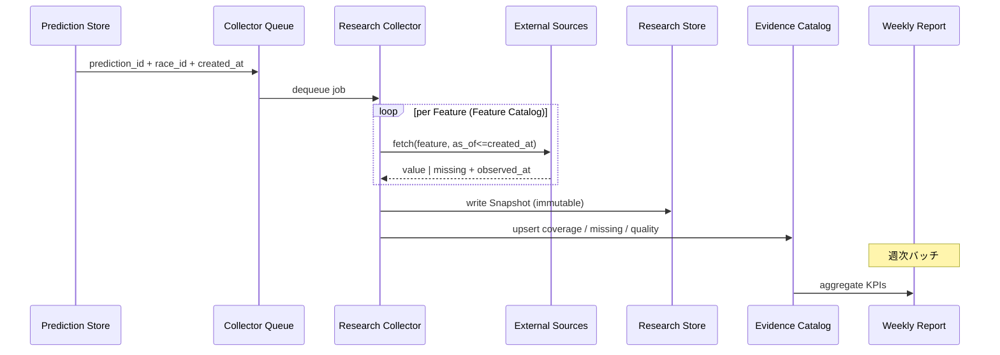

# Version9.3 Design — Research Collector

**Status:** Design only（実装なし / コード変更禁止）  
**Date:** 2026-07-27  
**Parent:** `docs/design/v92-prediction-snapshot.md` / `docs/design/v92-evidence-platform.md`  
**Sibling:** `docs/design/v93-feature-catalog.md`  
**Hard Lock:** AI / PE / CE / AI推論 / Research Runtime / ResultAutomation 変更禁止。**Research 専用。**

---

## 1. 目的

Version9.2 で定義した **Prediction Snapshot** を、実際に収集・品質管理・週次報告まで運ぶ **Research Collector** を設計する。

本 Collector は Product AI を変更せず、Prediction 永続化を **観測トリガ** としてのみ使う。

```
Prediction
    ↓  (prediction_id 通知 / ポーリング)
Snapshot request
    ↓
Collector  ← Retry / Partial / Missing / ObservedAt / Quality / Latency
    ↓
Research Store
    ↓
Evidence Catalog
    ↓
Weekly Report
```

---

## 2. 非ゴール

| 禁止 | 理由 |
|------|------|
| PE / CE / AI推論ロジック変更 | Hard Lock |
| `predictions.bundle_json` への書込 | Product 契約汚染防止 |
| 収集失敗で Prediction / UI / Challenge を落とす | Fail-open（Research 側） |
| 結果確定後データでの Snapshot 上書き | Anti-Leak（V9.2） |
| 本票でのコード実装 | 設計のみ |

---

## 3. パイプライン詳細



### 3.1 ステージ定義

| Stage | 責務 | 出力 |
|-------|------|------|
| **Trigger** | Prediction 行の検知（サイドカー / ポーリング） | `CollectJob` |
| **Collect** | Feature Catalog に従いソース取得 | `FeatureObservation[]` |
| **Assemble** | Snapshot payload 組み立て | `PredictionSnapshot` |
| **Persist** | Research Store へイミュータブル保存 | `snapshot_id` |
| **Catalog** | Evidence Catalog 更新 | coverage / missing 索引 |
| **Report** | 週次集計 | Weekly Report |

AI プロセス内に Collect ロジックを埋め込まない。**別プロセス / 別デプロイ単位**。

---

## 4. CollectJob 契約（Draft）

```json
{
  "job_id": "uuid",
  "schema_version": "expect-research-collect-job/1.0",
  "prediction_id": 12345,
  "race_id": "2026-07-26-03-05",
  "prediction_created_at": "2026-07-26T01:12:00+09:00",
  "priority": "normal|high",
  "attempt": 1,
  "max_attempts": 5,
  "enqueued_at": "...",
  "deadline_at": "prediction_created_at + 15m"
}
```

- **同一 `prediction_id` は1 Snapshot**（成功後の再 Collect は禁止。repair は監査付き別経路）  
- `deadline_at` 超過後の取得は Anti-Leak 違反リスク → 原則 `missing` で閉じる  

---

## 5. Collector 中核能力

### 5.1 Retry

| 項目 | 設計 |
|------|------|
| 対象 | 一時障害（HTTP 5xx / timeout / rate limit） |
| 非対象 | 恒久欠損（未発表・ソース非対応）→ Missing へ |
| バックオフ | 指数: 5s → 15s → 45s → 2m → 5m |
| 上限 | `max_attempts=5` または `deadline_at` の早い方 |
| 冪等 | 試行中は `capture_status=pending`；成功時のみ Persist |

Retry カウンタはジョブ単位 **および** フィーチャ単位の両方を持つ（一部だけ成功した Partial を壊さない）。

```text
feature_attempt[feature_id] += 1
job.attempt = max(feature_attempts)  # 監視用
```

### 5.2 Partial

Snapshot は **全 Feature 成功を待たない**。

| `capture_status` | 条件 |
|------------------|------|
| `complete` | P0 Feature がすべて非 Missing（P1/P2 欠落可） |
| `partial` | 1 フィールド以上取得成功だが P0 未充足 |
| `failed` | Persist 不能（ペイロード生成失敗・Store 障害） |
| `pending` | ジョブ実行中 |

Partial でも Research Store に **確定行として書く**（後から同 `prediction_id` を黙って埋めない）。  
追加情報が必要なら Version10 の `snapshot_supplement` 別レコード案（本票スコープ外）。

### 5.3 Missing

欠落は沈黙させず、必ず構造化記録する。

```json
{
  "field": "win_odds",
  "horse_number": 5,
  "reason": "not_yet_published|source_unavailable|parse_failed|timeout|rate_limited|not_applicable|deadline_exceeded",
  "source_id": "odds_api_win",
  "observed_at": null,
  "attempt": 3
}
```

| reason | 意味 |
|--------|------|
| `not_yet_published` | 予測時点で未発表（馬体重など） |
| `source_unavailable` | ソース未接続 / 開催非対応 |
| `parse_failed` | 取得できたがパース失敗 |
| `timeout` / `rate_limited` | Retry 尽きた一時系 |
| `not_applicable` | 定義不能（新馬の継続騎乗など） |
| `deadline_exceeded` | Anti-Leak 期限超過で打ち切り |

`not_applicable` は品質ペナルティから除外（Feature Catalog の Missing 率定義で区別）。

### 5.4 ObservedAt

すべての成功観測に必須:

```text
observation.observed_at   # ソース側の観測時刻（なければ取得時刻）
observation.fetched_at    # Collector が HTTP 等を完了した時刻
constraint: observed_at <= prediction_created_at
```

違反検知時:

1. 値を採用しない  
2. `missing.reason=deadline_exceeded` または `anti_leak_rejected`  
3. Quality イベントを Catalog に記録  
4. **Anti-Leak Violations カウンタ +1**（週次で常に 0 目標）

レース文脈（開催・距離）のような静的メタも、可能なら `observed_at` を付与（カード公開時刻など）。

### 5.5 Quality

観測単位の品質スコア（0–1）とフラグ:

| 次元 | 例 |
|------|-----|
| `freshness` | `prediction_created_at - observed_at` が小さいほど高 |
| `completeness` | フィールド内必須サブキー充足（複勝 min/max など） |
| `consistency` | 人気順位と単勝オッズ順序の矛盾検知 |
| `parse_confidence` | パース成功確度（騎手名ノイズ除去後など） |

```json
"quality": {
  "score": 0.82,
  "flags": ["jockey_name_normalized"],
  "freshness_sec": 120
}
```

Snapshot 全体の `field_coverage` = 非 Missing フィールド数 / 対象フィールド数（層別: P0/P1/P2）。

### 5.6 Latency

| メトリクス | 定義 | SLO 案 |
|------------|------|--------|
| `enqueue_latency` | `created_at → enqueued_at` | ≤ 30s (p95) |
| `collect_latency` | `job_start → persist` | ≤ 5m (p95) |
| `e2e_latency` | `prediction.created_at → snapshot.captured_at` | ≤ 10m (p95) |
| `source_latency[source_id]` | ソース別 fetch 時間 | 監視のみ |

Latency 超過は Retry 継続中でも `partial` 確定してよい（締切優先）。Weekly Report に p50/p95 を載せる。

---

## 6. ソースアダプタ

Collector は Feature を直接叩かず、**Source Adapter** 経由。

| source_id | 取得対象例 | 備考 |
|-----------|------------|------|
| `shutuba_entries` | 騎手・枠・厩舎・斤量 | `_trainer` 露出が前提 |
| `odds_api_win` | 単勝オッズ・人気 | |
| `odds_api_place` | 複勝オッズ | |
| `derived_expected_pop` | 想定人気 | 単勝から算出（ネットワーク無し） |
| `horse_history` | 継続騎乗 | 新馬は N/A |
| `pedigree_db` | 父・母父 | |
| `horse_weight_board` | 馬体重・増減 | 発表前は Missing |
| `workout_page` | 追切・調教時計 | |
| `race_meta` | 開催・距離・頭数・馬場・天候 | |
| `track_moisture` | 含水率 | 非対応開催は source_unavailable |

各 Adapter 出力:

```json
{
  "source_id": "odds_api_win",
  "observed_at": "...",
  "fetched_at": "...",
  "latency_ms": 340,
  "ok": true,
  "payload": {},
  "error": null
}
```

---

## 7. Research Store 書込

V9.2 のパスを踏襲:

```text
evidence/research/prediction-snapshots/{race_date}/{race_id}/{prediction_id}.json
research_prediction_snapshots  (DB index)
```

書込トランザクション:

1. Assemble payload（Feature Catalog の全キーを埋める。欠落は null + missing）  
2. Anti-Leak バリデーション  
3. Persist JSON + DB  
4. Catalog upsert  
5. Job → `succeeded`

失敗時 Job → `failed`（Snapshot 行が無い）。Partial 成功は `succeeded` + `capture_status=partial`。

---

## 8. Evidence Catalog 更新

Collector 成功/部分成功のたびに:

| 更新 | 内容 |
|------|------|
| race/prediction 索引 | snapshot_id, capture_status, field_coverage |
| feature 日次カウンタ | success / missing / quality sum（Catalog 詳細は sibling 文書） |
| anti_leak_violations | 当日累計 |

Catalog は Snapshot の派生。**正本は Snapshot Store**。

---

## 9. Weekly Report

### 9.1 生成

| 項目 | 設計 |
|------|------|
| 周期 | 毎週月曜 03:30 JST（案） |
| 入力 | Evidence Catalog 日次 + Snapshot manifest |
| 出力 | `evidence/research/reports/weekly/{week_id}.json` + 人間可読 MD |
| OPS | Operations Console Research カードからリンク（将来） |

### 9.2 必須セクション

1. **Volume** — Prediction 数 / Snapshot 数 / 作成率  
2. **Capture Status** — complete / partial / failed  
3. **Latency** — e2e p50/p95、ソース別  
4. **Retry** — 平均 attempt、exhausted 件数  
5. **Missing** — reason 別・Feature 別 Missing 率（P0 強調）  
6. **Quality** — 平均 quality、consistency フラグ件数  
7. **Anti-Leak** — violations（目標 0）  
8. **Segment** — 2歳新馬だけの P0 充足（Tie Resolver 準備状況）  
9. **Action List** — Missing 率が高い Feature のソース修正チケット候補  

Weekly Report は **自動で PE にフィードバックしない**（V8.9 Approval 境界）。

---

## 10. 配置・隔離

```text
[AI Host]
  expect-ai (Prediction)     ← 変更しない
  research-collector (new)   ← 別 systemd / 別コンテナ案
       │
       ├ read-only: predictions テーブル / API
       ├ write: research_* / evidence/research/**
       └ read: PI / netkeiba 系（Collector 自身の資格情報）
```

- AI の CPU/推論キューと資源分離  
- Collector 障害でも expect-ai は継続  
- 秘密情報は Research 用に分離可能なら分離  

---

## 11. 監視 SLO（導入後）

| SLO | 目標 |
|-----|------|
| Snapshot 作成率 | ≥ 95% / day |
| e2e_latency p95 | ≤ 10m |
| P0 field coverage（新馬） | ≥ 90% |
| Anti-Leak violations | **0** |
| Job exhausted (failed) | ≤ 2% |

アラート案: 作成率 < 90%、violations > 0、failed > 5%。

---

## 12. セキュリティ

- 資格情報は Collector のみ（AI プロセスに共有しない方が望ましい）  
- Research Store 書込権限は Collector サービスアカウントに限定  
- repair ジョブは ADMIN 監査ログ必須  

---

## 13. 実装フェーズ（将来・本票では実装しない）

| Phase | 内容 |
|-------|------|
| V9.3a | Job 契約 + Queue + Store スタブ |
| V9.3b | P0 Source Adapters + Retry/Partial/Missing |
| V9.3c | Evidence Catalog 連携 + Latency/Quality メトリクス |
| V9.3d | Weekly Report 生成 |
| V10 | Tie Resolver Shadow が Store を正式入力に |

---

## 14. 参照

- `docs/design/v93-feature-catalog.md`  
- `docs/design/v92-prediction-snapshot.md`  
- `docs/design/v92-evidence-platform.md`  
- `docs/design/v91-tie-resolver.md`  
- `docs/research/v91-rank-degeneracy-analysis.md`
