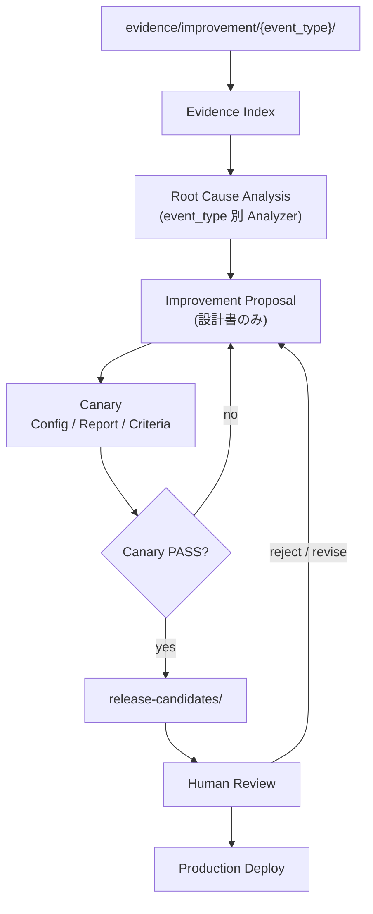

# Phase AI-Improvement Pipeline — 設計書

**Status:** I-1 implemented (Evidence Index). I-2+ pending review gate.  
**前提:** Production READY。P-1 / OPS-ResultAutomation / OPS-Monitor と整合。  
**入力:** `evidence/improvement/` のみ  
**禁止:** Production 上での Prediction Core 変更・改善アルゴリズム実行・コード自動生成（本パイプラインの Proposal 段階）

### 追加要件（承認反映）

1. **Proposal Lifecycle** — `DRAFT` … `DEPLOYED` + `CANARY_FAIL` / `REJECTED` / `ARCHIVED`  
   契約: `contracts/expect-proposal-lifecycle/1.0/`（**I-3 で強制**）
2. **Evidence 追跡** — Proposal `evidence_refs` 必須（`event_id` / `event_type` / `path`）  
   **I-3 で生成時検証（0 件は拒否）**
3. **Analyzer 参照** — Proposal `analysis_refs`（`analysis_id` / `event_type` / `path` + advisory `confidence`）  
   Analyzer confidence は採否の単独基準にしない。`metadata` 等は後方互換で拡張可。

---

## 0. 目的と境界

### 目的

Production が出力した Improvement Evidence を入力に、Development 側で

**解析 → 改善提案（設計書）→ Canary → Release Candidate → Human Review → Production Deploy**

までを標準化し、将来自動化する。

### 境界

| 層 | やる | やらない |
|----|------|----------|
| **Production** | Evidence Export（既存） | 原因分析・Proposal・Canary・Core 変更 |
| **Development Pipeline** | Index / RCA / Proposal / Canary / RC | 本番 DB 書込・本番 Core ホットパッチ |
| **Human Review** | 承認 / 却下 / 差し戻し | 自動デプロイ（必須ゲート） |
| **Production Deploy** | 承認済み RC のみ適用 | 未承認 Proposal の適用 |

```
Production Core は Deploy 承認まで不変。
Pipeline は設計書・評価成果物を生成する。Proposal 段階ではコードを生成しない。
```

---

## 1. エンドツーエンド・フロー



### ステージ定義

| # | ステージ | 入力 | 出力 | 自動化方針（実装時） |
|---|----------|------|------|----------------------|
| 1 | Evidence Ingest | `evidence/improvement/**` | 検証済みイベント集合 | sync 済み前提 |
| 2 | Evidence Index | イベント集合 | `development/index/` | 集計・指紋クラスタ |
| 3 | Root Cause Analysis | Index + 生 Evidence | `development/analysis/{event_type}/` | Analyzer Registry |
| 4 | Improvement Proposal | RCA | `development/proposals/{id}.md` + `.json` | **設計書のみ・コード禁止** |
| 5 | Canary Evaluation | Proposal | config / report / criteria | オフライン評価 |
| 6 | Release Candidate | Canary PASS のみ | `development/release-candidates/{id}/` | ゲート厳守 |
| 7 | Human Review | RC | 承認記録 | 人手必須 |
| 8 | Production Deploy | 承認済み RC | Prod リリース | 既存デプロイ手順 |

---

## 2. ディレクトリ構成（設計）

```
evidence/improvement/                 # Production 正本（入力専用・Dev は読のみ）
├── miss/{date}/
├── feature_missing/{date}/
├── prediction_failed/{date}/
├── result_sync_failed/{date}/
└── manifest/{date}/

development/
├── index/                            # Evidence Index
│   ├── by-date/{YYYY-MM-DD}.json
│   ├── by-event-type/{event_type}.json
│   └── clusters/{fingerprint}.json
├── analysis/                         # Root Cause（event_type 分離）
│   ├── miss/
│   ├── feature_missing/
│   ├── prediction_failed/
│   ├── result_sync_failed/
│   └── _registry.json                # Analyzer 登録（将来 type 追加）
├── proposals/
│   ├── _TEMPLATE.md
│   └── {proposal_id}.md + .json
├── canary/
│   ├── configs/{proposal_id}.json
│   ├── reports/{proposal_id}.json      # 要約（レガシー）
│   ├── criteria/{proposal_id}.json
│   └── results/{proposal_id}/          # I-4 独立 Canary Result
│       ├── {run_id}.json
│       └── latest.json
└── release-candidates/
    └── {proposal_id}/                # Canary PASS のみ
        ├── candidate.json
        ├── checklist.md
        └── links.json                # proposal / canary 参照
```

Production の `services/win5-ai/` および Prediction Core には **書かない**。

---

## 3. Evidence Analysis（event_type 分離）

### 3.1 Analyzer Registry

将来の `event_type` 追加に備え、**Registry パターン**（Production Evidence Builder と同型）を採用する。

```
AnalyzerRegistry
  ├── miss                 → MissRootCauseAnalyzer
  ├── feature_missing      → FeatureMissingAnalyzer
  ├── prediction_failed    → PredictionFailedAnalyzer
  ├── result_sync_failed   → ResultSyncFailedAnalyzer
  └── <future>             → register(event_type, analyzer)
```

| 規則 | 内容 |
|------|------|
| 未知 type | Index には載せるが RCA は `unsupported` でスキップ（パイプライン全体は止めない） |
| 1 Evidence | 1 Analyzer のみ（複合原因は Proposal で束ねる） |
| 出力 | Markdown + 構造化 JSON（`expect-root-cause/1.0` 予定） |

### 3.2 種別ごとの解析観点（設計）

| event_type | 主因カテゴリ例 | Proposal が触れうる対象 | 触れないもの |
|------------|----------------|-------------------------|--------------|
| `miss` | ranking / confidence / explain drift | 特徴重み設計・閾値・説明方針 | 本番 Core 直書き |
| `feature_missing` | ETL 欠落 / schema gap / source 遅延 | データ供給設計・fallback 方針 | 黙って mock 成功扱いの恒久化 |
| `prediction_failed` | 予測未生成 / 解決失敗 | パイプライン前提・race_id 整合 | 再予測の Prod 強制 |
| `result_sync_failed` | CSV/Provider / 権限 / パス | ResultProvider 運用・リトライ設計 | Monitor の無効化 |

### 3.3 Evidence Index（設計）

`development/index/` に日次・種別・指紋クラスタを出力する。

必須フィールド（設計）:

| フィールド | 説明 |
|------------|------|
| `schema_version` | `expect-evidence-index/1.0` |
| `generated_at` | ISO8601 |
| `source_root` | `evidence/improvement` |
| `counts_by_event_type` | map |
| `events[]` | `{ event_id, event_type, race_date, fingerprint, path }` |
| `clusters[]` | fingerprint 単位の件数・代表 event_id |

Index は **集計のみ**。改善判断は RCA / Proposal に委ねる。

---

## 4. Improvement Proposal（設計書のみ）

### 原則

- **コード生成禁止**（パッチ・diff・実装スクリプトを Proposal に含めない）
- テンプレート 5 項目を必須化: **目的 / 対象 / 期待効果 / 副作用 / 評価方法**
- 1 Proposal = 1 主要仮説（複数 fingerprint を束ねる場合は明示）

### 成果物

| ファイル | 役割 |
|----------|------|
| `proposals/{proposal_id}.md` | 人間可読の設計書 |
| `proposals/{proposal_id}.json` | 機械可読（Schema 準拠） |

契約: `contracts/expect-improvement-proposal/1.0/schema.json`  
テンプレート: `development/proposals/_TEMPLATE.md`

### proposal_id 採番（設計）

```
IMP-{YYYYMMDD}-{event_type_short}-{seq}
例: IMP-20260720-miss-001
```

---

## 5. Canary（I-4）

Proposal 入力 → **独立 Canary Result** 出力。Proposal 本文は書き換えず、Result を根拠に Lifecycle のみ更新。

| 成果物 | パス | 内容 |
|--------|------|------|
| Canary Config | `canary/configs/{id}.json` | 評価範囲・ベースライン・禁則 |
| Success / Rollback Criteria | `canary/criteria/{id}.json` | ゲート定義 |
| **Canary Result** | `canary/results/{id}/{run_id}.json` | 判定・ゲート詳細・Lifecycle 監査 |
| Latest | `canary/results/{id}/latest.json` | 最新 Result ポインタ |
| Canary Report | `canary/reports/{id}.json` | 要約（`canary_result_path` 参照） |

契約: `contracts/expect-canary-result/1.0/schema.json`  
実装ノート: [`improve-i4-canary.md`](improve-i4-canary.md)

### 判定（3 状態）

| Verdict | Lifecycle |
|---------|-----------|
| `PASS` | → `CANARY_PASS` |
| `PASS_WITH_WARNING` | → `CANARY_PASS`（RC 前に warning 確認） |
| `FAIL` | → `CANARY_FAIL` |

Human Review 未承認 → `evaluation_status: pending_human_review`、Lifecycle 不更新。

### Canary 評価原則

- **Development / オフライン**のみ（Production Core 不変）
- ゲート例（event_type で追加可）:
  - `no_hit_at_1_regression`
  - `no_coverage_regression`
  - `ops_monitor_green`（設計上の参照指標。Prod 監視を汚さない）
  - event_type 固有ゲート（例: `feature_missing` → `feature_fill_rate_non_decreasing`）
- `status`: `pending` \| `pass` \| `pass_with_warning` \| `fail` \| `aborted`

### PASS の定義

```
Canary Report.status == "pass"
  AND 全 success.gates == true
  AND rollback トリガ未発火
```

---

## 6. Release Candidate

### ゲート

```
Canary PASS の Proposal のみ release-candidates/ へ出力可
```

FAIL / pending / aborted は **出力禁止**（実装時に CLI が拒否）。

### RC 内容（設計書・チェックリスト。この段階でも「自動コード生成」はしない）

| ファイル | 内容 |
|----------|------|
| `candidate.json` | メタ・参照リンク・リスク・デプロイ手順ポインタ |
| `checklist.md` | Human Review 項目 |
| `links.json` | proposal / canary config / report / criteria の相対パス |

承認後の **実装・PR・デプロイ**は別ランブック（人間または別フェーズ）。本 Pipeline の RC は「デプロイしてよい設計パッケージ」である。

---

## 7. Human Review → Production Deploy

| ステップ | 責任 | 記録 |
|----------|------|------|
| Review | 人間（ADMIN / 将来 OPS） | `release-candidates/{id}/review.json`（実装時） |
| Approve | 明示的 approve | `status=approved` |
| Deploy | 既存 CI / runbook | Prediction Core 変更は承認済み差分のみ |
| Rollback | Canary rollback criteria に従う | OPS-Monitor で健全性確認 |

Deploy は本設計の **最終ゲート**であり、Pipeline 自動化の対象外（手動または既存 CD）。

---

## 8. 契約・テンプレート一覧

| 成果物 | パス |
|--------|------|
| Pipeline 設計（本紙） | `docs/ops/ai-improvement-pipeline.md` |
| Runbook | `docs/ops/ai-improvement-runbook.md` |
| Proposal Schema | `contracts/expect-improvement-proposal/1.0/schema.json` |
| Canary Schema | `contracts/expect-canary/1.0/schema.json` |
| Release Candidate Schema | `contracts/expect-release-candidate/1.0/schema.json` |
| Proposal Template | `development/proposals/_TEMPLATE.md` |
| Canary Config Template | `development/canary/configs/_TEMPLATE.json` |
| Canary Report Template | `development/canary/reports/_TEMPLATE.json` |
| Criteria Template | `development/canary/criteria/_TEMPLATE.json` |
| RC Template | `development/release-candidates/_TEMPLATE/` |

---

## 9. OPS / P-1 との関係

| コンポーネント | 関係 |
|----------------|------|
| OPS-ResultAutomation | Evidence の **生産者**。本 Pipeline は消費者 |
| OPS-Monitor | 健全性のみ。改善判断に使わない（ゲート参照は可） |
| OPS-1 / OPS-1A | ユーザー公開制御。Dev Pipeline と独立 |
| P-1 | 本設計はその具体化（Miss → Improvement Evidence 全種別） |

---

## 10. 実装フェーズ（承認後）

| ID | 内容 | 依存 | 状態 |
|----|------|------|------|
| I-1 | Evidence Index CLI | 本設計承認 | **DONE** — [`improve-i1-evidence-index.md`](./improve-i1-evidence-index.md) |
| I-2 | Analyzer Registry + 4 Analyzer | I-1 | **DONE** — [`improve-i2-analyzer-registry.md`](./improve-i2-analyzer-registry.md) |
| I-3 | Proposal 生成 + Lifecycle + evidence_refs + analysis_refs | I-2 | **DONE** — [`improve-i3-proposal-generator.md`](./improve-i3-proposal-generator.md) |
| I-4 | Canary 4 点セット生成 + 評価ハーネス | I-3 | pending |
| I-5 | RC ゲート + Manifest | I-4 | implemented |
| I-6 | Review 記録 + Runbook 連結 | I-5 | pending |

**I-3 完了。Lifecycle / evidence_refs 運用の再レビュー後に I-4。**

---

## 11. 非目標

- Production での自動学習 / 自動重み更新
- Proposal からのソースコード自動生成
- Canary FAIL の RC 出力
- OPS-Monitor / Result Automation の仕様変更

---

*I-3 complete — request re-review of Proposal Lifecycle + evidence_refs (+ analysis_refs) before I-4.*
