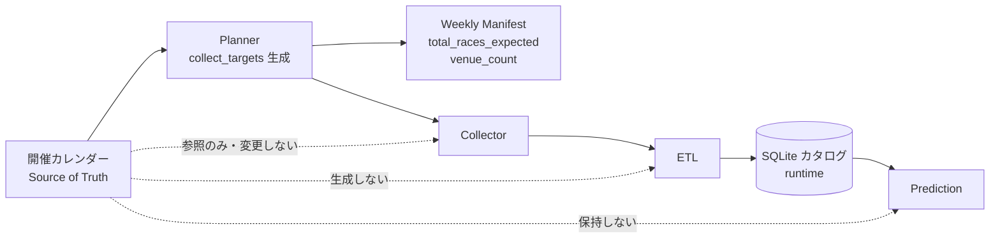
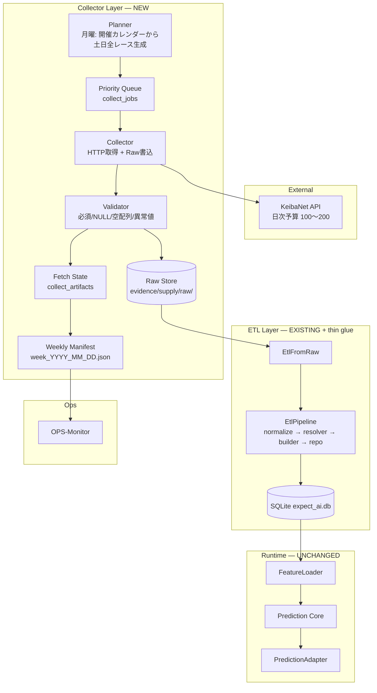
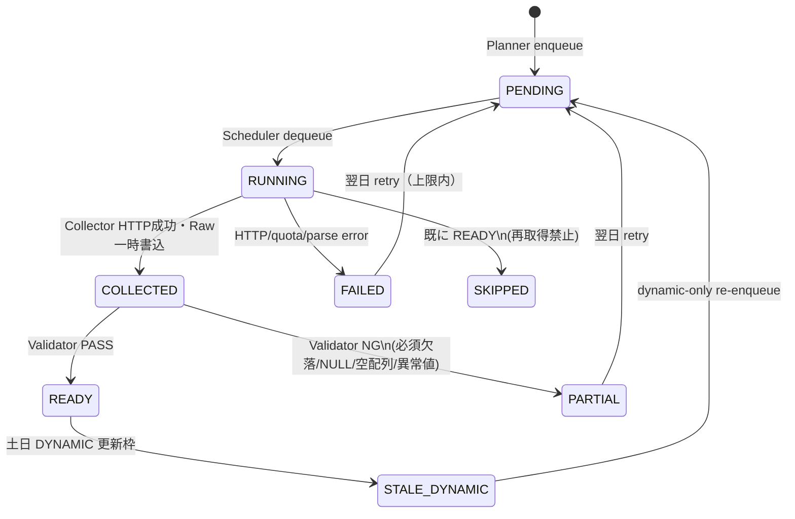
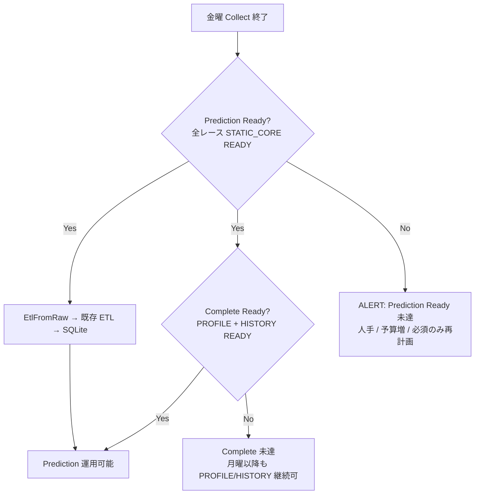
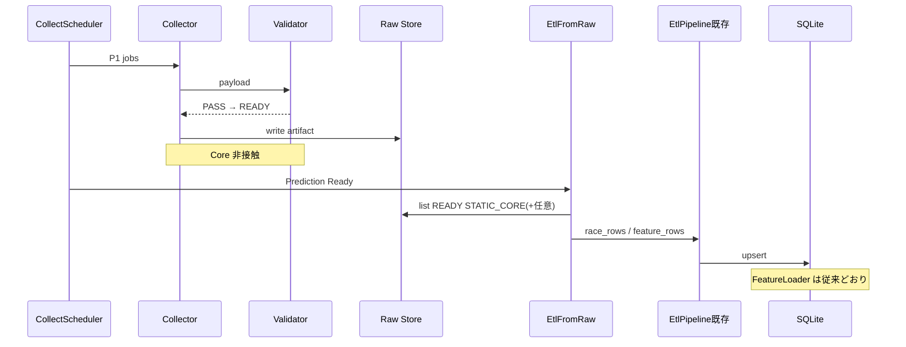
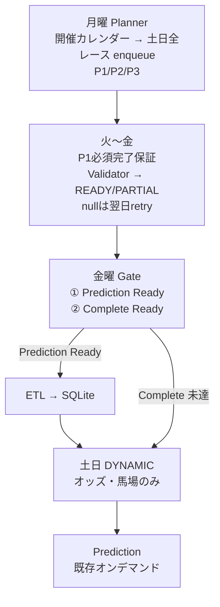

# Collector — Weekday Dispersion & Priority Supply

**Status:** Design only（実装未着手）  
**Depends:** Phase E Data Supply（`data-supply-phase-e.md`）、Phase D Data Foundation  
**Non-goals:** Prediction Core / FeatureLoader / PredictionAdapter / Result Automation の変更

---

## 1. 目的と制約

### 目的

KeibaNet のアクセス制限（**1日あたり 100〜200 req 程度**）を前提に、馬・レース情報の取得を **開催日（土日）ではなく月曜〜金曜へ分散**する。

### 運用条件

| # | 条件 |
|---|------|
| 1 | 取得済みデータは再取得しない |
| 2 | null / Validator NG は翌日に自動リトライ |
| 3 | **金曜日まで**に土日全レースの静的取得を完了（段階ゲートあり） |
| 4 | 土日はオッズ・馬場など **開催日変動情報のみ**更新 |
| 5 | **Collector と ETL を分離** |
| 6 | **Prediction Core は変更しない** |
| 7 | Scheduler により運用を自動化 |

### 変更しないもの（現行アーキテクチャ維持）

- Prediction Core（`CorePipeline` / Scorer / Ranker / Confidence）
- FeatureLoader
- PredictionAdapter（Python / BFF）
- Result Automation

### 設計原則 — Single AI は Win5 限定ではない

| 原則 | 内容 |
|------|------|
| **Single AI の対象** | **カタログに存在する全レース**。`PredictionAdapter.list_with_meta()` はカタログ全件を iterate し、任意の `date` / `venue` クエリのみで絞る（Win5 / `win5_leg` フィルタなし） |
| **Collector の役割** | Single AI が参照する **SQLite カタログ**へ、土日の **全開催レース**を供給する。Win5 5 レース用の取得パイプラインではない |
| **Win5 レガシーとの分離** | `win5_fetcher.py` / `list_win5_races()` / `win5_probabilities.csv` は **Win5 製品側**。Collector・ETL・Prediction からは **呼ばない・依存しない** |
| **命名の注意** | リポジトリ内の `win5-ai` 等は歴史的ラベル。本 Collector 設計の Data Scope は **Win5 商品の 5 レッグではない** |

調査根拠（現行実装）: `RaceRepository.as_catalog()` → `PredictionAdapter` 全件 iterate。ETL は CSV 全行 upsert。Win5 絞り込みコードは Single AI 本体に存在しない。

---

## 2. Data Scope

Collector の **正式対象** を次のとおり固定する。

```
全開催場 × 土日全レース（1R〜12R）
```

| 次元 | 範囲 | 備考 |
|------|------|------|
| **開催日** | 対象週の **土曜・日曜** | `week_id` = その週土曜基準 |
| **開催場** | その土日に **JRA 中央競馬で開催される全場** | 函館・札幌・新潟・福島・中山・東京・中京・京都・阪神・小倉 等。カレンダー上 0 場の日は対象外 |
| **レース番号** | 各場 **1R〜12R**（開催カレンダー上の全 R） | 短縮開催・除外 R は **開催カレンダー正本**に従う。Win5 5 レッグ・11R 固定・メインレースのみ等の **暗黙フィルタは禁止** |

### 含む / 含まない

| 含む | 含まない |
|------|----------|
| 新馬・未勝利・1勝クラス等、グレード問わず全 R | JRA WIN5 投票対象 5 レース **のみ** |
| 各場 12R 未満の短縮開催（カレンダー記載分） | 地方競馬・海外（本設計スコープ外） |
| 土日各日 × 全開催場の **レース単位** STATIC / DYNAMIC ジョブ | レガシー `get_win5_target_races_for_this_week()` の 5 件リスト |

ETL 投入後、Single AI **ランタイムカタログ**（`races` テーブル / `RaceRepository.as_catalog()`）は Collector 供給分を反映する。ただし **週次の対象レース数（expected）の正本は開催カレンダー**（§3 Source of Truth）。Collector / ETL の投入件数で expected を再定義しない。

---

## 3. Source of Truth

**開催カレンダー**を Planner の **唯一の正本（Source of Truth）** とする。

週次の対象レース数・開催場数は **Collector や ETL では決めない**。開催カレンダーを唯一の基準とし、Planner がそこから `collect_targets` を生成する。



### レイヤ別責務

| レイヤ | 開催カレンダーに対する責務 |
|--------|---------------------------|
| **Planner** | **開催カレンダーから `collect_targets` を生成する**（土日 × 全開催場 × 1R〜12R、カレンダー記載分）。`collect_jobs` enqueue と Manifest 初期値（`total_races_expected` / `venue_count` / `race_count_per_venue`）の算出 |
| **Collector** | 開催カレンダーを **変更しない**。Planner が enqueue したジョブに従い KeibaNet から取得するのみ |
| **ETL** | 開催カレンダーを **生成しない**。Validator 通過 Raw を正規化し SQLite へ upsert するのみ |
| **Prediction** | 開催カレンダーを **保持しない**。ランタイムカタログ（SQLite / モック JSON）上のレースを推論対象とする |

### `collect_targets`（Planner 出力・論理）

開催カレンダー 1 行 ≒ 次のタプル:

```
(race_date, venue, race_no)
```

Planner は対象週の土日について、カレンダー上の **全タプル**を `collect_targets` として固定し、各タプル × artifact 種別から `collect_jobs` を派生する。  
**`collect_targets` の件数 = `total_races_expected`**（Manifest）。

### Manifest との関係

| Manifest フィールド | 算出元 |
|---------------------|--------|
| **`races.total_races_expected`** | **開催カレンダー正本** — `collect_targets` の件数（Planner が月曜に確定） |
| **`races.venue_count`** | **開催カレンダー正本** — 対象週土日のユニーク開催場数 |
| **`races.race_count_per_venue`** | **開催カレンダー正本** — 日 × 場ごとの R 数 |
| `races.total_races_ready` | Collect / Validator の **進捗**（カレンダーから再計算しない） |
| `races.prediction_ready_races` | Collect / Validator / ETL の **進捗**（expected の分子） |

**禁止:** Collector の取得件数・ETL の upsert 件数・SQLite `races` 行数から `total_races_expected` や `venue_count` を **逆算して上書き**すること。

---

## 4. Planner

Planner は **Win5 対象生成ではない**。責務は **開催カレンダー（§3 Source of Truth）から `collect_targets` を生成し、土日の全開催レースに対する `collect_jobs` を enqueue すること**。

### 入力

| 入力 | 説明 |
|------|------|
| **開催カレンダー** | §3 の **唯一の正本**。対象週の土日について、場・日・R 数（1〜12）が分かる正本（KeibaNet / JRA 開催情報。実装時に Adapter で抽象化） |
| **`week_id`** | その週土曜（例: `2026-07-25`） |

### 出力

各 `(race_date, venue, race_no)` に対し、§8 Queue 設計どおり `race_meta` / `entries_core` / … のジョブを enqueue。

```
開催カレンダー（Source of Truth）
  → collect_targets（土日 × 全開催場 × 各場 1R..12R）
  → collect_jobs（P1/P2/P3 × STATIC/DYNAMIC）
  → Weekly Manifest 初期化（total_races_expected / venue_count — カレンダー由来）
```

### 処理（月曜 06:00 既定）

1. 対象週の **土曜・日曜** `race_date` を確定  
2. 各 `race_date` の **全開催場**をカレンダーから列挙 → `venue_count`  
3. 各 `(race_date, venue)` の **1R〜12R**（実開催 R 数）を列挙 → `race_count_per_venue`  
4. レース単位 × artifact 種別で `collect_jobs` を生成（既存 READY は SKIP）  
5. `total_races_expected` / `venue_count` / `race_count_per_venue` を **開催カレンダー正本から算出**し Manifest に書き込む（Collector / ETL 件数は使わない）  

### 禁止事項

- `win5_leg` / WIN5 5 レッグ / `list_win5_races()` による対象絞り込み  
- 11R・メインレース・G1〜G3 等の **グレード・R 番号による暗黙フィルタ**（Data Scope 逸脱）  
- デモ CSV（`demo_races.csv` 等）を Planner の正本にすること  
- Collector / ETL / SQLite 行数から **`total_races_expected` や `venue_count` を逆算**すること（§3 違反）  

---

## 5. アーキテクチャ



### パイプライン（固定）

```
KeibaNet
  → Planner
  → Queue（Priority）
  → Collector
  → Validator
  → READY / PARTIAL / FAILED
  → Raw Store
  → 既存 ETL
  → SQLite
  →（既存）FeatureLoader → Prediction Core
```

**Collector 成功 ≠ データ正常。** Validator 通過後にのみ `READY` とする。

---

## 6. 静的データの細分化

従来の単一 `STATIC` を三分する。

| Kind | 内容例 | Prediction への位置づけ |
|------|--------|-------------------------|
| **STATIC_CORE** | race メタ、horse（出走馬）、frame、jockey | **これだけで Prediction 可能を保証** |
| **STATIC_PROFILE** | horse profile、trainer、owner | 説明・分析品質向上（任意） |
| **STATIC_HISTORY** | 近走詳細、血統、統計 | モデル拡張・説明用（任意） |

| Kind | 内容例 | 取得ウィンドウ |
|------|--------|----------------|
| **DYNAMIC** | オッズ、人気、馬場、天候、当日馬体重 | 土日（＋金曜夕方の暫定可） |

### Prediction Ready の定義

ある開催週について、**Data Scope（§2）の全レース** — 開催カレンダー正本（§3）に基づく `total_races_expected` 件すべて — で:

- `STATIC_CORE` が **Validator 通過後 `READY`**
- Raw Store に ETL 可能な成果物がある
- （運用上）`EtlFromRaw` 実行後、SQLite に FeatureLoader が読める features がある

→ **Prediction Ready = true**（Profile / History 未完でも可）。Manifest 上は **`prediction_ready_races === total_races_expected`**

### Complete Ready の定義

- 全対象レースで `STATIC_CORE` + `STATIC_PROFILE` + `STATIC_HISTORY` が `READY`
- 静的データ完成率 100%

→ **Complete Ready = true**

---

## 7. Priority Queue

`collect_jobs.priority` を必須とする。

### Priority 定義

| Priority | 対象 | 例 |
|----------|------|-----|
| **P1** | Prediction 必須 | レース一覧、出走馬一覧、STATIC_CORE 全フィールド |
| **P2** | プロフィール | 騎手詳細、調教師、馬プロフィール（STATIC_PROFILE） |
| **P3** | 履歴・統計 | 近走詳細、血統、統計（STATIC_HISTORY） |

### 予算枯渇時の保証

```
日次予算 B を消費する順:
  1. P1 かつ PENDING（scheduled_for ≤ today）をすべて消化するまで dequeue
  2. 残り予算で P2
  3. さらに残りで P3
```

**規則:**

- その日の予算内で **P1 を完了できない場合** → `budget_exhausted_before_p1_complete` を Manifest / OPS に記録し、**P2/P3 は起動しない**
- P1 完了後のみ P2/P3 に予算を割く
- `READY`（Validator 通過済）のジョブは **再取得しない**（`SKIPPED`、予算消費ゼロ）

### priority と kind の対応（既定）

| artifact_type 例 | kind | priority |
|------------------|------|----------|
| `race_list` / `race_meta` | STATIC_CORE | P1 |
| `entries_core`（horse, frame, jockey） | STATIC_CORE | P1 |
| `horse_profile` / `trainer` / `owner` | STATIC_PROFILE | P2 |
| `recent_form` / `pedigree` / `stats` | STATIC_HISTORY | P3 |
| `odds` / `track` | DYNAMIC | P1（土日枠内） |

---

## 8. Queue 設計

### `collect_jobs`（論理スキーマ）

| フィールド | 説明 |
|------------|------|
| `job_id` | 一意 ID |
| `week_id` | 例: `2026-07-25`（その週の土曜基準） |
| `race_date` | 対象開催日 |
| `race_id` | public / catalog race_id |
| `artifact_type` | `race_meta` / `entries_core` / … |
| `kind` | `STATIC_CORE` \| `STATIC_PROFILE` \| `STATIC_HISTORY` \| `DYNAMIC` |
| `priority` | `P1` \| `P2` \| `P3` |
| `status` | 下記状態機械 |
| `budget_cost` | 予想 req 数 |
| `attempt` / `max_attempts` | リトライ |
| `scheduled_for` | 実行予定日 |
| `retry_after` | 次回リトライ日 |
| `last_error` | 直近エラー |
| `artifact_id` | `collect_artifacts` FK |
| `validation_errors` | Validator が付けた理由配列 |

### Dequeue 順序

```
ORDER BY
  priority ASC,          -- P1 first
  kind  (CORE before PROFILE before HISTORY),
  scheduled_for ASC,
  attempt ASC,
  job_id ASC
```

日次:

1. `daily_limit`（推奨設定 150、上限 200）を読み込む  
2. P1 を予算内で実行  
3. P1 残が 0 のときのみ P2 → P3  
4. 実行結果を Manifest に反映  

---

## 9. 状態遷移

Collector 成功後は必ず Validator を通す。



| 状態 | 意味 |
|------|------|
| `PENDING` | キュー待ち |
| `RUNNING` | 取得中 |
| `COLLECTED` | Collector 成功・未検証（内部遷移、永続化任意） |
| `READY` | **Validator PASS** — ETL 入力可 |
| `PARTIAL` | Collector は成功したが Validator NG、または部分欠損 |
| `FAILED` | 通信・quota・パース失敗 |
| `SKIPPED` | 取得済みのため実行せず |

**重要:** Collector が 200 OK でも、必須フィールド null / 空配列 / 異常値なら **`PARTIAL`**（`READY` にしない）。

---

## 10. Validator Layer

```
Collector → Validator → READY | PARTIAL
```

### 検査項目

| 検査 | 例 |
|------|-----|
| 必須フィールド欠落 | `STATIC_CORE`: `race_id`, `horse_number`, `horse_name`, `frame`/`gate`, `jockey` |
| NULL | 必須キーが `null` |
| 空配列 | `entries` が `[]` |
| 異常値 | `horse_number ≤ 0`、距離 ≤ 0、オッズ ≤ 0（DYNAMIC）など |

### kind 別必須セット（設計上の既定）

**STATIC_CORE（Prediction 必須）**

- race: `race_id`, `date`, `venue`, `race_no`, `distance`（または同等）
- entries: 各馬 `horse_number`, `horse_name`, `frame` または `gate`, `jockey`

**STATIC_PROFILE / STATIC_HISTORY**

- 種別ごとの必須セット（実装時に契約 JSON で固定）
- 欠落 → `PARTIAL`（Prediction Ready には影響しない）

### Validator 出力

```json
{
  "ok": false,
  "errors": [
    { "code": "required_null", "field": "entries[2].jockey" },
    { "code": "empty_array", "field": "entries" }
  ]
}
```

→ job `status=PARTIAL`、`validation_errors` に記録、`retry_after=翌営業日`。

---

## 11. Weekly Manifest

週単位の運用スナップショット。OPS-Monitor は **このファイルを見るだけで週全体を判断**できる。

### パス

```
evidence/supply/manifests/week_YYYY_MM_DD.json
```

`YYYY_MM_DD` = その週の **土曜（開催開始日）** を推奨。

### スキーマ（論理）

**正本:** `contracts/expect-collect-week-manifest/1.1/schema.json`（Contract 1.1）

```json
{
  "schema_version": "expect-collect-week-manifest/1.1",
  "week_id": "2026-07-25",
  "calendar_version": "jra-calendar-2026-w30",
  "planner_run_id": "planner-2026-07-25-abc123",
  "generated_at": "2026-07-24T10:00:00+09:00",
  "data_scope": {
    "venues": "all_jra_weekend",
    "race_numbers": "1-12_per_calendar",
    "note": "Single AI catalog supply — not Win5 five-leg subset"
  },
  "races": {
    "total_races_expected": 72,
    "total_races_ready": 68,
    "venue_count": 3,
    "race_count_per_venue": {
      "2026-07-25": { "函館": 12, "小倉": 12, "新潟": 12 },
      "2026-07-26": { "函館": 12, "小倉": 12, "新潟": 12 }
    },
    "prediction_ready_races": 65
  },
  "collect": {
    "ready": 180,
    "partial": 12,
    "failed": 2,
    "retry": 14
  },
  "budget": {
    "daily_limit": 150,
    "used": 142,
    "remaining": 8
  },
  "status": {
    "prediction_ready": true,
    "complete_ready": false
  },
  "notes": []
}
```

| フィールド | 意味 |
|------------|------|
| **`races.total_races_expected`** | **開催カレンダー正本**（§3）— Planner が `collect_targets` から算出した土日全開催レース数。Win5 5 件ではない。**Collector / ETL 件数からは算出しない** |
| **`races.total_races_ready`** | 上記 expected に対する **進捗** — レース単位で STATIC_CORE が Validator 通過 `READY` の件数 |
| **`races.venue_count`** | **開催カレンダー正本**（§3）— 対象週土日のユニーク開催場数。**Collector / ETL からは算出しない** |
| **`races.race_count_per_venue`** | `race_date` → `venue` → その日その場の **R 数**（通常 12、短縮開催はカレンダーどおり） |
| **`races.prediction_ready_races`** | **Prediction Ready** 判定に足るレース数（当該レースの STATIC_CORE READY かつ ETL 可能 Raw あり）。`status.prediction_ready` の分子 |
| **`collect.ready/partial/failed/retry`** | ジョブ状態集計（OPS Monitor 警告用） |
| **`budget.daily_limit/used/remaining`** | 日次 KeibaNet 予算 |
| **`status.prediction_ready`** | Friday Gate 段階 1（**`prediction_ready_races === total_races_expected`** で true） |
| **`status.complete_ready`** | Friday Gate 段階 2 |

Planner 初期化時に **`total_races_expected` / `venue_count` / `race_count_per_venue` を開催カレンダー正本から設定**する（§3）。日次 Collect / Validator / Friday Gate のたびに **`total_races_ready` / `prediction_ready_races` / `collect` / `status` のみ**再計算し Manifest を上書きする。expected / venue_count はカレンダー改定時（Planner 再実行）以外 **変更しない**。

---

## 12. Friday Gate（二段階）



| Gate | 条件 | 失敗時 |
|------|------|--------|
| **Prediction Ready** | 全対象レースで **Availability Contract の `prediction_required` artifact**（`race_meta` + `entries_core`）が `READY`。かつ `prediction_ready_races === total_races_expected` | 重大アラート。P2/P3 より P1 リカバリ優先 |
| **Complete Ready** | 全対象レースで Contract 上の **全 artifact**（odds/track 含む）が `READY` | 警告。Prediction は継続可 |

**Manifest 更新責務（C-5 / C-6）**

| 主体 | 更新内容 |
|------|----------|
| **Planner** | `races.total_races_expected` / `venue_count` / `race_count_per_venue` 初期化。`status.*=false` |
| **Scheduler** | `collect.*` / `budget.*` / 進捗カウント + **`status.dynamic_ready` / `dynamic_stale`**。**`status.prediction_ready` / `complete_ready` は変更しない** |
| **Friday Gate** | `status.prediction_ready` / `status.complete_ready` / `prediction_ready_races` の正本。`dynamic_*` は維持 |
| **Collector** | Manifest を更新しない |

**OPS Monitor 状態（Manifest 参照）**

Prediction 軸（C-5）:

| 状態 | 条件 |
|------|------|
| `NOT_READY` | `prediction_ready=false` |
| `PREDICTION_READY` | `prediction_ready=true` かつ `complete_ready=false` |
| `COMPLETE_READY` | `complete_ready=true` |

DYNAMIC 軸（C-6・Prediction Ready と独立）:

| 状態 | 条件 |
|------|------|
| `STATIC_READY` | DYNAMIC 非活性 / 静的供給フォーカス |
| `DYNAMIC_REFRESHING` | `dynamic_stale` または DYNAMIC が更新中 |
| `DYNAMIC_READY` | `dynamic_ready=true` |

ETL の本番投入トリガは **Prediction Ready** を最低条件とする（Complete Ready / DYNAMIC Ready を待たない）。

---

## 13. Scheduler 設計

| Timer（案） | 時刻（JST） | 処理 |
|-------------|-------------|------|
| `expect-collect-planner` | 月曜 06:00 | **開催カレンダーから土日全レース生成**、P1→P2→P3 ジョブ enqueue、Manifest 初期化（`total_races_expected` 等） |
| `expect-collect-daily` | 火〜金 07:00 | Priority dequeue → Collector → Validator → Manifest 更新 |
| `expect-collect-friday-gate` | 金曜 18:00 | Prediction Ready / Complete Ready 判定、アラート |
| `expect-etl-from-raw` | 金曜 19:00（＋Prediction Ready 達成時） | Raw → 既存 ETL |
| `expect-collect-race-day` | 土日 08:00 / 12:00 / 発走前 | DYNAMIC のみ（P1） |
| （既存）Result Automation | 21:00 / 翌 06:00 | **変更なし** |
| （既存）OPS-Monitor | 5 分 | Manifest 参照を追加 |

### 曜日別フォーカス

| 曜日 | 主目的 |
|------|--------|
| 月 | **Planner**（開催カレンダー → 全レース）+ P1（race / entries_core）開始 |
| 火〜水 | P1 完走 → 残り予算で P2 |
| 木 | PARTIAL リトライ（P1 優先）+ P2/P3 |
| 金 | P1 最終リトライ → Friday Gate → ETL |
| 土日 | DYNAMIC のみ |

---

## 14. ETL 連携



| 規則 | 内容 |
|------|------|
| 入力 | Validator 通過の `READY` のみ（PARTIAL は待つか明示的 partial upsert ポリシー） |
| STATIC_CORE | Prediction Ready 時に必須 ETL |
| PROFILE / HISTORY | Complete Ready 前後で差分 ETL 可 |
| DYNAMIC | 土日は odds/popularity/track キーのみ upsert |
| 再取得禁止 | READY STATIC は Collector が SKIP；ETL も同一 hash なら no-op 可 |

---

## 15. OPS-Monitor 連携

Monitor は Weekly Manifest（**Contract 正本:** `contracts/expect-collect-week-manifest/1.1/schema.json`）を主指標にする。

| チェック | 判定例 |
|----------|--------|
| `manifest.status.prediction_ready` | 金曜 18:00 以降 false → **critical** |
| `manifest.races.total_races_ready < total_races_expected` | 金曜 18:00 以降 → **critical** |
| `manifest.races.prediction_ready_races < total_races_expected` | 金曜 18:00 以降 → **critical** |
| `manifest.status.complete_ready` | false → **warning** |
| `manifest.budget.remaining <= 0` かつ P1 未完了 | **critical**（`budget.used` / `collect.partial` を参照） |
| `manifest.races.total_races_ready / total_races_expected < 1.0`（金以降） | **critical** |
| `manifest.collect.partial` / `collect.failed` 急増 | **warning** |

既存 probe（prediction_api / etl / result_automation）は維持。Collect 用に Manifest パス監視を **追加**する（Prediction Core 非変更）。

---

## 16. 週次運用フロー（統合）



---

## 17. 既存システムとの差分

| 領域 | 現行（Phase E） | 本設計 |
|------|-----------------|--------|
| **Source of Truth** | なし（CSV 件数が事実上の expected になりうる） | **開催カレンダー唯一**。Manifest expected / venue_count は Planner がカレンダーから算出 |
| **Data Scope** | CSV に含まれるレース（デモは Win5 由来の 10R/11R 中心） | **全開催場 × 土日 1R〜12R**（Win5 限定なし） |
| **Planner** | なし（手動 CSV 配置） | **開催カレンダー正本から `collect_targets` 生成**（Win5 fetcher 非使用） |
| 取得タイミング | 開催日 AM に ETL schedule（手動/推奨 cron） | **月〜金分散 Collect** |
| 取得と ETL | `EtlScheduler` 内で download〜DB 一体 | **Collector → Validator → Raw → ETL** 分離 |
| データソース | CSV / API stub / JRA stub | **KeibaNet Collector**（CSV はフォールバック維持） |
| 優先度 | なし | **P1/P2/P3 + 予算枯渇時 P1 保証** |
| 静的データ | 単一 STATIC | **CORE / PROFILE / HISTORY** |
| 品質ゲート | ETL 後 validation（coverage） | **Validator（Collect 直後）+ Friday 二段階 Gate** |
| 週次可視性 | etl_runs / validation_runs | **Weekly Manifest** |
| Prediction Core | DB 経由 | **変更なし** |
| Result Automation | 独立 timer | **変更なし** |

### 新規成果物（実装時）

```
services/win5-ai/app/data/collect/     # Planner, Queue, Collector, Validator, Manifest
evidence/supply/raw/                   # Raw Store
evidence/supply/manifests/             # week_*.json
infra/aws/systemd/expect-collect-*.timer
docs/ops/collector-weekday-dispersion.md  # 本設計書
```

### 触らないパス

```
platform/core-overlay/.../FeatureLoader
platform/core-overlay/.../CorePipeline
app/engine/adapters/prediction_adapter.py
functions/_lib/adapters/predictionAdapter.js
app/ops/result_automation*.py
```

---

## 18. 実装フェーズ（設計上の順序・未実装）

| Phase | 内容 |
|-------|------|
| **C-0** | スキーマ（jobs/artifacts/runs）+ 開催カレンダー SoT 契約 + Manifest 契約（`races.*` 含む）+ 状態機械 |
| **C-0.1 / Contract 1.1** | kind-aware SM、job idempotency、dequeue index、link/transition metadata、Manifest/OPS パス同期 |
| **C-1** | KeibaNetClient + KeibaNetCollector + Validator + Raw Store — STATIC_CORE / `race_meta` E2E |
| **C-2** | Planner（開催カレンダー SoT）+ Queue（P1/race_meta）+ Scheduler `dequeue_pending` + Budget + Retry + Manifest |
| **C-3** | EtlFromRaw（race_meta Raw → 既存 ETL → SQLite）+ FeatureLoader / Prediction 一致確認 |
| **C-4** | Data Availability Contract + entries_core Collector/Validator/Raw/ETL + Availability Queue |
| **C-5** | Friday Gate（Prediction Ready / Complete Ready）+ Manifest 責務整理 + OPS Monitor 3 状態 |
| **C-6** | DYNAMIC Contract（odds/track）+ Refresh Policy + Scheduler STALE + Manifest `dynamic_*` + OPS DYNAMIC 軸 |
| **C-7** | Production Validation（Real/Budget/Manifest/Failure/Prediction/Perf）— 報告: [`collector-c7-production-validation.md`](./collector-c7-production-validation.md) |
| **C-8** | Production Readiness — Retry Automation / Budget SoT / Weekday Distribution — [`collector-c8-production-readiness.md`](./collector-c8-production-readiness.md) |
| **RC-1** | Release Review — [`collector-rc1-release-review.md`](./collector-rc1-release-review.md) |
| **O-1** | Operations — Real KeibaNet Validation Plan — [`collector-o1-real-keibanet-validation-plan.md`](./collector-o1-real-keibanet-validation-plan.md) |

> **運用方針:** Collector 開発フェーズ（C シリーズ）は RC-1 で終了。以降は **O シリーズ（Operations）** で管理する。

---

## 19. 関連ドキュメント

| 文書 | 関係 |
|------|------|
| [`data-supply-phase-e.md`](./data-supply-phase-e.md) | 現行 ETL Scheduler。本設計はその上流に Collector を追加 |
| [`data-foundation-phase-d.md`](./data-foundation-phase-d.md) | DB / RaceResolver / FeatureBuilder |
| [`ops-monitor.md`](./ops-monitor.md) | Manifest 監視の追加先 |
| [`gameday-live-e2e.md`](./gameday-live-e2e.md) | 開催日は DYNAMIC + 既存 Prediction / RA |
| [`production-readiness-gameday.md`](./production-readiness-gameday.md) | M-3（ETL↔RA 統合）とは別軸の Collect 自動化 |

---

## 20. 承認観点（レビュー用）

1. P1 予算保証で KeibaNet 上限内に Prediction Ready が成立するか（**`total_races_expected` = 開催カレンダー上の全場 × 土日全 R**。Win5 5 レース前提ではない）
2. STATIC_CORE 必須フィールドセットが現行 FeatureLoader / モデル入力と一致するか
3. Prediction Ready で ETL し、Complete Ready を後追いにする運用でよいか
4. Validator を Collect 直後に置くことと、既存 ETL 後 validation の二重化を許容するか
5. **開催カレンダー SoT**（KeibaNet / JRA）の取得元・更新タイミング・`race_count_per_venue` 改定時の Planner 再実行ポリシーでよいか
6. Collector / ETL 件数から `total_races_expected` / `venue_count` を **逆算しない** 運用が Monitor で担保できるか

**本ドキュメントは設計のみ。コード実装は別承認後に着手する。**
