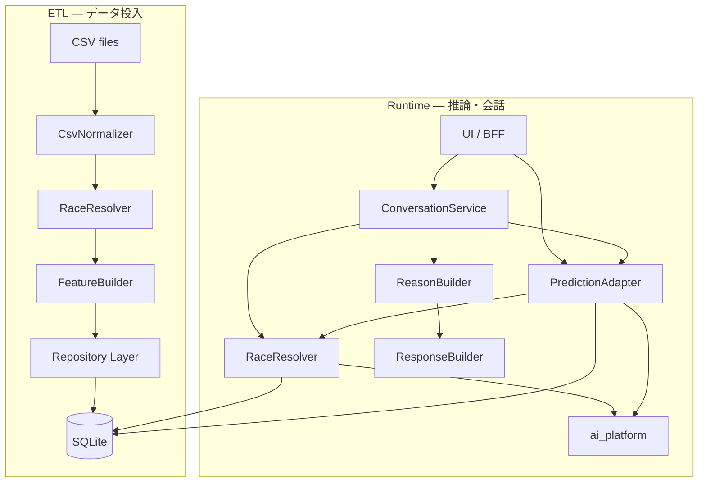
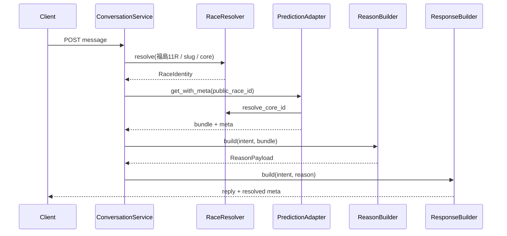

# Phase D — Data Foundation

**Status:** Implemented  
**Goal:** 開催日データを投入するだけで `real_ai` が自動増加する構造

PredictionBundle 契約は変更しない。Race ID 解決・ETL・Conversation は Resolver 経由に統一。

---

## 1. アーキテクチャ図



### Conversation フロー（Phase D）



---

## 2. Race Resolver

| 入力例 | 出力（RaceIdentity） |
|--------|----------------------|
| `福島11R`（+ 日付ヒント） | `2026-07-19-福島-11` / `20260719_fukushima_11` / `2026-07-19-04-11` |
| `2026-07-19-福島-11` | catalog + core + slug |
| `2026-07-19-04-11` | core → venue 福島 |
| `20260719_fukushima_11` | slug → 上記すべて |

**解決順:** DB races → venue/date/no → platform legacy → `AI_RACE_ID_MAP`

**API:** `GET /v1/races/resolve?text=今日の福島11R`

---

## 3. ETL パイプライン

```
CSV → Normalizer → Race Resolver → Feature Builder → Repository → DB
```

### CLI

```bash
cd services/win5-ai
python -m app.data.import_csv migrate
python -m app.data.import_csv import-races /path/to/races.csv
python -m app.data.import_csv import-features /path/to/runners_pace_market_features.csv
python -m app.data.import_csv import-day /opt/expect-ai/platform/data --date 2026-07-19
```

### HTTP（運用）

```http
POST /v1/admin/etl/import-day
{"data_dir": "/opt/expect-ai/platform/data", "date": "2026-07-19"}
```

**投入後:** `engine.data.clear_caches()` で catalog 再読込 → Prediction が DB 経由で新レースを認識。

**real_ai 増加条件（ETL 後自動）:**
1. `races` に core_race_id / public_race_id が入る
2. `features` に core race_id 行がある
3. ai_platform が core race_id で推論可能

→ 3 条件が揃えば `diagnose_inference` が `real_ai` を返す（CSV を Prediction へ直接渡さない）。

---

## 4. DB 変更（002_race_identity）

`races` テーブル追加列:

| 列 | 用途 |
|----|------|
| `core_race_id` | `2026-07-19-04-11` |
| `public_race_id` | `20260719_fukushima_11` |
| `venue_code` | `04` |

---

## 5. 変更ファイル一覧

| パス | 内容 |
|------|------|
| `app/data/race_resolver.py` | **新規** — 相互変換 Resolver |
| `app/data/etl/normalizer.py` | **新規** — CSV 正規化 |
| `app/data/etl/feature_builder.py` | **新規** — feature/entry/horse 組立 |
| `app/data/etl/pipeline.py` | **新規** — ETL オーケストレーション |
| `app/data/migrations/002_race_identity.sql` | **新規** — identity 列 |
| `app/conversation/reason_builder.py` | **新規** — Reason Builder |
| `app/conversation/service.py` | Resolver → Prediction → Reason → Response |
| `app/data/import_csv.py` | ETL pipeline ラッパー + `import-day` |
| `app/data/repository/__init__.py` | identity 列 + Horse/Entry repo |
| `app/engine/adapters/single_prediction_mapper.py` | Resolver 委譲 + DB feature 優先 |
| `app/engine/adapters/prediction_adapter.py` | Resolver 経由 catalog 解決 |
| `app/main.py` | `/v1/races/resolve`, `/v1/admin/etl/import-day` |
| `docs/ops/data-foundation-phase-d.md` | 本ドキュメント |

---

## 6. データ投入フロー（運用手順）

1. **開催日 CSV を配置**  
   `platform/data/` または `platform/data/2026-07-19/` に  
   `races.csv`, `runners_pace_market_features.csv` を置く

2. **一括 ETL**  
   ```bash
   python -m app.data.import_csv import-day /opt/expect-ai/platform/data --date 2026-07-19
   ```

3. **確認**  
   - `GET /v1/races/resolve?text=2026-07-19-04-11`  
   - `GET /v1/predictions` → 該当レース `engine_source=real_ai`  
   - `GET /v1/diagnostics/missing` → `race_not_found` 減少

4. **Conversation 確認**  
   `POST /v1/conversation/chat` `{"message":"今日の福島11Rを予想して"}`  
   → `resolved.core_race_id` が付与される

**追加データだけで real_ai が増える理由:**  
ETL が Resolver で core_id を確定し features を DB に載せ、Prediction は CSV を読まず DB + Resolver 経由で推論可否を判定するため。
