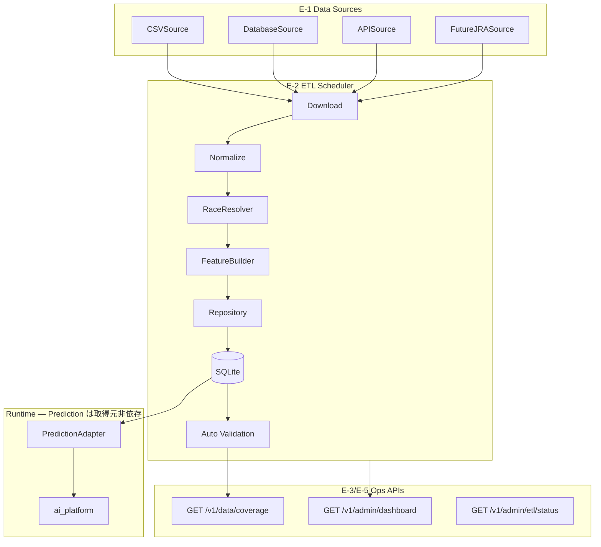
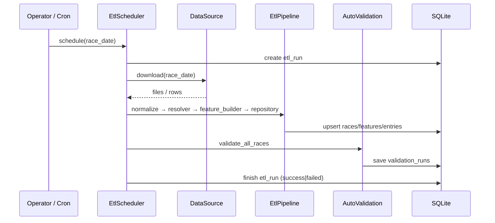

# Phase E — Data Supply Platform

**Status:** Implemented  
**Goal:** 開催日に必要なデータが自動で DB へ供給される基盤

Prediction はデータ取得元を意識しない（DataSource 抽象化 + DB 経由）。

---

## 1. アーキテクチャ図



### ETL Scheduler シーケンス



---

## 2. Data Source（E-1）

| Source | 種別 | 説明 |
|--------|------|------|
| `CSVSource` | csv | `AI_PLATFORM_ROOT/data` または指定 dir |
| `DatabaseSource` | database | 既存 DB から再供給 |
| `APISource` | api | `EXPECT_AI_DATA_API_URL` 経由 |
| `FutureJRASource` | jra | 将来 JRA 連携スタブ |

環境変数: `EXPECT_AI_DATA_SOURCE=csv|database|api|jra`

---

## 3. ETL Scheduler（E-2）

### CLI

```bash
python -m app.data.import_csv schedule 2026-07-19
python -m app.data.import_csv schedule 2026-07-19 --source csv --data-dir /opt/expect-ai/platform/data
```

### HTTP

```http
POST /v1/admin/etl/schedule
{"race_date": "2026-07-19", "source_type": "csv", "data_dir": "/opt/expect-ai/platform/data"}
```

**失敗時:** `etl_runs.stopped_at_step`, `error_reason`, `missing_data_json` に保存。  
各ステップは `etl_steps` に記録。

---

## 4. Coverage API（E-3）

```http
GET /v1/data/coverage
GET /v1/data/coverage?date=2026-07-19
```

```json
{
  "race_total": 200,
  "real_ai": 10,
  "mock": 190,
  "coverage": 5.0,
  "missing_features": 0,
  "missing_races": 190,
  "by_reason": {"race_not_found": 190}
}
```

---

## 5. Auto Validation（E-4）

ETL 完了後（`schedule` / `import-day` + date）に自動実行:

- 全レース `list_with_meta` 診断
- `real_ai` / `mock` / `reason` / `coverage` 生成
- `validation_runs` テーブルへ保存

手動:

```http
POST /v1/admin/validate
{"race_date": "2026-07-19"}
```

---

## 6. Dashboard API（E-5）

| Method | Path | 内容 |
|--------|------|------|
| GET | `/v1/data/coverage` | Coverage サマリ |
| GET | `/v1/admin/dashboard` | 全項目サマリ |
| GET | `/v1/admin/etl/status` | 最新 ETL 実行状態 |
| GET | `/v1/admin/etl/history` | Import 履歴 |
| GET | `/v1/admin/dashboard/fallback` | Fallback 理由一覧 |
| GET | `/v1/admin/dashboard/missing` | 不足データレポート |
| GET | `/v1/admin/data/sources` | 利用可能 DataSource |
| POST | `/v1/admin/etl/schedule` | ETL 自動実行 |
| POST | `/v1/admin/validate` | 手動検証 |

---

## 7. DB（migration 003）

- `etl_runs` — 実行単位
- `etl_steps` — ステップ単位（download〜validation）
- `import_history` — 投入件数履歴
- `validation_runs` — coverage スナップショット

---

## 8. Coverage 改善方法

| 優先 | 施策 | 効果 |
|------|------|------|
| P0 | `schedule 2026-07-19` で races + features ETL | `missing_races` 減少 |
| P1 | `core_race_id` 付き races CSV 整備 | Resolver が core 解決 |
| P2 | features CSV を core race_id キーで投入 | `missing_features` 減少 |
| P3 | cron で開催日 AM に `POST /v1/admin/etl/schedule` | 自動供給 |
| P4 | JRA Source 実装（Phase 将来） | 手動 CSV 不要化 |

**確認:** `GET /v1/data/coverage` → `coverage` % 上昇、`GET /v1/admin/dashboard` で ETL 状態・不足一覧を監視。

---

## 9. 後継設計 — Weekday Collector（設計のみ）

KeibaNet 日次上限（100〜200 req）を前提に、取得を **月〜金へ分散**し、Collector と ETL を分離する正式設計:

→ [`collector-weekday-dispersion.md`](./collector-weekday-dispersion.md)

| 現行 Phase E | Collector 設計 |
|--------------|----------------|
| 開催日 AM に ETL 一体実行 | Planner → Priority Queue → Collector → Validator → Raw → 既存 ETL |
| 単一 download | STATIC_CORE / PROFILE / HISTORY + DYNAMIC |
| なし | Priority P1〜P3（予算枯渇時も P1 保証） |
| ETL 後 validation | Collect 直後 Validator + Friday Gate（Prediction Ready / Complete Ready） |
| etl_runs | Weekly Manifest（OPS-Monitor の週次正本） |

**Prediction Core / FeatureLoader / PredictionAdapter / Result Automation は変更しない。**
実装は未着手（設計承認後）。
