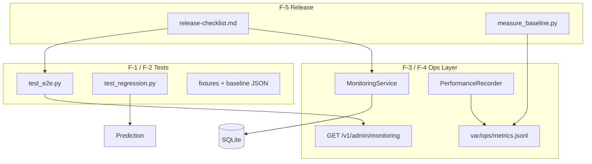

# Phase F — Operational Readiness

**Status:** Implemented  
**Goal:** 本番運用で安心して継続利用できる品質保証基盤

---

## 1. アーキテクチャ図



---

## 2. テスト実行

```bash
cd services/win5-ai
python -m unittest discover -s tests/ops -p "test_*.py" -v
```

| スイート | ファイル | 内容 |
|----------|----------|------|
| E2E | `tests/ops/test_e2e.py` | ETL / Resolver / Prediction / Conversation / Coverage / Diagnostics / Monitoring |
| Regression | `tests/ops/test_regression.py` | mock 順位・信頼度 baseline 比較 |

---

## 3. 監視項目一覧（F-3）

| 監視対象 | 取得元 | アラート条件（例） |
|----------|--------|-------------------|
| ETL 失敗率 | `etl_runs` | failure_rate > 20% |
| Coverage 推移 | `validation_runs` / live | coverage < 5% (info) |
| fallback_reason 推移 | Prediction provenance | 急増時 manual review |
| Prediction エラー | provenance + `logs` | exception/timeout > 0 |
| API 応答時間 | `var/ops/metrics.jsonl` | p95 > 5000ms |
| DB サイズ | `expect_ai.db` stat | > EXPECT_AI_DB_MAX_MB |

**API:** `GET /v1/admin/monitoring`

---

## 4. ベースライン測定（F-4）

```bash
cd services/win5-ai
python scripts/ops/measure_baseline.py --engine mock
```

出力: `tests/ops/baseline.json`

---

## 5. リリースチェックリスト

→ [release-checklist.md](./release-checklist.md)

---

## 6. 変更ファイル

| パス | 内容 |
|------|------|
| `app/ops/monitoring.py` | 監視メトリクス集約 |
| `app/ops/performance.py` | API 応答時間記録 |
| `app/main.py` | monitoring API + timing |
| `tests/ops/test_e2e.py` | E2E テスト |
| `tests/ops/test_regression.py` | 回帰テスト |
| `tests/regression/real_ai_baseline.json` | 回帰 baseline |
| `scripts/ops/measure_baseline.py` | 性能ベースライン測定 |
| `docs/ops/monitoring.md` | 監視項目詳細 |
| `docs/ops/release-checklist.md` | リリース前チェック |
