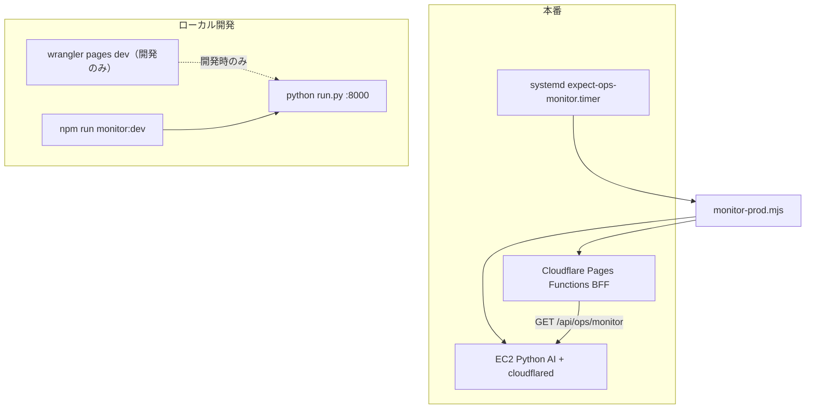

# Phase OPS-Monitor — 本番監視基盤

**目的:** 本番運用を前提としたヘルスチェック・障害ログ・開発/本番ランタイム分離。

---

## 1. アーキテクチャ



| コンポーネント | 本番 | 開発 |
|----------------|------|------|
| BFF ランタイム | Cloudflare Pages Functions（デプロイ） | `wrangler pages dev` |
| 監視実行 | EC2 systemd timer | `npm run monitor:dev` |
| インシデントログ | `var/ops/incidents.jsonl`（EC2） + Workers Logpush | `var/ops-dev/incidents.jsonl` |

**原則:** 本番監視は **wrangler dev に依存しない**。EC2 の Node スクリプト + Pages 上の BFF エンドポイント。

---

## 2. エンドポイント

### GET `/api/health`（公開・認証不要）

BFF 自身の liveness。

```json
{
  "ok": true,
  "data": {
    "status": "ok",
    "service": "bff",
    "runtime": "cloudflare-pages-functions",
    "expect_env": "production",
    "ai_proxy_configured": true
  }
}
```

### GET `/api/ops/monitor`（監視用）

| チェック | 説明 |
|----------|------|
| `bff` | BFF 実行中 |
| `python_api` | `AI_BASE_URL/health` |
| `cloudflare_tunnel` | Tunnel 経由で AI 到達 |
| `prediction_api` | `/v1/predictions` |
| `conversation_api` | `POST /v1/conversation/chat` |
| `etl` | `/v1/admin/etl/status` |
| `result_automation` | `/v1/admin/results/status`（ACTIVE 滞留 / FAILED / DEGRADED / manifest・summary 欠落） |

### Collect Weekly Manifest（C-5）

Weekday Collector の週次 Manifest（`evidence/supply/manifests/week_*.json`）を参照し、供給状態を判定する。

| OPS 状態 | Manifest 条件 |
|----------|----------------|
| `NOT_READY` | `status.prediction_ready === false` |
| `PREDICTION_READY` | `status.prediction_ready === true` かつ `complete_ready === false` |
| `COMPLETE_READY` | `status.complete_ready === true` |

正本は **Friday Gate** が更新する `status.*`。Python: `app.data.collect.ops_monitor.evaluate_collect_ops(week_id)`。

| チェック | ソース | 重大度例 |
|----------|--------|----------|
| `collect.prediction_ready` | `manifest.status.prediction_ready` | 金曜以降 false → critical |
| `collect.complete_ready` | `manifest.status.complete_ready` | false → warning |
| `collect.ops_state` | `NOT_READY` / `PREDICTION_READY` / `COMPLETE_READY` | NOT_READY（金以降）→ critical |
| `collect.static_core_rate` | 同上 → `completion.static_core_rate` | < 1.0（金以降）→ critical |

**Prediction Core / FeatureLoader / PredictionAdapter / Result Automation の probe ロジックは変更しない。** Manifest 監視は追加のみ。

`OPS_MONITOR_KEY` 設定時は `X-Ops-Monitor-Key` または `?key=` 必須。

障害時: HTTP **503** + Workers console に incident JSON。

### GET `/api/health`（OPS-Hardening）

BFF liveness に加え、Python `/health` 経由の `result_automation` 要約を添付する。  
詳細障害は `/api/ops/monitor` を正とする。

```json
{
  "ok": true,
  "data": {
    "status": "ok",
    "service": "bff",
    "result_automation": {
      "ok": true,
      "status": "ok",
      "issues": [],
      "stale_active": 0,
      "failed_latest": 0,
      "degraded_latest": 0,
      "manifest_missing": 0,
      "summary_missing": 0
    }
  }
}
```

Python 側:

- `GET /health` — `result_automation` 要約
- `GET /v1/admin/results/status` — 詳細（Monitor 用）

環境変数: `EXPECT_RA_ACTIVE_STALE_MINUTES`（既定 60）

---

## 3. インシデントログ形式

```json
{
  "incident": true,
  "schema_version": "expect-ops-incident/1.0",
  "occurred_at": "2026-07-20T10:15:00.000Z",
  "service": "python_api",
  "error": "ECONNREFUSED",
  "restart_count": 2,
  "status": "down",
  "detail": {},
  "source": "ec2-monitor"
}
```

| フィールド | 説明 |
|------------|------|
| `occurred_at` | 発生時刻（ISO 8601 UTC） |
| `service` | サービス名 |
| `error` | エラー内容 |
| `restart_count` | systemd `NRestarts`（EC2） |

**保存先**

| 環境 | パス |
|------|------|
| EC2 本番 | `/var/lib/expect-ai/ops/incidents.jsonl` |
| ローカル | `var/ops-dev/incidents.jsonl` |
| BFF | Cloudflare Logpush / `wrangler tail`（`incident: true` 行） |

---

## 4. EC2 セットアップ

```bash
sudo cp infra/aws/systemd/expect-ops-monitor.service /etc/systemd/system/
sudo cp infra/aws/systemd/expect-ops-monitor.timer /etc/systemd/system/
sudo cp infra/aws/systemd/ops-monitor.env.example /etc/expect-ai/ops-monitor.env
# env を編集

sudo systemctl daemon-reload
sudo systemctl enable --now expect-ops-monitor.timer
journalctl -u expect-ops-monitor.service -f
```

手動実行:

```bash
node scripts/ops/monitor-prod.mjs
echo $?   # 0=healthy, 1=degraded
```

---

## 5. 開発 vs 本番

| 項目 | 開発 | 本番 |
|------|------|------|
| UI + BFF | `npm run dev:ai` | Pages デプロイ |
| Python | `npm run ai` | systemd `expect-ai` |
| 監視 | `npm run monitor:dev` | systemd timer |
| `EXPECT_ENV` | `development` | `production` |

`wrangler.toml` の `[vars]` は **非 secret デフォルトのみ**。Secrets は Dashboard / `wrangler pages secret put`。

---

## 6. 監視サイクル（推奨）

| 頻度 | 対象 |
|------|------|
| 5 分 | EC2 timer（全チェック） |
| 毎時 | BFF `/api/ops/monitor`（外形監視） |
| 開催日 AM | ETL status + prediction |
| 障害時 | `incidents.jsonl` 確認 → runbook |

---

## 7. 関連ファイル

| パス | 役割 |
|------|------|
| `functions/api/health.js` | BFF liveness |
| `functions/api/ops/monitor.js` | 統合プローブ |
| `functions/_lib/opsMonitor.js` | プローブロジック |
| `functions/_lib/incidentLog.js` | BFF incident 出力 |
| `scripts/ops/monitor-prod.mjs` | EC2 本番監視 |
| `scripts/ops/monitor-dev.mjs` | ローカル監視 |

---

## 8. Secrets（Pages）

| 名前 | 用途 |
|------|------|
| `OPS_MONITOR_KEY` | `/api/ops/monitor` 保護 |
| `AI_BASE_URL` | Python / Tunnel |
| `CF_ACCESS_CLIENT_*` | Tunnel Access |

```bash
npx wrangler pages secret put OPS_MONITOR_KEY --project-name keiba-single-ai
```
