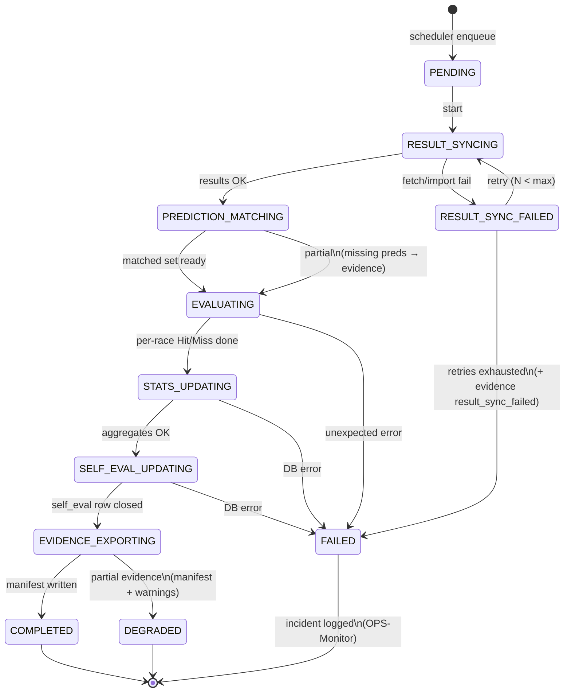
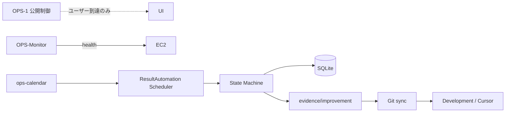

# Phase OPS-ResultAutomation — 設計書

**Status:** Implemented  
**前提:** P-1 完了。Production は改善しない。Cursor は **Improvement Evidence のみ** を読む（移行期は `evidence/miss` も dual-write）。

---

## 実装エントリ

| 項目 | パス |
|------|------|
| Orchestrator | `app/ops/result_automation.py` |
| State Machine | `app/ops/state_machine.py` |
| Runner / Scheduler | `app/ops/result_automation_runner.py` |
| ResultProvider | `app/ops/result_providers.py` (`CsvResultProvider`) |
| Evidence Builders | `app/ops/evidence/` |
| Migration | `006_result_automation.sql` |
| systemd | `infra/aws/systemd/expect-result-automation.*` |
| Admin API | `POST /v1/admin/results/run` |
| Git sync | `npm run evidence:sync -- --date YYYY-MM-DD` |

### CLI

```bash
cd services/win5-ai
python -m app.ops.result_automation_runner --date 2026-07-19 --trigger manual --force
python -m app.ops.result_automation_runner --mode auto
# EXPECT_RA_AUTO_MODE=post|morning|recovery|all
```

### Admin

```http
POST /v1/admin/results/run
{ "date": "2026-07-19", "trigger": "manual", "force": true, "parent_run_id": null }
```

---

## 0. 目的と境界

### Production が自動化する処理

1. 結果取得（Result Sync）
2. Prediction 照合
3. Hit / Miss 判定
4. 統計更新
5. Self Evaluation 更新
6. **Improvement Evidence 生成**（イベント種別ごと）

### 禁止（P-1 継承）

- 改善アルゴリズム実行
- 学習 / Canary
- Development 以外での原因分析

### P-1 からの拡張

| P-1 | OPS-ResultAutomation |
|-----|----------------------|
| Miss Evidence のみ | **Improvement Evidence**（複数 event_type） |
| `miss_evidence.py` 単一 | **Builder を event_type ごとに分離** |
| `evidence/miss/` | `evidence/improvement/{event_type}/` |
| 手動 / 単発 run | **State Machine + Scheduler で完全自動** |

互換: `miss` は Improvement Evidence の一種。旧 `expect-miss-evidence/1.0` は `event_type=miss` のサブセットとして移行。

---

## 1. State Machine

開催日 `race_date` 単位のジョブ状態。1 日 1 アクティブ run（再実行は新 run_id）。



### 状態定義

| State | 意味 | 次へ進む条件 |
|-------|------|----------------|
| `PENDING` | キュー待ち | Scheduler が lock 取得 |
| `RESULT_SYNCING` | 公式結果を取得し `race_results` へ | 対象レースの winner 確定 or 当日分完了 |
| `RESULT_SYNC_FAILED` | 同期失敗（リトライ可） | 再試行 or FAILED |
| `PREDICTION_MATCHING` | `predictions` 最新行と突合 | race_id 集合確定 |
| `EVALUATING` | Hit/Miss・イベント分類 | 全対象レース処理 |
| `STATS_UPDATING` | 統計テーブル更新 | commit 成功 |
| `SELF_EVAL_UPDATING` | Self Evaluation run 締める | commit 成功 |
| `EVIDENCE_EXPORTING` | Improvement Evidence 書出 | manifest 完成 |
| `COMPLETED` | 正常終了 | — |
| `DEGRADED` | 本体成功だが一部 Evidence / 照合欠け | 運用確認 |
| `FAILED` | 中断（手動再実行が必要） | — |

### レース単位の副状態（ログ用）

各 `race_id` はジョブ内で:

```
UNSEEN → RESULT_READY | RESULT_MISSING
       → PRED_MATCHED | PRED_MISSING | PRED_INVALID
       → HIT | MISS | SKIPPED
       → EVIDENCE_WRITTEN | EVIDENCE_SKIPPED
```

ジョブ全体の遷移は上表。レース単位失敗は **ジョブを止めず** Evidence 化し続行（`DEGRADED` 候補）。

---

## 2. Scheduler

### トリガー

| トリガー | 条件 | 備考 |
|----------|------|------|
| **A. 開催日終了バッチ** | JST 当日最終発走 + 余白（例 +90分） | 主経路 |
| **B. 翌日 AM 確定バッチ** | 翌 06:00 JST | 遅延確定レースの回収 |
| **C. OPS-Monitor 連動** | ETL/結果ソース復旧後 | `result_sync_failed` の再キュー |
| **D. Admin API** | `POST /v1/admin/results/run` | 手動・再実行 |
| **E. 単レース追記** | 新規 `race_results` upsert | オプション（将来） |

OPS-1 との関係:

- 一般ユーザー PUBLIC/CLOSED とは独立
- Scheduler / Admin は常時実行可（内部）
- 開催日カレンダー（`ops-calendar.json`）がある日だけ A/B を enqueue

### 実行主体（本番）

```
systemd timer: expect-result-automation.timer
  → expect-result-automation.service
  → python -m app.ops.result_automation_runner --mode auto
```

`wrangler` / Pages に依存しない（OPS-Monitor と同じ EC2 原則）。

### 排他制御

```
advisory lock: result_automation_runs WHERE race_date=? AND status NOT IN (COMPLETED, FAILED, DEGRADED)
```

同一 `race_date` の並行 run 禁止。再実行は `force=true` で旧 run を `SUPERSEDED` にして新規。

### auto モード判定

```
today_jst = Asia/Tokyo date
if today in race_days and now > last_post + grace:
  enqueue(today)
if yesterday in race_days and no COMPLETED/DEGRADED for yesterday:
  enqueue(yesterday)  # AM catch-up
```

---

## 3. DB 更新順序（厳守）

トランザクションは **段階コミット**（長時間ロック回避）。順序は固定。

```
① result_automation_runs INSERT (status=PENDING → RESULT_SYNCING)
② race_results UPSERT          ← 結果取得の唯一の書込点
③ （照合は READ: predictions 最新）
④ race_evaluations INSERT      ← Hit/Miss 行（run_id 紐付け）
⑤ stats aggregates / timeseries ← 統計更新
⑥ self_evaluation_runs UPDATE  ← Self Evaluation 締め
⑦ improvement_evidence メタ表 INSERT（任意・索引用）
⑧ ファイル: evidence JSON + manifest（DB 成功後）
⑨ result_automation_runs → COMPLETED | DEGRADED | FAILED
```

### 順序の理由

| 段階 | なぜこの順か |
|------|----------------|
| ② before ④ | 結果なしに Hit 判定しない |
| ③ read-only | Prediction は当日生成済み。ここでは書き換えない |
| ④ before ⑤ | 集計は評価行が正本 |
| ⑤ before ⑥ | Self Eval は統計スナップショットを参照 |
| ⑥ before ⑧ | Evidence は「確定した評価」の写し。先にファイルを書くと不整合 |
| ⑧ before ⑨ | manifest 書けてからジョブ完了 |

### ロールバック方針

- ②〜⑥: 段階ごとに commit。失敗した段階から **idempotent 再実行**
- ⑧: ファイルは `tmp/` に書いてから rename（原子的）
- ⑨: 最後に状態更新

再実行時:

- `race_evaluations` は同一 `(run_id, race_id)` で置換、または新 `run_id` で全再評価
- Evidence ファイルは上書き可（同 race_id + event_type + fingerprint）

---

## 4. Improvement Evidence 設計

### ディレクトリ（Cursor 入力）

```
evidence/improvement/
  miss/YYYY-MM-DD/{race_id}.json
  feature_missing/YYYY-MM-DD/{race_id}.json
  prediction_failed/YYYY-MM-DD/{race_id}.json
  result_sync_failed/YYYY-MM-DD/{race_date_or_race_id}.json
  manifest/YYYY-MM-DD/manifest.json
```

互換: 当面 `evidence/miss/` へ `miss` のコピーまたは symlink ポリシー可。最終的に Cursor は **`evidence/improvement/` のみ**。

### 共通エンベロープ `expect-improvement-evidence/1.0`

```json
{
  "schema_version": "expect-improvement-evidence/1.0",
  "event_type": "miss",
  "event_id": "miss:20260719_hanshin_11:2026-07-19T18:00:00Z",
  "timestamp": "2026-07-19T18:00:00Z",
  "race_id": "20260719_hanshin_11",
  "race_date": "2026-07-19",
  "severity": "sha256:...",
  "payload": { },
  "version": { "model_version": "...", "pipeline_version": "ops-result-automation/1.0" }
}
```

| event_type | いつ生成 | Builder |
|------------|----------|---------|
| `miss` | Hit 判定で Top1 外れ | `MissEvidenceBuilder` |
| `feature_missing` | 照合時に features 不足 / fallback feature | `FeatureMissingEvidenceBuilder` |
| `prediction_failed` | 予測なし・bundle 不正・engine 失敗メタ | `PredictionFailedEvidenceBuilder` |
| `result_sync_failed` | 結果取得失敗（日 or レース） | `ResultSyncFailedEvidenceBuilder` |

将来追加例: `coverage_drop`, `confidence_miscalibrated` — Builder 追加のみ。State Machine は変更不要。

### Builder 分離

```
app/ops/evidence/
  base.py              # envelope + fingerprint + write
  miss_builder.py
  feature_missing_builder.py
  prediction_failed_builder.py
  result_sync_failed_builder.py
  registry.py          # event_type → Builder
```

Orchestrator（State Machine）は **Registry 経由でだけ** Evidence を書く。分析ロジック禁止。

### payload 最小原則（P-1 継承）

- 改善に必要な最小限
- 全 CSV・巨大ログ禁止
- `miss` payload ≈ 現行 Miss Evidence 本体

---

## 5. 障害時リカバリー

### マトリクス

| 障害 | 検知 | 自動復旧 | Evidence / Incident |
|------|------|----------|---------------------|
| 結果ソース不通 | RESULT_SYNCING timeout | 指数バックオフ再試行（max 5） | `result_sync_failed` + OPS-Monitor incident |
| 一部レースのみ結果なし | 照合時 RESULT_MISSING | 翌日 AM バッチで再 enqueue | レース単位 skip、ジョブは DEGRADED |
| Prediction なし | PRED_MISSING | 再予測は **しない**（Prod 改善禁止） | `prediction_failed` |
| Feature 不足 | meta / diagnostics | 再 ETL は別ジョブ（ETL scheduler） | `feature_missing` |
| DB lock / disk full | commit fail | FAILED + incident | 手動: disk 確保 → `--force` 再実行 |
| Evidence 書込失敗 | EVIDENCE_EXPORTING | tmp 掃除して再 export（評価は済み） | incident `improvement_evidence_export` |
| プロセス死亡 | systemd Restart | run status が中途半端 | **起動時:** `fail_orphan_active_runs` が ACTIVE → FAILED。`--mode recover` または auto recovery で `parent_run_id` 付き retry |

### リカバリーコマンド

```bash
# 失敗日の再実行（新 run_id）
python -m app.ops.result_automation_runner --date YYYY-MM-DD --force

# Evidence のみ再出力（DB 再評価なし）
python -m app.ops.result_automation_runner --date YYYY-MM-DD --evidence-only

# Git 同期
npm run evidence:sync -- --date YYYY-MM-DD --commit
```

### OPS-Monitor 連携

| service 名（incident） | 条件 |
|------------------------|------|
| `result_automation` | ジョブ FAILED |
| `result_sync` | RESULT_SYNC_FAILED 最終 |
| `improvement_evidence_export` | ファイル書出失敗 |

監視は健全性のみ。改善は Evidence → Development。

---

## 6. 処理パイプライン（1 race_date）

```
enqueue(race_date)
  → RESULT_SYNCING: fetch/import results → UPSERT race_results
  → PREDICTION_MATCHING: for each result race_id → latest prediction
       missing/invalid → queue event prediction_failed
       feature gaps → queue event feature_missing
  → EVALUATING: Hit/Miss → race_evaluations
       miss → queue event miss
  → STATS_UPDATING
  → SELF_EVAL_UPDATING
  → EVIDENCE_EXPORTING: for each queued event → Builder → JSON
       write manifest
  → COMPLETED | DEGRADED
```

---

## 7. 新規 / 変更テーブル（実装時）

```
result_automation_runs (
  id, race_date, status, trigger_source,
  attempt, max_attempts,
  started_at, finished_at, error_json, meta_json
)

improvement_evidence_index (optional)
  event_id PK, event_type, race_id, race_date,
  fingerprint, path, created_at, run_id
)
```

既存: `race_results`, `race_evaluations`, `self_evaluation_runs`, `predictions` を継続利用。

---

## 8. Scheduler と OPS-1 / P-1 の整合



---

## 9. 実装フェーズ（承認後）

| Step | 内容 |
|------|------|
| R-1 | State Machine + `result_automation_runs` |
| R-2 | Result Sync アダプタ（CSV / API stub） |
| R-3 | Evidence Registry + 4 Builders |
| R-4 | Orchestrator を SM 化（現行 `ResultAutomationService` 置換） |
| R-5 | systemd timer + runner CLI |
| R-6 | `evidence/improvement` + sync スクリプト更新 |
| R-7 | 契約 schema + テスト |

---

## 10. 承認チェック

実装前に確認したい点:

1. 結果ソース: 当面 **CSV / 既存 import** でよいか、外部 API 必須か  
2. 同一日の再実行: 常に **新 run_id** でよいか  
3. Cursor 入力パス: 即時 `evidence/improvement` のみにするか、移行期間 `evidence/miss` 併用か  

上記問題なければ実装に入ります。
