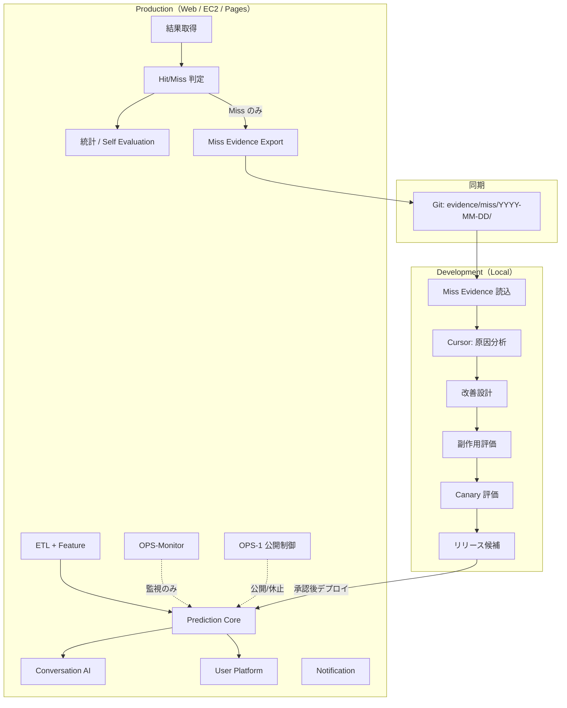
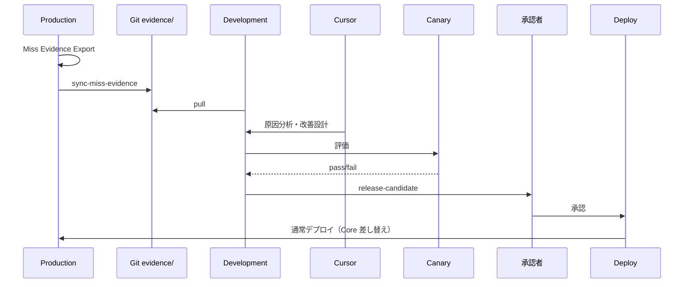

# Phase P-1 — Production / Development Separation

**Status:** Architecture locked  
**前提:** OPS-Monitor（監視）・OPS-1（開催日公開制御）と両立。矛盾しない境界を定義する。

---

## 0. 境界原則

| 環境 | やってよいこと | 禁止 |
|------|----------------|------|
| **Production** | ETL・予測・会話・User・通知・監視・結果取込・Hit/Miss・統計・Self Eval・**Miss Evidence Export** | 改善アルゴリズム・学習・Canary 評価・モデル差し替えの意思決定 |
| **Development** | Miss Evidence 解析・改善設計・副作用評価・Canary・リリース候補 | 本番 DB 直接書き込み・本番 Prediction Core へのホットパッチ |

```
Production が直接改善を行うことは禁止。
改善は必ず Development → Canary → 承認 → Production の順。
```

OPS との関係:

| Phase | 責務 | P-1 との関係 |
|-------|------|--------------|
| **OPS-1** | 開催日 PUBLIC / 非開催日 CLOSED | 公開制御のみ。Miss Export は開催日終了後（結果確定後）に実行 |
| **OPS-Monitor** | BFF / Python / Tunnel / Prediction / Conversation / ETL ヘルス | 監視。改善はしない。ETL 失敗は incident、Miss は Evidence |
| **P-1** | Prod↔Dev 責務分離 + Miss Evidence パイプライン | 改善の入口は Evidence のみ |
| **AI-Improvement Pipeline** | Evidence → Proposal → Canary → RC | P-1 の具体化。設計: [`ai-improvement-pipeline.md`](./ai-improvement-pipeline.md) |

---

## 1. システム構成図



**データフロー（改善）**

```
開催日終了 → 結果確定 → Hit/Miss
  → Hit: 統計更新のみ
  → Miss: Miss Evidence JSON 書出
  → Git push（evidence ブランチ or 専用 repo path）
  → Local pull
  → Cursor が Evidence のみ解析
  → 改善設計（Canary 前提）
  → Canary 通過 → 承認 → Production デプロイ
```

---

## 2. ディレクトリ構成

```
KEIBA-Single-AI/
├── services/win5-ai/                 # Production Python AI
│   ├── app/
│   │   ├── ops/
│   │   │   ├── miss_evidence.py      # Evidence 生成（分析なし）
│   │   │   ├── result_automation.py  # 結果→Hit/Miss→Export オーケストレーション
│   │   │   ├── monitoring.py         # OPS-Monitor（既存）
│   │   │   └── ...
│   │   └── stats/                    # 統計・Self Evaluation（改善なし）
│   └── var/
│       ├── ops/                      # OPS-Monitor incidents（既存）
│       └── miss-evidence/            # Production ローカル出力（gitignore）
│           └── YYYY-MM-DD/
│               ├── {race_id}.json
│               └── manifest.json
│
├── evidence/                         # Git 同期用（Production → Development）
│   └── miss/
│       └── YYYY-MM-DD/
│           ├── {race_id}.json
│           └── manifest.json
│
├── development/                      # Development 専用（本番実行禁止）
│   ├── README.md
│   ├── analysis/                     # Cursor / 人間の分析メモ
│   ├── proposals/                    # 改善設計ドキュメント
│   ├── canary/                       # Canary 設定・結果
│   │   ├── configs/
│   │   └── reports/
│   └── release-candidates/           # 承認待ち差分・チェックリスト
│
├── contracts/
│   └── expect-miss-evidence/1.0/
│       └── schema.json
│
└── docs/ops/
    ├── p1-production-development-separation.md  # 本ドキュメント
    ├── ops-monitor.md
    └── ...
```

| パス | 環境 | Git |
|------|------|-----|
| `services/win5-ai/var/miss-evidence/` | Prod 作業領域 | **ignore** |
| `evidence/miss/` | Prod→Dev 同期成果物 | **commit**（Miss JSON のみ） |
| `development/` | Dev のみ | commit（提案・Canary レポート。巨大 CSV 禁止） |
| `var/ops/incidents.jsonl` | OPS-Monitor | ignore |

---

## 3. Miss Evidence JSON Schema

契約: `expect-miss-evidence/1.0`  
正本: `contracts/expect-miss-evidence/1.0/schema.json`

### 必須フィールド

| フィールド | 型 | 説明 |
|------------|-----|------|
| `schema_version` | string | `"expect-miss-evidence/1.0"` |
| `race_id` | string | PredictionBundle.race_id |
| `timestamp` | string | ISO8601 UTC（Export 時刻） |
| `winner` | object | `{ horse_number, horse_name }` |
| `prediction_bundle` | object | **要約**（runners は候補上位のみ） |
| `candidate_pool` | array | model_rank 上位（最大 8） |
| `confidence` | number\|null | 0–100 |
| `engine_source` | string\|null | real_ai / mock_fallback 等 |
| `feature_source` | string\|null | |
| `miss_category` | enum | `miss_top1` \| `miss_top3` \| `miss_top5` |
| `explain` | object | narrative + reasons（最大 5） |
| `model_version` | string\|null | |
| `version` | object | model / core / schema |

### 任意

| フィールド | 説明 |
|------------|------|
| `repick` | betting_recommendations 要約 |
| `delete` | 除外候補（将来） |
| `fallback_reason` | mock 時の理由 |

### 明示的に保存しないもの

- 全出走馬の生 CSV
- Feature 行列全体
- 一時ログ / journal
- Training dataset
- 巨大 bundle 全文（runners は上位のみ）

### miss_category

| 値 | 条件 |
|----|------|
| （出力なし = Hit） | hit_at_1 |
| `miss_top1` | Top1 外、Top3 内 |
| `miss_top3` | Top3 外、Top5 内 |
| `miss_top5` | Top5 外 |

---

## 4. Export Trigger

### トリガー条件

1. **結果確定後**（`race_results` に winner が入り、予測が存在する）
2. **Hit/Miss 判定で Miss**（hit_at_1 = false）
3. **開催日バッチ**（推奨: 開催日翌日 AM、または当日最終レース後）

### 実行主体（Production のみ）

| 方式 | コマンド / API | 用途 |
|------|----------------|------|
| CLI | `python -m app.ops.result_automation --date YYYY-MM-DD` | cron / systemd |
| Admin API | `POST /v1/admin/results/run` | 手動再実行 |
| 内部 | `ResultAutomationService.run(date)` | 上記の実装 |

### パイプライン（1 開催日）

```
1. 結果取得 / 既存 race_results 読込
2. 当該日の predictions と突合
3. Hit/Miss 判定 → race_evaluations / 統計更新
4. Self Evaluation 更新（集計のみ。改善なし）
5. Miss のみ Evidence 生成 → var/miss-evidence/YYYY-MM-DD/
6. manifest.json 更新
7. （任意）evidence/miss/ へコピー → Git 同期ジョブ
```

### manifest.json 例

```json
{
  "schema_version": "expect-miss-evidence-manifest/1.0",
  "race_date": "2026-07-19",
  "exported_at": "2026-07-19T18:30:00+09:00",
  "races_evaluated": 36,
  "hits": 12,
  "misses": 24,
  "files": ["20260719_hanshin_11.json", "..."],
  "trigger_source": "cron"
}
```

### OPS-1 との順序

```
PUBLIC（開催中）→ 結果確定 → SCHEDULED_CLOSED でも Export は実行可
（Export は管理者 / 内部 cron。一般 API 公開とは独立）
```

### OPS-Monitor との関係

- Export 失敗 → incident `service: "miss_evidence_export"`
- Prediction / ETL down 中は Export をスキップし incident のみ

---

## 5. Git 運用

### 推奨フロー

```
Production EC2
  var/miss-evidence/YYYY-MM-DD/*.json
       ↓ sync script（コピーのみ。解析なし）
  evidence/miss/YYYY-MM-DD/
       ↓ git commit + push（専用ブランチ）
  origin/evidence/miss-YYYY-MM-DD  or  main の evidence/ パス
       ↓ git pull（Local）
  Development が Cursor で読む
```

### ルール

| ルール | 内容 |
|--------|------|
| コミット単位 | **1 開催日 = 1 commit**（理想） |
| メッセージ | `evidence: miss export 2026-07-19 (N misses)` |
| 禁止 | CSV・DB dump・フル feature・個人情報 |
| ブランチ | `evidence/YYYY-MM-DD` または `main` 直下 `evidence/miss/` |
| レビュー | Evidence 自体は機械生成のため自動マージ可。改善 PR は別 |

### 同期スクリプト

```
scripts/ops/sync-miss-evidence.mjs
  --from $EXPECT_MISS_EVIDENCE_DIR
  --to evidence/miss
  --date YYYY-MM-DD
  --commit   # 任意
```

Production では `--commit` を cron から。Local では pull のみ。

---

## 6. Canary 連携

### 原則

改善設計は **Canary を通過する前提**で提案する。Production 直適用禁止。

### Canary 入力

| 入力 | 出所 |
|------|------|
| Miss Evidence 集合 | `evidence/miss/` |
| 改善パッチ候補 | `development/proposals/` |
| ベースライン KPI | `tests/ops/baseline.json` / core_benchmark |

### Canary 出力

`development/canary/reports/{proposal_id}.json`

```json
{
  "proposal_id": "prop-2026-07-20-top1-pace",
  "status": "pass" | "fail",
  "metrics_delta": { "hit_at_1": +0.02, "hit_at_3": -0.01 },
  "side_effects": [],
  "gates": { "no_hit_at_1_regression": true },
  "evidence_sample": ["20260719_hanshin_11"]
}
```

### Gate（最低限）

1. hit_at_1 がベースライン許容幅内（回帰なし）
2. Coverage / fallback_reason 悪化なし
3. 対象 miss_category の改善が確認できる
4. OPS-Monitor 合成チェックが green（staging）

Canary **fail** → Production へのリリース候補に載せない。

---

## 7. リリースフロー



### チェックリスト（リリース候補）

- [ ] Evidence に基づく提案である（憶測のみの変更ではない）
- [ ] Canary pass
- [ ] 副作用メモあり
- [ ] OPS-Monitor green（staging）
- [ ] OPS-1 公開モードと衝突しない（メンテ窓でデプロイ可）
- [ ] PredictionBundle 契約非破壊

### 禁止

- Production 上での学習ジョブ
- Miss 以外の大量データによる「観測のため」の永続化
- 手動分析を前提とした運用（Evidence が一次ソース）

---

## 8. 実装マップ（本フェーズ）

| 成果物 | パス |
|--------|------|
| 本設計 | `docs/ops/p1-production-development-separation.md` |
| Schema | `contracts/expect-miss-evidence/1.0/schema.json` |
| Builder | `app/ops/miss_evidence.py`（既存強化） |
| Orchestrator | `app/ops/result_automation.py` |
| Dev ツリー | `development/**` |
| Git 同期 | `scripts/ops/sync-miss-evidence.mjs` |
| Export CLI | `scripts/ops/export_miss_evidence.py` |

---

## 9. まとめ

| 質問 | 回答 |
|------|------|
| 改善はどこで？ | Development のみ |
| Production の出口？ | Miss Evidence JSON + 統計 |
| Cursor の入力？ | `evidence/miss/` のみ |
| 監視との関係？ | OPS-Monitor は健全性、P-1 は改善パイプライン |
| 公開制御との関係？ | OPS-1 はユーザー到達、Export は内部バッチ |
