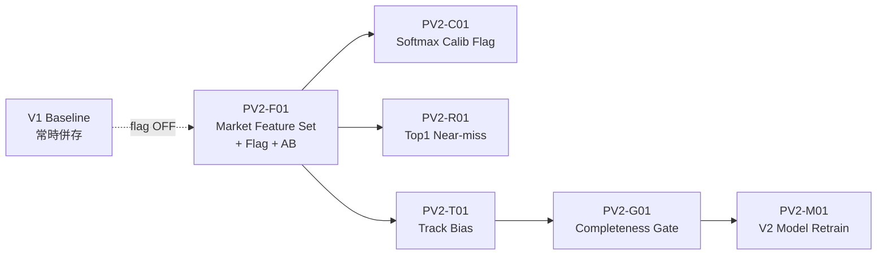
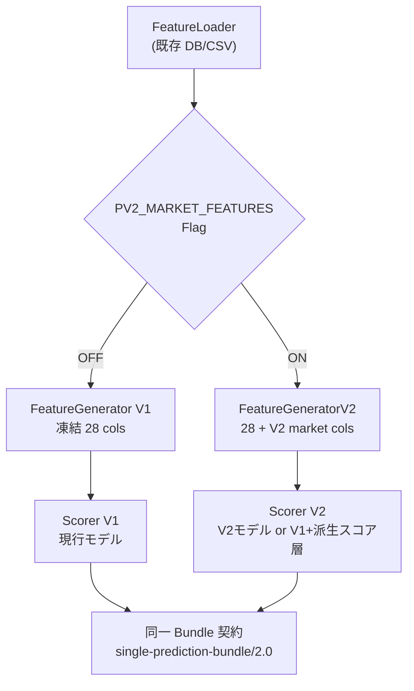

# Prediction Core — Version 2 Design Review

**Date:** 2026-07-21  
**Status:** Design Review（コード実装禁止） / **PV2-F01 = ARCHIVED・V2 除外**  
**Baseline:** Version 1 = Phase255（Win5 Product BKC）+ Prediction Core `ai-core-migrated/1.0-phase1`（凍結 28 特徴）  
**Collector:** **凍結**（変更・依存追加禁止）  
**Series:** Prediction 改善（Collector は O シリーズ運用のみ）  
**F01 後任:** [`prediction-v1-miss69-theme-roi-review.md`](./prediction-v1-miss69-theme-roi-review.md)（残ミス 69 テーマ別 ROI）

---

## 0. 境界（必須）

| 許可 | 禁止 |
|------|------|
| Prediction Core / Scoring / Ranking / Confidence | Collector / Planner / Queue / Scheduler |
| Feature Flag + AB（Canary） | Budget / Retry / Availability / Manifest |
| FeatureLoader **読取のみ**（既存 DB/CSV） | Friday Gate / OPS Monitor / **ETL Bridge** |
| 独立 V2 Feature 経路 | Phase255 / V1 Core の破壊的変更 |
| I-4/I-5 Canary → RC → Human Review | Core ← Collector の import・循環依存 |

**データ前提（運用）:** Collector が供給しうる `race_meta` / `entries_core` / `odds` / `track` は、将来 SQLite / Feature 行に載ることを **前提知識** とする。Prediction は **FeatureLoader が返す行**だけを見る。供給パイプライン改修は本レビューの実装範囲外（別 Ops / Data 承認）。

---

## 1. 改善候補一覧

評価尺度（相対）:

- **優先度:** P0（最初）… P3（後回し）
- **ROI:** 期待効果 ÷（実装・評価・リスクコスト）— High / Mid / Low
- **期待改善量:** KPI 仮説（定量は Canary で確定）
- **リスク:** Baseline 破壊・較正悪化・運用複雑度

| ID | 候補 | 優先 | ROI | 期待改善量（仮説） | リスク | 備考 |
|----|------|------|-----|-------------------|--------|------|
| ~~PV2-F01~~ | ~~V2 独立 Market Feature Set~~ | **除外** | — | ROI 18.8% < 20% → **Archive** | — | 実装チケットなし。後任: `prediction-v1-miss69-theme-roi-review.md` |
| PV2-C01 | Softmax 温度キャリブレーション（既存 `CORE_SOFTMAX_*` の Flag 化 AB） | P1 | High | ECE ↓ / 高conf帯 miss 安定 | Low | 実装コスト低。F01 と並行可だが「データ前提」度は低い |
| PV2-R01 | Top1 近傍較正（IMP-20260720-miss-001 系） | P1 | Mid | miss_top1 ↓、hit@1 非悪化 | Mid | feature_missing 併発除外が前提 |
| PV2-M01 | V2 専用モデルパス（`CORE_MODEL_PATH_V2`）+ 凍結 V1 併存 | P2 | High | 再学習による大幅改善余地 | High（学習・回帰コスト） | F01 特徴確定後 |
| PV2-T01 | track_condition → 芝/ダ適性バイアス（V2 のみ） | P2 | Mid | 馬場敏感レースで局所改善 | Mid | F01 の拡張 |
| PV2-G01 | 欠落ゲート強化（V2 推論前に必須特徴充足チェック） | P2 | Mid | mock_fallback / 誤自信 ↓ | Low | 供給側完了後に効果大 |
| PV2-W01 | Phase255 Optimizer 連携（Pool/Repick） | P3 | — | Product 層 | **Out of scope** | Core facade は V2 Product を呼ばない制約を維持 |

### 優先順位（要約）— F01 除外後

1. **Product: RePick / Candidate Pool(Entry)** — 残ミス 69 の ROI 再評価で上位（設計レビューのみ）  
2. PV2-C01（低リスク較正 = Candidate Evaluation）  
3. PV2-R01（miss 較正）  
4. PV2-T01 / PV2-G01（新 Feature Contract + ROI≥20% が前提。F01 は再開しない）  
5. PV2-M01（再学習）  
6. PV2-W01 / PV2-F01 は現行 V2 対象外（F01=Archive）  

---

## 2. Version 2 Roadmap



| 順 | ID | 成果 | 昇格条件 |
|----|-----|------|----------|
| 0 | Baseline lock | V1 / Phase255 / 28 特徴を不変の对照群に固定 | 常時 |
| 1 | **PV2-F01** | V2 Feature 経路 + Flag + Canary 設計確定 | 本設計レビュー承認 |
| 2 | PV2-C01 | 温度 AB | Canary PASS |
| 3 | PV2-R01 | Top1 較正 | Canary PASS + feature 欠落除外 |
| 4 | PV2-T01 | track 拡張 | F01 本番 Flag 安定後 |
| 5 | PV2-G01 | 充足ゲート | 供給データが安定してから |
| 6 | PV2-M01 | V2 モデル | 特徴セット凍結 + 学習データ承認 |

**AB 原則:** 常に `flag OFF = V1 完全同一出力`。`flag ON` のみ V2。I-4 Canary / I-5 RC を通す。

---

## 3. 最初に着手する改善案（選定）

### 選定: **PV2-F01 — Version 2 Independent Market Feature Set**

**選定理由**

1. ユーザー要件「Collector で取得できるデータを前提」に最も整合（odds / track を Feature 行の入力として設計）  
2. V1 の凍結 28 特徴・Phase255 を触らず、**独立 V2 経路**にできる  
3. Feature Flag + AB が自然（OFF 時ゼロ差分）  
4. Collector / ETL への依存をコード上持たない（FeatureLoader のみ）  
5. 後続の再学習（PV2-M01）の特徴セット定義になる  

以下、**設計書のみ**（実装禁止）。

---

# PV2-F01 設計書 — V2 Independent Market Feature Set

## 3.1 目的

Version 1 Baseline（凍結 28 特徴 LightGBM + Phase255 非破壊）を維持したまま、  
市場系（odds 派生）および任意の馬場（track）情報を **Version 2 専用 Feature** として追加し、Feature Flag 配下で AB 評価できるようにする。

## 3.2 非目標

- Collector / ETL Bridge の改修  
- V1 FeatureGenerator の 28 列変更  
- Phase255 / Win5 Optimizer ロジック変更  
- 本番デフォルト ON  
- 循環依存・Collector import  

## 3.3 アーキテクチャ



**依存規則**

- `ai_platform.core` → FeatureLoader / DB 行のみ  
- **禁止:** `app.data.collect*` / `app.data.etl*` への import  
- Adapter / Bundle 契約は変更しない（出力スキーマ同一）

## 3.4 Feature Flag（必須）

| 項目 | 仕様 |
|------|------|
| 名前 | `PREDICTION_V2_MARKET_FEATURES`（案） |
| 型 | env / config boolean、既定 **`false`** |
| OFF | V1 と **ビット一致**（回帰必須） |
| ON | V2 Feature 経路のみ |
| 記録 | Bundle `meta` または内部 trace に `feature_set=v1|v2_market`（契約破壊しない範囲） |

AB:

- Control = Flag OFF  
- Treatment = Flag ON  
- 評価は Development Canary（I-4）→ RC（I-5）→ Human Review  

## 3.5 V2 Feature 定義（独立セット）

V1 の 28 列は **コピーして保持**（値を変えない）。V2 は末尾に独立列を追加する。

| V2 feature | 入力前提 | 定義（設計） | 欠落時 |
|------------|----------|--------------|--------|
| `v2_log_odds` | `odds` | log(max(odds, ε)) | 0 + `v2_market_missing=1` |
| `v2_odds_rank_in_race` | 全馬 odds | レース内オッズ順位（1=最人気側） | 中位補完 or missing |
| `v2_odds_gap_to_favorite` | odds | 当該馬 odds / 最低 odds | missing |
| `v2_track_condition_code` | track.condition 相当が Feature 行にあれば | カテゴリコード（良/稍重/重/不良…） | 0 |
| `v2_market_missing` | — | 市場必須が欠けたら 1 | — |

**入力経路（設計上の契約）:** FeatureLoader が返す dict / CSV 行に、既存の `odds` / `popularity` および将来の `track_condition`（名称は実装時に既存カラムへマップ）があること。無い場合は V2 でも安全に欠落フラグを立て、**スコア経路は V1 にフォールバックするオプション**（`PREDICTION_V2_MARKET_STRICT=false` 既定）を持つ。

## 3.6 モデル戦略（二段・Flag 内）

| モード | 内容 | いつ使う |
|--------|------|----------|
| **V2-A（初期）** | V1 モデルで 28 列のみスコアし、V2 列は **後段の軽量再ランク**（例: odds gap による微小 logit bias）にのみ使用 | 再学習前の AB |
| **V2-B（後期 = PV2-M01）** | `CORE_MODEL_PATH_V2` で拡張次元モデル | F01 特徴凍結後 |

本設計（F01）の実装スコープは **V2-A まで**を推奨。V2-B は Roadmap 次段。

## 3.7 Baseline 保護

| ゲート | 内容 |
|--------|------|
| Flag 既定 OFF | 本番・CI 既定は V1 |
| 回帰 | `real_ai_baseline` / `core_kpi_baseline` を Flag OFF で必須 PASS |
| Phase255 | 変更しない・参照のみ（混同禁止） |
| Bundle | `single-prediction-bundle/2.0` 非破壊 |
| Canary | hit_at_1 非低下、miss_top1 非増加、ECE 大幅悪化禁止 |

## 3.8 循環依存・モジュール境界

```
[OK]  core.features.v2  →  core.features.loader (read)
[OK]  core.scoring      →  core.features.v2
[NG]  core.*            →  app.data.collect.*
[NG]  core.*            →  app.data.etl.*
[NG]  collect.*         →  core.*  (既存どおり不要)
```

## 3.9 評価計画（AB）

1. 固定レース集合（benchmark / GameDay fixture）  
2. Control vs Treatment で Bundle top3 / hit@1 / miss_top1 / confidence  
3. Criteria 例:  
   - `no_hit_at_1_regression`  
   - `no_miss_top1_increase`  
   - `flag_off_bitwise_identity`（同一入力で V1 ビット一致）  
4. PASS → RC → Human Review → 段階的 Flag ON（影配信 → 一部 → 全体は別承認）

## 3.10 リスクと対策

| リスク | 対策 |
|--------|------|
| Feature 欠落で V2 がノイズ | `v2_market_missing` + STRICT オフ時 V1 フォールバック |
| 見掛け改善がデータ品質隠し | feature_missing 併発レースを Canary から除外 |
| 次元追加で即モデル崩壊 | 初期は V2-A（後段微小 bias）に限定 |
| 運用で Flag 踏みっぱなし | 既定 OFF、RC に「既定値」明記 |

## 3.11 成果物（実装フェーズで作成・現時点は作らない）

- Flag 仕様を `docs` / 設定一覧に追記  
- Canary config/criteria: `PV2-F01-*`  
- 実装 PR（**本レビュー承認後**）  

## 3.12 設計レビュー判定（提案）

| 項目 | 提案 |
|------|------|
| 設計としての妥当性 | **レビュー提出 — 承認待ち** |
| 実装着手 | **禁止（本依頼どおり）** |
| 承認後の最初の実装単位 | Flag + V2-A 後段 bias + OFF 同一性テストのみ |

---

## 4. 設計レビュー総括

| 提出物 | 内容 |
|--------|------|
| 改善候補一覧 | §1（PV2-F01 を P0） |
| V2 Roadmap | §2 |
| 最初の設計書 | §3 PV2-F01 |
| Collector | 凍結・非依存 |
| Phase255 / V1 | 非破壊 |
| 次アクション | Feature Contract 条件付き承認 → **ROI Validation HOLD** → 実装チケット見送り |

**Feature Contract:** [`prediction-v2-f01-feature-contract.md`](./prediction-v2-f01-feature-contract.md)  
**ROI Validation:** [`prediction-v2-f01-roi-validation.md`](./prediction-v2-f01-roi-validation.md)（odds 改善可能 13/69=18.8% < 20% 閾値）
