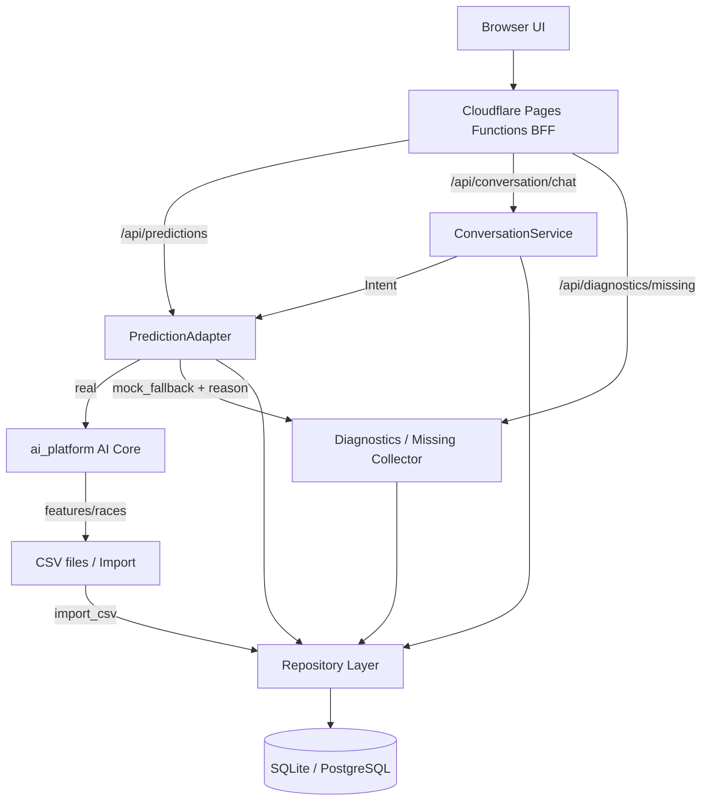
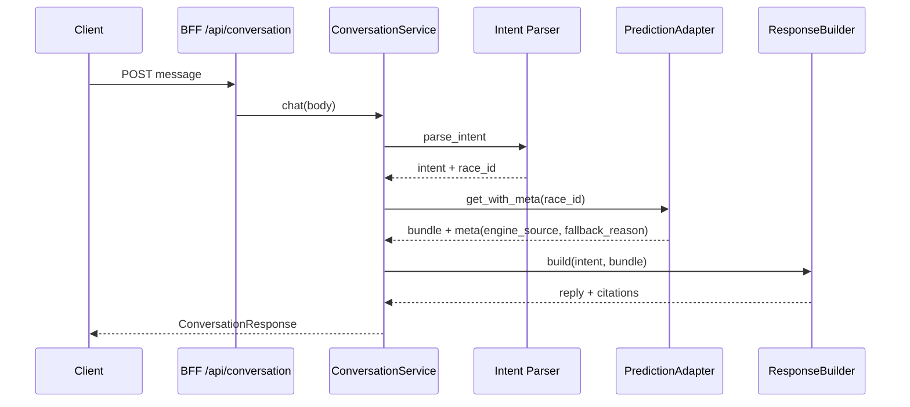
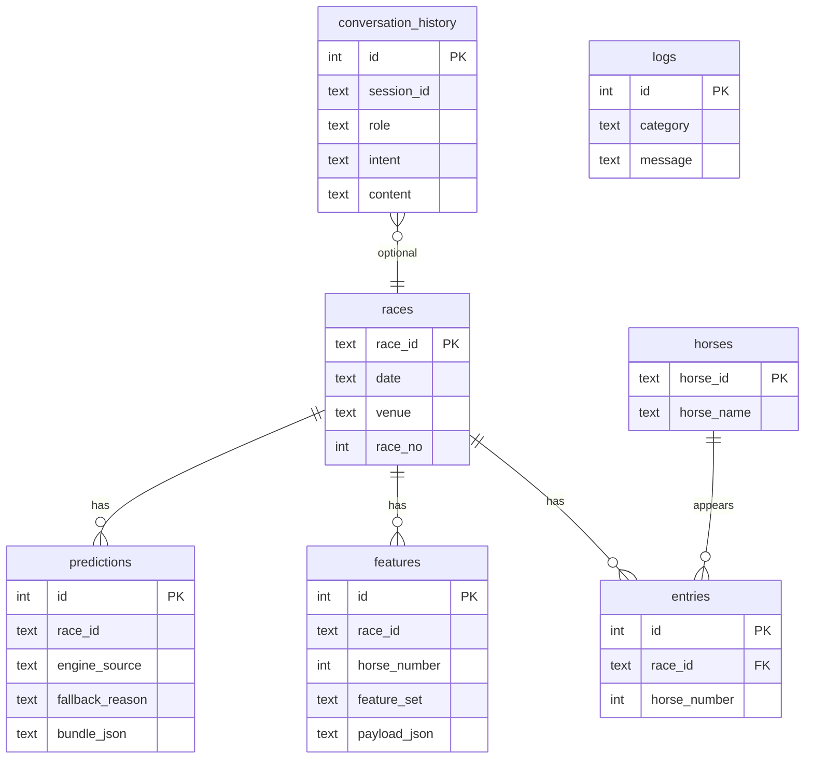

# Production Foundation — Phase A/B/C

**Status:** Implemented（v1 foundation）  
**Scope:** mock_fallback 可視化 / Conversation Layer / CSV→DB Repository

PredictionBundle (`single-prediction-bundle/2.0`) 契約は変更しない。  
`fallback_reason` は **envelope meta / provenance items** のみ。

---

## 1. アーキテクチャ図



Conversation 拡張パス:



---

## 2. DB ER図



Migration: `services/win5-ai/app/data/migrations/001_init.sql`  
Default DB: `services/win5-ai/var/expect_ai.db`（`EXPECT_AI_DB_PATH` で変更可）

---

## 3. mock_fallback 理由コード

| Code | 意味 | real_ai 化に必要なもの |
|------|------|------------------------|
| platform_missing | ai_platform 無し | AI_PLATFORM_ROOT |
| race_not_found | race index 無し | races.csv / DB races |
| feature_csv_missing | 特徴量ファイル無し | runners_pace_market_features.csv |
| market_feature_missing | 当該 race 行無し | features 行追加 |
| feature_missing | カラム不足 | 特徴量スキーマ整備 |
| model_not_loaded | Core import 失敗 | demo_* / pandas |
| prediction_failed | get_prediction 失敗 | Core ログ確認 |
| timeout | タイムアウト | 設定・データ量 |
| exception | 例外 | スタックトレース |
| unknown | 未分類 | 再診断 |

レスポンス例（meta.items[]）:

```json
{
  "race_id": "20260719_tokyo_11",
  "engine_source": "mock_fallback",
  "fallback_reason": "market_feature_missing",
  "detail": "features unavailable for ..."
}
```

自動生成レポート:

- `var/reports/missing_report.json`
- `var/reports/missing_features.csv`
- `var/reports/missing_tables.csv`
- `var/logs/prediction_fallback.jsonl`

API: `GET /v1/diagnostics/missing`（BFF: `/api/diagnostics/missing`）

---

## 4. Conversation Layer

| 層 | 責務 |
|----|------|
| Conversation API | HTTP 入出力・session |
| Intent 解析 | 予想 / 理由 / 穴 / 買い判断 |
| Prediction API | 既存 PredictionAdapter |
| Response Builder | 自然言語 reply + citations |
| conversation_history | DB 永続化 |

`POST /v1/conversation/chat`  
`POST /api/conversation/chat`

Kaoba（既存 `/v1/kaoba/chat`）とは **分離**。LLM 差し替えは Intent/Response 境界。

---

## 5. CSV Import / Repository

```bash
cd services/win5-ai
python -m app.data.import_csv migrate
python -m app.data.import_csv import-races /path/to/races.csv
python -m app.data.import_csv import-features /path/to/runners_pace_market_features.csv
python -m app.data.import_csv export-races ./var/races_export.json
```

`engine/data.load_races()` は DB catalog を優先（空なら mocks JSON）。

---

## 6. 改善後 API 仕様（追加分）

| Method | Path | 説明 |
|--------|------|------|
| GET | `/v1/predictions` | meta.items[].fallback_reason 追加 |
| GET | `/v1/predictions/:id` | meta.fallback_reason 追加 |
| GET | `/v1/diagnostics/fallback-reasons` | 理由一覧 |
| GET | `/v1/diagnostics/missing` | 不足データレポート |
| POST | `/v1/conversation/chat` | Conversation Layer |
| POST | `/v1/admin/migrate` | DB migrate |
| GET | `/health` | db path + reason codes |

BFF:

| Method | Path |
|--------|------|
| POST | `/api/conversation/chat` |
| GET | `/api/diagnostics/missing` |

---

## 7. ロードマップ

1. **短期:** EC2 に本ブランチ反映、全カタログ race の features 行を埋め mock_fallback=0 を目指す  
2. **中期:** Conversation UI、LLM Intent、Access 保護  
3. **中期:** PostgreSQL 切替（Repository インターフェース維持）  
4. **長期:** features を日次 ETL、predictions キャッシュ TTL、監視ダッシュボード
