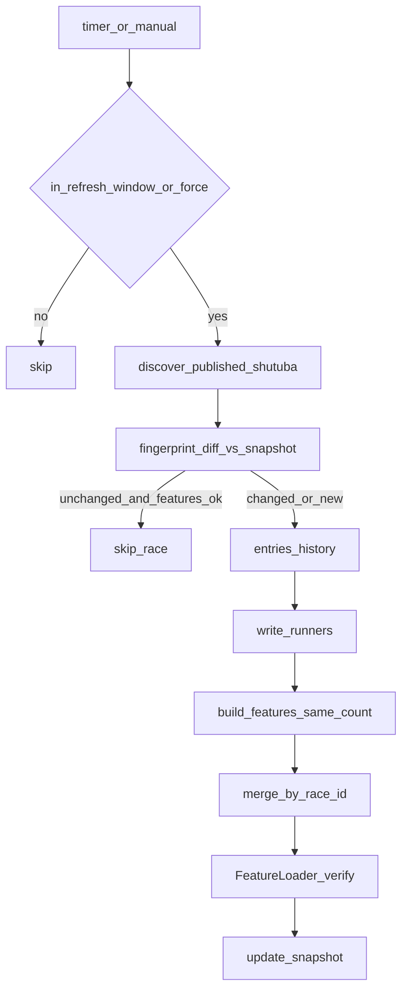
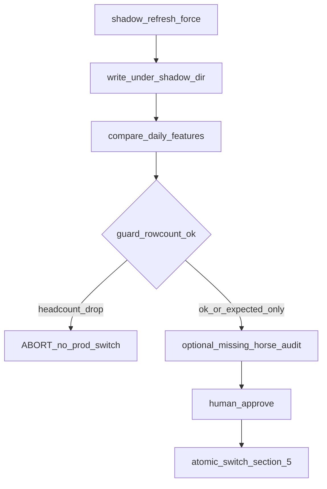

# Version 2 Operations Addendum — Race Refresh / Features / Shadow

**Status:** APPROVED（2026-07-24）  
**Scope:** PI `race_refresh` · daily features CSV · Shadow 検証 · Production 切替  
**Code change:** 本 Addendum は**運用仕様のみ**。実装変更は別承認。  
**根拠:** 2026-07-25 Shadow 検証における特別戦行数減少の原因分析（減少点 = 現行 shutuba）

**関連:**

- Runbook: [`v2-operations-runbook.md`](./v2-operations-runbook.md)
- PI README（手順メモ）: `services/pi-keibanet-api/README.md`
- Unit: `expect-pi-race-refresh.{service,timer}`

---

## 1. 運用原則（確定）

| # | 原則 | 説明 |
|---|------|------|
| P1 | **現行 shutuba を正とする** | netkeiba 出馬表 HTML に載っている出走馬のみが正式エントリ。Baseline（旧 CSV）の頭数・馬一覧は参考値であり、現行名簿と矛盾する場合は現行を採用する |
| P2 | **features は runners と同数** | `build_features` / daily CSV の行数は、当該 `race_id` の `runners.csv`（= shutuba entries）と一致させる。特徴量計算段階で出走馬を増減しない |
| P3 | **fingerprint 変化 → 再生成** | entries fingerprint（頭数・馬番・horse_id・オッズ等のスナップショット鍵）が変わったレースは再取得・再特徴量化の対象とする |
| P4 | **Shadow 頭数減少で自動切替禁止** | Baseline 対 Shadow でガード対象レースの行数（出走頭数）が減少している場合、Production CSV への自動／即時切替を行わない |
| P5 | **最終確定出馬表で Production Refresh** | 本番切替を伴う Refresh は、可能な限り**最終確定出馬表**（取消・除外・名簿確定後）を正としたタイミングで実施する |
| P6 | **欠落 horse_id は監査ログへ** | Baseline に存在し現行 shutuba / runners に無い `horse_id` は監査対象として記録する（**設計のみ・実装は後続**） |

---

## 2. データ正本とパイプライン

```text
[netkeiba shutuba HTML]     ← 正本（P1）
        │
        ▼
 parse_entries_from_shutuba
        │
        ▼
 runners.csv (+ horse_history_raw.csv)
        │
        ▼
 build_features  → 行数 == runners（P2）
        │
        ▼
 daily CSV (demo_runners_pace_market_features.csv)
   · race_id 単位マージ（更新レースのみ置換）
   · win5_leg = (VV-1)*12+RR（安定採番）
        │
        ▼
 FeatureLoader → CorePipeline → /v1/predictions/{race_id}
```

### 2.1 用語

| 用語 | 意味 |
|------|------|
| Baseline | 現行 Production `$PI_DATA_ROOT/demo_daily_outputs/{date}/...csv` |
| Shadow | `--shadow-dir` / `PI_FEATURES_SHADOW_DIR` 配下に書いた候補 CSV（本番非参照） |
| runners | `$PI_RACE_REFRESH_STATE_ROOT/{date}/runners.csv` |
| fingerprint | entries から計算する差分検知鍵（変化で再生成: P3） |
| ガードレース | Shadow 比較で退行を見る既知レース集合（特別戦など） |

### 2.2 行数減少の扱い（承認済み分析）

- features / history / distance / odds 計算は行数減少の主因ではない
- 減少は **shutuba 時点**（名簿から馬が消える／未掲載）で発生する
- HTML に「取消」「除外」が残らない場合もある → **非掲載 = 現行非出走**として扱う（P1）

---

## 3. Refresh 運用フロー



### 3.1 定期 Refresh（差分）

| 項目 | 内容 |
|------|------|
| Unit | `expect-pi-race-refresh.timer`（15 分） |
| 窓 | 08:00–20:00 JST（スクリプト側。`--force` で窓外可） |
| 対象 | 公開済み shutuba（クラス問わず。未勝利・新馬含む） |
| 再生成 | fingerprint 変化 or 未 features_ok（P3） |
| 出力 | Production daily CSV（race_id マージ） |

定期 Refresh は **サービス継続用**（オッズ更新・新規公開レース取り込み）。  
**全日一括の本番切替**は §5 Production Refresh 手順に従う。

### 3.2 環境変数（本番）

| Env | 役割 |
|-----|------|
| `PI_DATA_ROOT` | `/opt/expect-ai/platform/data` |
| `PI_AI_PLATFORM_ROOT` | `/opt/expect-ai/platform` |
| `PI_RACE_REFRESH_STATE_ROOT` | snapshot / runners / history / logs |
| `PI_FEATURES_SHADOW_DIR` | 任意。設定時は features を shadow ルートへ |

---

## 4. Shadow 運用フロー

Shadow は **本番 CSV を直接上書きせず**候補を検証する経路（P4）。



### 4.1 Shadow 生成

```bash
cd /home/ubuntu/KEIBA-Single-AI/services/pi-keibanet-api
export PI_DATA_ROOT=/opt/expect-ai/platform/data
export PI_AI_PLATFORM_ROOT=/opt/expect-ai/platform
export PI_RACE_REFRESH_STATE_ROOT=/opt/expect-ai/platform/data/var/race_refresh

python3 scripts/prod_race_refresh.py --date YYYY-MM-DD --force \
  --shadow-dir /tmp/pi-features-shadow
```

出力例:

`/tmp/pi-features-shadow/demo_daily_outputs/YYYY-MM-DD/demo_runners_pace_market_features.csv`

### 4.2 Shadow 比較

```bash
python3 scripts/compare_daily_features.py --date YYYY-MM-DD \
  --baseline "$PI_DATA_ROOT/demo_daily_outputs/YYYY-MM-DD/demo_runners_pace_market_features.csv" \
  --candidate "/tmp/pi-features-shadow/demo_daily_outputs/YYYY-MM-DD/demo_runners_pace_market_features.csv"
```

### 4.3 切替ゲート（必須）

| ゲート | 条件 | 結果 |
|--------|------|------|
| G1 頭数 | ガードレースで Shadow 行数 **&lt;** Baseline 行数 | **FAIL → 切替禁止**（P4） |
| G2 欠落 | Baseline にあって Shadow に無い `horse_id` が存在 | 監査対象（P6）。G1 と同時なら切替禁止 |
| G3 消失 | ガード `race_id` が Shadow から消える | **FAIL → 切替禁止** |
| G4 想定差分 | `win5_leg` 安定採番のみ / 新規 race_id 追加のみ 等 | 人間レビューで許容可 |
| G5 一致 | ガード行数一致かつ主要列が許容差内 | PASS → §5 へ |

**自動切替は行わない。** G1–G3 FAIL 時は Shadow を残し Production を据え置き、原因を記録して停止する。

### 4.4 想定差分 vs 非想定差分

| 種別 | 例 | 切替 |
|------|-----|------|
| 想定（レビュー後可） | 新規未勝利・新馬の追加、安定 `win5_leg` の番号変更のみ | 条件付き可 |
| 非想定（禁止） | 特別戦などの頭数減少、ガードレース消失、runners≠features 行数 | 不可 |

---

## 5. Production Refresh 手順

**目的:** 最終確定出馬表を正とした daily features を本番に載せる（P5）。

### 5.1 前提チェック

1. 対象日の出馬表が**最終確定**に近い（取消・除外・名簿確定後が望ましい）
2. `curl -sS http://127.0.0.1:8081/health` が OK
3. Baseline をバックアップ可能であること

### 5.2 手順（Shadow → 比較 → 切替）

```bash
DATE=YYYY-MM-DD
SHADOW=/tmp/pi-features-shadow
BASE="$PI_DATA_ROOT/demo_daily_outputs/$DATE"
CAND="$SHADOW/demo_daily_outputs/$DATE"

# 1) Shadow 生成
python3 scripts/prod_race_refresh.py --date "$DATE" --force --shadow-dir "$SHADOW"

# 2) 比較（exit != 0 ならここで停止）
python3 scripts/compare_daily_features.py --date "$DATE" \
  --baseline "$BASE/demo_runners_pace_market_features.csv" \
  --candidate "$CAND/demo_runners_pace_market_features.csv"

# 3) 追加ゲート: ガード頭数（例）
#    いずれかのガード race で shadow_n < baseline_n → STOP（切替しない）

# 4) 人間承認後のみ原子的切替
mv "$BASE" "$BASE.bak.$(date +%Y%m%d%H%M%S)"
mkdir -p "$PI_DATA_ROOT/demo_daily_outputs"
mv "$CAND" "$BASE"
```

### 5.3 切替後スポット確認

| 確認 | 例 |
|------|-----|
| Health | `GET http://127.0.0.1:8081/health` |
| 特別戦 Prediction | `/v1/predictions/{special_race_id}` → `prediction_available=true` |
| 未勝利 / 新馬 | 公開済みなら features あり・詳細表示可 |
| Race Detail (Pages) | 対象 `race.html?race_id=...` が本命・着順・評価を描画 |
| runners vs features | 同一 `race_id` で行数一致（P2） |

### 5.4 ロールバック

```bash
# 直近バックアップへ戻す
mv "$BASE" "$BASE.failed"
mv "$BASE.bak.<timestamp>" "$BASE"
```

FeatureLoader はファイルを都度読むため、通常は PI 再起動不要。異常時のみ `systemctl restart expect-pi-keibanet-api`。

---

## 6. 監査ログ設計（P6・実装は後続）

**現状:** 設計のみ。コード変更は本 Addendum の範囲外。

### 6.1 記録タイミング

- Shadow 比較時、および Production Refresh 比較時
- Baseline∋horse_id かつ Candidate/runners∌horse_id を検出したとき

### 6.2 推奨フィールド

| フィールド | 内容 |
|------------|------|
| `ts` | JST ISO8601 |
| `date` | 開催日 |
| `race_id` | WIN5 形式 ID |
| `numeric_race_id` | netkeiba race id |
| `horse_id` | 欠落 ID |
| `horse_number` / `horse_name` | Baseline 側の値（あれば） |
| `baseline_n` / `candidate_n` | 行数 |
| `shutuba_present` | 現行 HTML に ID が存在したか |
| `cancel_marker` | HTML 近傍に取消・除外があったか |
| `action` | `abort_switch` / `allow_after_review` |

### 6.3 推奨出力先（案）

`$PI_RACE_REFRESH_STATE_ROOT/{date}/logs/missing_horses.jsonl`

---

## 7. 役割分担

| 役割 | 責務 |
|------|------|
| 定期 timer | 差分 Refresh（本番 CSV 更新可。一括切替ゲートは Shadow 経路） |
| 運用者 | Shadow 比較・G1 判定・Production 切替承認 |
| 開発 | 監査ログ実装（別チケット）、比較ゲート自動化（別承認） |

---

## 8. 変更履歴

| 日付 | 内容 |
|------|------|
| 2026-07-24 | 初版。shutuba 正本・Shadow 頭数ゲート・確定後 Production Refresh・欠落監査（設計）を追加 |
| 2026-07-25 | Horse Number Integrity ゲート追加（正式馬番未取得時は Feature CSV 非生成） |

---

## Horse Number Integrity {#horse-number-integrity}

### 目的

正式馬番（Umaban）が揃っていない状態で Feature CSV を生成しない。

### ゲート

| 条件 | Feature CSV |
|------|-------------|
| 全頭 `horse_id` + 正式 `horse_number`（source=`umaban`） | 生成可 |
| `horse_number` 未取得 / fallback source | **生成中止**（当該 race_id 行を purge） |
| `frame_number` 未取得 | ログ警告（Feature の hard gate ではない） |

### 成果物

- `$PI_RACE_REFRESH_STATE_ROOT/{date}/logs/horse_number_integrity_latest.json`
- Ops: `GET /v1/ops/horse-number-integrity` · probe `pi_horse_number_integrity` · Alert `ALT-E10`

