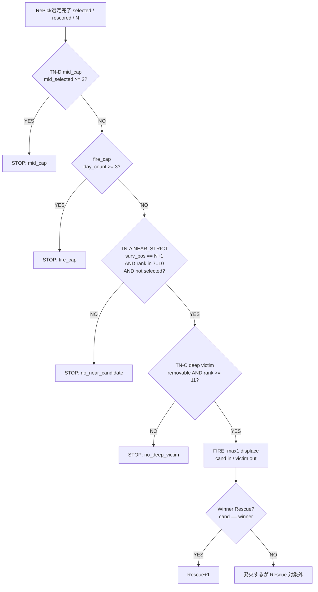

# RP-V2-A G1 FAIL 観測資料（再設計用）

**Generated:** 2026-07-22T02:15:57Z
**Scope:** Winner Rescue 対象 G1 = 11レース（評価母集団のみ）
**AB STATUS:** FAIL（Hit 218→218 / Rescue 0/11）
**制約:** 改善実装なし・観測と設計材料のみ

## 観測サマリー（再設計の前提）

1. **11/11 で strict NEAR（`surv_pos==N+1` ∧ rank7–10 ∧ not selected）が不成立。** first_fail は `no_near_candidate`×6 + `mid_cap`×5。`fire_cap` / `no_deep_victim` を first_fail にした G1 は 0。
2. **winner はほぼ全員 mid（rank7–10）だが N+1 にいない。** `winner_mid_but_not_N+1` = 10/11。例外は既に RePick 内の `2026-01-18-中山-10`（Rescue 定義上は対象外に近い）。
3. **N+1 スロット馬が mid 候補になっていない／既に selected。** 例: N+1 が rank3/4/5/6/12、または selected 内 mid。
4. **仮に NEAR を N+1..N+2 に戻しても、winner が帯に入るのは 4/11**（中京・アウダーシア・ナムラフランク・マイノワール）。うち mid_cap で止まる 1、残り 3 は **deep victim 0** のため、帯緩和だけでは Rescue 0 のまま。
5. **構造ギャップ:** surv_pos≤N なのに RePick 外の winner が複数（函館 pos4、中山 pos5、阪神 pos3、小倉 pos5）。「境界 N+1 置換」では届かない層。

## ゲート通過フロー図

本番は上記を**短絡評価**する。本資料は各ゲートを**独立評価**し、落ちた全条件を列挙する。

## FAIL理由集計（11件）

### 最終ゲート（journal / first_fail）

| condition | count / 11 |
|-----------|----------:|
| `no_near_candidate` | 6 |
| `mid_cap` | 5 |

### 独立ブロッキング条件（1レース複数可）

| condition | races / 11 | 解釈 |
|-----------|----------:|------|
| `no_near_candidate` | 11 | 全件で TN-A strict NEAR 不成立（mid_cap 短絡後も独立評価では全員） |
| `winner_mid_but_not_N+1` | 10 | winner は mid だが N+1 スロットにいない |
| `winner_surv_pos_ne_N+1`（合算） | 10 | winner の surv_pos ≠ N+1（詳細は CSV） |
| `winner_outside_repick_pre` | 6 | surv_pos > N かつ RePick 前 out |
| `mid_cap` | 5 | selected 内 mid≥2 |
| `winner_already_in_repick_pre` | 1 | 既に枠内（Rescue 不要） |
| `fire_cap` | 0 | G1 では未到達 |
| `no_deep_victim`（独立・NEAR 仮定時） | ※ | first_fail には未出現。N+1..N+2 反実仮想では 3 件がここで止まる |

### 反実仮想: NEAR を N+1..N+2 にした場合（実装なし・机上）

| race_id | winner が N+1..N+2 mid? | mid_cap | deep victim | 机上の次ゲート |
|---------|:---------------------:|:-------:|:-----------:|----------------|
| 2025-12-14-中京-11 | YES (pos9) | OK | 0 | `no_deep_victim` |
| 2026-03-15-中山-11 | YES (pos9) | OK | 0 | `no_deep_victim` |
| 2026-04-19-中山-10 | YES (pos9) | BLOCK | 0 | 先に `mid_cap` |
| 2026-04-25-京都-10 | YES (pos9) | OK | 0 | `no_deep_victim` |
| 他 7 件 | NO | — | — | 帯緩和でも候補化せず |

**結論:** 案B単独では Rescue 期待値 ≈ 0。案A（mid_cap）+ 案B（帯）+ **deep victim / 別トリガ（案C）** の組合せが必要。

### レース × 停止条件 一覧

| race_id | winner | wr | first_fail | all_blocking | mid | near | deep | fire |
|---------|--------|---:|------------|--------------|----:|-----:|-----:|-----:|
| 2024-01-21-京都-11 | ウィリアムバローズ | 7 | `mid_cap` | mid_cap;no_near_candidate;winner_mid_but_not_N+1;winner_outside_repick_pre;winner_surv_pos_ne_N+1(pos=11,N=7) | 2/2 | 0 | 1 | 0 |
| 2024-02-18-京都-11 | スズカコテキタイ | 10 | `no_near_candidate` | no_near_candidate;winner_mid_but_not_N+1;winner_outside_repick_pre;winner_surv_pos_ne_N+1(pos=13,N=7) | 1/2 | 0 | 0 | 0 |
| 2024-07-14-函館-10 | レッドラグラス | 8 | `mid_cap` | mid_cap;no_near_candidate;winner_mid_but_not_N+1;winner_surv_pos_ne_N+1(pos=4,N=7) | 2/2 | 0 | 0 | 0 |
| 2025-12-13-中山-10 | モンドプリューム | 9 | `mid_cap` | mid_cap;no_near_candidate;winner_mid_but_not_N+1;winner_surv_pos_ne_N+1(pos=5,N=7) | 2/2 | 0 | 0 | 0 |
| 2025-12-14-中京-11 | モズナナスター | 8 | `no_near_candidate` | no_near_candidate;winner_mid_but_not_N+1;winner_outside_repick_pre;winner_surv_pos_ne_N+1(pos=9,N=7) | 1/2 | 0 | 0 | 0 |
| 2026-01-18-中山-10 | モンドプリューム | 9 | `mid_cap` | mid_cap;no_near_candidate;winner_already_in_repick_pre | 3/2 | 0 | 1 | 0 |
| 2026-03-15-中山-11 | アウダーシア | 10 | `no_near_candidate` | no_near_candidate;winner_mid_but_not_N+1;winner_outside_repick_pre;winner_surv_pos_ne_N+1(pos=9,N=7) | 1/2 | 0 | 0 | 0 |
| 2026-04-12-阪神-10 | マイネルエニグマ | 7 | `no_near_candidate` | no_near_candidate;winner_mid_but_not_N+1;winner_surv_pos_ne_N+1(pos=3,N=7) | 1/2 | 0 | 0 | 1 |
| 2026-04-19-中山-10 | ナムラフランク | 8 | `mid_cap` | mid_cap;no_near_candidate;winner_mid_but_not_N+1;winner_outside_repick_pre;winner_surv_pos_ne_N+1(pos=9,N=7) | 2/2 | 0 | 0 | 0 |
| 2026-04-25-京都-10 | マイノワール | 7 | `no_near_candidate` | no_near_candidate;winner_mid_but_not_N+1;winner_outside_repick_pre;winner_surv_pos_ne_N+1(pos=9,N=7) | 1/2 | 0 | 0 | 0 |
| 2026-06-28-小倉-11 | テーオーダヴィンチ | 7 | `no_near_candidate` | no_near_candidate;winner_mid_but_not_N+1;winner_surv_pos_ne_N+1(pos=5,N=5) | 1/2 | 0 | 0 | 0 |

## 11レース詳細

### `2024-01-21-京都-11`

- **winner:** ウィリアムバローズ（model_rank=7）
- **Candidate Pool順位:** 6 / size=13（surv_pos=11）
- **RePick前順位:** out（N=7, size_pre=7）
- **RePick後順位:** out
- **NEAR候補の有無:** なし（strict cand=`-` r-）
- **N+1 スロット馬:** `ヴィクティファルス` r3
- **N+1..N+2 帯に mid 候補:** なし（-）
- **deep victim の有無:** あり（n=1, `オーロイプラータ`）
- **mid_cap 判定:** block=True（mid_selected=2 / thr=2; キリンジ:r9|サンライズウルス:r10）
- **fire 判定:** block=False（day_count_at_entry=0 / thr=3）
- **最終的に落ちたゲート:** `mid_cap`
- **落ちた理由（全条件）:** `mid_cap;no_near_candidate;winner_mid_but_not_N+1;winner_outside_repick_pre;winner_surv_pos_ne_N+1(pos=11,N=7)`

### `2024-02-18-京都-11`

- **winner:** スズカコテキタイ（model_rank=10）
- **Candidate Pool順位:** 10 / size=13（surv_pos=13）
- **RePick前順位:** out（N=7, size_pre=7）
- **RePick後順位:** out
- **NEAR候補の有無:** なし（strict cand=`-` r-）
- **N+1 スロット馬:** `ボイラーハウス` r12
- **N+1..N+2 帯に mid 候補:** なし（-）
- **deep victim の有無:** なし（n=0, `-`）
- **mid_cap 判定:** block=False（mid_selected=1 / thr=2; イスラアネーロ:r9）
- **fire 判定:** block=False（day_count_at_entry=0 / thr=3）
- **最終的に落ちたゲート:** `no_near_candidate`
- **落ちた理由（全条件）:** `no_near_candidate;winner_mid_but_not_N+1;winner_outside_repick_pre;winner_surv_pos_ne_N+1(pos=13,N=7)`

### `2024-07-14-函館-10`

- **winner:** レッドラグラス（model_rank=8）
- **Candidate Pool順位:** 8 / size=9（surv_pos=4）
- **RePick前順位:** out（N=7, size_pre=7）
- **RePick後順位:** out
- **NEAR候補の有無:** なし（strict cand=`-` r-）
- **N+1 スロット馬:** `アセレラシオン` r4
- **N+1..N+2 帯に mid 候補:** なし（-）
- **deep victim の有無:** なし（n=0, `-`）
- **mid_cap 判定:** block=True（mid_selected=2 / thr=2; テンクウジョー:r7|サハラヴァンクール:r9）
- **fire 判定:** block=False（day_count_at_entry=0 / thr=3）
- **最終的に落ちたゲート:** `mid_cap`
- **落ちた理由（全条件）:** `mid_cap;no_near_candidate;winner_mid_but_not_N+1;winner_surv_pos_ne_N+1(pos=4,N=7)`

### `2025-12-13-中山-10`

- **winner:** モンドプリューム（model_rank=9）
- **Candidate Pool順位:** 9 / size=9（surv_pos=5）
- **RePick前順位:** out（N=7, size_pre=7）
- **RePick後順位:** out
- **NEAR候補の有無:** なし（strict cand=`-` r-）
- **N+1 スロット馬:** `ジェネラーレ` r5
- **N+1..N+2 帯に mid 候補:** なし（-）
- **deep victim の有無:** なし（n=0, `-`）
- **mid_cap 判定:** block=True（mid_selected=2 / thr=2; エコロエイト:r8|シャカシャカシー:r7）
- **fire 判定:** block=False（day_count_at_entry=0 / thr=3）
- **最終的に落ちたゲート:** `mid_cap`
- **落ちた理由（全条件）:** `mid_cap;no_near_candidate;winner_mid_but_not_N+1;winner_surv_pos_ne_N+1(pos=5,N=7)`

### `2025-12-14-中京-11`

- **winner:** モズナナスター（model_rank=8）
- **Candidate Pool順位:** 8 / size=9（surv_pos=9）
- **RePick前順位:** out（N=7, size_pre=7）
- **RePick後順位:** out
- **NEAR候補の有無:** なし（strict cand=`-` r-）
- **N+1 スロット馬:** `キャプテンシー` r7
- **N+1..N+2 帯に mid 候補:** あり（モズナナスター:pos9:r8）
- **deep victim の有無:** なし（n=0, `-`）
- **mid_cap 判定:** block=False（mid_selected=1 / thr=2; キャプテンシー:r7）
- **fire 判定:** block=False（day_count_at_entry=0 / thr=3）
- **最終的に落ちたゲート:** `no_near_candidate`
- **落ちた理由（全条件）:** `no_near_candidate;winner_mid_but_not_N+1;winner_outside_repick_pre;winner_surv_pos_ne_N+1(pos=9,N=7)`

### `2026-01-18-中山-10`

- **winner:** モンドプリューム（model_rank=9）
- **Candidate Pool順位:** 8 / size=13（surv_pos=5）
- **RePick前順位:** 5（N=7, size_pre=7）
- **RePick後順位:** 5
- **NEAR候補の有無:** なし（strict cand=`-` r-）
- **N+1 スロット馬:** `オーブルクール` r3
- **N+1..N+2 帯に mid 候補:** なし（-）
- **deep victim の有無:** あり（n=1, `ジュンウィンダム`）
- **mid_cap 判定:** block=True（mid_selected=3 / thr=2; カンパニョーラ:r8|ナムラフランク:r7|モンドプリューム:r9）
- **fire 判定:** block=False（day_count_at_entry=0 / thr=3）
- **最終的に落ちたゲート:** `mid_cap`
- **落ちた理由（全条件）:** `mid_cap;no_near_candidate;winner_already_in_repick_pre`

### `2026-03-15-中山-11`

- **winner:** アウダーシア（model_rank=10）
- **Candidate Pool順位:** 7 / size=10（surv_pos=9）
- **RePick前順位:** out（N=7, size_pre=7）
- **RePick後順位:** out
- **NEAR候補の有無:** なし（strict cand=`-` r-）
- **N+1 スロット馬:** `ジーネキング` r9
- **N+1..N+2 帯に mid 候補:** あり（アウダーシア:pos9:r10）
- **deep victim の有無:** なし（n=0, `-`）
- **mid_cap 判定:** block=False（mid_selected=1 / thr=2; ジーネキング:r9）
- **fire 判定:** block=False（day_count_at_entry=0 / thr=3）
- **最終的に落ちたゲート:** `no_near_candidate`
- **落ちた理由（全条件）:** `no_near_candidate;winner_mid_but_not_N+1;winner_outside_repick_pre;winner_surv_pos_ne_N+1(pos=9,N=7)`

### `2026-04-12-阪神-10`

- **winner:** マイネルエニグマ（model_rank=7）
- **Candidate Pool順位:** 7 / size=9（surv_pos=3）
- **RePick前順位:** out（N=7, size_pre=7）
- **RePick後順位:** out
- **NEAR候補の有無:** なし（strict cand=`-` r-）
- **N+1 スロット馬:** `キーパフォーマー` r6
- **N+1..N+2 帯に mid 候補:** あり（アレナリア:pos9:r8）
- **deep victim の有無:** なし（n=0, `-`）
- **mid_cap 判定:** block=False（mid_selected=1 / thr=2; エゾダイモン:r9）
- **fire 判定:** block=False（day_count_at_entry=1 / thr=3）
- **最終的に落ちたゲート:** `no_near_candidate`
- **落ちた理由（全条件）:** `no_near_candidate;winner_mid_but_not_N+1;winner_surv_pos_ne_N+1(pos=3,N=7)`

### `2026-04-19-中山-10`

- **winner:** ナムラフランク（model_rank=8）
- **Candidate Pool順位:** 8 / size=9（surv_pos=9）
- **RePick前順位:** out（N=7, size_pre=7）
- **RePick後順位:** out
- **NEAR候補の有無:** なし（strict cand=`-` r-）
- **N+1 スロット馬:** `ポッドベイダー` r7
- **N+1..N+2 帯に mid 候補:** あり（ナムラフランク:pos9:r8）
- **deep victim の有無:** なし（n=0, `-`）
- **mid_cap 判定:** block=True（mid_selected=2 / thr=2; スリーピース:r9|ポッドベイダー:r7）
- **fire 判定:** block=False（day_count_at_entry=0 / thr=3）
- **最終的に落ちたゲート:** `mid_cap`
- **落ちた理由（全条件）:** `mid_cap;no_near_candidate;winner_mid_but_not_N+1;winner_outside_repick_pre;winner_surv_pos_ne_N+1(pos=9,N=7)`

### `2026-04-25-京都-10`

- **winner:** マイノワール（model_rank=7）
- **Candidate Pool順位:** 9 / size=9（surv_pos=9）
- **RePick前順位:** out（N=7, size_pre=7）
- **RePick後順位:** out
- **NEAR候補の有無:** なし（strict cand=`-` r-）
- **N+1 スロット馬:** `ショウサンジョージ` r9
- **N+1..N+2 帯に mid 候補:** あり（マイノワール:pos9:r7）
- **deep victim の有無:** なし（n=0, `-`）
- **mid_cap 判定:** block=False（mid_selected=1 / thr=2; ショウサンジョージ:r9）
- **fire 判定:** block=False（day_count_at_entry=0 / thr=3）
- **最終的に落ちたゲート:** `no_near_candidate`
- **落ちた理由（全条件）:** `no_near_candidate;winner_mid_but_not_N+1;winner_outside_repick_pre;winner_surv_pos_ne_N+1(pos=9,N=7)`

### `2026-06-28-小倉-11`

- **winner:** テーオーダヴィンチ（model_rank=7）
- **Candidate Pool順位:** 7 / size=8（surv_pos=5）
- **RePick前順位:** out（N=5, size_pre=5）
- **RePick後順位:** out
- **NEAR候補の有無:** なし（strict cand=`-` r-）
- **N+1 スロット馬:** `ベイビーキッス` r8
- **N+1..N+2 帯に mid 候補:** なし（-）
- **deep victim の有無:** なし（n=0, `-`）
- **mid_cap 判定:** block=False（mid_selected=1 / thr=2; ベイビーキッス:r8）
- **fire 判定:** block=False（day_count_at_entry=0 / thr=3）
- **最終的に落ちたゲート:** `no_near_candidate`
- **落ちた理由（全条件）:** `no_near_candidate;winner_mid_but_not_N+1;winner_surv_pos_ne_N+1(pos=5,N=5)`

## 設計改善案（実装禁止・案のみ）

### 案A — mid_cap の適用条件変更

- **狙い:** first_fail=`mid_cap` が 5/11。選定済み mid≥2 の時点で短絡し、NEAR/deep まで到達しない。
- **設計案:**
  - A1: 閾値 `>=2` → `>=3`（または「置換後に mid が増える場合のみ禁止」）
  - A2: mid_cap を発火禁止ではなく **victim 制約**に格下げ（mid を victim にしない／deep 必須は維持）
  - A3: レース内カウントをやめ、**当日 mid 置換回数**の予算制にする
- **観測との対応:** ナムラフランクは N+2 帯に入るが mid_cap で止まる。A 単独でも他 4 件の mid_cap は「その後 no_near」なので **A だけでは Rescue 増は限定的**。
- **リスク:** 既存 Hit への churn。Hard Gate `Hit>218` 前提で AB。

### 案B — NEAR 判定帯変更（TN-A 緩和）

- **狙い:** first_fail=`no_near_candidate` が 6/11、独立評価では 11/11。N+1 スロットが非 mid／selected 内になりがち。
- **設計案:**
  - B1: `N+1` のみ → `N+1..N+2` へ戻す（段階 AB）
  - B2: N+1 が mid∧not-selected でないとき、**最初の mid∧not-selected（pos≤N+K）** を候補化
  - B3: selected と surv 上位の不一致を前提に、「pool 内 mid のうち surv 最良の not-selected」を NEAR と再定義
- **観測との対応:** B1 で winner 候補化は最大 4/11。ただしその 4 のうち 3 は **deep victim 不在**、1 は mid_cap → **B 単独の机上 Rescue ≈ 0**。
- **必須の併せ技:** TN-C の victim 定義緩和、または案C。

### 案C — 新しい Rescue Trigger（境界 NEAR 以外）

- **狙い:** G1 winner の本態は「N+1 境界」ではなく **Pool 内・RePick 外の mid**、または **surv 上位なのに selected 外**。現行 TN-A∧C∧D では経路が閉じている。
- **設計案:**
  - C1: **Pool-in / RePick-out mid** トリガ（rank7–10、not selected、pool 内）。mid_cap 非適用。victim は removable deep（rank≥11）必須。max1
  - C2: **surv≤N なのに not-selected** の mid を優先（函館/阪神/小倉型）。compress 副作用の巻き戻しに近い匿名トリガ
  - C3: **shadow → promote** — 匿名トリガで候補を数え、churn 予測（または日次 fire_cap 厳格化）を通ったときだけ本番 displace
- **期待:** C1 は G1 の 10/11（既に枠内の 1 件を除く）に理論到達。deep victim 供給がボトルネックなら victim を「removable 最弱」まで段階緩和する別 AB が必要。
- **制約:** 本番トリガは匿名維持（G1 allowlist / winner 参照禁止）。G1 は評価母集団のみ。

## Artifacts

- Detail CSV: `C:\win5-ai\compare\v2_rp_v2_a_g1_gate_detail.csv`
- Aggregate CSV: `C:\win5-ai\compare\v2_rp_v2_a_g1_fail_gate_aggregate.csv`
- This report: `C:\win5-ai\KEIBA-Single-AI\docs\ops\v2-rp-v2-a-g1-fail-observation.md`
- JSON: `C:\win5-ai\compare\v2_rp_v2_a_g1_fail_observation.json`

## Notes

- 本スクリプトは観測専用。`v2_repick_v2.py` のロジックは変更していない。
- `fire_day_count_at_entry` は AB Treatment CSV のジョブ順から復元。
- `all_blocking_conditions` は短絡無視の独立評価＋ winner 位置の説明条件を含む。

