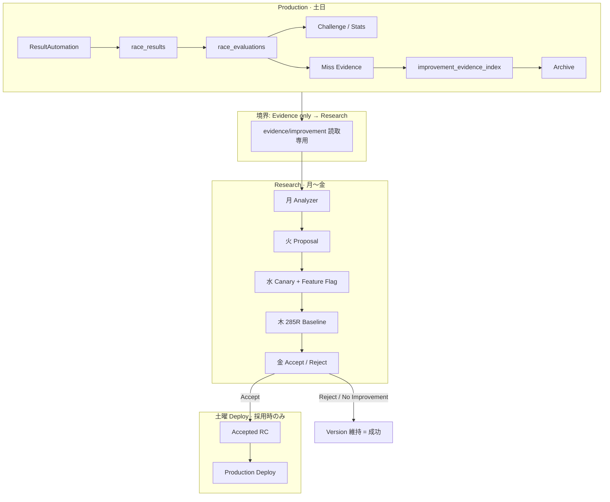
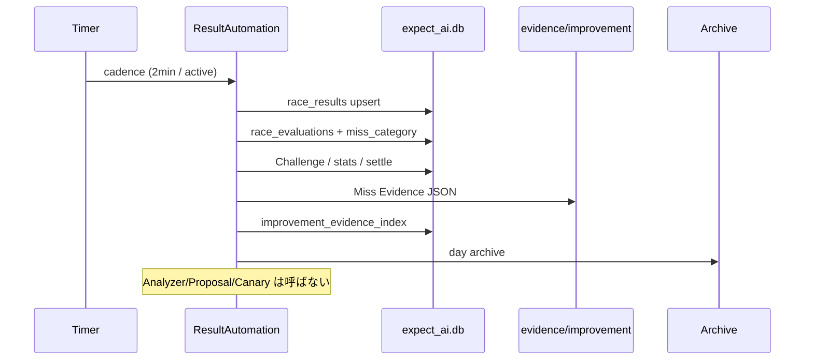
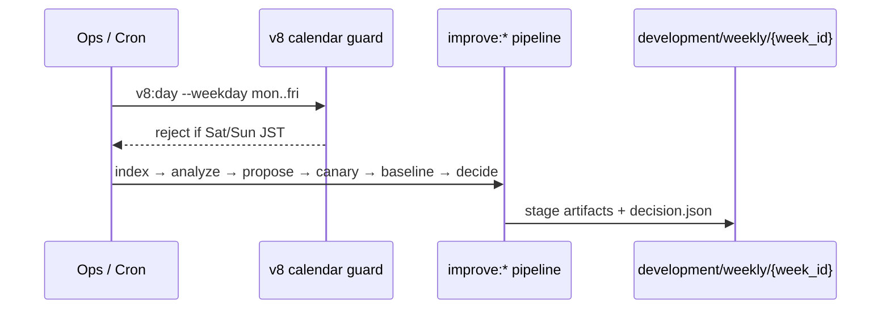

# Version 8 — AI Self-Improvement Cycle

**Status:** Architecture complete → **Operations Baseline 8.5**  
**Ops:** [`v8-operations-baseline.md`](./v8-operations-baseline.md)（Version8.5 Operations Mode 正式運用）  
**Non-goals:** Prediction Engine / Candidate Evaluation / AI ロジックの直接変更。本番中の自動改善。新 Research 機能の追加（根拠なき拡張禁止）。

---

## 0. 基本思想

| 環境 | 目的 | 実行してよいこと | 禁止 |
|------|------|------------------|------|
| **Production（土日）** | 本番データ収集 | ResultAutomation → Evidence → Archive | Analyzer / Proposal / Canary / Baseline / Core 更新 |
| **Research（月〜金）** | 改善研究 | Evidence → Analyzer → Proposal → Canary → 285R → 採否 | 本番 DB 書込・未承認 Canary の本番適用 |
| **Deploy（土曜・採用時のみ）** | 承認済み反映 | Accept 済み RC のデプロイ | その場での再分析・その場での Core 改変 |

```
本番中は AI を改善しない。
研究期間だけ改善案を作成・評価する。
改善しない週（Reject / No Improvement）も成功である。
```

既存資産の位置づけ:

| 既存 | Version8 での役割 |
|------|-------------------|
| ResultAutomation `EVIDENCE_EXPORTING` | Production Evidence 収集（土日） |
| `evidence/improvement/` + `improvement_evidence_index` | Research 入力正本 |
| `scripts/ops/improvement/*` (I-1〜I-5) | Research 実行エンジン |
| `development/*` | Research 成果物 |
| `fixtures/stats/baseline-285r-evaluations.json` | 木・285R Baseline 比較正本 |
| `development/weekly/` + `scripts/ops/v8/*` | **週次カレンダー・ガード・採否（本 Version）** |

---

## 1. 全体アーキテクチャ



---

## 2. 運用シーケンス

### 土日（Production）



### 月〜金（Research）



| 曜日 | ステージ | npm | 成果 |
|------|----------|-----|------|
| 月 | Analyzer | `v8:mon` | `weekly/{id}/mon-analyzer/` |
| 火 | Proposal | `v8:tue` | `weekly/{id}/tue-proposal/` |
| 水 | Canary | `v8:wed` | `weekly/{id}/wed-canary/` + Feature Flag 草案 |
| 木 | 285R Baseline | `v8:thu` | `weekly/{id}/thu-baseline/` |
| 金 | Accept / Reject | `v8:fri` | `weekly/{id}/fri-decision/decision.json` |
| 土 | Deploy（Accept 時のみ） | `v8:sat-deploy` | 既存デプロイ手順へリンク |
| 日 | Production only | — | Research 禁止 |

---

## 3. ディレクトリ構成

```
evidence/improvement/              # Production 正本（Research は読取のみ）
development/                       # 既存 I-1〜I-5 成果物
├── index/ analysis/ proposals/ canary/ release-candidates/ reviews/ runs/
└── weekly/                        # Version8 週次履歴
    ├── _TEMPLATE/
    ├── README.md
    └── {YYYY}-W{ww}/              # ISO week (JST)
        ├── manifesto.json
        ├── mon-analyzer/
        ├── tue-proposal/
        ├── wed-canary/
        ├── thu-baseline/
        ├── fri-decision/
        │   └── decision.json      # accept | reject | no_improvement
        ├── sat-deploy/
        └── reports/

contracts/
├── expect-miss-evidence/1.0/      # miss_top1|3|5（本番・変更最小）
└── expect-root-cause-taxonomy/1.0/  # Version8 Root Cause 分類

scripts/ops/v8/
├── calendar.mjs                   # 土日 Research 禁止
├── week-id.mjs
├── run-day.mjs
├── decide.mjs
└── baseline-285r.mjs
```

---

## 4. Evidence → … → 採用フロー

```
Miss Evidence (miss_top1|3|5)
        ↓
Analyzer (+ root_cause_taxonomy tags)
        ↓
Proposal (設計書のみ・コード自動生成しない)
        ↓
Canary (Feature Flag OFF 既定 / オフライン評価)
        ↓
285R Baseline (formal-285r-offline-corpus)
        ↓
Accept / Reject / No Improvement
        ↓
Accept のみ → RC → Human Review → 土曜 Deploy
```

**改善しない週も成功:**

```json
{ "decision": "no_improvement", "ok": true, "reason": "Canary/Baseline で優位差なし。現行 Version 維持。" }
```

---

## 5. Feature Flag 運用

| Flag | 既定 | 用途 |
|------|------|------|
| `v8_research_enabled` | `true`（Dev ツール） | 週次スクリプト許可（本番 Core 非接触） |
| `v8_canary_candidate_pool` | **false** | Canary 用予約。PE 未配線 |
| `v8_canary_repick` | **false** | 同上 |
| `v8_canary_delete` | **false** | 同上 |
| `v8_canary_confidence` | **false** | 同上 |
| `v8_production_canary` | **false** | 本番トラフィック Canary。Accept+Review 後のみ検討 |

原則:

1. Research Canary は **オフライン / Flag OFF** で評価する  
2. Production への Flag ON は **Accept + Human Review + 土曜 Deploy** 後のみ  
3. Flag を PE/CE に配線する変更は **別 PR（承認済み Proposal 実装）** — Version8 スキャフォールド自体は Core を触らない  

---

## 6. 本番・研究の責務分離

| 責務 | Production | Research |
|------|------------|----------|
| race_results / evaluations | ✅ | ❌ |
| Challenge / settle / Archive | ✅ | ❌ |
| Miss Evidence 生成 | ✅ | ❌（読取のみ） |
| Analyzer / Proposal | ❌ | ✅ |
| Canary / 285R | ❌ | ✅ |
| Core ホットパッチ | ❌ | ❌ |
| Deploy | 土曜・承認済みのみ | 成果物作成まで |

カレンダーガード: `scripts/ops/v8/calendar.mjs`  
土日 JST に `v8:mon`〜`v8:fri` / `v8:week` を実行すると **非 0 exit**。

---

## 7. 「改善しない週」運用ルール

1. Evidence 0 件 → `no_improvement`（Proposal/Canary 省略可）  
2. Analyzer 後に有意パターンなし → `no_improvement`  
3. Canary FAIL → `reject`（失敗ではなくゲート作動）  
4. 285R で Baseline 比優位なし → `reject` または `no_improvement`  
5. いずれも **`ok: true`**（プロセス成功）。Version 番号は維持  
6. 週次 `manifesto.json` に `decision` を必ず残し、履歴追えること  

---

## 8. PE / CE / AI ロジック

Version8 スキャフォールドは以下に **変更を入れない**:

- `ai_platform.core` / Candidate Evaluation / Scorer / Ranker  
- PredictionAdapter の Ready 判定ロジック  
- ResultAutomation の EVALUATING / Miss 分類本体（miss_top1|3|5）  

Root Cause 拡張は **Research 側 taxonomy + Analyzer 出力** に載せ、Production Miss schema の必須 enum は維持する。

---

## クイックコマンド

```bash
npm run v8:week-id
npm run v8:mon          # Analyzer (+ V8.1 pattern)
npm run v8:tue          # Proposal + ranking
npm run v8:wed          # Canary Priority順
npm run v8:thu          # 285R Baseline compare
npm run v8:fri          # Decide + history + metrics
npm run v8:sat-deploy   # Accept 時のみ案内
npm run v8:week         # 月〜金まとめて（土日は拒否）
npm run v8:report       # 週次 Ops Report（運用提出物）
npm run v8:smoke81      # … v8:smoke85
```

運用フェーズ: [`v8-operations-baseline.md`](./v8-operations-baseline.md)
