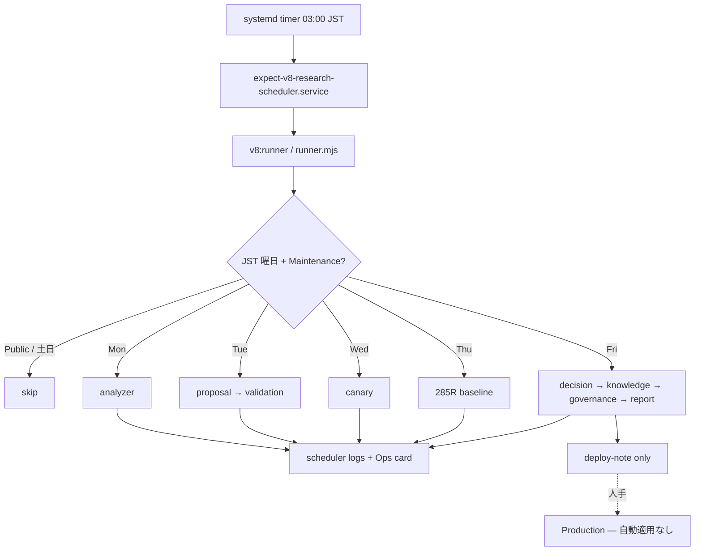
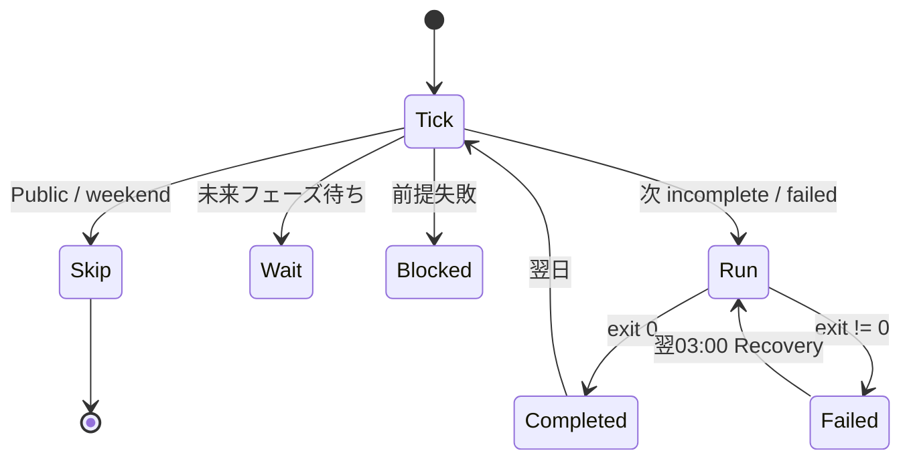

# Version8.6 — Research Scheduler Automation

**Baseline Lock:** Version8.5（維持）  
**PE / CE / AI / Production / ResultAutomation / Challenge:** unchanged  
**Production 自動反映:** **禁止**（deploy-note のみ）

---

## ① Runner 構成図



---

## ② systemd timer 構成

| Unit | 内容 |
|------|------|
| `infra/aws/systemd/expect-v8-research-scheduler.timer` | `OnCalendar=*-*-* 03:00:00`（TZ=Asia/Tokyo） |
| `infra/aws/systemd/expect-v8-research-scheduler.service` | `node scripts/ops/v8/runner.mjs` |

```bash
sudo cp infra/aws/systemd/expect-v8-research-scheduler.* /etc/systemd/system/
sudo systemctl daemon-reload
sudo systemctl enable --now expect-v8-research-scheduler.timer
systemctl list-timers | grep v8-research
```

曜日別 timer は **持たない**。Runner が自律判定。

---

## ③ Runner 状態遷移図



フェーズ順:  
`analyzer → proposal → validation → canary → baseline → decision → knowledge → governance → report`

---

## ④ Recovery 設計

| 状況 | 動作 |
|------|------|
| Proposal 完了・Validation 失敗 | `phases.validation.status=failed` → 翌 tick で **validation から再開** |
| 前提未完了 | `blocked` / 後続開始禁止 |
| 同一 week・同一 phase 完了済 | double-exec skip |
| 週またぎ | `week_id` 変わると state リセット |

状態正本: `development/scheduler/weekly-runner.json`  
履歴: `phase-history.json`  
ログ: `runner.log`  
Ops 公開: `public/ops-data/research-scheduler.json`

---

## ⑤ Skip 条件一覧

| 条件 | reason |
|------|--------|
| Public 期間（土 0:00〜日 21:00） | `public_window` |
| 土日（冗長ガード） | `weekend` |
| 週フェーズ完了 | `week_phases_complete` |
| 同一フェーズ完了済 | `already_completed:*` |
| 前提未完了 / 失敗 | `prerequisite_*` |
| カレンダー上まだ早い | `waiting_for_calendar:*` |

**実行可能:** Maintenance 期間かつ Mon–Fri。

---

## ⑥ Ops Dashboard

- カード: **Research Scheduler**（`ops.html`）
- API: `GET /api/ops/research-scheduler`（ADMIN）
- 表示: 現在フェーズ / 次回実行 / 最終実行 / 実行時間 / 成功 / 失敗 / Skip理由 / Recovery / Baseline

---

## ⑦ 本番確認結果（ローカル）

```bash
npm run v8:smoke86
npm run v8:runner -- --dry-run
```

| 項目 | 結果 |
|------|------|
| Public Sat skip | PASS |
| Maintenance Mon allow | PASS |
| Recovery validation | PASS |
| Deploy note only / no auto apply | PASS |
| Baseline Lock 8.5 | PASS |

---

## コマンド

| 用途 | コマンド |
|------|----------|
| 日次 Runner | `npm run v8:runner` |
| Dry-run | `npm run v8:runner -- --dry-run` |
| 手動（従来） | `v8:mon` … `v8:fri`（互換維持） |

## Health Check

金曜 `report` 成功後に `v8:incident` を呼び、異常時のみ Incident Report。
