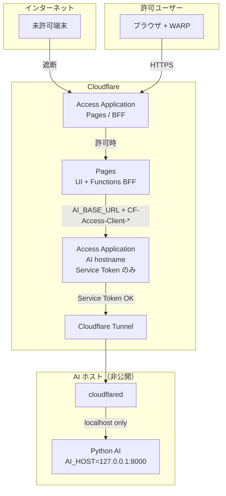

# Phase9-A: Access Infrastructure（Cloudflare Zero Trust）

**Status:** Prepared（IaC / 手順書。Cloudflare アカウントへの適用は管理者が実施）  
**仕様正本:** [`phase9-access-control.md`](./phase9-access-control.md)  
**範囲:** インフラのみ。Prediction / Analysis / Kaoba / Auth API・UI・契約は変更しない。  
**招待制 Auth:** 別 Phase（アプリ側は既存実装を維持。本 Phase では触らない）

---

## 1. Cloudflare 構成図



**要点**

| 経路 | 保護 |
|---|---|
| ユーザー → Pages/BFF | Access（メール / ドメイン + 推奨 WARP） |
| BFF → Python | Tunnel + Access Service Token +（推奨）`AI_API_KEY` |
| インターネット → Python:8000 | **LISTEN しない**（`127.0.0.1` のみ） |

> Pages Functions は顧客 WARP 私有 IP に直接届かないため、AI は **Tunnel hostname + Service Auth** で BFF 専用にする（設計書の「公開しない」を Pages 構成で実現する標準形）。

---

## 2. Tunnel 設定

| 項目 | 値 / 場所 |
|---|---|
| IaC | `infra/cloudflare/terraform/tunnel.tf` |
| コネクタ例 | `infra/cloudflare/cloudflared/config.example.yml` |
| systemd | `infra/cloudflare/cloudflared/systemd/cloudflared-expect-ai.service` |
| Origin | `http://127.0.0.1:8000`（可変: `ai_origin_service`） |
| Hostname | `ai_private_hostname`（例 `ai-staging.expect-internal.example.com`） |
| Catch-all | `http_status:404`（誤公開防止） |

### ホスト上の起動（管理者）

```bash
# Terraform apply 後
export TUNNEL_TOKEN="$(terraform -chdir=infra/cloudflare/terraform output -raw tunnel_token)"

# Python（loopback のみ）
export AI_HOST=127.0.0.1 AI_PORT=8000 AI_ALLOW_PUBLIC_BIND=0
python services/win5-ai/run.py

# 別プロセス
cloudflared tunnel run --token "$TUNNEL_TOKEN"
```

---

## 3. Access Policy

| アプリ | 対象 | Allow | Deny |
|---|---|---|---|
| Pages | `pages_hostnames` | 許可メール / メールドメイン（+ 手動で WARP Require） | everyone |
| AI | `ai_private_hostname` | **Service Token のみ**（non_identity） | everyone |

論理 JSON: `infra/cloudflare/policies/access-policy.example.json`  
Terraform: `infra/cloudflare/terraform/access.tf`

**WARP:** `require_warp` は Posture ルール ID がチーム依存のため、apply 後にダッシュボードで Pages ポリシーへ「Require → WARP」を追加する。

---

## 4. 必要な Secrets 一覧

| Secret | 設定場所 | 用途 |
|---|---|---|
| `CLOUDFLARE_API_TOKEN` | 管理者ローカル / CI（apply 時のみ） | Terraform |
| `TUNNEL_TOKEN` | AI ホスト `/etc/cloudflared/env` | cloudflared |
| `AI_BASE_URL` | Pages env（staging/production） | BFF→AI |
| `AI_API_KEY` | Pages + Python 環境 | `X-AI-Key` |
| `CF_ACCESS_CLIENT_ID` | Pages secret | Access Service Token |
| `CF_ACCESS_CLIENT_SECRET` | Pages secret | Access Service Token |
| （任意）DNS / Zone 編集権限 | 管理者 | `create_dns_for_ai_hostname=true` 時のみ |

Terraform 出力:

```bash
terraform -chdir=infra/cloudflare/terraform output -raw bff_access_client_id
terraform -chdir=infra/cloudflare/terraform output -raw bff_access_client_secret
terraform -chdir=infra/cloudflare/terraform output -raw tunnel_token
terraform -chdir=infra/cloudflare/terraform output ai_base_url_suggested
```

---

## 5. 環境変数一覧

| 変数 | development | staging | production |
|---|---|---|---|
| `EXPECT_ENV` | `development` | `staging` | `production` |
| `AI_BASE_URL` | `http://127.0.0.1:8000` | `https://ai-staging....` | `https://ai....` |
| `AI_API_KEY` | 空可 | 必須推奨 | 必須 |
| `CF_ACCESS_CLIENT_ID` | 空 | 必須 | 必須 |
| `CF_ACCESS_CLIENT_SECRET` | 空 | 必須 | 必須 |
| `AUTH_MODE` | stub | stub | stub |
| `KAOBA_PROVIDER` | auto | auto | auto |
| `AI_ENGINE` | mock/auto | real | real |
| `VALIDATE_CONTRACTS` | soft | soft | soft |
| `AI_HOST`（Python） | `127.0.0.1` | `127.0.0.1` | `127.0.0.1` |
| `AI_ALLOW_PUBLIC_BIND`（Python） | `0` | `0` | `0` |

テンプレート:

- `infra/cloudflare/env/development.env.example` → `.dev.vars`
- `infra/cloudflare/env/staging.env.example`
- `infra/cloudflare/env/production.env.example`

---

## 6. デプロイ手順（管理者）

### 6.1 事前

1. Cloudflare アカウントで Zero Trust を有効化  
2. API Token（Account / Access / Tunnel 編集権限）を用意  
3. β許可メールリストを確定  

### 6.2 Terraform

```bash
cd infra/cloudflare/terraform
cp terraform.tfvars.example terraform.tfvars
# account_id / pages_hostnames / allowed_emails / ai_private_hostname を編集

export CLOUDFLARE_API_TOKEN=...
terraform init
terraform plan
terraform apply   # 管理者が承認して実行
```

### 6.3 AI ホスト

1. Python 依存インストール  
2. `AI_HOST=127.0.0.1` `AI_ALLOW_PUBLIC_BIND=0` で起動  
3. `cloudflared tunnel run --token …`（または systemd ユニット）  
4. 外部から `AI_PORT` へ到達できないことを確認  

### 6.4 Pages

1. Git 連携デプロイ（既存）  
2. Staging / Production それぞれに Secrets を設定:

```bash
# 例（プロジェクト名は環境に合わせる）
echo -n "https://ai-staging...." | wrangler pages secret put AI_BASE_URL --project-name keiba-single-ai
echo -n "$AI_API_KEY" | wrangler pages secret put AI_API_KEY --project-name keiba-single-ai
echo -n "$CLIENT_ID" | wrangler pages secret put CF_ACCESS_CLIENT_ID --project-name keiba-single-ai
echo -n "$CLIENT_SECRET" | wrangler pages secret put CF_ACCESS_CLIENT_SECRET --project-name keiba-single-ai
```

3. Access で Pages ホストが Protect されていることを確認  
4.（推奨）Pages Allow ポリシーに WARP Require を追加  

### 6.5 DNS

- **既定:** AI hostname の公開 DNS レコードは作らない（`create_dns_for_ai_hostname=false`）  
- 独自ゾーンで CNAME する場合のみ Terraform で作成し、必ず Access を掛ける  

---

## 7. ローカル開発との差分

| 項目 | ローカル | staging / production |
|---|---|---|
| UI+BFF | `wrangler pages dev` / `npm run dev:ai` | Cloudflare Pages |
| Python | 同一マシン `127.0.0.1:8000` | Tunnel 背後のホスト |
| `AI_BASE_URL` | `http://127.0.0.1:8000` | `https://ai-…`（Access 保護） |
| Access（Pages） | なし | あり（未接続は到達不可） |
| Service Token | 不要 | 必須 |
| WARP | 不要 | 推奨必須 |
| アプリ API 契約 | 同一 | 同一 |

ローカルは従来どおり:

```bash
copy .dev.vars.example .dev.vars
python services/win5-ai/run.py
npm run dev:ai
```

---

## 8. 動作確認手順

### 8.1 Python 非公開

```bash
# AI ホスト上
ss -lntp | grep 8000
# 127.0.0.1:8000 のみであること

# 別ネットワークから
curl -m 5 http://<AIホストのパブリックIP>:8000/health
# → タイムアウト / 接続拒否
```

### 8.2 Tunnel

```bash
# AI ホスト
curl -sS http://127.0.0.1:8000/health
# → {"status":"ok"}

# cloudflared ログに ingress 接続があること
```

### 8.3 Access（Pages）

| 操作 | 期待 |
|---|---|
| WARP オフ + 未許可ブラウザで Pages URL | Access ブロック / ログイン要求（アプリに到達しない） |
| 許可ユーザー +（推奨）WARP オン | login / UI 表示 |

### 8.4 BFF → AI（Service Token）

```bash
# Service Token なし（ブラウザや外部から AI hostname 直）
curl -sS -o /dev/null -w "%{http_code}\n" https://ai-staging..../health
# → 302/403 等（Access）

# Pages 上の BFF 経由（アプリ操作）
# レース一覧・詳細が従来どおり表示（契約・UI 変更なし）
```

### 8.5 回帰（アプリ）

```bash
npm test
# 契約テスト PASS を維持
```

---

## アプリ側の最小変更（本 Phase）

| ファイル | 内容 | 挙動差分 |
|---|---|---|
| `functions/_lib/env.js` | `CF_ACCESS_*` / `EXPECT_ENV` 読み取り | 未設定時は従来どおり |
| `functions/_lib/aiProxy.js` | Service Token ヘッダ付与 | ID/Secret があるときのみ |
| `services/win5-ai/app/main.py` | `0.0.0.0` バインド拒否 | 既定 `127.0.0.1` は従来どおり |
| `wrangler.toml` / `.dev.vars.example` | 変数コメント整理 | 実行時無影響 |
| `infra/cloudflare/**` | IaC・手順 | 適用まで無影響 |

**変更していないもの:** PredictionBundle / Prediction・Analysis・Kaoba・Auth の HTTP 契約、UI。

---

## 成果物インデックス

| # | 成果物 | 場所 |
|---|---|---|
| 1 | Cloudflare構成図 | 本ドキュメント §1 |
| 2 | Tunnel設定 | §2 / `infra/cloudflare/terraform/tunnel.tf` / `cloudflared/` |
| 3 | Access Policy | §3 / `terraform/access.tf` / `policies/` |
| 4 | Secrets一覧 | §4 |
| 5 | 環境変数一覧 | §5 / `infra/cloudflare/env/` |
| 6 | デプロイ手順 | §6 |
| 7 | ローカル差分 | §7 |
| 8 | 動作確認手順 | §8 |
