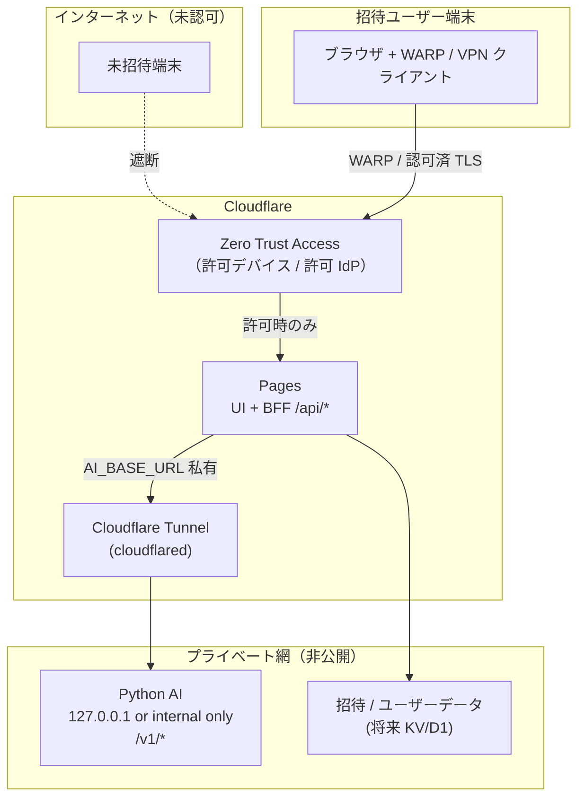
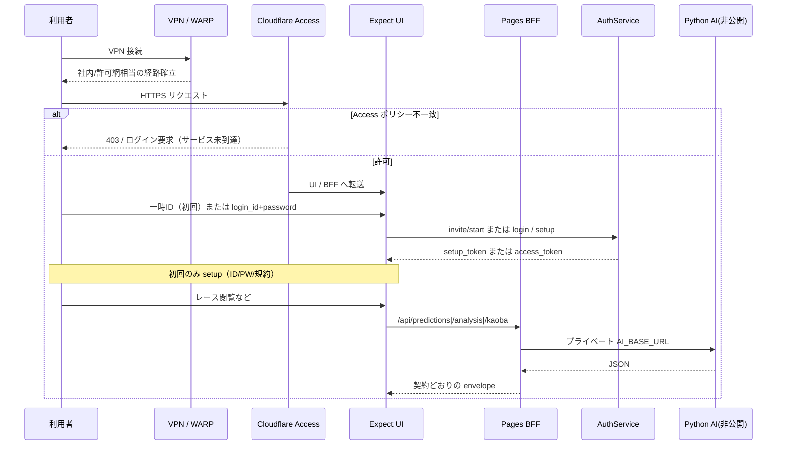

# Phase9: アクセス制御インフラ設計（VPN + 招待制β）

**Status:** Design  
**前提アプリ:** Expect / KEIBA-Single-AI（Cloudflare Pages UI+BFF + 非公開 Python AI）  
**既存実装:** [`phase9-invitation-auth.md`](./phase9-invitation-auth.md)  
**Phase9-A（IaC / 手順・管理者適用）:** [`phase9-a-access-infrastructure.md`](./phase9-a-access-infrastructure.md)

---

## 設計原則

| 層 | 役割 | 公開 |
|---|---|---|
| L0 ネットワーク | VPN / Zero Trust 配下のみ到達 | インターネット直公開しない |
| L1 エッジ認証 | VPN 接続（または Access ポリシー） | 未接続は UI / `/api/*` に届かない |
| L2 アプリ認証 | 招待制（一時ID → 初回設定 → 正式ログイン） | L1 通過後のみ |
| L3 内部サービス | Python AI（`AI_BASE_URL`） | **一切公開しない**（BFF からのみ） |

```
利用者端末
  → (1) VPN / WARP 接続
  → (2) Expect UI + BFF（Cloudflare Pages）
  → (3) 招待制ログイン / 初回設定
  → (4) BFF がプライベート経路で Python AI を呼ぶ
```

Prediction / Analysis / Kaoba の **API 契約・パスは変更しない**。到達可能性だけをインフラで制限する。

---

## 1. ネットワーク構成図

### 1.1 推奨構成（Cloudflare Zero Trust + Tunnel）



### 1.2 到達可否マトリクス

| 対象 | VPN 外 | VPN 内・未ログイン | VPN 内・ログイン済 |
|---|---|---|---|
| `login.html` / `setup.html` | ✗ | ✓ | ✓（リダイレクト可） |
| UI（ホーム等） | ✗ | ✗（アプリ Auth） | ✓ |
| `POST /api/auth/*` | ✗ | ✓（invite/login/setup） | ✓ |
| `GET /api/predictions*` | ✗ | △（現状 Bearer 任意※） | ✓ |
| `GET /api/analysis*` | ✗ | △※ | ✓ |
| `POST /api/kaoba/chat` | ✗ | △※ | ✓ |
| Python `/v1/*` 直接 | ✗ | ✗ | ✗（BFF のみ） |

※ L1（VPN）で既に API ごと遮断するため、VPN 外からの直接アクセスは不可。  
アプリ層で Prediction 等を「要ログイン」に締めるかは任意強化（§5）。

### 1.3 トラフィックの流れ（要約）

1. ユーザーが VPN（WARP 等）に接続  
2. ブラウザで `https://<pages-host>/login` を開く（Access 通過）  
3. 一時ID → 初回設定、または正式ログイン（アプリ Auth）  
4. UI が同オリジン `/api/predictions` 等を呼ぶ（BFF）  
5. BFF が **非公開** `AI_BASE_URL`（Tunnel 先の Python）へプロキシ  
6. ブラウザから Python オリジンへは DNS/FW 上到達不能

---

## 2. 認証シーケンス図（VPN + 招待制）



**二段構え**

| 段 | 何を証明するか | 失敗時 |
|---|---|---|
| VPN / Access | 「許可された端末・人のネットワーク到達」 | サービス自体が見えない |
| 招待制 Auth | 「発行された一時ID→正式アカウント」 | login / setup で拒否 |

---

## 3. VPN 候補と採用理由

### 比較表

| 候補 | 形態 | β人数向き | Pages との相性 | Python 非公開化 | 運用負荷 | 採用評価 |
|---|---|---|---|---|---|---|
| **A. Cloudflare Zero Trust（Access + WARP + Tunnel）** | SaaS ZTNA | 〜数十人 Free 枠あり | **最高**（同一ベンダー） | Tunnel で Origin 非公開 | 低 | **推奨・第一候補** |
| **B. Tailscale** | WireGuard mesh SaaS | 小〜中 | 高（Pages は Access 相当を別途 or 私有ホスト） | subnet router / exit で隔離 | 低〜中 | 有力な第二候補 |
| **C. NetBird（self-host 可）** | WireGuard overlay | 小〜中 | 中 | ACL で AI ホストのみ | 中 | 自前運用したい場合 |
| **D. 自前 WireGuard + 私有 VPS** | 古典 VPN | 小 | 低（Pages 公開点の封鎖が別途必要） | FW で閉じやすい | 高 | 非推奨（β短期） |
| **E. 企業既存 VPN（AnyConnect 等）** | 既存基盤 | 既存契約次第 | 中（私有 DNS / プロキシ） | 社内セグメント配置 | 既存依存 | 既に VPN がある組織向け |

### 推奨: **A. Cloudflare Zero Trust（第一採用）**

**理由**

1. 既に **Cloudflare Pages** で UI+BFF をホストしており、**同一平面で Access ポリシーを掛けられる**  
2. **WARP** で「VPN 配下のみ」をユーザー体験として満たしやすい  
3. **Cloudflare Tunnel** で Python AI を **パブリック IP なし**で BFF からのみ接続可能（要件「Python AI は公開しない」に直結）  
4. Free プランでも小規模β（目安 50 ユーザー前後）を試せる  
5. Prediction / Analysis / Kaoba の **アプリ契約を変えずに**「到達制御」だけ追加できる  

**構成イメージ**

- Pages プロジェクトに Access Application（Allow: 招待メール / WARP 加入デバイス / One-time PIN 等）  
- Python は VPS / 自宅 / クラウド private に配置し `cloudflared` で Tunnel  
- Pages の `AI_BASE_URL` = Tunnel の **プライベートホスト名**（インターネット DNS に出さない）  
- WARP 未接続端末からは Pages 自体が 403  

### 第二候補: **B. Tailscale**

**理由:** 導入が極めて簡単、ACL で「クライアント → Pages 相当ホスト」と「BFF 相当 → AI」を分けやすい。  
**注意:** Pages の `*.pages.dev` を「VPN のみ」にするには、**(1) 独自ドメインを私有オリジンに載せる**か **(2) Cloudflare Access と併用**が必要。Tailscale 単体では「公開 Pages URL を全世界から隠す」ことはできない。

→ **Pages を使い続けるなら A が自然。** 全体を私有 VPS に移すなら B/C も有力。

### 第三候補: **C. NetBird**

自前コントロールプレーンを持ちたい場合。WireGuard + ポリシー。運用（IdP・証明書・アップデート）は A/B より重い。

### 非推奨（β短期）: **D. 素の WireGuard のみ**

Pages 公開面の封鎖とユーザーオンボードが別問題として残り、要件を満たしにくい。

---

## 4. インフラ変更点

### 4.1 必須（推奨構成 A）

| # | 変更 | 内容 |
|---|---|---|
| I1 | Cloudflare Zero Trust 有効化 | チーム作成、WARP デバイス登録ポリシー |
| I2 | Access Application | `keiba-single-ai.pages.dev`（または独自ドメイン）を Protect。Allow ルールでβメンバーのみ |
| I3 | Python 公開停止 | 8000/tcp 等をインターネットへ LISTEN しない。ローカル or private NIC のみ |
| I4 | Cloudflare Tunnel | `cloudflared` で Python を Tunnel 公開（**Public hostname を付けない** / Private Network 経由） |
| I5 | Pages 環境変数 | `AI_BASE_URL` = Tunnel 経由の内部 URL。`AI_API_KEY` を設定し BFF→AI を鍵付きに |
| I6 | DNS | 独自ドメイン利用時は Access 対象に含める。Python 用ホストは公開 DNS に出さない |
| I7 | 運用 | 招待ユーザーの WARP 登録手順書、一時ID 配布手順（既存 `invitations.json`） |

### 4.2 やってはいけないこと

| NG | 理由 |
|---|---|
| Python を `0.0.0.0:8000` でインターネット公開 | 要件違反。契約以前に推論基盤が露出 |
| `AI_BASE_URL` をブラウザへ露出 | 現状 FE は同オリジン `/api` のみ（維持） |
| Access なしで Pages を全世界公開したまま「招待制だけ」 | VPN 外から `/api/predictions` 等へ到達可能（現状 BFF はゲストでも一部 API 可） |

### 4.3 将来拡張（任意）

| 項目 | 内容 |
|---|---|
| Cloudflare KV / D1 | 招待・ユーザーの永続化（現状 Isolate メモリ + JSON seed） |
| Access Service Token | CI や管理バッチのみ API 到達 |
| WAF / Rate limit | ログイン・invite/start の濫用対策 |
| 監査ログ | Access ログ + Auth ログイン成功/失敗 |

---

## 5. アプリ側で必要な変更点

### 5.1 今すぐ必須ではない（インフラで満たせる）

| 項目 | 判断 |
|---|---|
| Prediction / Analysis / Kaoba 契約変更 | **不要・禁止どおり触らない** |
| BFF パス変更 | **不要** |
| FE の API ベース URL | **不要**（同オリジン維持） |
| 招待制 Auth | **実装済**（Phase9） |

VPN + Access で「サービス到達」を止めれば、要件の大半はインフラで達成できる。

### 5.2 推奨するアプリ側強化（任意・段階導入）

| # | 変更 | 目的 |
|---|---|---|
| A1 | BFF で `AI_API_KEY` を必須化（未設定時は Python へ繋がない） | Tunnel 漏洩時の第二鍵 |
| A2 | Prediction / Analysis / Kaoba を **access Bearer 必須**に変更 | VPN 内の「未ログイン API 叩き」を防止（契約 envelope は維持、401 を返すだけ） |
| A3 | Access 注入ヘッダ検証（例 `Cf-Access-Jwt-Assertion`）を BFF middleware で任意チェック | WARP 迂回の防御深化（Pages が Access 背後のとき） |
| A4 | 招待・ユーザー永続化を KV/D1 へ | 複数 Isolate / 再デプロイ耐性 |
| A5 | 運用ドキュメントに「VPN 未接続時の期待画面（Access 403）」を追記 | サポート負荷低減 |

**A2 はプロダクト判断:**  
現状 `requireAuth`（BFF）は Bearer 無しを通す。VPN 外遮断ができていれば必須ではないが、**VPN 内の共有端末**対策としては有効。実施する場合も **レスポンス schema は変えず 401 のみ**にする。

### 5.3 明示的に変更しないもの

- PredictionBundle / Analysis / Kaoba の JSON 契約  
- `/api/predictions` `/api/analysis` `/api/kaoba` のパス  
- ブラウザから Python を直接呼ぶ導線（作らない）

---

## 6. 導入チェックリスト（β公開前）

- [ ] Zero Trust チーム作成・WARP 配布手順  
- [ ] Pages に Access 適用（未接続で 403 を確認）  
- [ ] Python のパブリックポート閉鎖を確認（`curl` 外部から不通）  
- [ ] Tunnel 経由でのみ BFF→`/v1/predictions` が通ることを確認  
- [ ] 招待一時ID → setup → 正式ログインの E2E（VPN 上）  
- [ ] VPN 切断後に UI / `/api/*` が到達不能であることを確認  

---

## 7. 成果物対応表

| # | 成果物 | 本ドキュメント内 |
|---|---|---|
| 1 | ネットワーク構成図 | §1 |
| 2 | 認証シーケンス図 | §2 |
| 3 | VPN 候補と採用理由 | §3（推奨: Cloudflare Zero Trust） |
| 4 | インフラ変更点 | §4 |
| 5 | アプリ側変更点 | §5（必須なし、推奨 A1–A5） |

関連: アプリ認証の詳細は [`phase9-invitation-auth.md`](./phase9-invitation-auth.md)。
