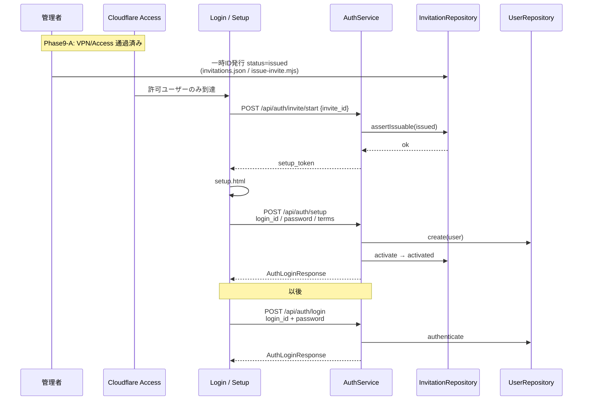
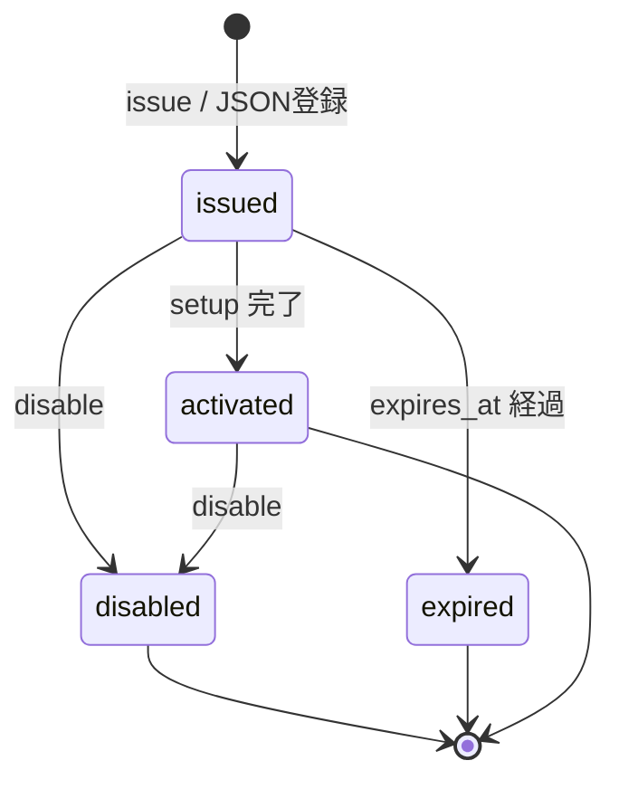

# Phase9-B: Invitation Authentication

**Status:** Implemented  
**前提:** Phase9-A（Access Infrastructure）完了 — 本認証は **Cloudflare Access の内側** で動作するアプリ層  
**仕様スコープ:** AuthService / Invitation / User / 初回設定のみ  
**禁止遵守:** Prediction・Analysis・Kaoba API / Bundle / Cloudflare IaC / UI 大幅変更なし

関連:

- Access: [`phase9-a-access-infrastructure.md`](./phase9-a-access-infrastructure.md)
- 設計（VPN）: [`phase9-access-control.md`](./phase9-access-control.md)

---

## 1. 認証シーケンス図



---

## 2. Invitation データモデル

**永続 seed:** `public/data/invitations.json`  
**契約:** `contracts/expect-auth/1.0` → `$defs.InvitationRecord`

| フィールド | 型 | 説明 |
|---|---|---|
| `invite_id` | string | 一時ID（正規化: 大文字） |
| `status` | enum | `issued` \| `activated` \| `disabled` \| `expired` |
| `issued_at` | string\|null | 発行日時 |
| `expires_at` | string\|null | 期限（到来時は issued を expired 扱い） |
| `activated_at` | string\|null | 利用開始 |
| `activated_user_id` | string\|null | 紐づく login_id |
| `note` | string\|null | 管理者メモ |

**Repository API** (`functions/_lib/invitationRepository.js`)

| メソッド | 説明 |
|---|---|
| `issue` | 管理者発行（runtime） |
| `assertIssuable` | 初回利用可否 |
| `activate` | issued → activated |
| `disable` | issued/activated → disabled |
| `get` / `list` | 参照 |

**管理者 CLI（UI なし）:** `npm run beta -- issue BETA-XXXX-YYYY`（互換: `issue-invite.mjs`）

---

## 3. User データモデル

**Seed:** `public/data/users.json`  
**契約:** `$defs.UserRecord`

| フィールド | 型 | 説明 |
|---|---|---|
| `user_id` | string | ログインID |
| `password_hash` | string | `sha256$salt$hex` |
| `display_name` | string\|null | 表示名 |
| `invite_id` | string\|null | 元一時ID |
| `status` | `active`\|`disabled` | アカウント状態 |
| `created_at` | string\|null | 作成日時 |
| `terms_version` | string\|null | 規約版 |
| `terms_accepted_at` | string\|null | 同意日時 |

**Repository:** `functions/_lib/userRepository.js` — `create` / `authenticate` / `get`

デモ seed は Phase12 で除去済み。アカウントは招待 → setup、または運営 CLI で発行。
（平文パスワードをドキュメントに記載しない）

---

## 4. 状態遷移図



---

## 5. 変更ファイル一覧（Phase9-B）

| ファイル | 役割 |
|---|---|
| `functions/_lib/invitationRepository.js` | 状態管理（issue/disable/list 追加） |
| `functions/_lib/userRepository.js` | 正式ユーザー |
| `functions/_lib/password.js` | ハッシュ |
| `functions/_lib/auth.js` | setup/access purpose・public paths |
| `functions/api/auth/invite/start.js` | 一時ID開始 |
| `functions/api/auth/setup.js` | 初回設定 |
| `functions/api/auth/login.js` | 正式ログイン |
| `functions/api/auth/me.js` | プロフィール |
| `public/data/invitations.json` | 招待 seed |
| `public/data/users.json` | ユーザー seed |
| `public/setup.html` | 初回設定画面 |
| `public/login.html` | 一時ID / ログイン（既存・軽微） |
| `public/assets/auth.js` / `api/auth.js` | クライアント |
| `contracts/expect-auth/1.0/*` | Invite/User defs |
| `scripts/issue-invite.mjs` | 管理者発行 CLI |
| `tests/contract/invitation-auth.test.mjs` | 契約テスト |
| `tests/contract/invitation-state.test.mjs` | 状態機械テスト |
| `docs/phase9-b-invitation-auth.md` | 本成果物 |

**未変更:** Prediction/Analysis/Kaoba、`infra/cloudflare/**`

---

## 6. テスト結果

### 契約 + 状態機械

```text
npm test
→ 55/55 PASS（invitation-auth + invitation-state 含む）
```

ライブ: `POST /api/auth/login`（運営発行のログインID）→ **200**
（Phase12: デモ資格情報は seed / docs から除去）

### 手動確認パス

1. Access 内側で `login.html`（一時IDタブ）  
2. 運営が `npm run beta -- issue` した一時ID → setup → ホーム  
3. 以降 `login_id` + password  
4. 利用済み一時IDは 409 `INVITE_ALREADY_USED`  

---

## API（Auth のみ拡張）

| Method | Path | 説明 |
|---|---|---|
| POST | `/api/auth/invite/start` | 一時ID → setup_token |
| POST | `/api/auth/setup` | 初回設定 → access_token |
| POST | `/api/auth/login` | 正式ログイン |
| GET | `/api/auth/me` | セッション確認 |
