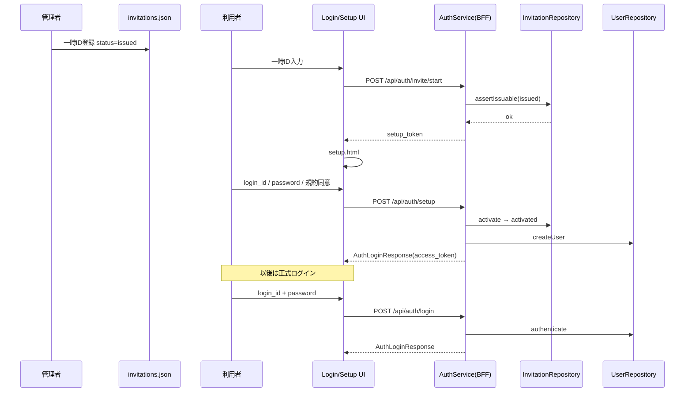
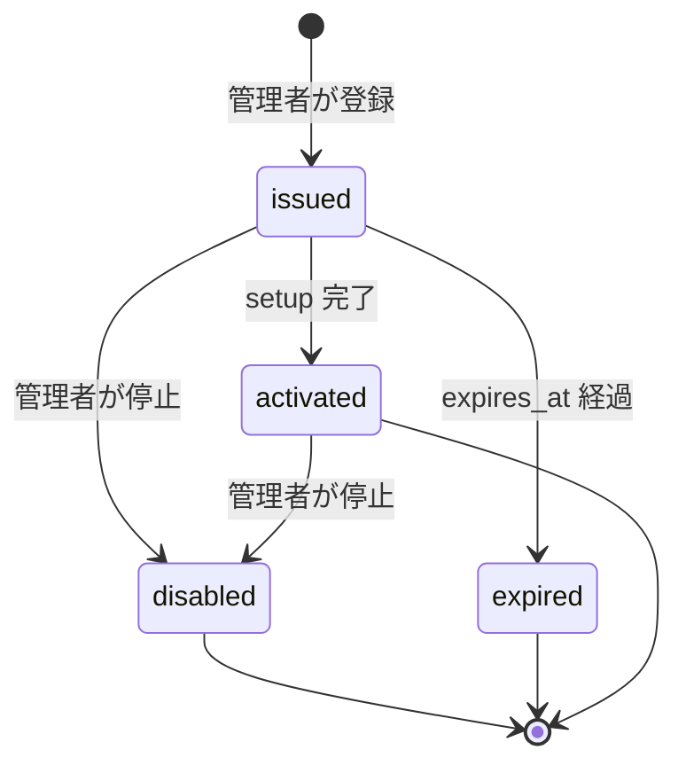

# Phase9: 招待制β認証（Invitation Beta Authentication）

**Status:** Implemented  
**Scope:** AuthService 拡張のみ。Prediction / Analysis / Kaoba / それらの BFF 契約は未変更。

**アクセス制御（VPN / Zero Trust）設計:** [`phase9-access-control.md`](./phase9-access-control.md)  
**Phase9-B 成果物（現行）:** [`phase9-b-invitation-auth.md`](./phase9-b-invitation-auth.md)

---

## 1. 認証シーケンス図

---

## 2. Invitation データ構造

**ファイル:** `public/data/invitations.json`（管理者が編集してデプロイ）

| フィールド | 型 | 説明 |
|---|---|---|
| `invite_id` | string | 一時ID（例 `BETA-XXXX-YYYY`。本番は CLI 発行） |
| `status` | enum | `issued` / `activated` / `disabled` / `expired` |
| `issued_at` | string\|null | 発行日時 |
| `expires_at` | string\|null | 期限（将来用。到来時は issued→expired 扱い） |
| `activated_at` | string\|null | 利用開始日時 |
| `activated_user_id` | string\|null | 紐づいた login_id |
| `note` | string\|null | 管理者メモ |

契約 `$defs.InvitationRecord`（`expect-auth/1.0`）

実行時の `activated` 更新は Isolate メモリ・オーバーレイ（将来 KV/D1 差し替え可）。

---

## 3. User データ構造

**ファイル:** `public/data/users.json`（seed）+ setup 時メモリ作成

| フィールド | 型 | 説明 |
|---|---|---|
| `user_id` | string | ログインID |
| `password_hash` | string | `sha256$<salt>$<hex>` |
| `display_name` | string\|null | 表示名 |
| `invite_id` | string\|null | 元一時ID |
| `status` | enum | `active` / `disabled` |
| `created_at` | string\|null | 作成日時 |
| `terms_version` | string\|null | 同意した規約版 |
| `terms_accepted_at` | string\|null | 同意日時 |

契約 `$defs.UserRecord`

ユーザー作成は招待フローのみ。平文デモパスワードは記載しない（Phase12）。

---

## 4. 状態遷移図

---

## 5. 変更ファイル一覧

| ファイル | 内容 |
|---|---|
| `public/data/invitations.json` | 招待データ（新規） |
| `public/data/users.json` | ユーザー seed（新規） |
| `functions/_lib/invitationRepository.js` | InvitationRepository（新規） |
| `functions/_lib/userRepository.js` | UserRepository（新規） |
| `functions/_lib/password.js` | ハッシュ（新規） |
| `functions/_lib/auth.js` | purpose 付きトークン / public paths |
| `functions/api/auth/login.js` | 正式ログインのみ |
| `functions/api/auth/invite/start.js` | 一時ID開始（新規） |
| `functions/api/auth/setup.js` | 初回設定（新規） |
| `functions/api/auth/me.js` | UserRepository 連携 |
| `functions/api/auth/favorites.js` | access purpose 検証 |
| `public/login.html` | ログイン / 一時IDタブ |
| `public/setup.html` | 初回設定画面（新規） |
| `public/assets/auth.js` | strict 既定・invite/setup |
| `public/assets/api/auth.js` | inviteStart / setup |
| `public/assets/login.css` | タブ / setup スタイル |
| `contracts/expect-auth/1.0/*` | Invite/User defs 追加 |
| `fixtures/auth/*` | 追加 fixtures |
| `tests/contract/invitation-auth.test.mjs` | 契約テスト |
| `docs/phase9-invitation-auth.md` | 本ドキュメント |
| `docs/auth-service.md` | 更新 |

**未変更:** PredictionBundle / Prediction・Analysis・Kaoba API 契約

---

## 6. 初回設定画面

`public/setup.html` — ログインID / パスワード / 確認 / 規約同意 → `POST /api/auth/setup`

## 7. ログイン画面変更

`public/login.html` — タブ「ログイン」「一時ID（初回）」。オープン登録・任意IDログインを廃止。

## 8. API

| Method | Path | 認証 | 説明 |
|---|---|---|---|
| POST | `/api/auth/invite/start` | 不要 | 一時ID → setup_token |
| POST | `/api/auth/setup` | setup_token | 正式アカウント作成 |
| POST | `/api/auth/login` | 不要 | login_id + password |
| GET | `/api/auth/me` | access Bearer | 従来どおり |

フロントは `ExpectAuth.requireAuth()` 既定でログイン必須（招待制β）。

---

## 9. テスト結果（2026-07-20）

### 契約 / スナップショット

`npm test` → **50/50 PASS**（Phase9 invitation-auth 契約テスト含む）

### ライブ API（`http://127.0.0.1:8788`）

| ケース | HTTP | 結果 |
|---|---|---|
| 運営発行ログインID + パスワード | 200 | PASS（seed にデモなし） |
| 運営発行一時ID の invite/start | 200 | PASS（`next=setup`） |
| setup → 正式アカウント作成 | 200 | PASS |
| 同一一時ID 再 start | 409 | PASS（`INVITE_ALREADY_USED`） |
| 新規 login_id + password | 200 | PASS |
| 誤パスワード | 401 | PASS（`INVALID_CREDENTIALS`） |

本番 seed: `public/data/users.json` / `invitations.json` は空配列（Phase12）。一時IDは CLI 発行。
