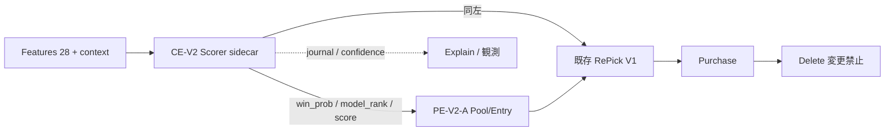

# CE-V2 — Candidate Evaluation 設計書（Version 2.2）

**Date:** 2026-07-22  
**Status:** **設計レビュー（実装禁止）**  
**Initiative:** Version 2 Accuracy / Layer3  
**Control ロック:** **PE-V2-A 正式採用** = Hit **218** / Purchase 187 / Winner in Pool 274/285  
**前提:** RP-V2 系は主要改善候補から除外。本設計は CE のみ。

| 提出物（本文書内） | § |
|--------------------|---|
| CE-V2 設計書（責務・ファセット・対象レース） | §1–§3 |
| 入力／出力仕様 | §4 |
| AB 評価計画 | §5 |
| Feature Flag 設計 | §6 |

**関連:**

| 文書 | パス |
|------|------|
| Accuracy V2.2 改訂 | `docs/releases/v2-accuracy-design-review.md` |
| V2.2 Roadmap | `docs/releases/v2-accuracy-v2.2-roadmap.md` |
| G1 層分類 | `compare/v2_accuracy_g1_layer_classification.csv` |
| G1 FAIL 観測 | `docs/ops/v2-rp-v2-a-g1-fail-observation.md` |
| Core Scorer（現行） | `services/win5-ai/platform/core-overlay/ai_platform/core/scoring/` |

---

## 0. 目的とスコープ

### 0.1 目的

Control **Hit=218** を維持したまま、G1 分類のうち次を **Candidate Evaluation（CE）で改善できる余地**を設計として固定する。

| primary_class | n | race_id（勝者） |
|---------------|--:|-----------------|
| **Evaluation不足** | 2 | `2024-01-21-京都-11`（ウィリアムバローズ） / `2024-02-18-京都-11`（スズカコテキタイ） |
| **RePick境界不足** | 4 | `2025-12-14-中京-11` / `2026-03-15-中山-11` / `2026-04-19-中山-10` / `2026-04-25-京都-10` |

**対象外（本 CE 設計の主ターゲットではない）:**

| class | n | 理由 |
|-------|--:|------|
| RePick並べ替え不足 | 4 | surv≤N なのに selected 外 → Layer2 並べ替え（将来 RO）。CE は間接のみ |
| 既得Hit | 1 | 追加改善不要 |
| Pool不足 | 0 | G1 は全件 in_pool（PE ロック済） |

### 0.2 非スコープ（明示）

- コード実装・AB 実行（本フェーズ禁止）
- RP-V2 の再設計・再 AB
- PE-V2-A の変更（ロック）
- Delete / Prediction API / PI / Catalog / Web
- 再学習・新 Feature Contract・F01 再開

---

## 1. CE の責務

### 1.1 何を評価する層か

CE はパイプライン最上流の **候補スコアリング層**である。

```text
Features(28) → [CE: score / win_prob / model_rank / confidence]
                    ↓
              PE (Pool/Entry) ← 入力として利用
                    ↓
              RePick (選定・並べ替え) ← 入力として利用
                    ↓
              Purchase / Delete（変更禁止）
```

| 評価する対象 | 内容 |
|--------------|------|
| **相対強度** | レース内の `adjusted_model_score` → `win_prob` / `model_rank` |
| **較正** | Softmax 温度・近傍ギャップに対する確率の鋭さ／平たさ |
| **帯別バイアス（CE-V2-C）** | mid（rank7–10）候補の生存寄与に効くスコア再重み（匿名・帯条件のみ） |
| **信頼度投影** | `confidence`（Explain / UI 用。Hit Hard Gate の主因にはしない） |

**CE が「良くなる」とは:** 下流が読む **順位・確率・生存入力**が、Evaluation不足／境界不足の勝者を選ばれやすい方向へ動くこと。Pool サイズや RePick トリガ自体は変えない。

### 1.2 何を評価しない層か

| 非責務 | 理由 |
|--------|------|
| Candidate Pool の入場可否・枠数 | Layer1（PE）。PE-V2-A ロック |
| RePick の selected 入替トリガ（NEAR 等） | Layer2。RP-V2 除外済 |
| Delete / multi / db_rescued | 変更禁止 |
| 勝者名・G1 allowlist 参照 | 匿名性。リーク禁止 |
| 新特徴の追加・再学習 | Learning / Feature 別トラック |
| 説明文の生成ロジック本体 | Explainability（CE 出力を読む側） |

### 1.3 責務境界の一文

> **CE-V2 は「誰を場に入れるか／誰を枠に入れるか」を決めない。場に並んだ候補のスコアと確率の品質だけを、Flag 付きで較正・再重みする。**

---

## 2. 対象レースと改善余地

### 2.1 Evaluation不足（2）— CE 一次責務

| race_id | winner | model_rank | surv_pos | N | 観測 |
|---------|--------|----------:|---------:|--:|------|
| 2024-01-21-京都-11 | ウィリアムバローズ | 7 | **11** | 7 | Pool 内・surv≪境界外。NEAR 不可 |
| 2024-02-18-京都-11 | スズカコテキタイ | 10 | **13** | 7 | 同上・さらに遠位 |

**CE で効きうる経路:**

1. mid 帯の `adjusted_score` / 生存寄与を上げ、`surv_pos` を N 近傍へ引き寄せる（**CE-V2-C 主**）
2. Softmax 温度で確率分布を変え、下流 survival の tie-break / 重みに波及（**CE-V2-A 副**）

**限界:** surv を N 以内に戻せないと Hit に届かない。CE は「入力を動かす」だけで、選定アルゴリズムは触らない。

### 2.2 RePick境界不足（4）— CE 二次〜条件付き一次

| race_id | winner | model_rank | surv_pos | N | 観測 |
|---------|--------|----------:|---------:|--:|------|
| 2025-12-14-中京-11 | モズナナスター | 8 | **9 (=N+2)** | 7 | 境界直近。deep victim 不足は RP 側問題 |
| 2026-03-15-中山-11 | アウダーシア | 10 | **9** | 7 | 同上 |
| 2026-04-19-中山-10 | ナムラフランク | 8 | **9** | 7 | 境界 + mid 飽和 |
| 2026-04-25-京都-10 | マイノワール | 7 | **9** | 7 | 境界直近 |

**CE で効きうる経路:**

1. surv を **N 以下**へ押し込めれば、RP なしでも selected 入りうる（生存上位選定に乗る）
2. surv を N+1 に寄せるだけでは、現行 RePick（RP OFF）では **自動 Rescue されない**（境界置換は RP の仕事だったが除外済）

**設計上の期待値の置き方:**

| 経路 | 期待 |
|------|------|
| surv ≤ N へ改善 → 既存 RePick 選定に自然入場 | **境界 4 の本命（CE→Hit）** |
| surv が N+1/N+2 のまま | Hit 改善は弱い（RP なし）。観測メトリクスのみ |

### 2.3 改善余地の整理（設計仮説・未検証）

| ファセット | Evaluation不足 (2) | 境界不足 (4) | 全体 Hit 仮説 |
|------------|:------------------:|:------------:|---------------|
| CE-V2-A 温度 | 間接・小 | 間接・小 | 218→**219〜220** |
| CE-V2-B near-cut | 主対象外 | 主対象外 | other_1_3 向け |
| CE-V2-C mid 再重み | **主** | **主（surv≤N 化）** | 218→**219〜222** |

Hard Gate は常に **Hit > 218**。仮説は AB で棄却してよい。

---

## 3. ファセット設計（実装しない・仕様のみ）

### 3.1 CE-V2-A — Softmax 温度較正

| 項目 | 仕様 |
|------|------|
| 狙い | 既存 `CORE_SOFTMAX_TEMP_*` 相当を **Flag 配下の sidecar 定数**に閉じ、レース場サイズ依存温度を AB |
| トリガ | Flag ON の全レース（匿名・全域） |
| アクチュエータ | `win_prob` 算出時の temperature のみ変更。`base_model_score` は不変 |
| パラメータ（設計レンジ） | `temp_base ∈ [0.85, 1.15]`、`temp_slope ∈ [0.02, 0.06]`（AB は **単一点**固定） |
| 上限 | 1 レース 1 温度。モデル差し替えなし |
| リスク | 低。OFF=現行恒等 |

**初回 AB 推奨順:** 低リスクのため **CE-V2-A を最初の単独 AB** とする（効果は小さい可能性あり）。

### 3.2 CE-V2-B — Near-cut score lift

| 項目 | 仕様 |
|------|------|
| 狙い | `model_rank ∈ {2,3}` かつ top1 ギャップ < ε のとき relative score +δ |
| 主対象 | other_1_3 残。**本 G1 6 件の主ターゲットではない** |
| パラメータ | ε・δ は設計固定 1 組（例 δ≤0.03） |
| V2.2 位置 | CE-V2-A PASS/FAIL 後の任意第 2 AB |

### 3.3 CE-V2-C — Mid-band 生存寄与再重み（本ターゲット本命）

| 項目 | 仕様 |
|------|------|
| 狙い | **rank∈[7,10]** の候補に対し、下流 survival が参照するスコア成分を匿名で +γ（または win_prob 再配分） |
| トリガ（匿名） | Flag ON ∧ `model_rank ∈ [7,10]`（勝者参照なし・G1 リスト参照なし） |
| アクチュエータ（案・いずれか 1 を AB） | **C1:** `adjusted_model_score` に帯別 additive lift → 再 softmax  
|  | **C2:** `_world_survival_score` 合成前の CE 寄与項に mid bonus（Product 側 hook が必要な場合は設計レビューで明示） |
| 推奨アクチュエータ | **C1（Core Scorer 内完結）** — PE/RP コードを触らない |
| パラメータ | γ 単一点（例: score 相対 +1〜3% 相当）。race 内 mid 全員に同一規則 |
| 上限 | mid 帯のみ。rank≤6 / ≥11 は無変更。N・Pool サイズ不変 |
| 非目標 | RePick displace、Pool +1、Delete 緩和 |

**匿名性:** 帯と既存スコアのみ。レース allowlist / 結果ラベル禁止。

### 3.4 ファセット優先順

```text
1) CE-V2-A（単独 AB）— 安全確認・温度感度
2) CE-V2-C（単独 AB）— Evaluation不足 + 境界不足の本命
3) CE-V2-B（任意）— 浅位残
```

**禁止:** A+C 同時 ON の合成 AB。各 Flag は 1 機能ずつ。

---

## 4. 入力／出力仕様

### 4.1 入力

#### 4.1.1 既存入力（必須・追加不要が原則）

| 入力 | 來源 | CE での利用 |
|------|------|-------------|
| **既存 Feature（28）** | FeatureLoader | `base_model_score` |
| **Candidate 情報** | horse_id / name / gate 等 | 行紐付けのみ |
| **World / Route / 文脈列** | `attach_probability_context_columns` 等 | grade-distance-style adjustment（現行） |
| **PE 出力** | Candidate Pool 後の馬集合 | **CE は PE より上流のため入力にしない**（PE は CE 出力を消費） |

補足: Accuracy パイプライン観測上「PE 出力」は下流。CE 設計上の入力は **Feature + レース文脈**である。

#### 4.1.2 追加で必要な情報はあるか

| 候補 | 要否 | 判断 |
|------|------|------|
| G1 レースリスト | **不要（禁止）** | 評価母集団のみ。トリガに使わない |
| 勝者・着順 | **不要（禁止）** | リーク |
| RP journal / mid_cap | **不要** | RP 除外。CE は独立 |
| オッズ・新 Market Feature | **不要** | F01 Archive。本 CE 範囲外 |
| World/Route の新規フィールド | **不要（V2.2-A/C）** | 既存文脈列で足りる |
| `model_rank`（現行 CE 循環） | **CE-V2-C のみ条件に使用** | 同一 Scorer パス内の暫定 rank、または adjusted_score 分位で代替可 |

**結論:** CE-V2-A/B/C いずれも **既存 Feature + 既存文脈 +（C のみ）同一推論内の rank/分位**で足りる。  
**外部の新規データソースは不要。**

### 4.2 出力

CE-V2 の出力は次の 3 種に整理する。Hit に効くのは主に (1)。

| # | 出力種別 | フィールド（例） | Hit への効き | 説明 |
|---|----------|------------------|--------------|------|
| **1** | **順位・確率変更** | `adjusted_model_score`, `win_prob`, `model_rank` | **主** | 下流 PE/RePick/Purchase の入力が変わる |
| **2** | **Confidence 変更** | `confidence` / temperature 投影 | 副（直接 Hit しない） | Explain / UI。較正指標の監視用 |
| **3** | **説明情報** | `_ce_v2_journal`, `decision_key` 用 meta | なし（観測） | Flag・facet・γ/temp・対象頭数 |

#### 4.2.1 出力契約（Flag ON 時）

```text
必須:
  win_prob[horse]
  model_rank[horse]
  adjusted_model_score[horse]   # A/C で変化しうる
  _ce_v2_journal = {
    enabled, facet, fired,
    temp_base?, temp_slope?,
    mid_lift_gamma?, mid_touched_n,
    reason
  }

不変（CE は触らない）:
  pool_size / repick_n 決定ロジック
  Delete 閾値
  28 Feature 定義
```

#### 4.2.2 Flag OFF 時

```text
ALL CE FLAGS OFF ≡ 現行 Scorer（PE-V2-A ロック環境下の CE 出力）とビット一致
```

### 4.3 入出力データフロー



---

## 5. AB 評価計画

### 5.1 アーム定義

| Arm | Flag | 期待 |
|-----|------|------|
| **Control** | PE-V2-A **ON** / RP **OFF** / CE **OFF** | Hit **= 218** ロック |
| **Treatment** | PE-V2-A **ON** / RP **OFF** / **CE-V2 対象 Flag のみ ON** | Hit **> 218** なら PASS |

### 5.2 コーパスと手順

| 項目 | 値 |
|------|-----|
| Corpus | **285R**（labeled_test / Phase255 系） |
| 順序 | Control 再現 → Treatment |
| 単一 Flag | A / B / C を **別実験** |
| 実験 ID 例 | `v2-ce-v2-a-285r-ab` / `v2-ce-v2-c-285r-ab` |

### 5.3 Hard Gate（採用条件）

```text
IF Treatment.Hit > 218:
    STATUS = PASS（採用候補）
ELSE:
    STATUS = FAIL
```

| 追加ガード | 条件 |
|------------|------|
| G-Ident | Control Hit=218 / rank710・other・Purchase を PE ロック値と一致 |
| G-Loss | churn_hit = 0（既存 Hit を落とさない） |
| G-Single | CE 対象 Flag 以外の新 Flag OFF（RP 含む） |
| G-Pool | Winner in Pool 率が Control から大きく悪化しない（記録必須。Hard には含めない） |
| G-Scope | 勝者名 allowlist 不使用 |

### 5.4 必須メトリクス

| メトリクス | 定義 | 用途 |
|------------|------|------|
| **Hit** | 最終 Hit | Hard Gate |
| Purchase | in_purchase 件数 | 副作用 |
| rank710 / other / rank46 | miss 内訳 | 回帰監視 |
| Winner in Pool 率 | 274/285 基準 | PE 非破壊確認 |
| **G1-Eval surv_pos** | Evaluation不足 2 件の surv_pos | CE 効果の切り分け |
| **G1-Bound surv_pos** | 境界不足 4 件の surv_pos・in_repick | 「surv≤N 化」仮説の検証 |
| confidence ECE（任意） | 較正 | A 向け副次 |

### 5.5 ターゲット別読み方（レポート必須）

| セクション | 内容 |
|------------|------|
| 1. Hit 増減レース一覧 | Control Miss→Treatment Hit |
| 2. Evaluation不足 2 件 | surv_pos / in_repick / in_purchase / after |
| 3. 境界不足 4 件 | 同上 + 「surv≤N になったか」 |
| 4. churn | Hit 損失 0 確認 |
| 5. 判定 | PASS/FAIL + Flag 推奨 |

### 5.6 成果物（実装フェーズで作成・本フェーズでは作らない）

- `compare/v2_ce_v2_<facet>_control_fire_path.csv`
- `compare/v2_ce_v2_<facet>_treatment_fire_path.csv`
- `compare/v2_ce_v2_<facet>_ab_summary.json`
- `docs/ops/v2-ce-v2-<facet>-ab-report.md`

### 5.7 FAIL 時方針

| 結果 | 方針 |
|------|------|
| CE-V2-A FAIL | Flag OFF。C へ進んでよい（独立） |
| CE-V2-C FAIL | mid 再重み棄却。PE-V2-B/C または Accuracy 一時停止を検討 |
| churn_hit > 0 | 即 FAIL（Hit 増でも不採用） |

---

## 6. Feature Flag 設計

### 6.1 Flag 一覧

| Flag | 既定 | 対応ファセット | 配置（案） |
|------|------|----------------|------------|
| `WIN5_CE_CALIBRATION_V2_ENABLED` | **false** | CE-V2-A 親スイッチ | `core-overlay/.../scoring/` sidecar |
| `WIN5_CE_V2_TEMP` | **false** | CE-V2-A 温度（親 ON 時のみ有効でも可） | 同上 |
| `WIN5_CE_V2_NEAR_CUT` | **false** | CE-V2-B | 同上 |
| `WIN5_CE_V2_MID_LIFT` | **false** | CE-V2-C | 同上 |

**簡易運用案（推奨）:** 親 Flag 1 本 + facet 環境変数でも可。AB 時は **同時に 1 facet のみ true**。

```text
推奨 AB トグル:
  CE-V2-A: WIN5_CE_CALIBRATION_V2_ENABLED=1 かつ facet=temp
  CE-V2-C: WIN5_CE_CALIBRATION_V2_ENABLED=1 かつ facet=mid_lift
```

### 6.2 恒等条件

| 条件 | 要件 |
|------|------|
| 全 CE Flag OFF | PE-V2-A 環境下の現行 CE 出力と一致 |
| Unit | OFF 時 journal.reason=`disabled`、score 差分 0 |
| 他 Flag | `WIN5_REPICK_V2_*=0` 固定。`WIN5_POOL_ENTRY_V2` は Control/Treatment とも **ON（ロック）** |

### 6.3 パラメータの持ち方

| 項目 | 方針 |
|------|------|
| 温度・γ | コード定数 or Flag 隣接の **読み取り専用 config**（AB 点は 1 値） |
| グリッドサーチ本番 | 禁止。research での点選択のみ |
| 勝者依存パラメータ | 禁止 |

### 6.4 既存環境変数との関係

現行 `CORE_SOFTMAX_TEMP_BASE` / `SLOPE` / `FIELD_THRESHOLD` は V1 経路に存在。  
CE-V2-A はこれらを **無秩序に上書きせず**、Flag ON 時のみ sidecar が優先する設計とする（OFF 時は現行どおり）。

---

## 7. リスクとガード

| リスク | 緩和 |
|--------|------|
| mid lift が既存 Hit を崩す | G-Loss churn_hit=0 |
| 確率較正悪化 | ECE / Purchase 記録。Hit FAIL なら不採用 |
| PE との二重効果誤認 | Control も PE ON。Δ は CE のみ |
| RP を密かに再導入 | Flag 監査・設計上禁止 |
| Explain とスコア不一致 | journal に facet と触った頭数を残す |

---

## 8. 実装前チェックリスト（承認後）

- [ ] 本 CE-V2 設計レビュー承認
- [ ] 初回 AB ファセット決定（推奨: A → C）
- [ ] Unit: Flag OFF 恒等
- [ ] 285R AB（Control=218）
- [ ] Hard Gate Hit>218 + churn=0
- [ ] RP / Delete / API 非変更確認

---

## 9. 決定事項サマリー

| 問 | 答 |
|----|-----|
| CE の責務 | スコア／確率／（副）confidence。Pool・RePick・Delete はしない |
| 追加入力 | **不要**（既存 Feature + 文脈。allowlist/勝者禁止） |
| 出力の本体 | **順位・確率変更が主**。confidence・journal は副 |
| AB | Control=PE-V2-A（218） / Treatment=PE+CE（単一 facet） |
| 採用 | **Hit > 218**（かつ churn_hit=0） |
| 本ターゲット | Evaluation不足 2 + 境界不足 4。本命ファセットは **CE-V2-C** |

---

**Next（実装は別指示まで禁止）:** 本設計の承認 → 実装許可が出たら CE-V2-A Unit + 285R AB。
