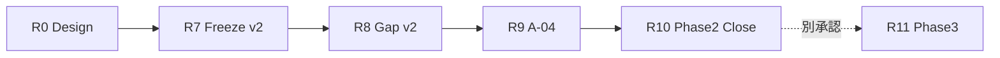

# Version 3 — Accuracy Phase 2 Research Roadmap

**Date:** 2026-07-24（**Phase 2 Close 更新**）  
**Status:** Phase 2 **CLOSED** · Lab Baseline v3 = A-01+A-03+A-04 · Hit **279** · Phase 3 未着手  
**Parent Report:** [`v3-accuracy-phase2-research-report.md`](./v3-accuracy-phase2-research-report.md)  
**Final Report:** [`v3-accuracy-phase2-final-report.md`](./v3-accuracy-phase2-final-report.md)  
**Gap Analysis:** [`v3-accuracy-gap-analysis-v2.md`](./v3-accuracy-gap-analysis-v2.md)

---

## 1. 原則

| 原則 | 内容 |
|------|------|
| 直列ゲート | 前ステップ PASS なしに実装しない |
| 単独 Flag | 1 実験 = 1 介入（A-01/A-02 同時 ON 禁止継続） |
| Offline 先行 | 実 285R Hard Gate 前に本番設計しない |
| Lab Baseline v3 凍結 | A-01+A-03+A-04 を公式比較基準とする |
| Delete 不変 | 購入境界は触らない · 研究対象外 |
| Phase 3 | 別承認なしに着手しない |

---

## 2. ロードマップ

```text
R0  Phase 2 Research Design          ← 完了
R1  Real-285R Miss Relabel           ← 保留
R2–R7 A-03 ライン + Lab Freeze v2    ← 完了
R8  Gap Analysis v2                  ← 完了
R9  A-04 Lab                         ← 完了（PASS）
R10 Phase 2 Close / Baseline v3      ← 完了（本更新）
R11 Phase 3                          ← 未着手
```



---

## 3. ステップ詳細（要約）

| Step | 状態 |
|------|------|
| R0–R9 | 完了（A-03 / Gap / A-04） |
| **R10 Phase 2 Close** | **完了** · Baseline v3 Hit 279 · Remaining = Delete 6 |
| R11 Phase 3 | **未着手** |

---

## 4. 研究テーマ（Close 後）

| # | テーマ | 状態 |
|---|--------|------|
| — | I-Eval / I-Pool / I-Boundary / I-Reorder | Baseline v3 で回収済（本 Lab） |
| — | I-Delete | 研究対象外 |
| — | Phase 3 | 未定義 · 未着手 |

---

## 5. マイルストーン

| ID | 意味 | 状態 |
|----|------|------|
| P2-M0 … P2-M5 | Design → Gap v2 | 完了 |
| P2-M6 | A-04 Lab PASS | 完了 |
| **P2-M7** | **Phase 2 Close / Baseline v3** | **完了** |
| P3-M0 | Phase 3 kickoff | 未 |

---

## 6. 参照

| 文書 | パス |
|------|------|
| Phase 2 Final | `v3-accuracy-phase2-final-report.md` |
| Baseline v3 | `v3-phase2-baseline-v3-report.md` |
| Remaining Issues | `v3-remaining-issues.md` |
| Candidate Registry | `v3-accuracy-candidate-registry.md` |
| Experiment Roadmap | `v3-experiment-roadmap.md` |
