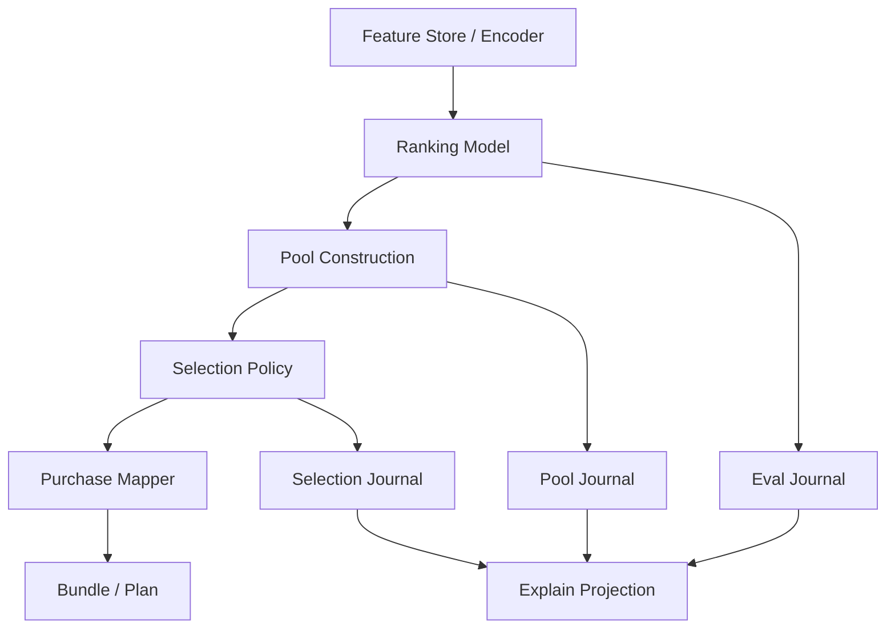

# Version 3 — Architecture Proposal

**Date:** 2026-07-22  
**Status:** Design Only（実装・コード変更禁止）  
**Vision:** [`v3-vision.md`](./v3-vision.md)  
**前提:** V2 採用構成固定（PE-V2-A ON / RP・CE OFF）。V2 コードは変更しない。

---

## 1. 現状アーキテクチャの限界（V2）

```text
Features(28) → Scorer → Ranker → Confidence → CE投影
                      ↘
                 ticket optimizer
                   ├─ build_candidate_pool (+ PE-V2-A sidecar)
                   ├─ world-aware repick / compress / …
                   └─ purchase plan
```

| 問題 | 詳細 |
|------|------|
| 責務混在 | スコア・入場・並べ替え・購入が同一スタックに密結合 |
| Flag パッチ限界 | サイドカーは局所には効くが、表現不足・Trigger 不足は解けない |
| RePick の誤設定 | 「Rescue」期待と「サイズ不変並べ替え」が混同された |
| CE の誤設定 | 「評価品質」を Softmax 温度に還元した |

V3 は **パイプラインを段階に分割**し、各段階に明示契約を与える。

---

## 2. 提案アーキテクチャ（論理）

```text
                    ┌─────────────────────────────────────┐
                    │         Version 3 Core (論理)         │
                    └─────────────────────────────────────┘
                                      │
     ┌────────────────────────────────┼────────────────────────────────┐
     ▼                                ▼                                ▼
[A] Representation              [B] Pool Construction           [C] Selection Policy
 Feature Store / Encoder         Admission + Capacity            Reorder / Slot / N-pick
 (契約化された特徴)               (次世代 Candidate Pool)         (旧 RePick の再定義)
     │                                │                                │
     └────────────────┬───────────────┴────────────────┬───────────────┘
                      ▼                                ▼
              [D] Ranking Model                 [E] Explain Journal
           Survival / Win / Margin              (各段の決定ログ)
                      │
                      ▼
              [F] Purchase Mapper（既存 ticket 層）
                      │
                      ▼
              Prediction Bundle / Purchase Plan
```

**重要な分離:** Accuracy の Hit 改善は **A→D** の責務。Purchase Mapper（F）は Hit を直接いじらない（V2 と同様、Delete 境界は不変）。

---

## 3. コンポーネント設計

### 3.1 [A] Representation — 特徴量とモデル入力

| 項目 | V3 方針 |
|------|---------|
| 現状 | 28 Feature 固定（V2 天井の主因） |
| V3 | **Feature Contract v3** を新設（V2 Contract と併存） |
| ロード | オフライン Encoder → ランタイム Feature Store |
| ゲート | ROI Validation 通過前に本番 Scorer へ接続しない |

**モデル責務（Representation）**

- 入力: レース文脈 + 馬属性 + 市場代理（リーク無し）
- 出力: 固定次元の `runner_embedding` / 拡張 tabular 行
- 非責務: Pool サイズ決定、購入枚数、Delete

詳細候補は [`v3-accuracy-strategy.md`](./v3-accuracy-strategy.md) §特徴量。

### 3.2 [B] Pool Construction — 次世代 Candidate Pool

V2 の PE-V2-A は「Deep-rank 最大 +1 入場」の局所緩和だった。V3 では Pool を **明示的な容量付き集合**として設計する。

```text
PoolConstruction:
  inputs:  ranked_runners, race_context, admission_policy
  outputs: candidate_pool[], pool_journal
  invariants:
    - capacity_max を超えない
    - 匿名 Trigger のみ（結果列禁止）
    - V2 PE-V2-A の効果は Control に内包（本番は維持）
```

#### Admission Policy（Entry 判定の改善案）

| 案 ID | 名称 | 概要 | V2 との差 |
|-------|------|------|-----------|
| AP-V3-A | **Banded Deep Admit** | rank 帯 × route_score × field_size で可変枠（0〜K） | 固定 +1 から **文脈可変容量**へ |
| AP-V3-B | **Coverage Admit** | Pool の世界/脚質カバレッジ不足時のみ追加入場 | 「強さ」ではなく **多様性ギャップ** |
| AP-V3-C | **Margin Gate Admit** | top 群と境界群のスコア差が薄いときのみ Deep 入場 | 不要な Deep 挿入を抑制 |

**共通制約**

- 1 Experiment = 1 Admission Policy Flag
- 勝者リーク禁止
- Control は常に V2 Final（PE-V2-A 含む）
- Pool 拡大の Purchase 副作用を Secondary Gate で監視

### 3.3 [C] Selection Policy — RePick の位置付け見直し

| V2 | V3 |
|----|----|
| RePick ≈ Winner Rescue（NEAR Trigger） | **廃止（パラダイム廃棄）** |
| サイズ不変の期待が曖昧 | **明示: \|Pool\| 不変の並べ替え / 枠配分** |
| Hit 押し上げの主レバー | **主レバーにしない**（補助・最後） |

```text
SelectionPolicy:
  inputs:  candidate_pool (size P), capacity N, ranking_scores
  outputs: selected[N], selection_journal
  invariants:
    - P は変えない（入場は PoolConstruction の責務）
    - 新規馬の Pool 外 Rescue をしない
    - 「勝者を探す」Trigger を書かない
```

#### V3 Selection の候補ファミリー（別名必須）

| 案 ID | 名称 | 目的 | 禁止事項 |
|-------|------|------|----------|
| SEL-V3-RO | **Reorder-only** | surv≤N なのに selected 外の compress 副作用を緩和 | Rescue / NEAR 復活 |
| SEL-V3-SLOT | **Role Slot Allocator** | deep/mid/front 役割枠の再配分 | 結果列・allowlist |
| SEL-V3-MARGIN | **Margin Stable Pick** | 境界付近の不安定入れ替えを抑制 | 温度 CE の再実装 |

**位置付け:** Selection は Evaluation（Ranking）が十分になった後の **仕上げ**。V3 初期の主戦場ではない。

### 3.4 [D] Ranking / Survival Model — Candidate Evaluation の再設計

V2 CE-V2-A（固定温度）は **不採用**。V3 では Evaluation を次のように再定義する。

```text
RankingModel:
  inputs:  representation(runners), race_context
  outputs: win_prob[], survival_score[], rank[], eval_journal
  NOT: softmax_temperature_knob_as_product
```

| モード | 内容 | いつ使うか |
|--------|------|------------|
| **D0 Baseline** | 現行 Scorer（V2 Control と同一） | 常に Control |
| **D1 Recalibrator** | 学習済み校正（温度ではない・検証付き isotonic / 分位） | Feature 不変の最小実験 |
| **D2 Reranker** | Representation 上のペア/リスト学習（rank loss） | Feature Contract 後 |
| **D3 Dual-head** | win_prob と survival を分離ヘッド | 遠位 miss 向け |

**CE-V2-A から学ぶ禁止事項**

- 「温度を少し変える」単独 AB を Accuracy 主実験にしない
- 既存 Hit を崩す churn を許容しない（Hard Gate: churn_hit=0）

### 3.5 [E] Explain Journal

各段は決定ログを出す（V2 Explain の product_stages 思想を継承しつつ、V3 段名に合わせる）。

| journal | 必須キー例 |
|---------|------------|
| `pool_journal` | admitted[], rejected_reason, capacity |
| `selection_journal` | swaps[], policy_id, size_invariant=true |
| `eval_journal` | model_id, rank_method, calibration_id |

本番 Explain 配線は V3 実装フェーズの別設計。本提案では **契約上の存在**のみ定義。

### 3.6 [F] Purchase Mapper

既存 ticket optimizer / Delete Boundary は **V3 Accuracy の変更対象外**。  
Pool/Selection/Ranking の出力を消費するだけとする。

---

## 4. 実行時配置（将来・論理配置）

V2 本番は保守。V3 は将来、次のいずれかで隔離する（実装時に選択）。

| 方式 | 概要 | 利点 |
|------|------|------|
| **Shadow Core** | `/opt/expect-ai/platform-v3` 併設 | V2 を触らない |
| **Flag Mesh** | `WIN5_V3_*` 名前空間のみ | 既存配置を流用 |
| **Offline Lab** | EC2 非経由の 285R バッチのみ | 最速で仮説検証 |

**推奨順序:** Offline Lab → Flag Mesh（Shadow）→ 採用時のみ本番 ON。

---

## 5. 契約・境界（非破壊）

| 境界 | V3 方針 |
|------|---------|
| Prediction API | 破壊禁止。additive フィールドのみ将来検討 |
| PI `/v1/predictions` | 同上 |
| RaceCardSummary | 変更しない（V3 Accuracy 外） |
| Delete Boundary | **不変** |
| V2 PE-V2-A | Control に内包・本番維持 |
| V2 RP/CE Flags | OFF のまま・再使用禁止 |

---

## 6. データフロー（目標状態）



---

## 7. リスクと緩和

| リスク | 緩和 |
|--------|------|
| Feature 追加がリークを生む | Contract レビュー + 結果列禁止チェックリスト |
| Pool 拡大で Purchase 膨張 | Secondary Gate（Purchase p95 ≤ 110%） |
| Selection が Rescue に退化 | 設計レビューで「Pool 外追加」を機械的に拒否 |
| V2 本番回帰 | V3 は別 Flag / Shadow。V2 コード変更禁止を維持 |
| 実験過多 | Roadmap の直列ゲート（[`v3-experiment-roadmap.md`](./v3-experiment-roadmap.md)） |

---

## 8. 参照

| 文書 | パス |
|------|------|
| Vision | `docs/releases/v3-vision.md` |
| Accuracy Strategy | `docs/releases/v3-accuracy-strategy.md` |
| Experiment Roadmap | `docs/releases/v3-experiment-roadmap.md` |
| V2 Architecture | `docs/releases/v2-architecture.md` |
| V2 Accuracy Design | `docs/releases/v2-accuracy-design-review.md` |
