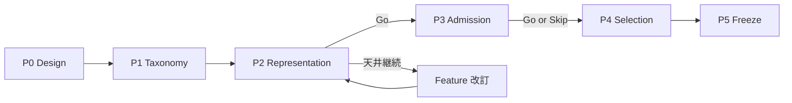

# Version 3 — Experiment Roadmap

**Date:** 2026-07-22（**Lab Configuration Freeze: 2026-07-24**）  
**Status:** P0–P5 Frozen · Accuracy Phase 2 CLOSED · Lab Baseline v3 = A-01+A-03+A-04（Hit 279）· **Production Readiness HOLD** · Production wiring not started · Phase 3 not started  
**Strategy:** [`v3-accuracy-strategy.md`](./v3-accuracy-strategy.md)  
**Control 固定:** V2 Final（PE-V2-A ON）Hit **218**  
**Lab Baseline v3:** [`v3-phase2-baseline-v3-report.md`](./v3-phase2-baseline-v3-report.md) · `research/v3_lab/baselines/lab_baseline_v3_a01_a03_a04.json`  
**Configuration:** [`v3-lab-configuration-report.md`](./v3-lab-configuration-report.md)  
**Phase 2 Final:** [`v3-accuracy-phase2-final-report.md`](./v3-accuracy-phase2-final-report.md)  
**Foundation Baseline:** `research/v3_lab/baselines/lab_baseline_p5.json`

---

## 1. ロードマップ原則

| 原則 | 内容 |
|------|------|
| 直列 | 次 Phase は前 Phase の Go/No-Go 後 |
| 単独 Flag | 1 Experiment = 1 介入 |
| 新名前空間 | `V3-*` / `WIN5_V3_*` のみ（V2 Flag 再利用禁止） |
| Offline 先行 | 285R バッチで Hard Gate を見てからランタイム設計 |
| V2 非変更 | 本番 V2 コード・採用 Flag は保守 |

---

## 2. Phase 一覧

```text
V3-P0  Design Freeze（本ドキュメント群）          ← 完了
V3-P1  Miss Taxonomy Lock + Lab Harness           ← 完了（2026-07-24 / research/v3_lab）
V3-P2  Representation（Feature / Contract）       ← 完了（2026-07-24）· Ranking D1/D2 は別承認
V3-P3  Pool Admission（AP-V3-A）                  ← 完了（2026-07-24）· AP-V3-B/C は別承認
V3-P4  Selection Reorder（SEL-V3-RO）             ← 完了（2026-07-24）· SLOT/MARGIN は別承認
V3-P5  Stack Freeze + Lab Baseline               ← 完了（2026-07-24）· Accuracy 実験は別承認
```



---

## 3. Phase 詳細

### V3-P0 — Design Freeze（完了条件: 本設計受領）

| 成果物 | 状態 |
|--------|------|
| Vision / Architecture / Strategy / Roadmap / Design Report | 本提出 |
| 実装 | **禁止** |

**Exit:** 設計レビュー承認。

---

### V3-P1 — Miss Taxonomy Lock + Lab Harness

| 項目 | 内容 |
|------|------|
| 目的 | V2 Final 基準の残 miss を再現可能な表に凍結 |
| 作業 | 層ラベル（Eval/Boundary/Reorder/Pool/Delete）の再確認 |
| Harness | 285R オフライン評価器（Control=218 再現） |
| 禁止 | 新ロジックの本番配線 |
| **実装** | **`research/v3_lab`（2026-07-24）** · 報告 [`v3-p1-lab-report.md`](./v3-p1-lab-report.md) |

**Exit Gate**

- Control Hit=218 をハーネスが再現 → **PASS**（synthetic fixture）
- 層別カウント表がレビュー済 → **PASS**（taxonomy lock scaffold）

**No-Go:** 再現できない → データ/スクリプト修正のみ（Accuracy 介入なし）

---

### V3-P2 — Representation / Ranking（主戦場）

| Experiment 案 | 介入 | Hard Gate | Status |
|---------------|------|-----------|--------|
| **`v3-p2-representation`** | Feature Generator + Contract 2.0（`F_V3_REPRESENTATION`） | Parity: Hit==218 ∧ churn=0 | **Complete** |
| `v3-rank-d1-recal-285r-ab` / **`v3-a01-d1-recal`** | D1 Recalibrator（Feature 不変） | Hit>218 ∧ churn=0 | **Lab Primary Candidate**（Hit 246 · Validation PASS）· frozen |
| `v3-feat-contract-roi` | Feature ROI（AB 前ゲート） | 情報利得・リーク検査 PASS | reserved（Phase 2+） |
| `v3-rank-d2-rerank-285r-ab` / **`v3-a02-d2-rerank`** | D2 Reranker（listwise/pairwise） | Hit>218 ∧ churn=0 | **Lab Secondary Candidate**（Hit 242）· frozen |

**順序:** Representation（完了）→ **D1 Primary** → **D2 Secondary** → Candidate Review → **Phase 1 CLOSE** → Phase 2（別承認）。

### Accuracy Phase 1（CLOSED · 2026-07-24）

| 項目 | 状態 |
|------|------|
| Primary | **A-01** |
| Secondary | **A-02** |
| 同時 ON | 禁止 |
| 本番配線 | 禁止 |
| Final Report | [`v3-accuracy-phase1-final-report.md`](./v3-accuracy-phase1-final-report.md) |
| Candidate Registry | [`v3-accuracy-candidate-registry.md`](./v3-accuracy-candidate-registry.md) |
| Experiment Status | [`v3-experiment-status.md`](./v3-experiment-status.md) |
| Flag Inventory | [`v3-feature-flag-inventory.md`](./v3-feature-flag-inventory.md) |

### Lab Configuration Freeze（履歴 · Baseline v2）

| 項目 | 状態 |
|------|------|
| Adopted stack (then) | Admission A-03 + Evaluation A-01 |
| Baseline v2 Hit | **255** |
| Note | Baseline v3 により公式 Accuracy スタックは更新 |

### Accuracy Phase 2（CLOSED · 2026-07-24）

| 項目 | 状態 |
|------|------|
| Research Report | [`v3-accuracy-phase2-research-report.md`](./v3-accuracy-phase2-research-report.md) |
| A-03 | Lab PASS + Validation PASS · **スタック採用** |
| Gap Analysis v2 | PASS |
| A-04 | Lab PASS · Validation **PASS** · **スタック採用** |
| **Baseline v3** | **A-01 + A-03 + A-04 · Hit 279** |
| Final Report | [`v3-accuracy-phase2-final-report.md`](./v3-accuracy-phase2-final-report.md) |
| Remaining | Delete 6 · 研究対象外 · [`v3-remaining-issues.md`](./v3-remaining-issues.md) |
| Production Readiness | [`v3-production-readiness-report.md`](./v3-production-readiness-report.md) · Decision **HOLD** |
| Offline Gate | [`v3-offline-gate-report.md`](./v3-offline-gate-report.md) · Decision **FAIL**（59→42 · churn 29） |
| Phase 3 | **未着手** |

```text
Representation Baseline → Admission A-03 → Selection A-04 → Evaluation A-01 → Purchase Baseline
```

**Exit Gate（Representation 部分）**

- Flag OFF identity 維持 → **PASS**
- Contract 2.0 + features/embedding 生成 → **PASS**
- AB parity（pick 不変）→ **PASS**
- Hard Gate Hit>218 は Ranking 実装後に評価

**No-Go / 禁止**

- Softmax 温度のみの実験（CE-V2-A 相当）
- V2 `WIN5_CE_V2_ENABLED` の再利用
- Admission 以降への先行着手（本 Phase では禁止）

---

### V3-P3 — Pool Admission Next-Gen

**前提:** P2 の結論が文書化されていること（PASS でも FAIL でも可。FAIL なら Admission に過度な期待をしない）。

| Experiment 案 | 介入 | Status |
|---------------|------|--------|
| **`v3-p3-admission`** / `v3-ap-banded-deep-285r-ab` | AP-V3-A Banded Deep（`F_V3_ADMISSION`） | **Complete**（parity） |
| `v3-ap-coverage-285r-ab` | AP-V3-B（A の分析後） | reserved |
| `v3-ap-margin-gate-285r-ab` | AP-V3-C | reserved |

**Exit Gate（Admission 基盤）**

- Flag OFF identity 維持 → **PASS**
- Contract 2.0 + capacity pool 生成 → **PASS**
- AB parity（Control fixture）→ **PASS**
- Hard Gate Hit>218 は Ranking / 後段と合わせて評価（本 Phase では未主張）

**Secondary Gate:** Purchase p95 ≤ 110% · WIP 非悪化（本番配線後）。

**注意:** V2 PE-V2-A は Control に残す。V3 Admission は **追加**（本実装は Lab のみ）。  
**禁止:** Selection 以降への先行着手（本 Phase では停止）。

---

### V3-P4 — Selection Reorder（補助）

**前提:** P2 または P3 で Hit が動くか、Reorder 層 miss が定量的に残存。

| Experiment 案 | 介入 | Status |
|---------------|------|--------|
| **`v3-p4-selection`** / `v3-sel-reorder-285r-ab` | SEL-V3-RO（`F_V3_SELECTION`） | **Complete**（parity） |
| `v3-sel-slot-285r-ab` | SEL-V3-SLOT | reserved |

**Exit Gate（Selection 基盤）**

- Flag OFF identity 維持 → **PASS**
- Contract 2.0 + Reorder-only（Rescue 禁止）→ **PASS**
- AB parity（Control fixture）→ **PASS**
- Hard Gate Hit>218 は Evaluation 実装後に評価（本 Phase では未主張）

**禁止:** Pool 外 Rescue、`WIN5_REPICK_V2_*`、NEAR Trigger 復活、Evaluation 以降への先行着手。

---

### V3-P5 — Stack Freeze + Production Design

| 項目 | 内容 | Status |
|------|------|--------|
| Pipeline / Contract Freeze | Stage 順・Contract ID 固定 | **Complete** |
| Feature Flag Inventory | すべて既定 OFF · identity | **Complete** |
| Experiment Registry 固定 | `REGISTRY_FROZEN=True` | **Complete** |
| Lab Baseline | `v3-lab-baseline-p5-v1` | **Complete** |
| AB Harness 最終確認 | Control 218 + P2–P4 parity | **Complete** |
| Design ↔ 実装整合 | aligned / stub_deferred 記録 | **Complete** |
| 本番設計（Shadow / Flag Mesh） | 文書のみ · 配線なし | deferred |
| Accuracy 実験開始 | 別承認 | **not started** |

**Report:** [`v3-p5-freeze-report.md`](./v3-p5-freeze-report.md)

**禁止（本 Phase）:** Evaluation 実装、Accuracy 介入、V2 Production 配線。

---

## 4. 実験カードテンプレート（将来用）

```text
Experiment ID:
Flag:
Control: V2 Final (PE-V2-A) Hit=218
Treatment: Control + <single intervention>
Corpus: 285R
Hard Gate: Hit > 218 AND churn_hit = 0
Secondary: Purchase p95, WIP rate, rank710, other
Leak check: PASS/FAIL
Decision: PASS / FAIL / INCONCLUSIVE
```

---

## 5. Flag 名前空間（予約・実装時）

| Flag（案） | 既定 | 対応 |
|------------|------|------|
| `WIN5_V3_RANK_D1_ENABLED` | OFF | Recalibrator |
| `WIN5_V3_RANK_D2_ENABLED` | OFF | Reranker |
| `WIN5_V3_AP_BANDED_ENABLED` | OFF | Admission A |
| `WIN5_V3_AP_COVERAGE_ENABLED` | OFF | Admission B |
| `WIN5_V3_SEL_REORDER_ENABLED` | OFF | Selection RO |
| （V2）`WIN5_POOL_ENTRY_V2_ENABLED` | **ON** | Control 固定 |
| （V2）`WIN5_REPICK_V2_ENABLED` | OFF | 使用禁止 |
| （V2）`WIN5_CE_V2_ENABLED` | OFF | 使用禁止 |

---

## 6. マイルストーン（カレンダーは未固定）

| Milestone | 意味 |
|-----------|------|
| M0 | Design 受領（本 Round） |
| M1 | Lab Harness が Control 218 再現 |
| M2 | 第一回 V3 Hard Gate PASS（いずれかの柱） | **達成**（A-01 Hit 246） |
| M3 | V3 採用スタック文書化 | **Phase 1 Close**（Primary/Secondary 登録 · 同時 ON なし） |
| M4 | 本番 Design 承認（実装開始の条件） | 未着手 |

日付は運用側が別途設定。本 Roadmap は **依存関係のみ**を固定する。

---

## 7. 中止・縮小条件

| 条件 | アクション |
|------|------------|
| Feature ROI が連続 FAIL | Representation 戦略を見直し（データソース再定義） |
| Admission が Purchase のみ悪化 | AP 案を破棄、Selection/Eval へ |
| Selection が churn のみ | SEL 案を破棄 |
| 全柱で Hit 天井 | Delete 以外の製品定義（対象レース・評価指標）を経営判断へエスカレーション |

---

## 8. 参照

| 文書 | パス |
|------|------|
| Design Report | `docs/releases/v3-design-report.md` |
| V2 Final | `docs/releases/v2-accuracy-final-report.md` |
| 旧メモ | `docs/releases/v2-accuracy-v3-roadmap.md` |
