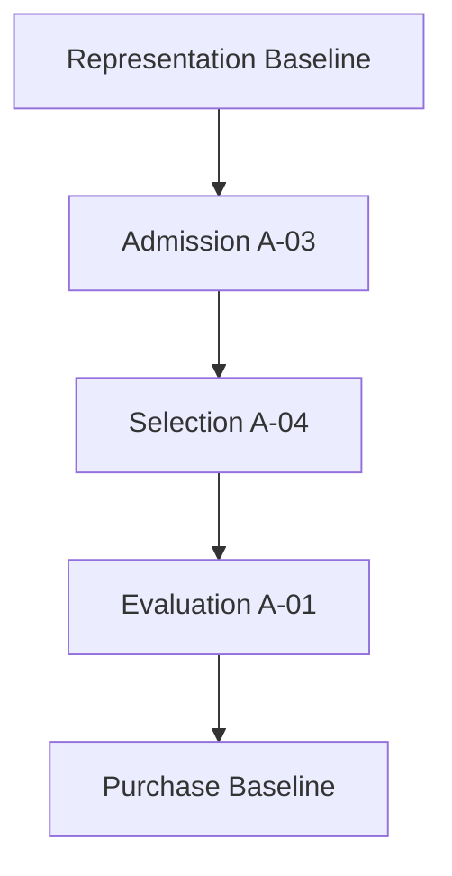

# Version 3 — Lab Configuration Report（Phase 2 Close / Baseline v3）

**Date:** 2026-07-24  
**Close ID:** `v3-accuracy-phase2-close/1.0`  
**Baseline v3:** `v3-lab-baseline-v3-a01-a03-a04`  
**Status:** **FROZEN（Phase 2）**  
**Code:** `research/v3_lab/phase2_close.py`  
**Artifacts:** `research/v3_lab/baselines/accuracy_phase2_close/` · `baselines/lab_baseline_v3_a01_a03_a04.json`

---

## 1. 目的

Accuracy Phase 2 の正式構成を固定し、Lab Baseline v3 を確定する。  
新しい Accuracy アルゴリズムは実装しない。

---

## 2. 採用構成（Official Lab Stack）

```text
Representation   Baseline (OFF)
        ↓
Admission        A-03  (F_V3_A03_POOL_ADMIT_ENABLED)
        ↓
Selection        A-04  (F_V3_A04_SEL_HISTORY_ENABLED)
        ↓
Evaluation       A-01  (F_V3_RANK_D1_ENABLED)
        ↓
Purchase         Baseline (OFF)
```



| Stage | Mode | Flag（スタック意図） | 既定コード |
|-------|------|----------------------|------------|
| Representation | Baseline | OFF | OFF |
| Admission | **A-03** | **ON** | OFF |
| Selection | **A-04** | **ON** | OFF |
| Evaluation | **A-01** | **ON** | OFF |
| Purchase | Baseline | OFF | OFF |

**A-02** は Evaluation Secondary Candidate として保持（スタック外）。

---

## 3. Baseline v3 指標（285R）

| Arm | Hit | Purchase | rank710 | rank46 | other | ROI | churn |
|-----|-----|----------|---------|--------|-------|-----|-------|
| Control OFF | **218** | 218 | 9 | 6 | 52 | 1.1418 | — |
| Baseline v2 | 255 | 255 | 0 | 6 | 24 | 2.7095 | 0 |
| **Stack A-01+A-03+A-04** | **279** | 279 | 0 | 6 | 0 | 3.0421 | **0** |

| Δ Stack vs Control | 値 |
|--------------------|-----|
| ΔHit | **+61** |

| Δ Stack vs Baseline v2 | 値 |
|------------------------|-----|
| ΔHit | **+24** |

詳細: [`v3-phase2-baseline-v3-report.md`](./v3-phase2-baseline-v3-report.md)

---

## 4. Candidate Registry v3（要約）

| 役割 | ID | Flag | スタック |
|------|-----|------|----------|
| Evaluation Primary | **A-01** | `F_V3_RANK_D1_ENABLED` | **採用** |
| Admission Primary | **A-03** | `F_V3_A03_POOL_ADMIT_ENABLED` | **採用** |
| Selection Primary | **A-04** | `F_V3_A04_SEL_HISTORY_ENABLED` | **採用** |
| Evaluation Secondary | A-02 | `F_V3_RANK_D2_ENABLED` | 保持のみ |

---

## 5. 停止

**Phase 2 Configuration / Baseline v3 固定完了。**  
Phase 3 には着手しない。
