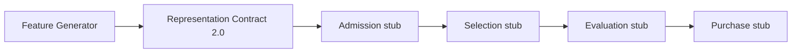

# Version 3 — P2 Representation Report

**Date:** 2026-07-24  
**Status:** **P2 Representation Complete**（Admission 以降は未着手）  
**Design authority:** [`v3-design-report.md`](./v3-design-report.md)  
**Code root:** `research/v3_lab/`（V2 Production 非配線）

---

## 1. 目的

Representation Stage を実装し、F-V3 特徴表現（tabular + embedding）を生成できるようにする。  
Admission / Selection / Evaluation / Purchase はスタブのまま。Hit 改善は Ranking 以降の課題。

---

## 2. Representation Pipeline

```text
[A] Representation (P2)  →  [B] Admission (stub)  →  [C] Selection (stub)
                                                         ↓
                              [E] Purchase (stub)  ←  [D] Evaluation (stub)
```



| 状態 | 挙動 |
|------|------|
| `F_V3_REPRESENTATION` **OFF** | identity（features/embedding 非付与） |
| `F_V3_REPRESENTATION` **ON** | `features` + `embedding` を各 runner に付与。pick は `model_rank` passthrough |

---

## 3. Feature Flag

| Flag | 既定 | 役割 |
|------|------|------|
| **`F_V3_REPRESENTATION`** | **OFF** | Representation 唯一のゲート |

Alias: `F_V3_REPRESENTATION_ENABLED`（同値に同期）。

**OFF ≡ V2 Production と Lab 上で完全一致**（本パッケージを本番から import しない前提）。

---

## 4. Contract

| Contract ID | Stage | 変更 |
|-------------|-------|------|
| **`v3-lab-representation/2.0`** | Representation | P2 新設（1.0 stub → Feature Generator） |
| `v3-lab-admission/1.0` | Admission | 変更なし |
| `v3-lab-selection/1.0` | Selection | 変更なし |
| `v3-lab-evaluation/1.0` | Evaluation | 変更なし |
| `v3-lab-purchase/1.0` | Purchase | 変更なし |
| `v3-lab-pipeline/1.0` | LabBundle | 変更なし |

**Representation ID:** `v3-rep-p2-v1`

**出力（ON 時）**

- `feature_keys`: F-V3-01 / 10 / 11 / 12 / 20 / 21 + `rank_inv` / `win_prob`
- `embedding`: 固定次元ベクトル（`len(FEATURE_KEYS)`）
- リーク入力禁止（結果・払戻・着順列を使わない）

検証: `validate_representation_output`（`contracts.py`）

---

## 5. Metrics

| Metric point | 意味 |
|--------------|------|
| `lab.stage.representation` | Stage 実行 |
| `lab.representation.enabled` | Flag 状態 |
| `lab.representation.feature_count` | feature_keys 数 |
| `lab.representation.embedding_dim` | embedding 次元 |
| `lab.representation.runner_count` | runner 数 |
| `lab.identity` | Flag OFF identity 経路 |
| `lab.ab.control_hit` / `treatment_hit` / `churn_hit` | AB |

Debug: `debug.representation` に sample features / embedding を投影。

---

## 6. AB 結果

Experiment: **`v3-p2-representation`**

| Arm | Flag | Hit | Miss |
|-----|------|-----|------|
| Control | all OFF | **218** | 67 |
| Treatment | `F_V3_REPRESENTATION=ON` | **218** | 67 |

| Gate | 結果 |
|------|------|
| Control 再現（218 / 285R） | **PASS** |
| Parity（Hit 不変 ∧ churn_hit = 0） | **PASS** |
| Hard Gate（Hit > 218 ∧ churn = 0） | **未主張**（Evaluation が stub のため） |

Representation は表現を生成するが、順位付けはまだ `model_rank` passthrough。  
Hard Gate 突破は Ranking（D1/D2）以降の実験対象。

---

## 7. Feature Generator（実装キー）

| Key | 概要 |
|-----|------|
| `F_V3_01_field_size_norm` | 頭数正規化 |
| `F_V3_10_decayed_form_proxy` | フォーム代理 |
| `F_V3_11_rel_rank_stability` | 相対順位安定 |
| `F_V3_12_style_cluster_dist` | 脚質クラスタ距離 |
| `F_V3_20_log_odds_residual` | オッズ残差（log） |
| `F_V3_21_popularity_crowd` | 人気帯密度 |
| `F_V3_rank_inv` | 1/rank |
| `F_V3_win_prob` | 入力 win_prob 透過 |

モジュール: `research/v3_lab/feature_generator.py`

---

## 8. 変更ファイル一覧

| Path | 内容 |
|------|------|
| `research/v3_lab/feature_generator.py` | **新規** Feature Generator |
| `research/v3_lab/flags.py` | `F_V3_REPRESENTATION` 正本 |
| `research/v3_lab/stages.py` | Representation Stage 実装 |
| `research/v3_lab/contracts.py` | Contract 2.0 + validator |
| `research/v3_lab/pipeline.py` | Representation metrics 発火 |
| `research/v3_lab/metrics.py` | Representation 計測点 |
| `research/v3_lab/debug.py` | Representation debug |
| `research/v3_lab/ab_harness.py` | P2 AB / parity |
| `research/v3_lab/registry.py` | `v3-p2-representation` |
| `research/v3_lab/__init__.py` | export 更新 |
| `research/v3_lab/README.md` | P2 境界 |
| `research/v3_lab/tests/test_representation.py` | **新規** |
| `research/v3_lab/tests/test_*.py` | AB / contracts / flags / registry 更新 |
| `docs/releases/v3-p2-representation-report.md` | 本レポート |
| `docs/releases/v3-design-report.md` | P2 ステータス追記 |
| `docs/releases/v3-experiment-roadmap.md` | P2 Representation 完了マーク |

**未変更:** Version 2 Production / Admission / Selection / Evaluation / Purchase / Prediction API / UI / Operations / Explainability

---

## 9. テスト結果

```text
cd research/v3_lab
python -m unittest discover -s tests -v
```

| Test | Result |
|------|--------|
| Flag default OFF | PASS |
| Pipeline identity（OFF） | PASS |
| Representation ON → features/embedding | PASS |
| Contract 2.0 validation | PASS |
| Control Hit=218 | PASS |
| P2 AB parity（218 / churn 0） | PASS |
| Registry / debug | PASS |
| Taxonomy lock | PASS |

---

## 10. 停止条件

**P2 Representation 完了。ここで停止する。**

- Admission 以降には着手しない
- Ranking D1/D2 Accuracy 介入は別承認
- V2 Production への配線は行わない
