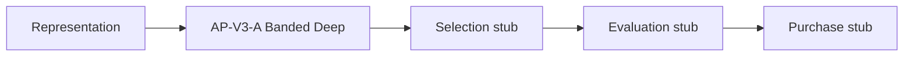

# Version 3 — P3 Admission Report

**Date:** 2026-07-24  
**Status:** **P3 Admission Complete**（Selection 以降は未着手）  
**Design authority:** [`v3-design-report.md`](./v3-design-report.md)  
**Code root:** `research/v3_lab/`（V2 Production 非配線）

---

## 1. 目的

Admission Stage を実装し、Representation 出力（features / embedding、存在時）を利用して  
**Candidate Pool** を生成できるようにする。  
Selection / Evaluation / Purchase はスタブのまま。Hit 改善は Ranking 以降の課題。

---

## 2. Admission Pipeline

```text
[A] Representation (P2)  →  [B] Admission (P3)  →  [C] Selection (stub)
                                                       ↓
                            [E] Purchase (stub)  ←  [D] Evaluation (stub)
```



| 状態 | 挙動 |
|------|------|
| `F_V3_ADMISSION` **OFF** | identity（pool = 全 runner） |
| `F_V3_ADMISSION` **ON** | AP-V3-A: base band + deep extra（容量上限）。pick は Evaluation stub のため `model_rank` passthrough |

**Representation 利用:** features/embedding がある場合、deep route_score / マージン判定に使用。  
無い場合は `model_rank` / `win_prob` / `field_size` にフォールバック（`F_V3_ADMISSION` 単独でも動作）。

---

## 3. Feature Flag

| Flag | 既定 | 役割 |
|------|------|------|
| **`F_V3_ADMISSION`** | **OFF** | Admission 唯一のゲート |

Alias: `F_V3_ADMISSION_ENABLED`（同値に同期）。

**OFF ≡ V2 Production と Lab 上で完全一致**（本パッケージを本番から import しない前提）。

P3 AB Treatment は **`F_V3_ADMISSION` のみ** ON。

---

## 4. Contract

| Contract ID | Stage | 変更 |
|-------------|-------|------|
| `v3-lab-representation/2.0` | Representation | **変更なし** |
| **`v3-lab-admission/2.0`** | Admission | P3 新設（1.0 stub → Banded Deep） |
| `v3-lab-selection/1.0` | Selection | 変更なし |
| `v3-lab-evaluation/1.0` | Evaluation | 変更なし |
| `v3-lab-purchase/1.0` | Purchase | 変更なし |
| `v3-lab-pipeline/1.0` | LabBundle | 変更なし |

**Admission ID:** `v3-adm-p3-v1`  
**Policy ID:** `AP-V3-A-banded-deep`

**出力（ON 時）**

- `candidate_pool[]`（capacity_max 以下）
- `pool_journal`: admitted / rejected_reason / deep_extra / used_representation
- リーク入力禁止

検証: `validate_admission_output`（`contracts.py`）

---

## 5. Metrics

| Metric point | 意味 |
|--------------|------|
| `lab.stage.admission` | Stage 実行 |
| `lab.admission.enabled` | Flag 状態 |
| `lab.admission.pool_size` | pool サイズ |
| `lab.admission.capacity_max` | 容量上限 |
| `lab.admission.admitted_count` | 入場数 |
| `lab.admission.rejected_count` | 却下数 |
| `lab.admission.deep_extra` | Deep 追加枠 |
| `lab.ab.*` | AB Hit / churn |

Debug: `debug.admission` に policy / admitted / rejected / used_representation を投影。

---

## 6. AB 結果

Experiment: **`v3-p3-admission`**

| Arm | Flag | Hit | Miss |
|-----|------|-----|------|
| Control | all OFF | **218** | 67 |
| Treatment | `F_V3_ADMISSION=ON` | **218** | 67 |

| Gate | 結果 |
|------|------|
| Control 再現（218 / 285R） | **PASS** |
| Parity（Hit 不変 ∧ churn_hit = 0） | **PASS** |
| Hard Gate（Hit > 218 ∧ churn = 0） | **未主張**（Evaluation stub / 2頭 fixture は全入場） |

大フィールド単体テストでは capacity により pool が縮小することを確認（Hit 主張対象外）。

---

## 7. Policy 概要（AP-V3-A）

| 項目 | 内容 |
|------|------|
| Base band | field_size 帯で core 枠（≤2 は全入場） |
| Deep extra | 0〜`DEEP_K_MAX=2`（大フィールド / field_norm / 薄マージン） |
| Deep 選定 | Representation route_score（なければ win_prob+rank_inv） |
| 不変条件 | capacity 超過禁止・結果列禁止・OFF identity |

モジュール: `research/v3_lab/admission_policy.py`

---

## 8. 変更ファイル一覧

| Path | 内容 |
|------|------|
| `research/v3_lab/admission_policy.py` | **新規** AP-V3-A |
| `research/v3_lab/flags.py` | `F_V3_ADMISSION` 正本 |
| `research/v3_lab/stages.py` | Admission Stage 実装 |
| `research/v3_lab/contracts.py` | Contract 2.0 + validator |
| `research/v3_lab/pipeline.py` | Admission metrics 発火 |
| `research/v3_lab/metrics.py` | Admission 計測点 |
| `research/v3_lab/debug.py` | Admission debug |
| `research/v3_lab/ab_harness.py` | P3 AB / parity |
| `research/v3_lab/registry.py` | `v3-p3-admission` |
| `research/v3_lab/__init__.py` | export 更新 |
| `research/v3_lab/README.md` | P3 境界 |
| `research/v3_lab/tests/test_admission.py` | **新規** |
| `research/v3_lab/tests/test_*.py` | AB / contracts / flags / registry 更新 |
| `docs/releases/v3-p3-admission-report.md` | 本レポート |
| `docs/releases/v3-design-report.md` | P3 ステータス追記 |
| `docs/releases/v3-experiment-roadmap.md` | P3 Admission 完了マーク |

**未変更:** Version 2 Production / Representation（Feature Generator） / Selection / Evaluation / Purchase / Prediction API / UI / Operations / Explainability

---

## 9. テスト結果

```text
cd research/v3_lab
python -m unittest discover -s tests -v
```

| Test | Result |
|------|--------|
| Flag default OFF | PASS |
| Pipeline identity（OFF） | PASS |
| Admission ON → capacity pool | PASS |
| Representation 併用で features 利用 | PASS |
| Contract 2.0 validation | PASS |
| Control Hit=218 | PASS |
| P3 AB parity（218 / churn 0） | PASS |
| Registry / debug | PASS |

---

## 10. 停止条件

**P3 Admission 完了。ここで停止する。**

- Selection 以降には着手しない
- Coverage / Margin Gate（AP-V3-B/C）は別承認
- V2 Production への配線は行わない
