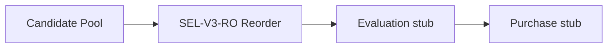

# Version 3 — P4 Selection Report

**Date:** 2026-07-24  
**Status:** **P4 Selection Complete**（Evaluation 以降は未着手）  
**Design authority:** [`v3-design-report.md`](./v3-design-report.md)  
**Code root:** `research/v3_lab/`（V2 Production 非配線）

---

## 1. 目的

Selection Stage を実装し、Admission の Candidate Pool を **並べ替え（Reorder）** できるようにする。  
Rescue / NEAR / Pool 外追加は禁止。Evaluation / Purchase はスタブのまま。

---

## 2. Selection Pipeline

```text
[A] Representation (P2)  →  [B] Admission (P3)  →  [C] Selection (P4)
                                                       ↓
                            [E] Purchase (stub)  ←  [D] Evaluation (stub)
```



| 状態 | 挙動 |
|------|------|
| `F_V3_SELECTION` **OFF** | identity（pool 順 passthrough） |
| `F_V3_SELECTION` **ON** | SEL-V3-RO: pool 内 reorder。馬集合不変。Evaluation stub が `model_rank` 再ソート |

---

## 3. Feature Flag

| Flag | 既定 | 役割 |
|------|------|------|
| **`F_V3_SELECTION`** | **OFF** | Selection 唯一のゲート |

Alias: `F_V3_SELECTION_ENABLED`（同値に同期）。

**OFF ≡ V2 Production と Lab 上で完全一致**（本パッケージを本番から import しない前提）。

P4 AB Treatment は **`F_V3_SELECTION` のみ** ON。

---

## 4. Contract

| Contract ID | Stage | 変更 |
|-------------|-------|------|
| `v3-lab-representation/2.0` | Representation | **変更なし** |
| `v3-lab-admission/2.0` | Admission | **変更なし** |
| **`v3-lab-selection/2.0`** | Selection | P4 新設（1.0 stub → Reorder-only） |
| `v3-lab-evaluation/1.0` | Evaluation | 変更なし |
| `v3-lab-purchase/1.0` | Purchase | 変更なし |
| `v3-lab-pipeline/1.0` | LabBundle | 変更なし |

**Selection ID:** `v3-sel-p4-v1`  
**Policy ID:** `SEL-V3-RO`

**出力（ON 時）**

- `selected[]`（pool の並べ替え。capacity_n 指定時のみ truncate）
- `selection_journal`: swaps / size_invariant / rescue_forbidden / pool_external_adds=0
- リーク入力禁止・Rescue 禁止

検証: `validate_selection_output`（`contracts.py`）

---

## 5. Metrics

| Metric point | 意味 |
|--------------|------|
| `lab.stage.selection` | Stage 実行 |
| `lab.selection.enabled` | Flag 状態 |
| `lab.selection.selected_size` | selected 数 |
| `lab.selection.pool_size` | 入力 pool 数 |
| `lab.selection.swap_count` | 並べ替え移動数 |
| `lab.selection.size_invariant` | \|selected\|==\|pool\| |
| `lab.selection.pool_external_adds` | Rescue 検出（常に 0） |
| `lab.ab.*` | AB Hit / churn |

Debug: `debug.selection` に order_before / order_after / swaps を投影。

---

## 6. AB 結果

Experiment: **`v3-p4-selection`**

| Arm | Flag | Hit | Miss |
|-----|------|-----|------|
| Control | all OFF | **218** | 67 |
| Treatment | `F_V3_SELECTION=ON` | **218** | 67 |

| Gate | 結果 |
|------|------|
| Control 再現（218 / 285R） | **PASS** |
| Parity（Hit 不変 ∧ churn_hit = 0） | **PASS** |
| Hard Gate（Hit > 218 ∧ churn = 0） | **未主張**（Evaluation stub が model_rank 再ソート） |

単体テストでは win_prob 優勢馬への reorder と、Evaluation stub による pick 不変を確認。

---

## 7. Policy 概要（SEL-V3-RO）

| 項目 | 内容 |
|------|------|
| 入力 | Candidate Pool のみ |
| 出力 | 同集合の並べ替え |
| スコア | win_prob + Representation features（あれば） |
| 禁止 | Pool 外 Rescue / NEAR / 勝者探索 Trigger |
| 不変条件 | size_invariant（truncate なし時）· pool_external_adds=0 |

モジュール: `research/v3_lab/selection_policy.py`

---

## 8. 変更ファイル一覧

| Path | 内容 |
|------|------|
| `research/v3_lab/selection_policy.py` | **新規** SEL-V3-RO |
| `research/v3_lab/flags.py` | `F_V3_SELECTION` 正本 |
| `research/v3_lab/stages.py` | Selection Stage 実装 |
| `research/v3_lab/contracts.py` | Contract 2.0 + validator |
| `research/v3_lab/pipeline.py` | Selection metrics 発火 |
| `research/v3_lab/metrics.py` | Selection 計測点 |
| `research/v3_lab/debug.py` | Selection debug |
| `research/v3_lab/ab_harness.py` | P4 AB / parity |
| `research/v3_lab/registry.py` | `v3-p4-selection` |
| `research/v3_lab/__init__.py` | export 更新 |
| `research/v3_lab/README.md` | P4 境界 |
| `research/v3_lab/tests/test_selection.py` | **新規** |
| `research/v3_lab/tests/test_*.py` | AB / contracts / flags / registry 更新 |
| `docs/releases/v3-p4-selection-report.md` | 本レポート |
| `docs/releases/v3-design-report.md` | P4 ステータス追記 |
| `docs/releases/v3-experiment-roadmap.md` | P4 Selection 完了マーク |

**未変更:** Version 2 Production / Representation / Admission / Evaluation / Purchase / Prediction API / UI / Operations / Explainability

---

## 9. テスト結果

```text
cd research/v3_lab
python -m unittest discover -s tests -v
```

| Test | Result |
|------|--------|
| Flag default OFF | PASS |
| Pipeline identity（OFF） | PASS |
| Selection ON → reorder · no Rescue | PASS |
| Contract 2.0 validation | PASS |
| Control Hit=218 | PASS |
| P4 AB parity（218 / churn 0） | PASS |
| Registry / debug | PASS |

---

## 10. 停止条件

**P4 Selection 完了。ここで停止する。**

- Evaluation 以降には着手しない
- SEL-V3-SLOT / MARGIN は別承認
- V2 Production への配線は行わない
