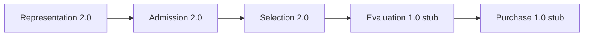

# Version 3 — P5 Freeze Report

**Date:** 2026-07-24  
**Status:** **P5 Freeze Complete**（Accuracy 実験・Evaluation 実装は未着手）  
**Design authority:** [`v3-design-report.md`](./v3-design-report.md)  
**Code root:** `research/v3_lab/`（V2 Production 非配線）  
**Baseline:** `research/v3_lab/baselines/lab_baseline_p5.json`  
**Freeze ID:** `v3-lab-freeze/1.0` · **Baseline ID:** `v3-lab-baseline-p5-v1`

---

## 1. 目的

Version 3 Lab の基盤（Pipeline / Contract / Flag / Registry / AB）を固定し、  
今後の Accuracy 実験を **別承認で開始できる状態**にする。  
新しいアルゴリズム追加は行わない。

---

## 2. Pipeline 最終図（Freeze）

```text
[A] Representation (P2)  →  [B] Admission (P3)  →  [C] Selection (P4)
         F_V3_REPRESENTATION      F_V3_ADMISSION         F_V3_SELECTION
                                                       ↓
                            [E] Purchase (stub)  ←  [D] Evaluation (stub)
```



| Stage | 実装 | Contract | Flag |
|-------|------|----------|------|
| Representation | Feature Generator | `v3-lab-representation/2.0` | `F_V3_REPRESENTATION` |
| Admission | AP-V3-A Banded Deep | `v3-lab-admission/2.0` | `F_V3_ADMISSION` |
| Selection | SEL-V3-RO Reorder | `v3-lab-selection/2.0` | `F_V3_SELECTION` |
| Evaluation | stub | `v3-lab-evaluation/1.0` | reserved |
| Purchase | stub | `v3-lab-purchase/1.0` | reserved |

**全 Flag OFF ⇒ identity（V2 Production 相当パス）。**

---

## 3. Contract 一覧（Freeze）

| Contract ID | Stage | Status |
|-------------|-------|--------|
| `v3-lab-representation/2.0` | Representation | **frozen** |
| `v3-lab-admission/2.0` | Admission | **frozen** |
| `v3-lab-selection/2.0` | Selection | **frozen** |
| `v3-lab-evaluation/1.0` | Evaluation | stub · frozen as stub |
| `v3-lab-purchase/1.0` | Purchase | stub · frozen as stub |
| `v3-lab-pipeline/1.0` | LabBundle | **frozen** |

定義: `research/v3_lab/contracts.py` · Freeze 定数: `freeze.FROZEN_CONTRACTS`

---

## 4. Feature Flag Inventory

| Flag | 既定 | 役割 |
|------|------|------|
| `F_V3_REPRESENTATION` | **OFF** | Representation 正本 |
| `F_V3_ADMISSION` | **OFF** | Admission 正本 |
| `F_V3_SELECTION` | **OFF** | Selection 正本 |
| `F_V3_*_ENABLED` | OFF | 上記 alias |
| `F_V3_LAB_ENABLED` | OFF | legacy / reserved |
| `F_V3_EVALUATION_ENABLED` | OFF | reserved（未実装） |
| `F_V3_PURCHASE_ENABLED` | OFF | reserved（未実装） |
| `F_V3_RANK_D1_ENABLED` | OFF | reserved Accuracy |
| `F_V3_RANK_D2_ENABLED` | OFF | reserved Accuracy |
| `F_V3_AP_BANDED_ENABLED` | OFF | reserved（Admission は `F_V3_ADMISSION`） |
| `F_V3_AP_COVERAGE_ENABLED` | OFF | reserved |
| `F_V3_SEL_REORDER_ENABLED` | OFF | reserved（Selection は `F_V3_SELECTION`） |

**Inventory 検証:** すべて既定 OFF · `any_stage_on=False` · OFF identity 維持。

---

## 5. Experiment Registry（固定）

`REGISTRY_FROZEN = True`

| Experiment ID | Phase | Status |
|---------------|-------|--------|
| `v3-p1-lab-harness` | P1 | complete · frozen |
| `v3-p2-representation` | P2 | complete · frozen |
| `v3-p3-admission` | P3 | complete · frozen |
| `v3-p4-selection` | P4 | complete · frozen |
| **`v3-p5-freeze`** | **P5** | **complete · frozen** |
| `v3-rank-d1-recal-285r-ab` | P2 | reserved |
| `v3-rank-d2-rerank-285r-ab` | P2 | reserved |
| `v3-ap-coverage-285r-ab` | P3 | reserved |
| aliases (`v3-ap-banded-deep-*` / `v3-sel-reorder-*`) | — | implemented_via_* |

新規 Accuracy 実験の追加は **別承認後**に Registry へ追記する（本 Freeze ではアルゴリズム追加なし）。

---

## 6. Lab Baseline

| 項目 | 値 |
|------|----|
| Path | `research/v3_lab/baselines/lab_baseline_p5.json` |
| Baseline ID | `v3-lab-baseline-p5-v1` |
| Control | V2 Final Hit **218** / 285R / miss 67 |
| Taxonomy lock | Eval28 + Boundary14 + Reorder10 + Pool9 + Delete6 = 67 |
| ready_for_accuracy_experiments | **True** |

生成: `python -m v3_lab.freeze`（`PYTHONPATH=research`）

---

## 7. AB Harness 最終結果

| Arm | Flag | Hit | churn | Hard Gate |
|-----|------|-----|-------|-----------|
| Control identity | all OFF | **218** | 0 | 未主張 |
| P2 Representation | `F_V3_REPRESENTATION` | **218** | 0 | 未主張 |
| P3 Admission | `F_V3_ADMISSION` | **218** | 0 | 未主張 |
| P4 Selection | `F_V3_SELECTION` | **218** | 0 | 未主張 |

| 検証 | 結果 |
|------|------|
| Control 再現 218/285R | **PASS** |
| 各 Stage parity | **PASS** |
| Hard Gate Hit>218 主張なし | **PASS**（意図的） |

---

## 8. Design ↔ 実装 整合性

| Design | 実装 | 判定 |
|--------|------|------|
| 5-stage pipeline | `pipeline.py` / `STAGE_ORDER` | **aligned** |
| 柱 I Representation | Feature Generator + Contract 2.0 | **aligned** |
| 柱 II Admission AP-V3-A | Banded Deep + Contract 2.0 | **aligned** |
| 柱 III Selection Reorder（Rescue 禁止） | SEL-V3-RO + Contract 2.0 | **aligned** |
| Evaluation / Purchase | stubs 1.0 | **stub_deferred** |
| V2 非干渉 · Flag OFF identity | 既定 OFF · 本番非配線 | **aligned** |

---

## 9. 変更ファイル一覧

| Path | 内容 |
|------|------|
| `research/v3_lab/freeze.py` | **新規** Freeze / Baseline 生成 |
| `research/v3_lab/baselines/lab_baseline_p5.json` | **新規** Lab Baseline |
| `research/v3_lab/registry.py` | P5 登録 · `REGISTRY_FROZEN` · P1–P4 frozen |
| `research/v3_lab/__init__.py` | freeze export |
| `research/v3_lab/tests/test_freeze.py` | **新規** |
| `research/v3_lab/tests/test_registry_debug.py` | P5 registry 検証 |
| `research/v3_lab/README.md` | P5 境界 |
| `docs/releases/v3-p5-freeze-report.md` | 本レポート |
| `docs/releases/v3-design-report.md` | P5 ステータス追記 |
| `docs/releases/v3-experiment-roadmap.md` | P5 完了マーク |

**未変更（ロジック）:** Version 2 Production / Representation / Admission / Selection / Prediction API / UI / Operations / Explainability  
**未着手:** Evaluation 実装 · Accuracy 改善実験

---

## 10. テスト結果

```text
cd research/v3_lab
python -m unittest discover -s tests -v
Ran 31+ tests — OK
```

| Test | Result |
|------|--------|
| Flag default OFF / identity | PASS |
| Contracts / Pipeline | PASS |
| P2–P4 AB parity | PASS |
| Freeze validate | PASS |
| Lab Baseline write | PASS |
| Registry P5 | PASS |

---

## 11. 停止条件

**P5 Freeze 完了。ここで停止する。**

- Accuracy 改善実験には着手しない
- Evaluation / Purchase 実装には着手しない
- V2 Production への配線は行わない

次の作業は、別承認による Accuracy 実験（例: Ranking D1）のみ。
