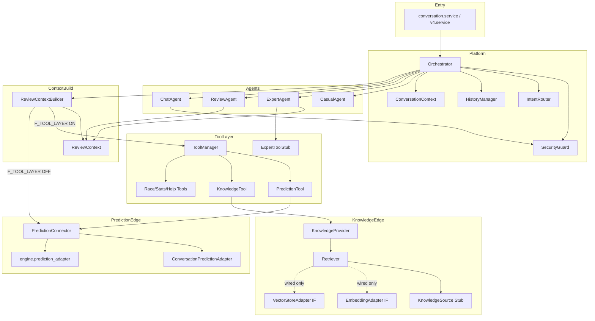

# Version 4 — Conversation AI Architecture Review

**Date:** 2026-07-25  
**Scope:** Conversation Platform 全体（Phase 3〜10 累積）  
**Type:** Design quality review（新機能追加なし · アプリコード変更なし）  
**Verdict:** **Conditional Freeze → Resolved by ADR-001…005（Final Freeze）**  
**See:** [`v4-conversation-platform-freeze.md`](./v4-conversation-platform-freeze.md) · [`../adr/README.md`](../adr/README.md)

---

## 0. Executive Summary

Version 4 Conversation AI は、**Orchestrator 中心の責務分離**と **Prediction Read-Only 境界**を一貫して守っており、Platform としての骨格は凍結に耐えうる。一方で、**(1) Security Guard の強制点が mode=chat に偏る、(2) Tool Layer Flag OFF 時の Connector 直結バイパス、(3) ExpertToolStub と Tool Manager の二重経路、(4) Feature Flag の組み合わせ複雑性**が、凍結前に文書化・合意すべき主要リスクである。

| 総合 | 評価 |
|------|------|
| 設計品質 | **B+** |
| Platform 凍結 | **Conditional Yes**（下記 Risk の受理または是正計画が前提） |
| Prediction 侵食 | **低**（構造上 Read-Only） |
| 拡張性（Knowledge / Memory） | **中〜高**（Interface は用意済み、配線規約の統一が必要） |

---

## 1. Architecture Review Report

### 1.1 Layer 構造（現状）

```text
API / service
    ↓
Orchestrator
    ↓
Security Guard（chat 強制 · 他 mode は履歴ゲート中心）
    ↓
Intent Router + Modes
    ↓
Agents: Casual | Expert | Review | Chat
    ↓
ReviewContextBuilder（Review / Explain）
    ↓
[Flag] Tool Manager → Tools → Prediction Connector / Knowledge Provider
    または
[Flag OFF] Prediction Connector 直接
    ↓
Prediction API（engine.adapters · Read Only）
Knowledge: Provider → Retriever → (Embedding/Vector Interface) → Source Stub
```

**判定: Layer は概ね適切。** 「会話生成」「公式予測取得」「共通知識」「短期履歴」「セキュリティ」が分離されている。

### 1.2 確認項目 1〜10

| # | 項目 | 判定 | 所見 |
|---|------|------|------|
| 1 | Layer が適切か | **Pass** | Orchestrator / Agent / Context / Tool / Prediction / Knowledge / History / Security の層が明確 |
| 2 | Interface が過不足ないか | **Pass−** | PredictionReadable / Retriever / Embedding / VectorStore / Tool は妥当。過剰な Abstract Factory はない。Help と Knowledge の役割重複が軽いノイズ |
| 3 | Stub と本実装の境界 | **Pass−** | Race/Statistics/Help/Knowledge Source は Stub 明示。Prediction Tool のみ本番接続。Flag OFF 時の Connector 直結は「本実装ショートカット」で境界がやや曖昧 |
| 4 | Embedding / Vector / Memory 追加耐性 | **Pass** | Retriever Interface 経由なら Provider を壊さず差し替え可。Memory は未導入で History と分離済み（侵食なし） |
| 5 | Prediction AI 責務侵食 | **Pass** | Connector は `get_with_meta` のみ。Ranking/Confidence 再計算なし |
| 6 | Prediction 変更不可の保証 | **Pass−** | 規約・`mutated=false`・投影コピー・出力ガードで多層防御。**型/権限による書込禁止は未実装**（運用規約依存） |
| 7 | Security Guard 迂回 | **Warn** | `mode=chat` は pre-router block。他 mode は履歴用 check のみで **Agent/Ollama 前の hard block ではない**。ChatAgent 内再検査あり。Review/Explain/Casual は Guard 通過を「前提」としているが Orchestrator 強制は弱い |
| 8 | Tool Manager 抽象化 | **Pass−** | Capability + Manager は適切。ただし Agents は Manager を直接呼ばず Builder 経由。Expert の非 Explain は **ExpertToolStub 並行** |
| 9 | Context / History 責務 | **Pass** | `ReviewContext`=公式根拠の統一入力。`ConversationContext`+History=短期セッション。Memory 非混在 |
| 10 | Platform 凍結品質 | **Conditional** | 骨格は凍結可。二重経路・Guard 適用範囲・Flag 行列の文書凍結が条件 |

### 1.3 責務分離

| モジュール | 責務 | 逸脱 |
|------------|------|------|
| Orchestrator | ルーティング・Flag・fail-open・履歴更新 | 肥大化気味（許容範囲） |
| ReviewAgent | `review(ReviewContext)` のみ · 文章生成 | Prediction 非接続（`connected=false` 固定は意味のねじれ） |
| ExpertAgent | Explain は Context · 他 intent は Stub | Tool Manager 非統一 |
| ChatAgent | 日常会話 · Guard 内再検査 | Prediction 非関与（良い） |
| ReviewContextBuilder | Official Prediction 組み立て | Flag で経路分岐（複雑度の主因） |
| Prediction Connector/Adapter | Read-Only 取得・投影 | 健全 |
| Tool Manager | Tool 単一窓口 | Builder 外からの利用が薄い |
| Knowledge Provider | Retriever のみ | 健全 |
| History | 短期 FIFO · 非永続 | Memory 未混入（良い） |
| Security Guard | Always-on ポリシー | 適用モードに偏り |

### 1.4 循環依存

静的 import 上、**循環依存は検出されない。**

- `knowledge` → `flags`（単方向）
- `tools` → `knowledge` / `prediction`（単方向）
- `context.builder` → `tools` / `prediction`（単方向）
- `agents` → `context` / `prompts`（単方向）
- `orchestrator` → 上記集約（最上位）

**判定: Pass**

### 1.5 Feature Flag 整理

| Flag | 既定 | 役割 |
|------|------|------|
| `F_V4_CONVERSATION_ENABLED` | OFF | Platform 全体 |
| `F_V4_CONVERSATION_OLLAMA` | OFF | LLM 呼び出し |
| `F_V4_REVIEW_AGENT` | OFF | Review 有効 |
| `F_V4_PERSONAL_CHAT` | OFF | Personal Chat |
| `F_V4_TOOL_LAYER` | OFF | Builder→Manager 経路 |
| `F_V4_KNOWLEDGE_LAYER` | OFF | Knowledge Tool 実行 |
| `F_V4_KNOWLEDGE_INTEGRATION` | OFF | Adapter 配線メタ |

**所見:** 段階導入としては正しいが、**組合せ行列が 2^7** に近づき、運用・テスト・凍結定義が重い。特に `TOOL_LAYER` と Prediction 経路の二重化は Platform 契約として一本化を推奨（後述 Proposal）。

### 1.6 拡張性 / 保守性 / テスト容易性

| 観点 | 評価 | 根拠 |
|------|------|------|
| 拡張性 | 高 | Protocol + Stub 差し替え、Fake Prediction Source 注入 |
| 保守性 | 中〜高 | Phase ドキュメント充実。Orchestrator と Flag 分岐が認知負荷 |
| テスト容易性 | 高 | ops テストで Fake Source / Flag / Manager 注入が確立 |

### 1.7 不要な抽象化

| 候補 | 判定 |
|------|------|
| Embedding / Vector Interface（未接続） | **必要**（将来差し替えの置き場。現状は軽い） |
| Help Tool + Knowledge Tool | **軽度の重複**（FAQ が二箇所） |
| ExpertToolStub + Tool Manager | **過渡的二重系**（整理候補） |
| `StubKnowledgeProvider` エイリアス | **互換用 · 許容** |

過度な DDD / 多層 Factory は見当たらない。**不要抽象の蔓延はなし。**

---

## 2. Dependency Diagram

### 2.1 論理依存（推奨読図）



### 2.2 依存ルール（凍結契約案）

1. **Agents は Prediction API / Knowledge Provider を直接 import しない**（現状: Review/Explain は遵守。Expert 他 intent は Stub のみ）
2. **Prediction への出口は Connector の Read メソッドのみ**
3. **Knowledge への出口は Tool Manager → Knowledge Tool → Provider → Retriever**
4. **History は Memory に昇格しない**（別 Phase）

---

## 3. Risk Report

| ID | 重大度 | リスク | 影響 | 現状緩和 | 凍結への含意 |
|----|--------|--------|------|----------|--------------|
| R1 | **High** | Guard の hard block が chat 偏重。Review/Explain/Casual は履歴ゲート中心 | プロンプト注入・漏洩系メッセージが LLM に到達しうる | Chat 二重検査 · Always-on ポリシー | 凍結時は「Guard 適用範囲=chat 優先」を明示するか、共通 pre-agent Guard を計画 |
| R2 | **Medium** | `F_V4_TOOL_LAYER=OFF` で Builder→Connector 直結 | Tool Manager 単一窓口の契約が Flag 依存 | Flag 既定 OFF · テストで両経路カバー | Platform 契約として Tool 経路を正規化するまで「過渡」と注記 |
| R3 | **Medium** | ExpertToolStub と Tool Manager の二重系 | 将来 Tool 追加時に経路漏れ | Explain は Context 経路 | 非 Explain Expert を Manager へ寄せる計画 |
| R4 | **Medium** | `mutated=false` は規約・メタ強制。書込 API 遮断はコード上未保証 | 将来開発者が write adapter を足す余地 | Read-only Connector · 投影コピー · Review 出力ガード | 凍結文書に「Write Adapter 禁止」を明文化 |
| R5 | **Low** | Help Tool と Knowledge FAQ の重複 | 応答の二重管理 | 双方 Stub | Knowledge へ集約候補 |
| R6 | **Low** | Review 応答 `prediction_meta.connected=false` 固定 | 運用メトリクスの誤解 | Builder meta は connected=true | 意味定義をドキュメント固定 |
| R7 | **Low** | Flag 組合せ爆発 | テスト・運用コスト | 既定すべて OFF | 推奨プロファイル（dev/stage/prod）を定義 |
| R8 | **Info** | Knowledge Integration の Adapter は NotImplemented | 誤って runtime 呼び出しすると例外 | Retriever は未使用 | 呼び出し禁止を lint/テストで固定推奨 |

### 循環依存リスク

**なし（現状）。** 追加時の危険パターンは `knowledge → tools → knowledge`。現在は `tools → knowledge` のみ。

---

## 4. Improvement Proposal（必要なもののみ）

Platform 凍結を優先するなら、**機能追加より契約の単線化**を推奨する。

### P1 — Security Guard 適用範囲の契約化（推奨 · 高）

- **現状:** chat は pre-router hard block。他 mode は履歴可否 + ChatAgent 内再検査。
- **提案:** 「全 mode で Agent/Ollama 前に Guard」を次イテレーションの必須契約にするか、意図的に chat-only と文書凍結する。
- **凍結時:** どちらかを **ADR 1 行で確定**。

### P2 — Prediction 取得経路の単線化（推奨 · 中）

- **現状:** Tool Layer Flag で Manager 経由 / Connector 直結が分岐。
- **提案:** 正規経路を `Builder → Tool Manager → Prediction Tool → Connector` に固定し、Flag は「Manager 無効化」ではなく「個別 Stub Tool の有効」に役割変更。
- **凍結時:** 「OFF は legacy 互換 · 次 major で削除」と注記でも可。

### P3 — ExpertToolStub の段階廃止（任意 · 中）

- 非 Explain Expert intent を Tool Manager Capability に寄せる。
- Explain/Review は現状のまま（Agent 非改変方針と整合）。

### P4 — Flag 推奨プロファイル（任意 · 低）

例:

| Profile | ENABLED | OLLAMA | REVIEW | CHAT | TOOL | KNOWLEDGE | INTEGRATION |
|---------|---------|--------|--------|------|------|-----------|-------------|
| freeze-safe | ON | OFF | ON | ON | ON | ON | OFF |
| llm-dev | ON | ON | ON | ON | ON | ON | OFF |

### やらないこと（本 Review の範囲外）

- Memory / Vector DB / Embedding 本実装
- UI
- Prediction AI 本体変更
- 本レビューに伴うコード修正

---

## 5. Freeze Decision

### 凍結してよいもの

- Orchestrator を中心とした Agent ディスパッチ契約
- ReviewContext を Review/Explain の唯一入力とする契約
- Prediction Read-Only（Connector `get_with_meta` のみ）契約
- Knowledge: Provider → Retriever Interface 契約
- History = 短期・非永続 · Memory 非混在
- Security Guard always-on（無効化不可）ポリシー自体

### 凍結前に合意が必要なもの

1. Security Guard の **適用 mode 範囲**（R1）
2. Tool Layer OFF 時の **Connector 直結を legacy として残すか**（R2）
3. `prediction_meta.connected` の **意味定義**（Agent 応答 vs Builder）（R6）

### 最終判定

**Conditional Freeze: Yes**

Version 4 は「会話 Platform」として骨格・境界・テスト容易性を備えており、**新機能を足す前に契約を文書凍結する段階**にある。上記 R1/R2 を ADR で固定すれば、Memory / Vector / UI に進んでも破綻しにくい。

---

## 6. Stop

Architecture Review 完了。アプリコード変更なし。  
次の実装 Phase（Memory / Embedding 本接続 / UI）には着手しない。
