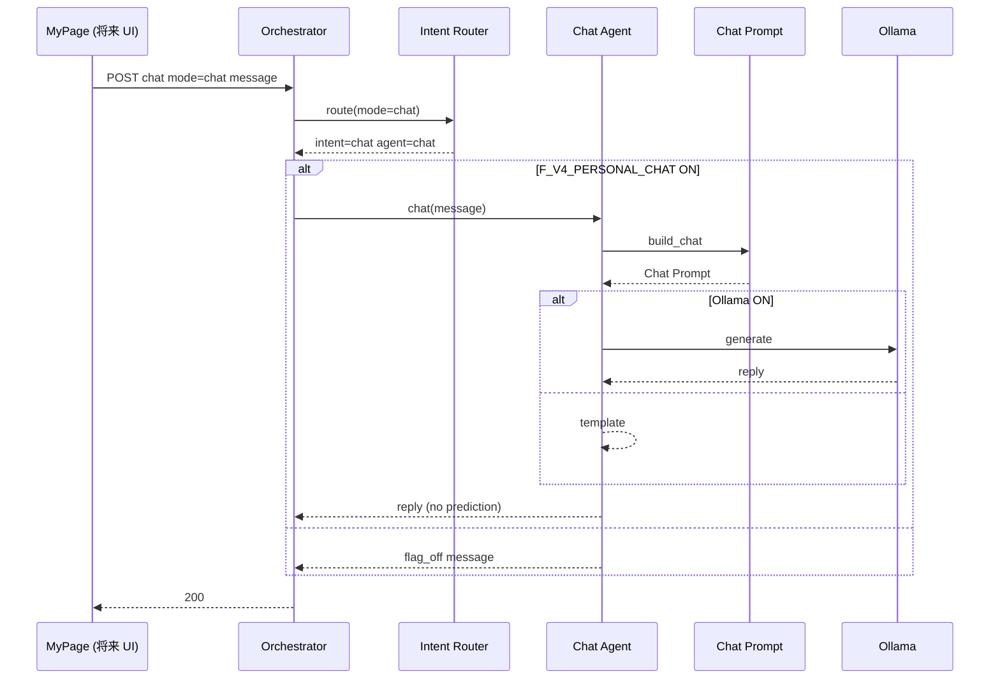

# Version 4 — Personal Chat Agent（マイページ日常会話）

**Date:** 2026-07-25  
**Status:** Implemented  
**Scope:** Personal Chat Agent のみ  
**Out of scope:** History · Memory · RAG · Tool Calling · UI

---

## 1. Architecture

```text
Conversation Orchestrator
        ↓
Intent Router
        ↓  (intent = chat のみ)
Chat Agent
        ↓
Chat Prompt
        ↓
Ollama
```

KAOBA / Review / Explain / Prediction とは **完全独立**。

---

## 2. Mode 定義

| Mode | UI 契約 | Intent | Agent |
|------|---------|--------|-------|
| `chat` | マイページ日常会話 | `chat` | `chat` |

Request: `{ "mode": "chat" }` または `{ "mode": "personal_chat" }`

---

## 3. Feature Flag

| Flag | 既定 |
|------|------|
| `F_V4_PERSONAL_CHAT` | **OFF** |

---

## 4. Sequence Diagram



---

## 5. 実装パス

| 要素 | Path |
|------|------|
| Chat Agent | `app/conversation/v4/agents/chat.py` |
| Chat Prompt | `prompts/builder.py` → `build_chat` / `CHAT_SYSTEM` |
| Intent Router | intent `chat` → agent `chat` |
| Mode | `modes.py` → `MODE_CHAT` |
| Flag | `F_V4_PERSONAL_CHAT` |

---

## 6. Stop

Chat Agent 実装完了。History / Memory / RAG / Tool / UI には着手しない。
