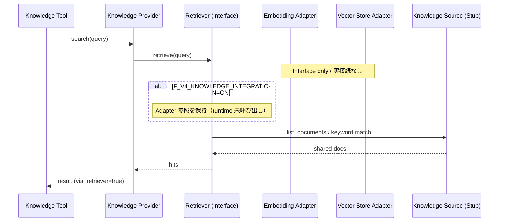

# Version 4 — Conversation AI Phase 10 · Knowledge Integration

**Date:** 2026-07-25  
**Status:** Implemented  
**Scope:** Knowledge Provider を Retriever Interface 利用構成へ置換（Adapter は Interface only）  
**Out of scope:** 実 Embedding · Vector DB · 外部 API · Memory · UI · Tool Manager 変更 · Agent 変更 · Security Guard 変更

---

## 1. Integration Report

### 目的

Knowledge Provider（Stub）を **実装可能な構成** に置き換える。Conversation Platform の構造は変更しない。

### 構成

```text
Knowledge Tool
      ↓
Knowledge Provider
      ↓
Retriever（Interface · Stub 実装は Source キーワードのみ）
      ↓
Embedding Adapter（Interface only · 未接続）
Vector Store Adapter（Interface only · 未接続）
      ↓
Knowledge Source（既存 Stub 維持）
```

### 提出物

| 提出物 | Path |
|--------|------|
| Retriever Interface | `knowledge/retriever.py`（`Retriever` + `StubRetriever`） |
| Embedding Adapter | `knowledge/embedding_adapter.py` |
| Vector Store Adapter | `knowledge/vector_store_adapter.py` |
| Knowledge Provider 更新 | `knowledge/provider.py`（Retriever のみ利用） |
| Flag | `F_V4_KNOWLEDGE_INTEGRATION`（既定 OFF） |
| Tests | `tests/ops/test_conversation_v4_knowledge_integration.py` |

### 不変条件

| 項目 | 値 |
|------|-----|
| Provider → Retriever | **のみ** |
| Provider → Embedding / Vector 直呼び | **禁止** |
| Embedding / Vector Store | **Interface only · 未接続** |
| Knowledge Source | **既存 Stub 維持** |
| Tool Manager / Agent / Security Guard | **変更なし** |
| `F_V4_KNOWLEDGE_INTEGRATION` | 既定 **OFF**（ON 時は Adapter を配線するが runtime 未使用） |

### 確認結果

| 確認項目 | 結果 |
|----------|------|
| Provider が `retriever.retrieve()` のみ使用 | OK |
| Embedding / Vector Adapter は interface_only · connected=false | OK |
| Source Stub 維持 | OK |
| Tool Manager 経路（Phase 9）互換 | OK |
| Flag 既定 OFF | OK |

---

## 2. Sequence Diagram



---

## 3. Stop

Knowledge Provider が Retriever Interface を利用する構成になったことを確認済み。  
**Embedding / Vector DB / 外部 API / Memory / UI には着手しない。**
