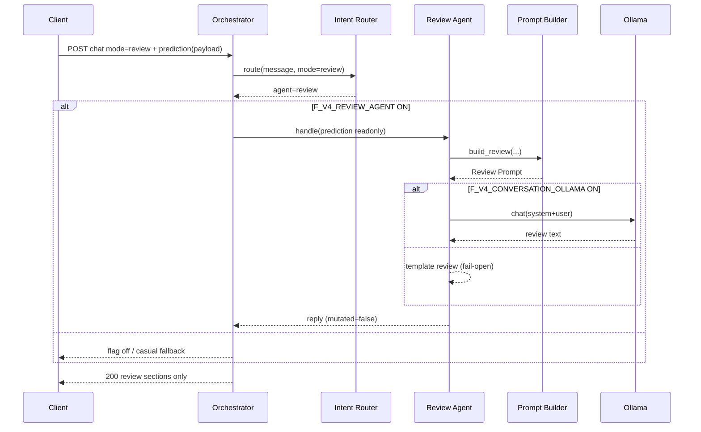

# Version 4 — Conversation AI Phase 3 · Review Agent

**Date:** 2026-07-25  
**Status:** Implemented（Review Agent 最小）  
**Scope:** Review Agent のみ  
**Out of scope:** Prediction API 実接続 · Tool 本実装 · RAG · 会話履歴 · UI 実装

---

## 1. Architecture

```text
Conversation Orchestrator
        ↓
Intent Router
        ↓
Review Agent
        ↓
Prompt Builder（Review Prompt）
        ↓
Ollama（F_V4_CONVERSATION_OLLAMA=ON 時）
```

Explain Mode は Expert Agent + **Explain Prompt**（Prompt Builder 分離）。

---

## 2. Mode 定義（UI 契約 · UI 未実装）

| UI | Mode | Agent | Prompt |
|----|------|-------|--------|
| KAOBAに◎の理由を聞く | `explain` | Expert | Explain Prompt |
| KAOBAに相談 | `review` | Review | Review Prompt |

Request 例: `{ "mode": "review" }` または `{ "context": { "type": "consult" } }`

実装: `app/conversation/v4/modes.py`

---

## 3. Review Rules

必須:

- 順位変更禁止
- 印変更禁止
- 買い目変更禁止
- Prediction AI が唯一の正解

回答してよい内容のみ:

- 予想の強み
- リスク
- 展開の注目点
- 初心者向けアドバイス

出力ガード: 書き換え誘導パターンを検出したら定型レビューへ差し替え。

---

## 4. Review Prompt Design

**System（要約）:** レビューのみ。順位・印・買い目変更禁止。Prediction が唯一の正解。

**User:** CONTEXT_JSON（prediction 投影・読取専用）+ 4 見出し指定。

Explain Prompt は別 system（選定理由の説明専用）。  
実装: `app/conversation/v4/prompts/builder.py`

---

## 5. Feature Flag

| Flag | 既定 | 意味 |
|------|------|------|
| `F_V4_REVIEW_AGENT` | **OFF** | Review Agent 有効化 |
| `F_V4_CONVERSATION_ENABLED` | OFF | Orchestrator 全体 |
| `F_V4_CONVERSATION_OLLAMA` | OFF | Ollama 呼び出し（Review 生成含む） |

Review 経路でも Prediction API には接続しない。`prediction` は request payload 受領のみ。

---

## 6. Sequence Diagram



---

## 7. 実装パス

| 要素 | Path |
|------|------|
| Review Agent | `app/conversation/v4/agents/review.py` |
| Prompt Builder | `app/conversation/v4/prompts/builder.py` |
| Intent Router | `app/conversation/v4/intent_router.py` |
| Modes | `app/conversation/v4/modes.py` |
| Flags | `app/conversation/v4/flags.py` |
| Tests | `tests/ops/test_conversation_v4_review_agent.py` |

---

## 8. Stop

Review Agent 実装完了。Prediction API 実接続・Tool・RAG・履歴・UI には着手しない。
