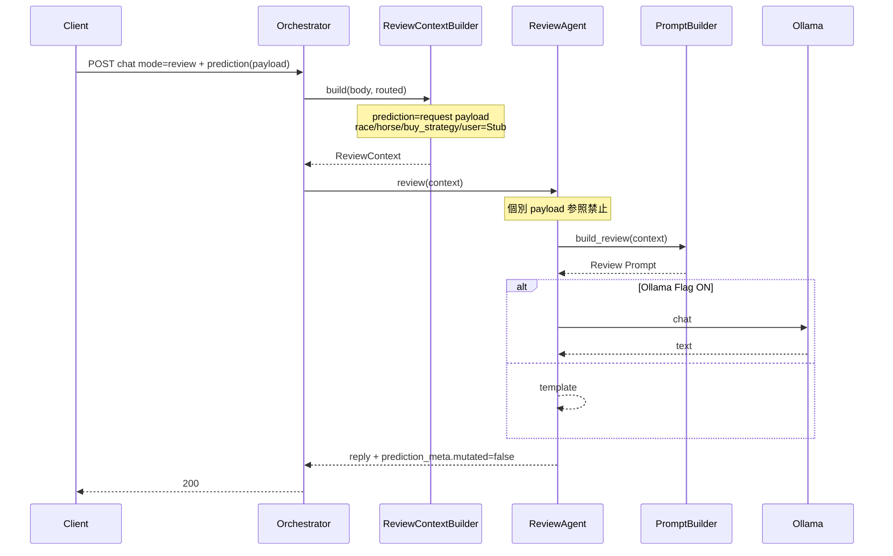

# Version 4 — Conversation AI Phase 4 · Review Context

**Date:** 2026-07-25  
**Status:** Implemented  
**Scope:** Review Context のみ  
**Out of scope:** Prediction API 実接続 · Tool · RAG · History · UI · Phase 5

---

## 1. ReviewContext

| フィールド | 本 Phase | 備考 |
|------------|----------|------|
| `mode` | set | review |
| `prediction` | request payload | API 未接続 |
| `prediction_meta` | set · `mutated=false` | `connected=false` |
| `buy_strategy` | Stub | |
| `race` | Stub | |
| `horse` | Stub | |
| `user` | Stub | |
| `request` | set | message / race_id / intent |

実装: `app/conversation/v4/context/review_context.py`  
Builder: `app/conversation/v4/context/builder.py`

---

## 2. Sequence Diagram

---

## 3. Integration Report

| 項目 | 結果 |
|------|------|
| Review Agent 公開 API | `review(context)` のみ（`handle` 削除） |
| Prompt Builder Review | `build_review(ReviewContext)` のみ |
| Orchestrator | Builder → `review(context)` |
| Prediction API | **未接続**（payload のみ） |
| `prediction_meta.mutated` | **false 維持** |
| Feature Flag | **変更なし・追加なし** |
| Mode / UI / DB / Prediction AI | **未変更** |

### 確認テスト

`tests/ops/test_conversation_v4_review_agent.py`

- Context 必須キー
- `review` が dict payload を TypeError
- Prompt Builder が旧シグネチャを TypeError
- Orchestrator 経由で `context_keys` 8 要素

---

## 4. Stop

Review Agent が ReviewContext のみで動作することを確認済み。  
Phase 5 / API 実接続 / UI には着手しない。
