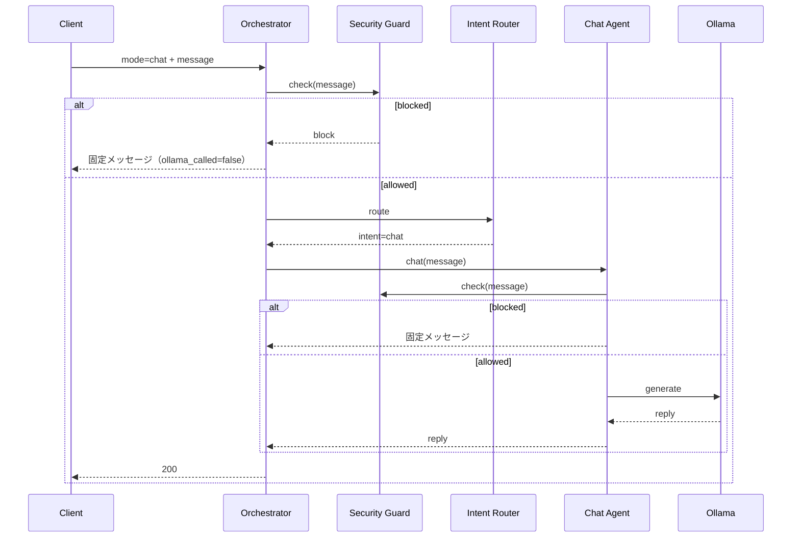

# Version 4 — Conversation AI Phase 5 · Security Guard

**Date:** 2026-07-25  
**Status:** Implemented  
**Scope:** Personal Chat Security Guard のみ  
**Out of scope:** Tool · History · Memory · Prediction API · UI · Mode 変更

---

## 1. Architecture

```text
Conversation Orchestrator
        ↓
Security Guard   ← 無効化不可 · Ollama 前必須
        ↓ (allow)
Intent Router
        ↓ (intent=chat)
Chat Agent
        ↓ Security Guard（再検査）
Chat Prompt
        ↓
Ollama
```

Block 時: **固定メッセージのみ**。Ollama は呼ばない。

---

## 2. Security Policy

| 項目 | 内容 |
|------|------|
| `SECURITY_GUARD_ALWAYS_ON` | `True`（Flag で OFF 不可） |
| 許可 | 日常会話 / 相談 / 学習 / 雑談 / 一般知識 |
| Block 応答 | 固定文（`BLOCK_FIXED_MESSAGE`） |

---

## 3. Block Rules（概要）

| rule_id | 対象 |
|---------|------|
| `sys_prompt` | System / Hidden Prompt |
| `internal_api` | 内部 API |
| `feature_flag` | Feature Flag |
| `prediction_internal` | Prediction AI 内部ロジック |
| `configuration` | Configuration |
| `env_secret` | Env / Secret / Token / Password |
| `infra` | Server / Database |
| `admin_debug` | 管理・デバッグ |
| `internal_path` | 内部パス |

---

## 4. Sequence Diagram



---

## 5. 実装パス

| 提出物 | Path |
|--------|------|
| Security Guard | `v4/security/guard.py` |
| Security Policy | `v4/security/policy.py` |
| Block Rule | `v4/security/rules.py` |
| Prompt 更新 | `CHAT_SYSTEM` に情報漏洩禁止 |
| Tests | `tests/ops/test_conversation_v4_security_guard.py` |

---

## 6. Stop

Security Guard が Ollama 呼び出し前に Block 判定することを確認済み。  
Tool / History / Memory / Prediction API には着手しない。
