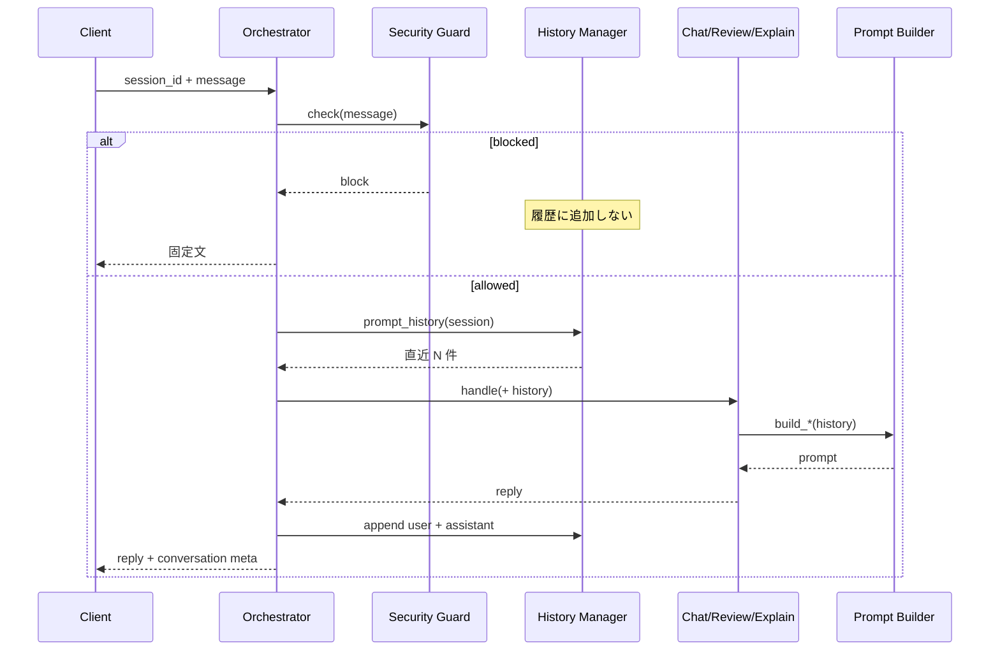

# Version 4 — Conversation AI Phase 6 · Conversation History

**Date:** 2026-07-25  
**Status:** Implemented  
**Scope:** セッション単位の短期 Conversation History のみ  
**Out of scope:** Memory · RAG · Tool · UI · Database · Prediction API

---

## 1. Conversation History

| 項目 | 内容 |
|------|------|
| 対象 | User Message / Assistant Message のみ |
| 単位 | `session_id` |
| 上限 | 設定可能（既定 20） |
| 淘汰 | FIFO |
| 永続化 | **禁止**（プロセスメモリのみ） |
| 共通 | Personal Chat / Review / Explain |

Security Guard 通過後の内容のみ保持（Guard 自体は変更なし）。

---

## 2. Components

| 提出物 | Path |
|--------|------|
| Conversation History | `v4/history/models.py` |
| History Manager | `v4/history/manager.py` |
| ConversationContext | `v4/context/conversation_context.py` |
| Prompt Builder | `build_chat` / `build_review` / `build_explain` に履歴ブロック |

設定:

- `CONVERSATION_HISTORY_MAX_MESSAGES`（既定 20）
- `CONVERSATION_HISTORY_PROMPT_TURNS`（既定 8 · Prompt に載せる直近件数）

---

## 3. Sequence Diagram

---

## 4. Stop

Conversation History 実装完了。Memory / Prediction API / RAG / Tool / UI には着手しない。
