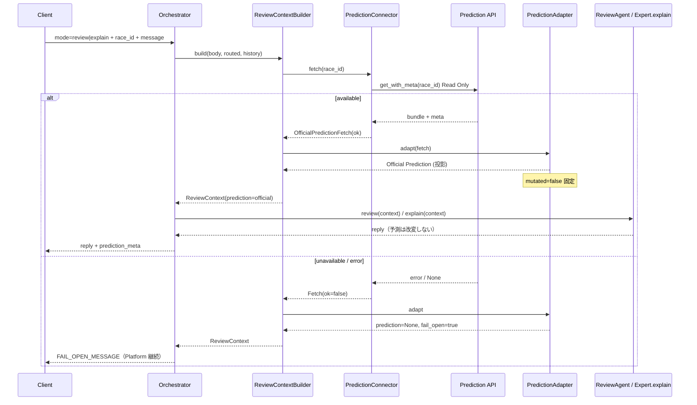

# Version 4 — Conversation AI Phase 7 · Prediction API Integration

**Date:** 2026-07-25  
**Status:** Implemented  
**Scope:** ReviewContextBuilder ↔ Prediction API（Read Only）正式接続  
**Out of scope:** Tool · Memory · RAG · UI · Ranking · Confidence · Purchase · History 変更 · Security Guard 変更 · Review Agent 変更

---

## 1. Integration Report

### 目的

Conversation AI は **Prediction AI の唯一の公式結果（Official Prediction）** のみを根拠に ReviewContext を構築する。

### 構成

```text
ReviewContextBuilder
        ↓
Prediction Connector（Read Only）
        ↓
Prediction API（engine.adapters.prediction_adapter.get_with_meta）
        ↓
Conversation Prediction Adapter（投影のみ · 非破壊）
        ↓
Official Prediction → ReviewContext.prediction
        ↓
ReviewAgent.review(context) / ExpertAgent.explain(context)
```

### 提出物

| 提出物 | Path |
|--------|------|
| Prediction Connector | `app/conversation/v4/prediction/connector.py` |
| Prediction Adapter | `app/conversation/v4/prediction/adapter.py` |
| ReviewContextBuilder 更新 | `app/conversation/v4/context/builder.py` |
| Explain ← ReviewContext | `app/conversation/v4/agents/expert.py`（`explain(context)`） |
| Orchestrator fail-open | `app/conversation/v4/orchestrator.py` |
| Tests | `tests/ops/test_conversation_v4_prediction_integration.py` |

### 不変条件

| 項目 | 値 |
|------|-----|
| `prediction_meta.mutated` | **常に `false`** |
| Prediction 書込み | **禁止**（Read Only） |
| request payload の prediction | **根拠にしない**（Official のみ） |
| Review Agent 公開 API | `review(context)` のみ（**変更なし**） |
| Review 応答 `prediction_meta.connected` | Agent 側で `false` 固定（接続は Builder 側。Agent 非改変） |
| Builder `prediction_meta.connected` | Official 取得時 `true` |
| Security Guard | 変更なし |
| fail-open | Prediction 不可時は固定メッセージ。Platform は停止しない |

### Fail-open 固定文

`FAIL_OPEN_MESSAGE`（`prediction/adapter.py`）:

> いま公式 Prediction を取得できないよ。Conversation はそのまま使えるから、レース画面で確認するか、少ししてからもう一度試してみてね。

### 確認結果

| 確認項目 | 結果 |
|----------|------|
| Connector → `get_with_meta` | OK（Fake / 実 Adapter 差し替え可） |
| Adapter 投影が bundle を破壊しない | OK |
| ReviewContext に Official Prediction | OK（`official: true`, `connected: true`） |
| request payload の偽 prediction を無視 | OK |
| Explain が ReviewContext を利用 | OK（`ExpertAgent.explain`） |
| Prediction 障害時 fail-open | OK（Casual 継続） |
| Review Agent シグネチャ不変 | OK |

---

## 2. Sequence Diagram



---

## 3. Stop

Prediction API 接続と Official Prediction → ReviewContext 取得を確認済み。  
**Tool / Memory / RAG / UI には着手しない。**
