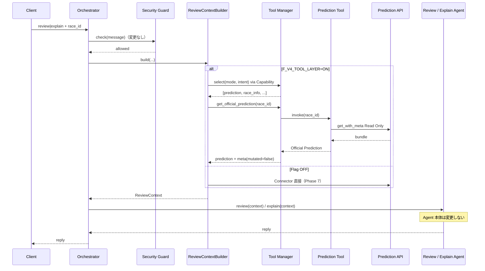

# Version 4 — Conversation AI Phase 8 · Tool Layer

**Date:** 2026-07-25  
**Status:** Implemented  
**Scope:** Tool Manager / Capability / Prediction·Race·Statistics·Help Tools  
**Out of scope:** Memory · RAG · UI · Review/Explain Agent 変更 · Security Guard 変更 · History 変更 · Prediction AI 変更

---

## 1. Integration Report

### 目的

Conversation Agent と Prediction API の間に **Tool Layer** を置き、Agent は **Tool Manager のみ** を利用する。

### 構成

```text
Review / Explain（ReviewContext 受信 · Agent 本体は未変更）
        ↓
ReviewContextBuilder
        ↓  F_V4_TOOL_LAYER=ON
Tool Manager  ← Capability 一覧を保持 · Tool 選択
        ↓
Prediction Tool（Read Only）
Race Info Tool（Stub）
Statistics Tool（Stub）
Help Tool（Stub）
        ↓
Prediction API（prediction のみ · 変更禁止）
```

Flag OFF（既定）時は Phase 7 互換（Builder → Prediction Connector 直接）。

### 提出物

| 提出物 | Path |
|--------|------|
| Tool Manager | `app/conversation/v4/tools/manager.py` |
| Capability 定義 | `app/conversation/v4/tools/capabilities.py` |
| Prediction Tool | `app/conversation/v4/tools/prediction_tool.py` |
| Race Info Tool (Stub) | `app/conversation/v4/tools/race_info_tool.py` |
| Statistics Tool (Stub) | `app/conversation/v4/tools/statistics_tool.py` |
| Help Tool (Stub) | `app/conversation/v4/tools/help_tool.py` |
| Flag | `F_V4_TOOL_LAYER`（既定 OFF） |
| Builder 配線 | `app/conversation/v4/context/builder.py` |
| Tests | `tests/ops/test_conversation_v4_tool_layer.py` |

### 不変条件

| 項目 | 値 |
|------|-----|
| Agent → 個別 Tool | **禁止**（Manager のみ） |
| Prediction Tool | **Read Only** · `mutated=false` |
| Race / Statistics | **Stub** · 実接続禁止 |
| Review / Explain Agent | **変更なし**（Builder 経由で Manager 利用） |
| Security Guard | **変更なし**（Tool 前に通過済み前提） |
| `F_V4_TOOL_LAYER` | 既定 **OFF** |

### 確認結果

| 確認項目 | 結果 |
|----------|------|
| Capability に 4 Tool | OK |
| Manager.select → prediction 優先（Review/Explain） | OK |
| Manager → Prediction Tool → Official Prediction | OK |
| Review / Explain が Manager 経由（meta.via=tool_manager） | OK |
| Review Agent シグネチャ不変 | OK |
| Flag 既定 OFF | OK |

---

## 2. Sequence Diagram



---

## 3. Stop

Tool Layer 導入完了。Review / Explain が Tool Manager 経由で Prediction Tool を利用できることを確認済み。  
**Memory / RAG / UI には着手しない。**
