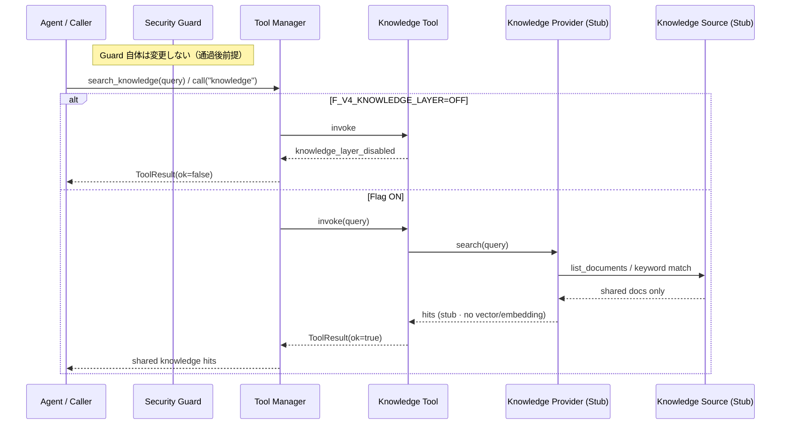

# Version 4 — Conversation AI Phase 9 · Knowledge Layer（RAG Foundation）

**Date:** 2026-07-25  
**Status:** Implemented  
**Scope:** 共通知識のみの Knowledge Layer（Stub）  
**Out of scope:** Memory · Vector DB · Embedding · UI · ユーザー固有情報 · Prediction 根拠 · Review/Explain Agent 変更 · Security Guard 変更

---

## 1. Integration Report

### 目的

Conversation AI が利用する **Knowledge Layer** を追加する。扱うのは **共通知識のみ**。

### 構成

```text
Agent
  ↓（個別 Provider 呼び出し禁止）
Tool Manager
  ↓
Knowledge Tool
  ↓
Knowledge Provider（Stub）
  ↓
Knowledge Source（Stub）
```

### 提出物

| 提出物 | Path |
|--------|------|
| Knowledge Source（Stub） | `app/conversation/v4/knowledge/source.py` |
| Knowledge Provider（Stub） | `app/conversation/v4/knowledge/provider.py` |
| Knowledge Tool | `app/conversation/v4/tools/knowledge_tool.py` |
| Capability 更新 | `app/conversation/v4/tools/capabilities.py`（`knowledge`） |
| Tool Manager 更新 | `search_knowledge()` / 登録 |
| Flag | `F_V4_KNOWLEDGE_LAYER`（既定 OFF） |
| Tests | `tests/ops/test_conversation_v4_knowledge_layer.py` |

### Knowledge Source 対象

| 許可 | 禁止 |
|------|------|
| FAQ | ユーザー固有情報 |
| ヘルプ | Prediction の根拠 |
| サービス説明 | Vector DB / Embedding |
| 用語集 | 外部 API |
| 競馬の一般知識 | Memory |

### 不変条件

| 項目 | 値 |
|------|-----|
| 呼び出し経路 | **Tool Manager のみ** |
| Provider 直接呼び出し | **禁止** |
| Security Guard | **変更なし**（通過後のみ利用前提） |
| Review / Explain / History | **変更なし** |
| `F_V4_KNOWLEDGE_LAYER` | 既定 **OFF** |

### 確認結果

| 確認項目 | 結果 |
|----------|------|
| Capability に `knowledge` | OK |
| Manager.search_knowledge → Tool → Provider → Source | OK |
| Flag OFF 時は disabled | OK |
| vector_db / embedding / user_private / prediction_rationale = false | OK |

---

## 2. Sequence Diagram



---

## 3. Stop

Knowledge Layer が Tool Manager 経由で利用できることを確認済み。  
**Memory / Vector DB / Embedding / UI には着手しない。**
