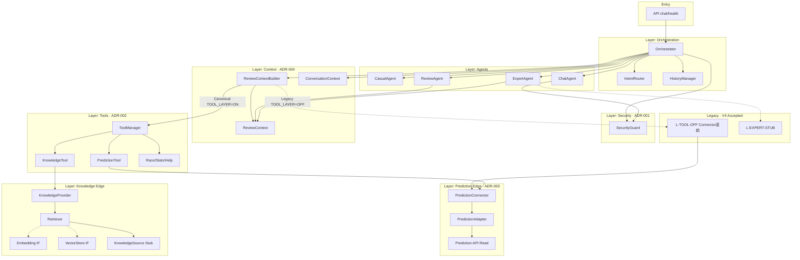

# Version 4 Platform — Final Freeze Report

**Date:** 2026-07-25  
**Status:** **FROZEN**  
**Basis:** ADR-001 … ADR-005 Accepted  
**Code changes in this freeze:** None（設計契約の正式化のみ）

---

## 1. Freeze Declaration

Version 4 Conversation Platform は、以下を満たしたため **正式に Freeze** する。

1. Architecture Review（Conditional Freeze）の未決事項を ADR で文書解決した
2. 各レイヤーの責務 · 依存方向 · 禁止事項 · 入出口 · Read Only · Flag · Legacy が定義された
3. 以降の破壊的変更は **新 ADR または V5** を要する

| 項目 | 結果 |
|------|------|
| Platform Freeze | **Yes · Final** |
| Prediction Read-Only | **契約化済み（ADR-003）** |
| Tool Manager Canonical | **契約化済み（ADR-002）** |
| Security Guard | **契約化済み（ADR-001）** |
| ReviewContext | **契約化済み（ADR-004）** |
| Layer 全体 | **契約化済み（ADR-005）** |

---

## 2. ADR 解決サマリ（Review → Freeze）

| Review Risk | ADR 解決 |
|-------------|----------|
| R1 Guard chat 偏重 | ADR-001: V4 は chat hard block を第一契約として **受理** |
| R2 Tool Layer OFF 直結 | ADR-002: **Legacy L2-A** として明示 · Canonical は Manager |
| R3 ExpertToolStub | ADR-002: **Legacy L2-B** |
| R4 Write 規約依存 | ADR-003: Write Adapter 追加禁止を契約化 |
| R6 connected 意味 | ADR-003: Builder vs Agent 応答の定義を固定 |

---

## 3. Frozen Contracts（要約）

### 唯一の入口

| 対象 | 入口 |
|------|------|
| Platform | `chat` / `health` → Orchestrator |
| Security | `SecurityGuard.check` |
| Tools | `ToolManager.call*` / `get_official_prediction` / `search_knowledge` |
| Review/Explain 入力 | `ReviewContext`（Builder 経由） |
| Prediction 読取 | `PredictionConnector.fetch` → `get_with_meta` |

### 唯一の出口

| 対象 | 出口 |
|------|------|
| ユーザー | Orchestrator 応答 dict |
| Prediction | Official Prediction 投影（書込なし） |
| Knowledge | ToolResult（共通知識 hits） |
| Guard Block | 固定文 · Ollama なし |

### Read Only

- Conversation → Prediction は Read Only（ADR-003）
- ToolResult.mutated = false
- request payload prediction は Official にしない

---

## 4. Feature Flag（Freeze 運用）

| Flag | 既定 | Freeze 意味 |
|------|------|-------------|
| `F_V4_CONVERSATION_ENABLED` | OFF | Platform マスタ |
| `F_V4_CONVERSATION_OLLAMA` | OFF | LLM 許可 |
| `F_V4_REVIEW_AGENT` | OFF | Review 実行 |
| `F_V4_PERSONAL_CHAT` | OFF | Chat 実行（Guard 常時） |
| `F_V4_TOOL_LAYER` | OFF | OFF=Legacy直結 / ON=Canonical |
| `F_V4_KNOWLEDGE_LAYER` | OFF | KnowledgeTool |
| `F_V4_KNOWLEDGE_INTEGRATION` | OFF | Adapter 配線のみ |

**本番推奨（freeze-safe）:** `ENABLED` + `TOOL_LAYER=ON`。Knowledge 利用時のみ `KNOWLEDGE_LAYER=ON`。Integration は実接続まで OFF。

---

## 5. Legacy（V4 受理 · 削除は V5）

| ID | 内容 |
|----|------|
| L-TOOL-OFF | Builder → Connector 直結 |
| L-EXPERT-STUB | ExpertToolStub |
| L-HELP-FAQ | Help と Knowledge FAQ 併存 |

詳細は Migration Notes。

---

## 6. Out of Freeze（着手禁止のまま）

- Memory
- 実 Embedding / Vector DB / 外部 Knowledge API
- UI
- Prediction AI 本体 · Ranking · Confidence · Purchase
- Guard 全 mode hard block（要 新 ADR）

---

## 7. Dependency Diagram（最新版）

**依存ルール（Freeze）:** 矢印は上から下のみ。Prediction API → Conversation 逆依存禁止。Agents → Connector/Provider 直接禁止（Canonical）。

---

## 8. Freeze Checklist

| チェック | 結果 |
|----------|------|
| ADR-001 完成 | Yes |
| ADR-002 完成 | Yes |
| ADR-003 完成 | Yes |
| ADR-004 完成 | Yes |
| ADR-005 完成 | Yes |
| Dependency Diagram 最新化 | Yes |
| Migration Notes | Yes |
| アプリコード変更なし | Yes |
| Platform Final Freeze 宣言 | **Yes** |

---

## 9. Stop

ADR 一式が完成し、Version 4 Platform を **正式に Freeze** できる状態を確認した。  
ここで停止する。コード変更・Memory / UI / Embedding 本接続には着手しない。
