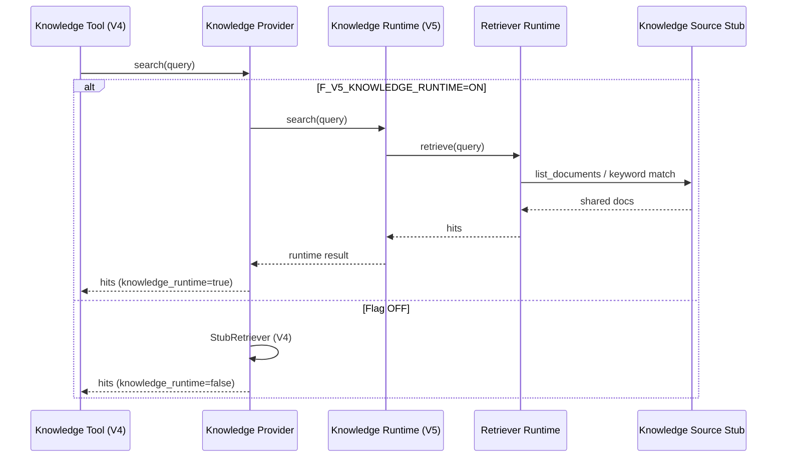

# Version 5 — Phase 1 · Knowledge Runtime

**Date:** 2026-07-25  
**Status:** Implemented  
**Scope:** Knowledge Runtime → Retriever Runtime → Knowledge Source Stub  
**V4 Platform:** Freeze 維持（ADR-001〜005 遵守 · Orchestrator / Tool Manager / Agents 未変更）

---

## 1. Integration Report

### 目的

V4 Knowledge Layer を、検索結果を返せる **Knowledge Runtime** へ発展させる。  
Embedding / Vector DB / RAG / Memory / UI / LLM は対象外。

### 構成

```text
Knowledge Tool（V4 · 未変更）
      ↓
Knowledge Provider（配線更新のみ）
      ↓  F_V5_KNOWLEDGE_RUNTIME=ON
Knowledge Runtime（V5）
      ↓
Retriever Runtime（Retriever Interface 実装）
      ↓
Knowledge Source（既存 Stub）
```

Flag OFF 時は V4 StubRetriever 経路（Freeze 互換）。

### 提出物

| 提出物 | Path |
|--------|------|
| Knowledge Runtime | `app/conversation/v5/knowledge/runtime.py` |
| Retriever Runtime | `app/conversation/v5/knowledge/retriever_runtime.py` |
| Knowledge Provider 更新 | `app/conversation/v4/knowledge/provider.py` |
| Flag | `F_V5_KNOWLEDGE_RUNTIME`（既定 OFF） |
| Tests | `tests/ops/test_conversation_v5_knowledge_runtime.py` |

### 未変更（遵守）

- Conversation Platform / Orchestrator / Tool Manager
- Security Guard / Review / Explain / Chat Agents
- Conversation Context / History / ReviewContext
- Prediction Tool / Prediction API
- ADR 文書

### 確認結果

| 項目 | 結果 |
|------|------|
| Runtime → Source Stub 検索 | OK |
| Retriever Runtime が hits を返す | OK |
| Provider が Runtime 経由（Flag ON） | OK |
| Tool → Provider → Runtime（Manager 未変更） | OK |
| Flag 既定 OFF · V4 互換 | OK |
| embedding / vector_db / rag = false | OK |

---

## 2. Sequence Diagram



---

## 3. Stop

Knowledge Runtime が Knowledge Source Stub を利用して検索結果を返せることを確認済み。  
**Embedding / Vector Database / Memory / UI / RAG には着手しない。**
