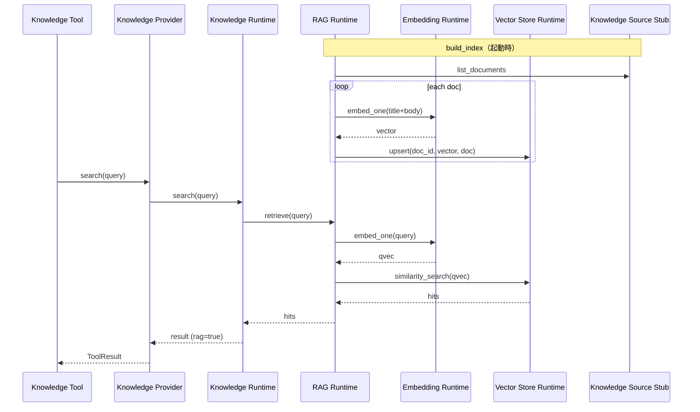

# Version 5 — Phase 2 · Knowledge Runtime Completion

**Date:** 2026-07-25  
**Status:** Implemented + Benchmark Complete  
**Scope:** Embedding Runtime · Vector Store Runtime · RAG Runtime · Knowledge Runtime 更新  
**V4 Platform:** Freeze 維持（Tool Manager / Agents / ADR / Prediction 未変更）

---

## 1. Integration Report

### 構成（完成形）

```text
Knowledge Tool（V4 · 未変更）
      ↓
Knowledge Provider
      ↓  F_V5_KNOWLEDGE_RUNTIME=ON
Knowledge Runtime（phase=2）
      ↓ 既定
RAG Runtime
  ├─ Embedding Runtime（local hashing · 外部 API なし）
  ├─ Vector Store Runtime（in-memory · クラウド DB なし）
  └─ Knowledge Source Stub
      ↕ フォールバック / Benchmark
Retriever Runtime（キーワード）
```

### 提出物

| 提出物 | Path |
|--------|------|
| Embedding Runtime | `app/conversation/v5/knowledge/embedding_runtime.py` |
| Vector Store Runtime | `app/conversation/v5/knowledge/vector_store_runtime.py` |
| RAG Runtime | `app/conversation/v5/knowledge/rag_runtime.py` |
| Knowledge Runtime 更新 | `app/conversation/v5/knowledge/runtime.py`（phase=2） |
| Provider 通過フィールド更新 | `v4/knowledge/provider.py` |
| Benchmark スクリプト | `tests/ops/bench_conversation_v5_knowledge_runtime.py` |
| Benchmark JSON | `docs/releases/v5-phase2-knowledge-runtime-benchmark.json` |

### 制約遵守

| 項目 | 状態 |
|------|------|
| 外部 Embedding API | 未接続（local hashing） |
| クラウド Vector DB | 未接続（in-memory） |
| LLM 生成 | なし（検索のみ RAG） |
| Memory / UI | 未着手 |
| Tool Manager / Agents / Platform | 未変更 |

---

## 2. Sequence Diagram



---

## 3. Runtime Benchmark Report

**条件:** rounds=30 · warmup=3 · query=`本命の意味` · Windows · ローカルプロセス  
**スクリプト:** `python -m tests.ops.bench_conversation_v5_knowledge_runtime`  
**生データ:** `v5-phase2-knowledge-runtime-benchmark.json`

### 結果（mean / median / p95 · ms）

| 計測対象 | mean_ms | median_ms | p95_ms | min_ms | max_ms |
|----------|---------|-----------|--------|--------|--------|
| Embedding Runtime | 0.0110 | 0.0109 | 0.0112 | 0.0106 | 0.0116 |
| Vector Store Runtime | 0.0523 | 0.0448 | 0.0727 | 0.0427 | 0.1215 |
| Retriever Runtime | 0.0091 | 0.0091 | 0.0094 | 0.0089 | 0.0096 |
| RAG Runtime | 0.0597 | 0.0584 | 0.0637 | 0.0553 | 0.0854 |
| Knowledge Provider | 0.0699 | 0.0652 | 0.0786 | 0.0629 | 0.1367 |
| Knowledge Tool | 0.0679 | 0.0640 | 0.0820 | 0.0624 | 0.1080 |
| Knowledge Tool via Manager | 0.0651 | 0.0647 | 0.0670 | 0.0626 | 0.0709 |
| **Knowledge Runtime 全体** | **0.0597** | **0.0592** | **0.0622** | 0.0574 | 0.0651 |

### Sanity

| 項目 | 値 |
|------|-----|
| search_path | `rag_runtime` |
| phase | 2 |
| hit_count | 5 |
| embedding_local | true |
| vector_store_local | true |
| external_api | false |
| llm | false |
| indexed docs | 9 |

### 所見

- RAG 経路（Embedding + Vector Store）でも **サブ ms〜0.1ms 台**で安定
- Keyword Retriever は最速（比較用）
- Provider / Tool / Manager 経由のオーバーヘッドは小さい
- 外部 API / LLM レイテンシは含まない（ローカル Runtime のみ）

---

## 4. Stop

Knowledge Runtime 全体の Runtime Benchmark 完了を確認した。  
**Memory / UI には着手しない。**
