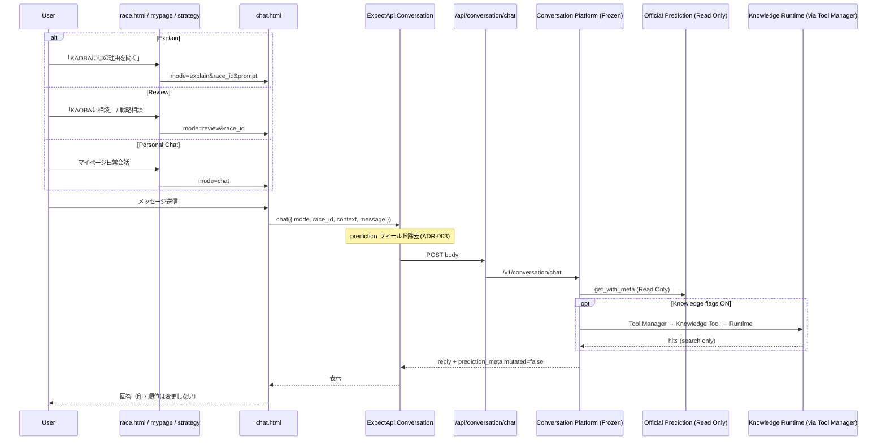

# Version 5 — Phase 3 · Conversation UI Integration

**Date:** 2026-07-25  
**Status:** Implemented  
**Scope:** Conversation UI · API Integration · UI Sequence（Review / Explain / Personal Chat）  
**V4 Platform:** Freeze 維持  
**ADR:** ADR-001〜005 遵守  
**Memory:** 未着手（本 Phase 対象外）

---

## 1. Integration Report

### 目的

Conversation Platform を既存 UI から利用できるようにする。

| 対象 | UI 導線 | mode |
|------|---------|------|
| KAOBA Explain（◎の理由） | レース詳細 CTA / 説明パネルリンク | `explain` |
| KAOBA Review（相談） | レース詳細 CTA / 戦略「KAOBAに相談する」 | `review` |
| Personal Chat（日常会話） | マイページ | `chat` |

### 変更範囲（UI のみ）

| 成果物 | Path |
|--------|------|
| Conversation クライアント | `public/assets/api/conversation.js` |
| Conversation UI ヘルパー | `public/assets/api/conversation-ui.js` |
| チャット画面 | `public/chat.html` |
| レース詳細 | `public/race.html`（スクリプト・`mountRaceCtas`） |
| マイページ | `public/mypage.html`（Personal Chat リンク） |
| 戦略画面導線 | `public/strategy.html`（`mode=review`） |
| Explain リンク | `public/assets/api/prediction-bind.js`（`mode=explain`） |
| CTA スタイル | `public/assets/screens.css`（`.v5-conversation-*`） |

### 変更禁止（未変更を確認）

| 層 | 状態 |
|----|------|
| Conversation Platform（V4 Orchestrator / Agents / Modes） | 未変更 |
| Tool Manager | 未変更 |
| Security Guard | 未変更 |
| Prediction API | 未変更（Read Only） |
| Knowledge Runtime（V5） | 未変更 |
| Memory | 未着手 |

### API Integration

```text
UI (chat.html / CTAs)
  → ExpectApi.Conversation.chat | explain | review | personalChat
  → POST /api/conversation/chat（BFF · 既存）
  → /v1/conversation/chat（Conversation Platform · Freeze）
```

クライアント契約（ADR 準拠）:

- **ADR-003:** リクエストから `prediction` / `prediction_bundle` を除去。UI は Official Prediction を上書きしない。
- **mode:** `explain` / `review` / `chat` を正規化して送信。
- **context.type:** `honmei_reason` / `consult` | `strategy_review` / `personal_chat`。
- 応答の `prediction_meta.mutated === false` を UI で表示（Read Only 可視化）。

### Knowledge Runtime（Conversation 経由の確認）

Knowledge Runtime 自体は変更しない。既存経路で Conversation から到達可能であることを確認した。

```text
Conversation（Orchestrator / Agents）
  → Tool Manager.search_knowledge（既存）
  → Knowledge Tool（F_V4_KNOWLEDGE_LAYER=ON）
  → Knowledge Provider
  → Knowledge Runtime（F_V5_KNOWLEDGE_RUNTIME=ON · Phase 2）
  → RAG / Retriever Runtime → Source Stub
```

UI は Knowledge を直接呼ばない。Conversation API 経由のみ。

### 停止条件チェック

| 条件 | 結果 |
|------|------|
| UI から Review が利用できる | ✅ `chat.html?mode=review&race_id=…` / レース CTA / 戦略相談 |
| UI から Explain が利用できる | ✅ `chat.html?mode=explain&race_id=…` / レース CTA |
| UI から Personal Chat が利用できる | ✅ `chat.html?mode=chat` / マイページ |
| Prediction Read Only 維持 | ✅ クライアント送信禁止 + meta 表示 |
| Memory 未着手 | ✅ |
| V4 Freeze / Knowledge Runtime 未変更 | ✅ |

---

## 2. UI Sequence



### 画面別エントリ

| 画面 | URL / 操作 |
|------|------------|
| Explain | `chat.html?mode=explain&race_id={id}&prompt=なぜ本命なの？理由を教えて` |
| Review | `chat.html?mode=review&race_id={id}&prompt=この予想について相談したい` |
| Review（戦略） | `chat.html?mode=review&from=strategy&race_id={id}` |
| Personal Chat | `chat.html?mode=chat` |

---

## 3. ADR 遵守メモ

| ADR | UI Integration での扱い |
|-----|-------------------------|
| ADR-001 | Guard は Platform 側。UI は mode を正しく渡し、ブロック応答をそのまま表示 |
| ADR-002 | Tool 呼び出しは Platform / Tool Manager。UI は直接 Tool を呼ばない |
| ADR-003 | Conversation クライアントが client prediction を送らない |
| ADR-004 | Review/Explain は Platform の ReviewContext。UI は race_id + mode + context.type のみ |
| ADR-005 | Knowledge は Flag 制御の既存経路。UI は Flag を迂回しない |

---

## 4. 次 Phase（参考・未実施）

- Memory
- Knowledge Runtime の追加実装
- Conversation Platform 構造変更

本 Phase は **Conversation UI Integration 完了** で停止する。
