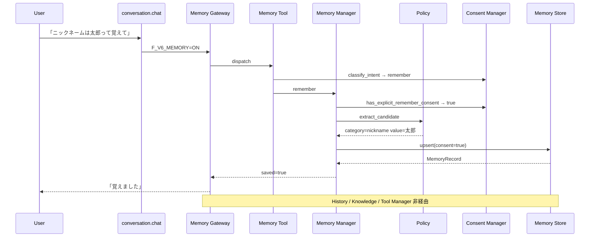
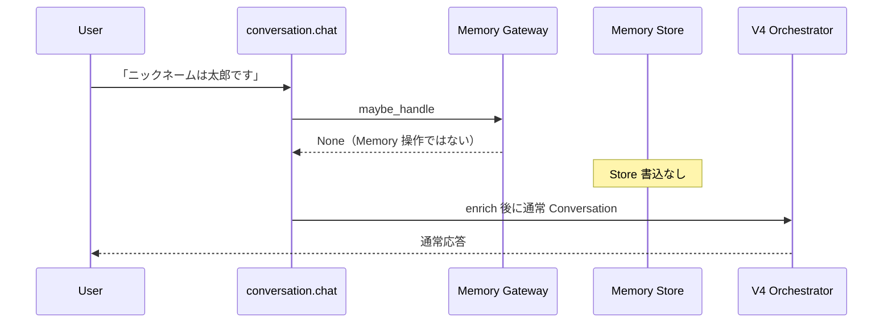
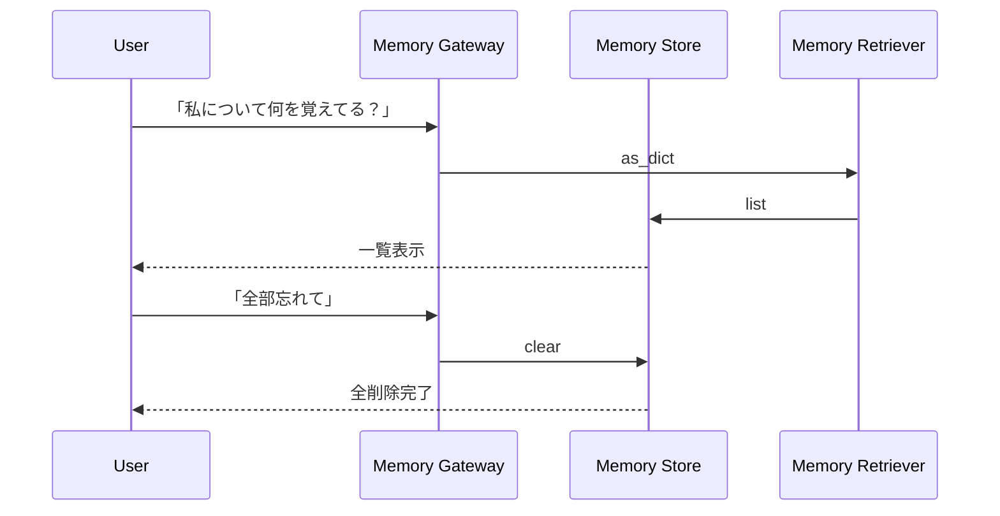

# Version 6 Phase 2 — Memory Platform Report

**Date:** 2026-07-25  
**Status:** COMPLETE（停止条件達成）  
**Scope:** Consent-only Long-term Memory Platform  
**Freeze:** Version 4 Platform · Knowledge Runtime · Tool Manager · Prediction · Security Guard · Conversation History · Review / Explain / Personal Chat **未変更**

---

## 1. What changed

| Item | Path | Change |
|------|------|--------|
| Memory Platform | `app/conversation/v6/memory/*` | Store / Retriever / Manager / Policy / Consent / Tool / Gateway |
| Flag | `v4/flags.py` | `F_V6_MEMORY` 加算（既定 OFF） |
| Entry wiring | `conversation/__init__.py` | Gateway 前段（Flag ON 時のみ） |
| ADR | `docs/adr/ADR-006-memory-layer-contract.md` | Memory Layer Contract |
| Spec | `docs/releases/v6-phase2-memory-specification.md` | 仕様 |
| Env example | `infra/aws/systemd/conversation.env.example` | `F_V6_MEMORY=OFF` |
| Tests | `tests/ops/test_conversation_v6_memory.py` | Consent-only 証拠 |

**未変更:** `v4/orchestrator.py` · `v4/agents/*` · `v4/history/*` · `v4/tools/manager.py` · `v4/security/*` · `v4/prediction/*` · `v5/knowledge/*` · Knowledge Source / Provider / Retriever / Tool

---

## 2. 提出物

| 成果物 | 場所 |
|--------|------|
| Memory Platform | `app/conversation/v6/memory/` |
| Consent Flow | ConsentManager + MemoryManager.remember |
| Memory Specification | `docs/releases/v6-phase2-memory-specification.md` |
| Memory Report | 本ドキュメント |
| Sequence Diagram | §4 |
| ADR-006 | `docs/adr/ADR-006-memory-layer-contract.md` |

---

## 3. Feature Flag

| Flag | Default | Production recommendation |
|------|---------|---------------------------|
| `F_V6_MEMORY` | **OFF** | 検証完了まで OFF |

---

## 4. Sequence Diagram

### 4.1 明示同意で保存

### 4.2 同意なし（自動保存禁止）

### 4.3 一覧 / 削除

---

## 5. Stop condition evidence

| 条件 | 結果 |
|------|------|
| 「覚えて」あり → 保存 | `test_with_consent_saves` |
| 「覚えて」なし → 保存しない | `test_without_consent_does_not_save` |
| 雑談 Preference のみ → 保存しない | `test_gateway_ignores_casual_preference_without_consent` |
| 禁止トピックは同意があっても拒否 | `test_forbidden_topic_rejected_even_with_consent` |
| History とストレージ分離 | `test_memory_separated_from_history_store` |
| Tool Manager 非登録 | `test_tool_not_in_tool_manager` |
| Flag 既定 OFF | `test_flag_default_off_in_snapshot` |

**自動保存経路は実装していない。** Memory は Long-term のみ（`var/memory/*.json`）。

---

## 6. Out of scope（本 Phase でやらない）

- Memory の本番 Flag ON
- Embedding / Vector 化 Memory
- UI（マイページ Memory 設定画面）
- V4 Platform / Knowledge Runtime 改修
- Short-term working memory（History と混同しない）
