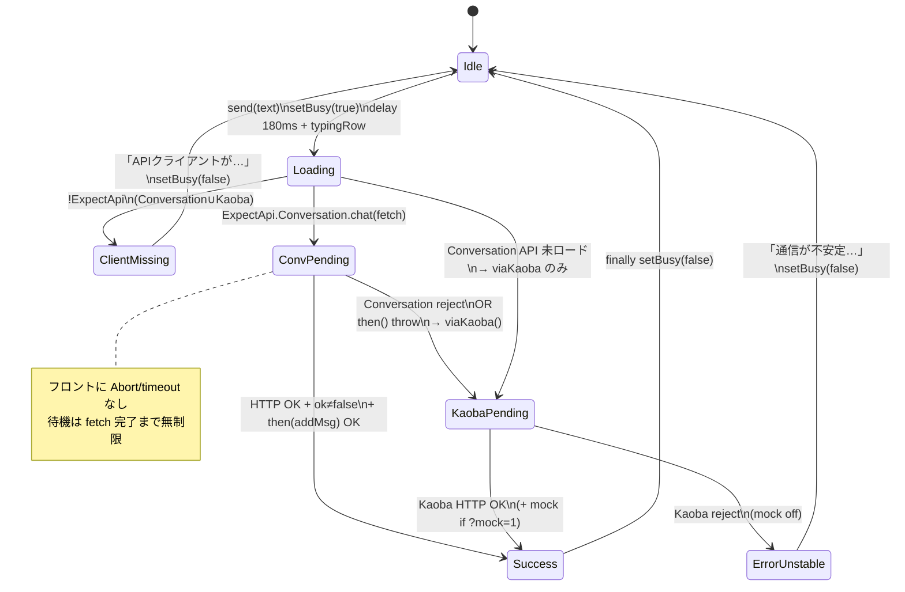

# UI18 — Explain Chat 状態遷移

Audit date: 2026-07-30  
Action Type: Audit Only

---

## 状態定義（UI）

| 状態 | UI 表現 | コード上の印 |
|------|---------|--------------|
| **Idle** | 入力可 | `setBusy(false)` |
| **Loading** | 入力不可 + typing 行 | `setBusy(true)` → `ExpectUx.typingRow()`（180ms 後） |
| **Success** | AI 吹き出し（reply） | `addMsg(..., "ai")` / `asHtml` |
| **Error（通信不安定）** | 固定文言吹き出し | `dispatchChat().catch` → `addMsg("いま通信が不安定…")` |
| **Error（クライアント未読込）** | 別文言 | ExpectApi なし |

明示的な `state = 'error'` 変数はなく、吹き出し追加 + `finally { setBusy(false) }` で Idle 復帰。

---

## 状態遷移図



---

## 詳細フロー（Explain）

```
[User Send]
    │
    ├─ addMsg(user)
    ├─ setBusy(true)          ← Loading 開始
    └─ setTimeout(180ms)
            │
            ├─ typingRow()
            │
            ├─ (!ExpectApi) → 「APIクライアント…」→ Idle
            │
            └─ dispatchChat()
                   │
                   ├─[1] Conversation.chat ─────────────────────────┐
                   │         │                                      │
                   │         ├─ resolve → addMsg(reply) → Success   │
                   │         │                                      │
                   │         └─ reject / then throw                 │
                   │                   │                            │
                   │                   ▼                            │
                   └─[2] viaKaoba / Kaoba.chat ◄────────────────────┘
                              │
                              ├─ resolve → addMsg(reply) → Success
                              │
                              └─ reject
                                    │
                                    ▼
                         dispatchChat().catch
                                    │
                                    ├─ strategyReply? → local HTML Success
                                    └─ else → 「通信が不安定…」→ Error
                                    │
                                    ▼
                              finally → setBusy(false) → Idle
```

---

## HTTP 200 → Error 経路の有無

### ある（間接）

```
Conversation HTTP 200
  → client が throw（ok:false / null body.__meta / then 例外）
  → viaKaoba
  → Kaoba も fail
  → 「通信が不安定」
```

つまり **「HTTP 200 単体で即 Error」ではなく、「200 でもクライアントが失敗扱い → フォールバックも失敗」** のときのみ。

### ない

```
Conversation HTTP 200 + ok + data + then 正常
  → Success のみ（Error 遷移なし）
```

Ollama が遅くても **29s で 200 + reply** なら Success。Loading が長いだけ。

---

## Loading の終了条件

| イベント | Loading 終了 |
|----------|--------------|
| Success addMsg | `finally` |
| Error「不安定」 | `finally` |
| API 未読込 | 明示 `setBusy(false)` |
| strategy ローカル | 明示 `setBusy(false)` |

途中でキャンセル UI / Abort はない → ユーザーは応答か Error まで待つ。

---

## プローブ HTTP 200 と画面 Error の両立

| シナリオ | Loading→? |
|----------|-----------|
| プローブ ADMIN + Conversation 29s 200 | Success 相当 |
| ユーザー USER + OPS_CLOSED | Conv 503 → Kaoba 503 → **ErrorUnstable** |
| ユーザー側だけエッジ切断 | 同上 |
| ユーザー側 Kaoba も失敗 | 同上 |
| Conversation 成功 | Success（Error にならない） |

**Root Cause 分類:** Server PASS（プローブ）でも Client 経路で Dual-fail なら Root Cause = **Client / Access / Edge 経路**（Backend 本体の「応答不能」とは限らない）。
