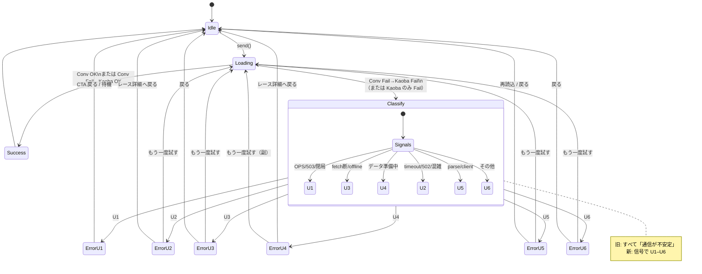
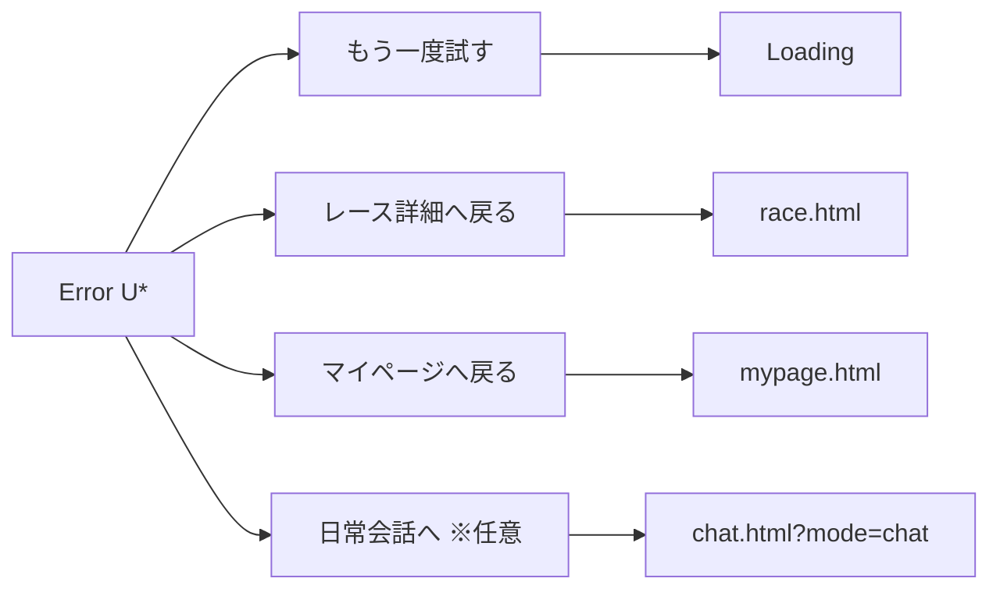

# UI19 — Explain Chat エラー状態遷移（設計）

Design date: 2026-07-30  
Companion: [error-ux-design.md](./error-ux-design.md), [error-message-mapping.md](./error-message-mapping.md)  
Action Type: UX Design Only

---

## 1. 目標状態モデル

| 状態 | 説明 |
|------|------|
| Idle | 入力可 |
| Loading | busy + typing |
| Success | AI reply 吹き出し |
| Error(U*) | 原因別文言 + CTA |
| Idle | Error/Success 後に復帰 |

現行からの変更点: **単一の Error** → **Error(U1…U6)**。Loading→Success 経路は不変。

---

## 2. 状態遷移図（設計後）



---

## 3. Conversation → Kaoba → 表示フロー（設計）

```
                    ┌──────────────┐
   send()           │   Loading    │
 ─────────────────► │              │
                    └──────┬───────┘
                           │
                           ▼
                 POST Conversation
                           │
            ┌──────────────┼──────────────┐
            │ OK           │ Fail         │
            ▼              ▼              │
         Success      POST Kaoba          │
         + Idle            │              │
            ┌──────────────┼──────────────┐
            │ OK           │ Fail         │
            ▼              ▼              │
         Success      mapChatErrorToUx    │
         + Idle       (Conv信号⊕K信号)     │
                           │              │
                           ▼              │
                    Error(U1…U6)          │
                    + CTA                 │
                    + Idle（入力再開）      │
```

---

## 4. 最終 Fail 時の表示一覧（Explain）

| 到達条件 | 状態 | 吹き出し（要約） | 主 CTA | 副 CTA |
|----------|------|------------------|--------|--------|
| Dual 503 / OPS | Error(U1) | AI 会話は利用できない時間帯 | レース詳細へ戻る | （再試行は任意・クールダウン） |
| Dual network / offline | Error(U3) | 通信がつながらなかった | もう一度試す | レース詳細へ戻る |
| timeout / 502 系 Dual | Error(U2) | 応答に時間がかかってる | もう一度試す | レース詳細へ戻る |
| データなし系 | Error(U4) | 説明データが準備中 | レース詳細へ戻る | もう一度試す |
| parse / client Dual | Error(U5) | うまく表示できなかった | もう一度試す | レース詳細 / 再読込 |
| 分類不能 Dual | Error(U6) | うまく答えられなかった | もう一度試す | レース詳細へ戻る |
| Conv Fail → Kaoba OK | Success | （Error なし） | — | — |

---

## 5. CTA 操作後の遷移



- **もう一度試す:** 直前 user メッセージを再送。Error 吹き出しは残してよい（履歴として）。連打は Loading 中 `setBusy` で抑止（現行踏襲）。
- **戻る系:** ページ遷移。チャット履歴は揮発で可（現行 session 方針のまま）。

---

## 6. 旧 → 新 の差分（遷移レベル）

| 項目 | UI18 時点（現行実装） | UI19 設計 |
|------|----------------------|-----------|
| Loading → Fail | 常に同一 Error 文言 | Classify → U1…U6 |
| 「通信」 | 全 Fail | **U3 のみ** |
| CTA | なし（文言のみ） | Category 別 CTA |
| Conv Fail → Kaoba OK | Success | **変更なし** |
| エラー信号 | 破棄 | 保持して map（実装 Phase） |

---

## 7. Decision

```
Action Type: UX Design Only
Implementation Required: No
Deployment Required: No
Configuration Required: No
```
