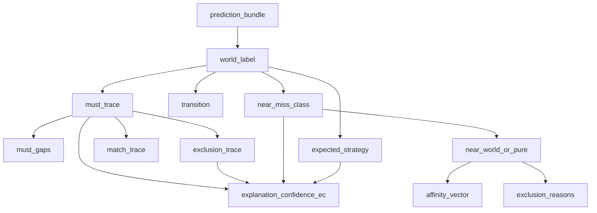

# Version102 — Semantic Dependency Graph

**Generated:** `2026-07-28T13:10:35+00:00`

## Design graph

## Empirical P(child | parent)

| From | To | support | P |
|---|---|---:|---:|
| `prediction_bundle` | `world_label` | 285 | 1.0000 |
| `world_label` | `must_trace` | 285 | 1.0000 |
| `must_trace` | `must_gaps` | 285 | 1.0000 |
| `must_trace` | `exclusion_trace` | 285 | 1.0000 |
| `must_trace` | `match_trace` | 285 | 1.0000 |
| `world_label` | `transition` | 285 | 1.0000 |
| `world_label` | `expected_strategy` | 285 | 1.0000 |
| `world_label` | `near_miss_class` | 176 | 1.0000 |
| `near_miss_class` | `near_world_or_pure` | 176 | 1.0000 |
| `near_world_or_pure` | `affinity_vector` | 176 | 1.0000 |
| `near_world_or_pure` | `exclusion_reasons` | 176 | 1.0000 |
| `must_trace` | `explanation_confidence_ec` | 285 | 1.0000 |
| `exclusion_trace` | `explanation_confidence_ec` | 285 | 1.0000 |
| `near_miss_class` | `explanation_confidence_ec` | 176 | 1.0000 |
| `expected_strategy` | `explanation_confidence_ec` | 285 | 1.0000 |
